# Model description

Here we describe the methods of MOSAIC version 1.0. This model version provides a starting point for understanding cholera transmission in Sub-Saharan Africa, incorporating important drivers of disease dynamics such as human mobility, environmental conditions, and vaccination schedules. As MOSAIC continues to evolve, future iterations will refine model components based on available data and improved model mechanisms, which we hope will increase its applicability to real-world scenarios.

The model operates on daily time steps and will be fitted to historical incidence data, however current development is based on data from January 2023 to August 2024 and includes 40 countries in Sub-Saharan Africa (SSA), see Figure \@ref(fig:map) and the [Table of MOSAIC framework countries](#mosaic-table).

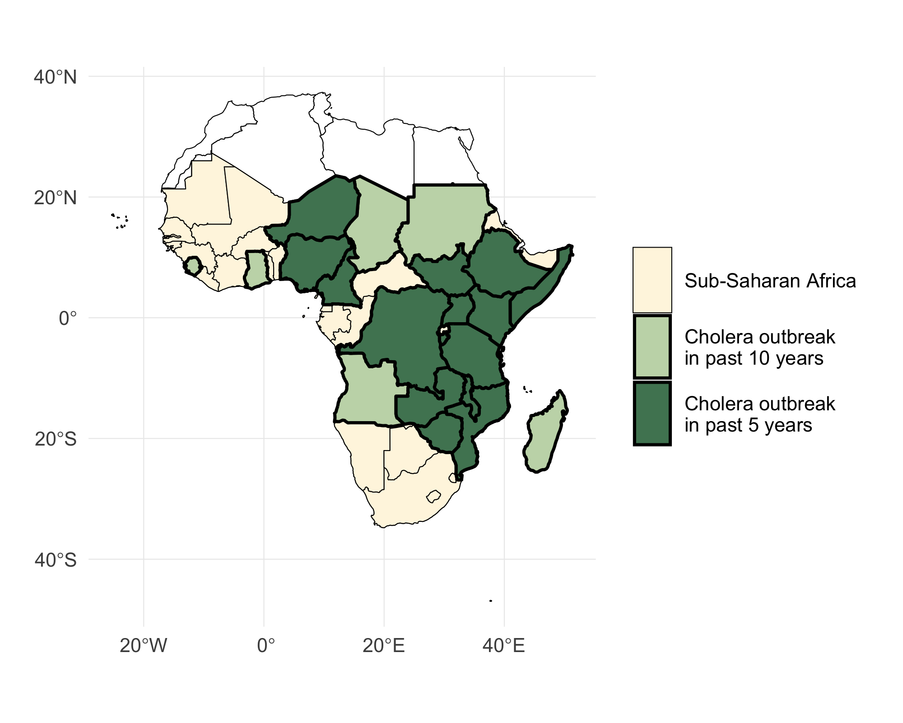

(\#fig:map)A map of Sub-Saharan Africa with countries that have experienced a cholera outbreak in the past 5 and 10 years highlighted in green. The 40 countries included in the MOSAIC modeling framework are indicated in blue.

## Transmission dynamics

The model has a metapopulation structure with familiar compartments for Susceptible, Exposed, Infected, and Recovered individuals with SEIRS dynamics. The model also contains compartments for one- and two-dose vaccination ($V_1$ and $V_2$) and Water & environment based transmission (W) which we refer to as SVEIWRS.

(\#fig:diagram)This diagram of the SVEIWRS (Susceptible-Vaccinated-Exposed-Infected-Water/environmental-Recovered-Susceptible) model shows model compartments as circles with rate parameters displayed. The primary data sources the model is fit to are shown as square nodes (Vaccination data, and reported cases and deaths).

The SVEIWRS metapopulation model, shown in Figure \@ref(fig:diagram), is governed by the following difference equations. Vaccination is delivered proportionally across a configurable set of eligible source compartments $\mathcal{V}^{\text{src}} \subseteq \{S, E, I_1, I_2, R\}$ (default: all five), with effective doses transferring the recipient to $V_1$ and ineffective doses remaining in the source compartment. We write $N^{\text{src}}_{jt} = \sum_{X \in \mathcal{V}^{\text{src}}} X_{jt}$ for the total population eligible for first-dose vaccination, which serves as the denominator of the per-compartment dose-allocation fraction:

\begin{equation}
\begin{aligned}
\mathbf{\text{Susceptible population:}}\\[1mm]
S_{j,t+1} = \ &
S_{jt}
+ b_{jt}\,N_{jt}
+ \varepsilon\,R_{jt}
+ \omega_1\,V_{1,jt}
+ \omega_2\,V_{2,jt}
- \frac{\phi_1\,\nu_{1,jt}\,S_{jt}}{N^{\text{src}}_{jt}}
- \left( \Lambda_{j,t+1} + \Psi_{j,t+1} \right)
- d_{jt}\,S_{jt}\\[3mm]
\mathbf{\text{One-dose vaccination:}}\\[1mm]
V_{1,j,t+1} = \ &
V_{1,jt}
+ \phi_1\,\nu_{1,jt}
- \phi_2\,\nu_{2,jt}
- \omega_1\,V_{1,jt}
- d_{jt}\,V_{1,jt}\\[3mm]
\mathbf{\text{Two-dose vaccination:}}\\[1mm]
V_{2,j,t+1} = \ &
V_{2,jt}
+ \phi_2\,\nu_{2,jt}
- \omega_2\,V_{2,jt}
- d_{jt}\,V_{2,jt}\\[3mm]
\mathbf{\text{Infection dynamics:}}\\[1mm]
E_{j,t+1} = \ &
E_{jt}
+ \left( \Lambda_{j,t+1} + \Psi_{j,t+1}\right)
- \frac{\phi_1\,\nu_{1,jt}\,E_{jt}}{N^{\text{src}}_{jt}}
- \iota\,E_{jt}
- d_{jt}\,E_{jt}\\[3mm]
I_{1,j,t+1} = \ &
I_{1,jt}
+ \sigma\,\iota\,E_{jt}
- \frac{\phi_1\,\nu_{1,jt}\,I_{1,jt}}{N^{\text{src}}_{jt}}
- \gamma_1\,I_{1,jt}
- \mu_{j,t}\,I_{1,jt}
- d_{jt}\,I_{1,jt}\\[3mm]
I_{2,j,t+1} = \ &
I_{2,jt}
+ \left(1-\sigma\right)\,\iota\,E_{jt}
- \frac{\phi_1\,\nu_{1,jt}\,I_{2,jt}}{N^{\text{src}}_{jt}}
- \gamma_2\,I_{2,jt}
- d_{jt}\,I_{2,jt}\\[3mm]
R_{j,t+1} = \ &
R_{jt}
+ \left( \gamma_1\,I_{1,jt} + \gamma_2\,I_{2,jt} \right)
- \frac{\phi_1\,\nu_{1,jt}\,R_{jt}}{N^{\text{src}}_{jt}}
- \varepsilon\,R_{jt}
- d_{jt}\,R_{jt}\\[5mm]
\mathbf{\text{Environment:}}\\[1mm]
W_{j,t+1} = \ &
W_{jt}
+ \left(1-\theta_j\right)\left( \zeta_1\,I_{1,jt} + \zeta_2\,I_{2,jt} \right)
- \delta_{jt}\,W_{jt}\\[3mm]
\end{aligned}
(\#eq:system)
\end{equation}

The vaccination terms above follow the simplified compartment structure introduced in laser-cholera 0.12 (issue [#41](https://github.com/InstituteforDiseaseModeling/laser-cholera/issues/41)): the per-dose vaccine effectiveness $\phi_1, \phi_2$ acts at the moment of dose delivery rather than as an ongoing dilution of the vaccinated compartment. Of the $\nu_{1,jt}$ first doses delivered, the $\phi_1\nu_{1,jt}$ *effective* doses transfer their recipients from the source compartment to $V_1$; the $(1-\phi_1)\nu_{1,jt}$ ineffective doses leave the recipient in the source compartment, which is why no $(1-\phi_1)$ term appears in the $V_1$ equation. Second doses are restricted to existing $V_1$ recipients: effective second doses transfer to $V_2$ at rate $\phi_2\nu_{2,jt}$, and ineffective second doses leave the recipient in $V_1$ (so the $V_1$ equation loses only the effective fraction $\phi_2\nu_{2,jt}$). Waning brings $V_1$ and $V_2$ recipients back to $S$ at rates $\omega_1$ and $\omega_2$ respectively. While in $V_1$ or $V_2$, individuals are not subject to the force of infection, so the human and environmental force of infection terms act only on $S$ (see Equations \@ref(eq:foi-human) and \@ref(eq:foi-environment) below).

For detailed descriptions of all parameters appearing in Equation \@ref(eq:system), see the [Table of model parameters](#parameters-table). Transmission dynamics in the model are governed primarily by two distinct force-of-infection terms: the human-to-human force of infection, $\Lambda_{jt}$, and the environmental force of infection, $\Psi_{jt}$.

The human-to-human force of infection at time $t+1$ in location $j$ acts on the local susceptible population $S_{jt}$, accounting for departure ($\tau_j$) and incoming infectious contacts from other locations via the diffusion matrix $\pi_{ij}$:

\begin{equation}
\Lambda_{j,t+1} = \frac{
\beta_{jt}^{\text{hum}} \, (1-\tau_{j})S_{jt} \, \left[ (1-\tau_{j}) (I_{1,jt} + I_{2,jt}) + \sum_{\forall i \neq j} \pi_{ij}\tau_i(I_{1,it} + I_{2,it}) \right]^{\alpha_1}}{N_{jt}^{\alpha_2}}.
(\#eq:foi-human)
\end{equation}

The environmental force of infection $\Psi_{j,t+1}$ at location $j$ and time $t+1$ also acts on the local susceptibles, dose-responding to the reservoir concentration $W_{jt}$ through the half-saturation constant $\kappa$:

\begin{equation}
\Psi_{j,t+1} = \frac{\beta_{jt}^{\text{env}}\, (1-\tau_{j})S_{jt}\,(1-\theta_j)W_{jt}}{\kappa + W_{jt}}.
(\#eq:foi-environment)
\end{equation}

Here, $\beta_{jt}^{\text{hum}}$ and $\beta_{jt}^{\text{env}}$ are the human-to-human and environment-to-human transmission rates; $\tau_i$ is the probability of departing origin location $i$; $\pi_{ij}$ is the relative probability of travel from origin $i$ to destination $j$ (see section on [spatial dynamics][Spatial dynamics]); $\theta_j$ is the proportion of the population at location $j$ with at least basic access to Water, Sanitation, and Hygiene (WASH); and $\kappa$ is the *V. cholerae* concentration associated with a 50% probability of infection (see [Infectious dose ($\kappa$)](#infectious-dose-kappa)). Vaccinated individuals are excluded from both force-of-infection terms in the current SVEIRWS implementation; this is a deliberate simplification that absorbs vaccine effectiveness into the dose-delivery step and treats $V_1$ and $V_2$ as fully protected for the duration of immunity.

Note that all model processes are stochastic. Transition rates are converted to probabilities with the commonly used method based on the exponential waiting time distribution $p(t) = 1-e^{-rt}$ (see [Ross 2007](https://www.google.com/books/edition/Introduction_to_Probability_Models/1uxBwhAb_zYC?hl=en)). Integer quantities are thus moved between model compartments at each time step according to a binomial process similar to the recovery of infected individuals $\gamma I_{jt}$:

\begin{equation}
\frac{\partial R}{\partial t} \sim \text{Binom}(I_{jt}, 1-e^{-\gamma}).
\end{equation}

For a detailed list of all stochastic transitions in the model, see the [Table of stochastic transitions](#transitions-table) below.

## Latency

An important feature of the SVEIWRS model is the inclusion of an exposed compartment $\left(E\right)$ , which captures the latent period between exposure and the onset of infectiousness. In our model, individuals who become infected first enter the $E$ compartment, where they remain for a period governed by the incubation period $\iota$, before progressing to the infectious compartments $I_1$ (severe symptomatic infection) or $I_2$ (mild and/or asymptomatic infection).

A systematic review by [Azman et al (2013)](http://www.sciencedirect.com/science/article/pii/S0163445312003477) estimated the median incubation period for cholera to be approximately $1.4 \ \text{days} \ (1.3–1.6 \ 95\% \text{CI})$. This relatively short latency is one of the key characteristic governing cholera dynamics and is critical for accurately capturing the rapid spatial spread observed during outbreaks.

## Seasonality
Cholera transmission is seasonal and is typically associated with the rainy season, so both transmission rate terms $\beta_{jt}^{\text{*}}$ are temporally forced. For human-to-human transmission we used a sinusoidal mechanism as in [Altizer et al 2006](https://onlinelibrary.wiley.com/doi/epdf/10.1111/j.1461-0248.2005.00879.x). Specifically, the function is a truncated sine-cosine form of the [Fourier series](https://en.wikipedia.org/wiki/Fourier_series) with two harmonic features which has the flexibility to capture seasonal transmission dynamics driven by extended rainy seasons and/or biannual trends:

\begin{equation}
\beta_{jt}^{\text{hum}} = \beta_{j0}^{\text{hum}} \left(1 + a_1 \cos\left(\frac{2\pi t}{p}\right) + b_1 \sin\left(\frac{2\pi t}{p}\right) + a_2 \cos\left(\frac{4\pi t}{p}\right) + b_2 \sin\left(\frac{4\pi t}{p}\right)\right).
(\#eq:beta1)
\end{equation}

Where, $\beta_{j0}^{\text{hum}}$ is the mean human-to-human transmission rate at location $j$ over all time steps. Seasonal dynamics are determined by the parameters $a_1$, $b_1$ and $a_2$, $b_2$ which gives the amplitude of the first and second waves respectively. The periodic cycle $p$ is 365, so the function controls the temporal variation in $\beta_{jt}^{\text{hum}}$ over each day of the year.

We estimated the parameters in the Fourier series ($a_1$, $b_1$, $a_2$, $b_2$) using the [Levenberg–Marquardt](https://en.wikipedia.org/wiki/Levenberg%E2%80%93Marquardt_algorithm) algorithm in the [`minpack.lm`](https://rdrr.io/cran/minpack.lm/) R library. Given the lack of reported cholera case data for many countries in SSA and the association between cholera transmission and the rainy season, we leveraged seasonal precipitation data to help fit the Fourier wave function to all countries. We first gathered weekly precipitation values from 1994 to 2024 for 30 uniformly distributed points within each country from the [Open-Meteo Historical Weather Data API](https://open-meteo.com/en/docs/historical-weather-api). Then we fit the Fourier series to the weekly precipitation data and used these parameters as the starting values when fitting the model to the more sparse cholera case data.

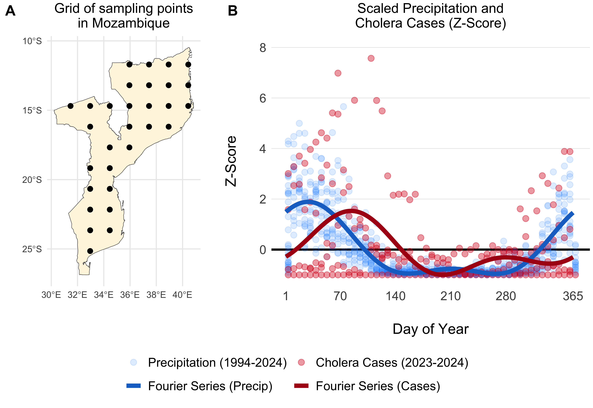

(\#fig:seasonal-example)Example of a grid of 30 uniformly distributed points within Mozambique (A). The scatterplot shows weekly summed precipitation values at those 30 grid points and cholera cases plotted on the same scale of the Z-Score which shows the variance around the mean in terms of the standard deviation. Fitted Fourier series functions are shown as blue (fit precipitation data) and red (fit to cholera case data) lines.

For countries with no reported case data, we inferred seasonal dynamics using the fitted wave function of a neighboring country with available case data. The selected neighbor was chosen from the same cluster of countries (grouped hierarchically into four clusters based on precipitation seasonality using [Ward's method](https://en.wikipedia.org/wiki/Ward%27s_method); see Figure \@ref(fig:seasonal-cluster)) that had the highest correlation in seasonal precipitation with the country lacking case data. In the rare event that no country with reported case data was found within the same seasonal cluster, we expanded the search to the 10 nearest neighbors and continued expanding by adding the next nearest neighbor until a match was found.

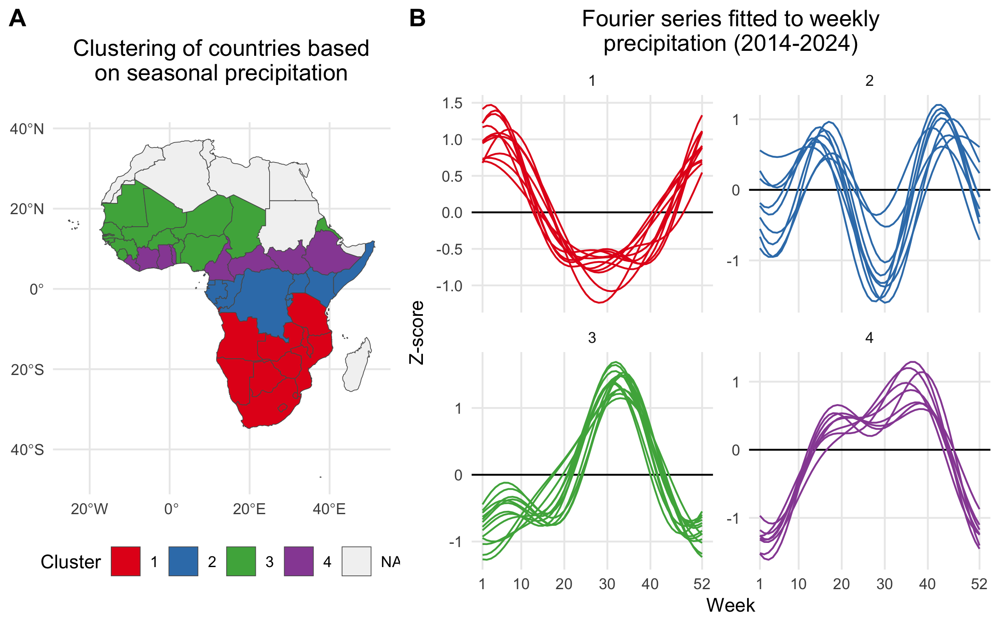

(\#fig:seasonal-cluster)A) Map showing the clustering of African countries based on their seasonal precipitation patterns (2014-2024). Countries are colored according to their cluster assignments, identified using hierarchical clustering. B) Fourier series fitted to weekly precipitation for each country. Each line plot shows the seasonal pattern for countries within a given cluster. Clusteres are used to infer the seasonal transmission dynamics for countries where there are no reported cholera cases.

Using the model fitting methods described above, and the cluster-based approach for inferring the seasonal Fourier series pattern in countries without reported cholera cases, we modeled the seasonal dynamics for all 40 countries in the MOSAIC framework. These dynamics are visualized in Figure \@ref(fig:seasonal-all), with the corresponding Fourier model coefficients presented in Table \@ref(tab:seasonal-table).

(\#fig:seasonal-all)Seasonal transmission patterns for all countries modeled in MOSAIC as modeled by the truncated Fourier series in Equation \@ref(eq:beta1). Blues lines give the Fourier series model fits for precipitation (1994-2024) and the red lines give models fits to reported cholera cases (2023-2024). For countries where reported case data were not available, the Fourier model was inferred by the nearest country with the most similar seasonal precipitation patterns as determined by the hierarchical clustering. Countries with inferred case data from neighboring locations are annotated in red. The X-axis represents the weeks of the year (1-52), while the Y-axis shows the Z-score of weekly precipitation and cholera cases.

<table class="table" style="font-size: 11.75px; width: auto !important; margin-left: auto; margin-right: auto;">
<caption style="font-size: initial !important;">(\#tab:seasonal-table)(\#tab:seasonal-table)Estimated coefficients for the truncated Fourier model in Equation \@ref(eq:beta1) fit to countries with reported cholera cases. Model fits are shown in Figure \@ref(fig:seasonal-all).</caption>
 <thead>
<tr>
<th style="empty-cells: hide;border-bottom:hidden;" colspan="1"></th>
<th style="border-bottom:hidden;padding-bottom:0; padding-left:3px;padding-right:3px;text-align: center; " colspan="4">
Fourier Coefficients
</th>
</tr>
  <tr>
   <th style="text-align:left;"> Country </th>
   <th style="text-align:left;"> $a_1$ </th>
   <th style="text-align:left;"> $a_2$ </th>
   <th style="text-align:left;"> $b_1$ </th>
   <th style="text-align:left;"> $b_2$ </th>
  </tr>
 </thead>
<tbody>
  <tr>
   <td style="text-align:left;"> Angola </td>
   <td style="text-align:left;"> -0.06 (-0.23 to 0.1) </td>
   <td style="text-align:left;"> -0.46 (-0.63 to -0.29) </td>
   <td style="text-align:left;"> 0.63 (0.46 to 0.8) </td>
   <td style="text-align:left;"> -0.44 (-0.61 to -0.28) </td>
  </tr>
  <tr>
   <td style="text-align:left;"> Benin </td>
   <td style="text-align:left;"> 0.17 (-0.01 to 0.35) </td>
   <td style="text-align:left;"> -0.58 (-0.76 to -0.4) </td>
   <td style="text-align:left;"> -1.29 (-1.47 to -1.11) </td>
   <td style="text-align:left;"> -0.36 (-0.54 to -0.18) </td>
  </tr>
  <tr>
   <td style="text-align:left;"> Burkina Faso </td>
   <td style="text-align:left;"> -1.67 (-2.1 to -1.23) </td>
   <td style="text-align:left;"> 0.91 (0.46 to 1.35) </td>
   <td style="text-align:left;"> -0.77 (-1.21 to -0.33) </td>
   <td style="text-align:left;"> 0.86 (0.42 to 1.3) </td>
  </tr>
  <tr>
   <td style="text-align:left;"> Burundi </td>
   <td style="text-align:left;"> 0.21 (0.09 to 0.32) </td>
   <td style="text-align:left;"> -0.32 (-0.44 to -0.2) </td>
   <td style="text-align:left;"> -0.75 (-0.86 to -0.63) </td>
   <td style="text-align:left;"> -0.16 (-0.28 to -0.05) </td>
  </tr>
  <tr>
   <td style="text-align:left;"> Cameroon </td>
   <td style="text-align:left;"> -0.47 (-0.58 to -0.37) </td>
   <td style="text-align:left;"> -0.37 (-0.48 to -0.26) </td>
   <td style="text-align:left;"> 0.03 (-0.08 to 0.14) </td>
   <td style="text-align:left;"> 0.13 (0.03 to 0.24) </td>
  </tr>
  <tr>
   <td style="text-align:left;"> Central African Republic </td>
   <td style="text-align:left;"> -1.62 (-2.02 to -1.22) </td>
   <td style="text-align:left;"> 0.62 (0.21 to 1.03) </td>
   <td style="text-align:left;"> -1.16 (-1.57 to -0.75) </td>
   <td style="text-align:left;"> 1.7 (1.29 to 2.1) </td>
  </tr>
  <tr>
   <td style="text-align:left;"> Chad </td>
   <td style="text-align:left;"> -0.18 (-0.45 to 0.09) </td>
   <td style="text-align:left;"> -1.35 (-1.62 to -1.08) </td>
   <td style="text-align:left;"> -1.83 (-2.1 to -1.56) </td>
   <td style="text-align:left;"> 0.21 (-0.06 to 0.47) </td>
  </tr>
  <tr>
   <td style="text-align:left;"> Congo </td>
   <td style="text-align:left;"> -0.8 (-1.03 to -0.57) </td>
   <td style="text-align:left;"> 0.06 (-0.17 to 0.3) </td>
   <td style="text-align:left;"> -0.63 (-0.86 to -0.4) </td>
   <td style="text-align:left;"> 1.31 (1.08 to 1.54) </td>
  </tr>
  <tr>
   <td style="text-align:left;"> Côte d’Ivoire </td>
   <td style="text-align:left;"> 1.12 (0.79 to 1.44) </td>
   <td style="text-align:left;"> 0.7 (0.38 to 1.03) </td>
   <td style="text-align:left;"> 0.55 (0.22 to 0.87) </td>
   <td style="text-align:left;"> 0.73 (0.41 to 1.05) </td>
  </tr>
  <tr>
   <td style="text-align:left;"> DRC </td>
   <td style="text-align:left;"> 0.1 (0.06 to 0.14) </td>
   <td style="text-align:left;"> -0.07 (-0.11 to -0.03) </td>
   <td style="text-align:left;"> -0.12 (-0.16 to -0.08) </td>
   <td style="text-align:left;"> 0.05 (0.01 to 0.09) </td>
  </tr>
  <tr>
   <td style="text-align:left;"> Ethiopia </td>
   <td style="text-align:left;"> -0.45 (-0.53 to -0.38) </td>
   <td style="text-align:left;"> -0.3 (-0.37 to -0.22) </td>
   <td style="text-align:left;"> 0.12 (0.04 to 0.19) </td>
   <td style="text-align:left;"> 0.2 (0.13 to 0.28) </td>
  </tr>
  <tr>
   <td style="text-align:left;"> Ghana </td>
   <td style="text-align:left;"> -0.43 (-0.69 to -0.18) </td>
   <td style="text-align:left;"> -0.89 (-1.14 to -0.64) </td>
   <td style="text-align:left;"> -1.64 (-1.89 to -1.39) </td>
   <td style="text-align:left;"> 0.59 (0.34 to 0.84) </td>
  </tr>
  <tr>
   <td style="text-align:left;"> Guinea </td>
   <td style="text-align:left;"> -1.1 (-1.41 to -0.78) </td>
   <td style="text-align:left;"> -0.22 (-0.53 to 0.09) </td>
   <td style="text-align:left;"> -1.22 (-1.53 to -0.91) </td>
   <td style="text-align:left;"> 1.43 (1.13 to 1.74) </td>
  </tr>
  <tr>
   <td style="text-align:left;"> Kenya </td>
   <td style="text-align:left;"> 0.15 (0.04 to 0.26) </td>
   <td style="text-align:left;"> -0.02 (-0.13 to 0.1) </td>
   <td style="text-align:left;"> 0.62 (0.51 to 0.73) </td>
   <td style="text-align:left;"> -0.31 (-0.42 to -0.2) </td>
  </tr>
  <tr>
   <td style="text-align:left;"> Liberia </td>
   <td style="text-align:left;"> 0.07 (-0.03 to 0.16) </td>
   <td style="text-align:left;"> -0.38 (-0.48 to -0.29) </td>
   <td style="text-align:left;"> 0.3 (0.21 to 0.4) </td>
   <td style="text-align:left;"> -0.16 (-0.26 to -0.07) </td>
  </tr>
  <tr>
   <td style="text-align:left;"> Malawi </td>
   <td style="text-align:left;"> 1.28 (1.02 to 1.54) </td>
   <td style="text-align:left;"> 0.42 (0.16 to 0.68) </td>
   <td style="text-align:left;"> 0.99 (0.73 to 1.25) </td>
   <td style="text-align:left;"> 1.11 (0.85 to 1.37) </td>
  </tr>
  <tr>
   <td style="text-align:left;"> Mozambique </td>
   <td style="text-align:left;"> 0.46 (0.31 to 0.61) </td>
   <td style="text-align:left;"> -0.65 (-0.8 to -0.5) </td>
   <td style="text-align:left;"> 1.15 (1 to 1.3) </td>
   <td style="text-align:left;"> 0.15 (0 to 0.29) </td>
  </tr>
  <tr>
   <td style="text-align:left;"> Namibia </td>
   <td style="text-align:left;"> 1.59 (1.42 to 1.76) </td>
   <td style="text-align:left;"> 0.82 (0.65 to 0.99) </td>
   <td style="text-align:left;"> 0.55 (0.38 to 0.72) </td>
   <td style="text-align:left;"> 0.42 (0.25 to 0.59) </td>
  </tr>
  <tr>
   <td style="text-align:left;"> Niger </td>
   <td style="text-align:left;"> -0.84 (-1.04 to -0.65) </td>
   <td style="text-align:left;"> -0.51 (-0.71 to -0.32) </td>
   <td style="text-align:left;"> -1.22 (-1.41 to -1.02) </td>
   <td style="text-align:left;"> 0.87 (0.67 to 1.06) </td>
  </tr>
  <tr>
   <td style="text-align:left;"> Nigeria </td>
   <td style="text-align:left;"> -0.77 (-0.87 to -0.67) </td>
   <td style="text-align:left;"> -0.21 (-0.31 to -0.12) </td>
   <td style="text-align:left;"> -0.67 (-0.77 to -0.57) </td>
   <td style="text-align:left;"> 0.42 (0.32 to 0.52) </td>
  </tr>
  <tr>
   <td style="text-align:left;"> Rwanda </td>
   <td style="text-align:left;"> -0.37 (-0.64 to -0.09) </td>
   <td style="text-align:left;"> -1.06 (-1.34 to -0.78) </td>
   <td style="text-align:left;"> 1.32 (1.04 to 1.59) </td>
   <td style="text-align:left;"> -0.54 (-0.81 to -0.27) </td>
  </tr>
  <tr>
   <td style="text-align:left;"> Sierra Leone </td>
   <td style="text-align:left;"> -0.9 (-1.15 to -0.66) </td>
   <td style="text-align:left;"> -0.25 (-0.5 to -0.01) </td>
   <td style="text-align:left;"> -1.14 (-1.38 to -0.9) </td>
   <td style="text-align:left;"> 1.34 (1.1 to 1.58) </td>
  </tr>
  <tr>
   <td style="text-align:left;"> Somalia </td>
   <td style="text-align:left;"> -0.37 (-0.46 to -0.28) </td>
   <td style="text-align:left;"> -0.27 (-0.37 to -0.18) </td>
   <td style="text-align:left;"> 0.86 (0.77 to 0.96) </td>
   <td style="text-align:left;"> -0.24 (-0.33 to -0.15) </td>
  </tr>
  <tr>
   <td style="text-align:left;"> South Sudan </td>
   <td style="text-align:left;"> 0.01 (-0.12 to 0.14) </td>
   <td style="text-align:left;"> 0.29 (0.16 to 0.42) </td>
   <td style="text-align:left;"> 0.6 (0.47 to 0.73) </td>
   <td style="text-align:left;"> -0.06 (-0.19 to 0.07) </td>
  </tr>
  <tr>
   <td style="text-align:left;"> Tanzania </td>
   <td style="text-align:left;"> 0.55 (0.48 to 0.63) </td>
   <td style="text-align:left;"> -0.11 (-0.18 to -0.03) </td>
   <td style="text-align:left;"> -0.38 (-0.45 to -0.3) </td>
   <td style="text-align:left;"> -0.07 (-0.14 to 0.01) </td>
  </tr>
  <tr>
   <td style="text-align:left;"> Togo </td>
   <td style="text-align:left;"> 0.81 (0.5 to 1.11) </td>
   <td style="text-align:left;"> -0.71 (-1.02 to -0.41) </td>
   <td style="text-align:left;"> -1.43 (-1.74 to -1.13) </td>
   <td style="text-align:left;"> -0.89 (-1.19 to -0.59) </td>
  </tr>
  <tr>
   <td style="text-align:left;"> Uganda </td>
   <td style="text-align:left;"> 0.37 (0.11 to 0.63) </td>
   <td style="text-align:left;"> -0.36 (-0.61 to -0.1) </td>
   <td style="text-align:left;"> 0.91 (0.65 to 1.16) </td>
   <td style="text-align:left;"> 0.72 (0.47 to 0.98) </td>
  </tr>
  <tr>
   <td style="text-align:left;"> Zambia </td>
   <td style="text-align:left;"> 1.36 (1.12 to 1.6) </td>
   <td style="text-align:left;"> 0.65 (0.41 to 0.89) </td>
   <td style="text-align:left;"> 0.65 (0.41 to 0.89) </td>
   <td style="text-align:left;"> 0.7 (0.46 to 0.94) </td>
  </tr>
  <tr>
   <td style="text-align:left;"> Zimbabwe </td>
   <td style="text-align:left;"> 0.66 (0.51 to 0.81) </td>
   <td style="text-align:left;"> -0.12 (-0.28 to 0.03) </td>
   <td style="text-align:left;"> -0.04 (-0.19 to 0.12) </td>
   <td style="text-align:left;"> 0.09 (-0.06 to 0.24) </td>
  </tr>
</tbody>
</table>

## Environmental transmission

Environmental transmission is a critical factor in cholera spread and consists of several key components: the rate at which infected individuals shed *V. cholerae* into the environment, the pathogen's survival rate in environmental conditions, and the overall suitability of the environment for sustaining the bacteria over time.

To capture the impacts of climate-drivers on cholera transmission, we have included the parameter $\psi_{jt}$, which represents the current state of environmental suitability with respect to: *i*) the survival time of *V. cholerae* in the environment and, *ii*) the rate of environment-to-human transmission which contributes to the overall force of infection. 

\begin{equation}
\beta_{jt}^{\text{env}} = \beta_{j0}^{\text{env}} \Bigg(1 + \frac{\psi_{jt}-\bar\psi_j}{\bar\psi_j} \Bigg) \quad \text{and} \quad \bar\psi_j = \frac{1}{T} \sum_{t=1}^{T} \psi_{jt}
(\#eq:beta2)
\end{equation}

This formulation effectively scales the base environmental transmission rate $\beta_{jt}^{\text{env}}$ so that it varies over time according to the climatically driven model of suitability. Note that, unlike the the cosine wave function of $\beta_{jt}^{\text{hum}}$, this temporal term can increase or decrease over time following multi-annual cycles.

### Suitability-dependent decay rate

Suitability also influences how long *V. cholerae* survives in the environment. The decay rate \( \delta_{jt} \) is modeled as the inverse of survival time, which varies with suitability. This is defined as:

$$
\delta_{jt} = \frac{1}{\text{days}_{\text{short}} + f\big(\psi_{jt}\big) \cdot \big(\text{days}_{\text{long}} - \text{days}_{\text{short}}\big)}.
(\#eq:delta)
$$

Where $\text{days}_{\text{short}}$ is the survival time at low suitability ($\psi_{jt}\!\to\!0$) and $\text{days}_{\text{long}}$ is the survival time at high suitability ($\psi_{jt}\!\to\!1$). Suitability is mapped to the *V. cholerae* decay rate through a transformation function $f(\psi_{jt})$ that scales suitability values using a cumulative [Beta distribution](https://en.wikipedia.org/wiki/Beta_distribution) and two shape parameters $s_1$ and $s_2$: $f\big(\psi_{jt}\big) = \text{pbeta}(\psi_{jt} \mid s_1, \, s_2)$.

The transformation $f\big(\psi_{jt}\big) \in [0, 1]$ enables a range of functional forms, including linear, convex, concave, sigmoidal, or arcsine responses to suitability. This flexibility ensures that survival dynamics can reflect a variety of empirically plausible relationships with environmental conditions which can be seen in Figure \@ref(fig:vibrio-decay-rate).

Rather than sampling $\text{days}_{\text{long}}$ directly --- which would occasionally produce draws with $\text{days}_{\text{long}} < \text{days}_{\text{short}}$ contrary to biology --- we sample a non-negative spread $\text{days}_{\text{spread}}$ and set $\text{days}_{\text{long}} = \text{days}_{\text{short}} + \text{days}_{\text{spread}}$, which guarantees that the longest survival time exceeds the shortest by construction. The priors on the four decay parameters are truncated normals, chosen so that the modal survival time is approximately 16 days at low suitability and approximately 196 days at high suitability (16 + 180), shown as the horizontal bounds in Figure \@ref(fig:vibrio-decay-rate):

$$
\begin{aligned}
\text{days}_{\text{short}} \ \sim\ & \text{Truncnorm}(16,\ 7,\ 0.01,\ 60),\\
\text{days}_{\text{spread}} \ \sim\ & \text{Truncnorm}(180,\ 95,\ 1,\ 365),\\
\text{days}_{\text{long}} \ =\ & \text{days}_{\text{short}} + \text{days}_{\text{spread}},\\
s_1,\, s_2 \ \sim\ & \text{Truncnorm}(3,\ 5,\ 0.1,\ 10).
\end{aligned}
(\#eq:decay-priors)
$$

The four-argument truncated normals are notated $\text{Truncnorm}(\mu, \sigma, a, b)$ with mean $\mu$, standard deviation $\sigma$, and support $[a, b]$. Using truncated normals (rather than Uniform priors on $s_1, s_2$ as in earlier MOSAIC versions) prevents posterior drift toward boundary values during the staged calibration described in the [Model Calibration](https://www.mosaicmod.org/model-calibration-1.html) page.

(\#fig:vibrio-decay-rate)Relationship between environmental suitability ($\psi_{jt}$) and the survival and decay rate of *V. cholerae* in the environment ($\delta_{jt}$). The five curves correspond to alternative shape choices for the cumulative-Beta transformation $f(\psi_{jt}) = \text{pbeta}(\psi_{jt}\mid s_1, s_2)$: Linear $(s_1{=}1, s_2{=}1)$, Concave $(s_1{=}1, s_2{=}5)$, Convex $(s_1{=}5, s_2{=}1)$, Sigmoidal $(s_1{=}5, s_2{=}5)$, and Arcsine $(s_1{=}0.5, s_2{=}0.5)$. The primary y-axis shows survival time in days; the secondary y-axis shows the corresponding decay rate $\delta_{jt} = 1/\text{days}(\psi_{jt})$. The horizontal dashed lines are placed at the modal values of the two MOSAIC priors: $\text{days}_{\text{short}} \approx 16$ days at low suitability (the mode of $\text{Truncnorm}(16, 7, 0.01, 60)$) and $\text{days}_{\text{long}} = \text{days}_{\text{short}} + \text{days}_{\text{spread}} \approx 16 + 180 = 196$ days at high suitability.

### Modeling environmental suitability

#### Environmental data

The mechanism for environment-to-human transmission (Equation \@ref(eq:beta2)) and rate of decay of *V. cholerae* in the environment (Equation \@ref(eq:delta)) is driven by the parameter $\psi_{jt}$, which we refer to as environmental suitability. The parameter $\psi_{jt}$ is modeled as a time series for each location using a Long Short-Term Memory (LSTM) Recurrent Neural Network (RNN) model and a suite of 24 covariates which include 19 historical and forecasted climate variables under the [MRI-AGCM3-2-S](https://www.wdc-climate.de/ui/cmip6?input=CMIP6.HighResMIP.MRI.MRI-AGCM3-2-S.highresSST-present) climate model. Covariates also include 4 large-scale climate drivers such as the Indian Ocean Dipole Mode Index (DMI), and the El Niño Southern Oscillation (ENSO) from 3 different Pacific Ocean regions. We also included a location specific variable giving the mean elevation for each country. See example time series of climate variables from one country (Mozambique) in Figure \@ref(fig:climate-data-moz) and DMI and ENSO variables in Figure \@ref(fig:climate-data-enso). A list of all covariates and their sources can be seen in Table \@ref(tab:climate-data-variables).

Note that while the 19 climate variables offer forecasts up to 2030 and beyond, the forecasts of the DMI and ENSO variables are limited to 5 months into the future. So, environmental suitability model predictions are currently limited to a 5 month time horizon but future iterations may allow for longer forecasts. Additional data sources will be integrated into subsequent versions of the suitability model. For instance, flood and cyclone data will likely be incorporated later, though not in the initial version of the model.

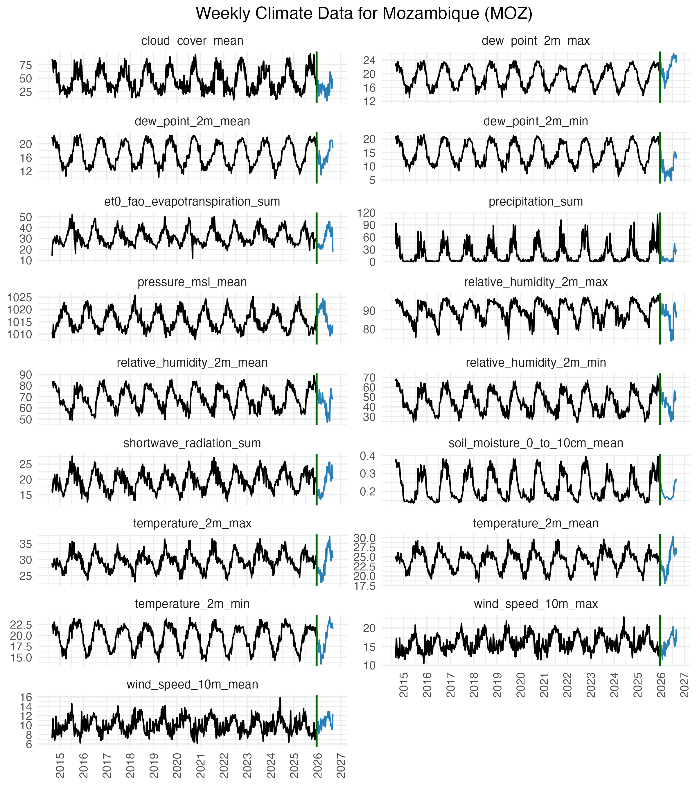

(\#fig:climate-data-moz)Climate data acquired from the OpenMeteo data API. Data were collected from 30 uniformly distributed points across each country and then aggregated to give weekly values of 17 climate variable from 1970 to 2030.

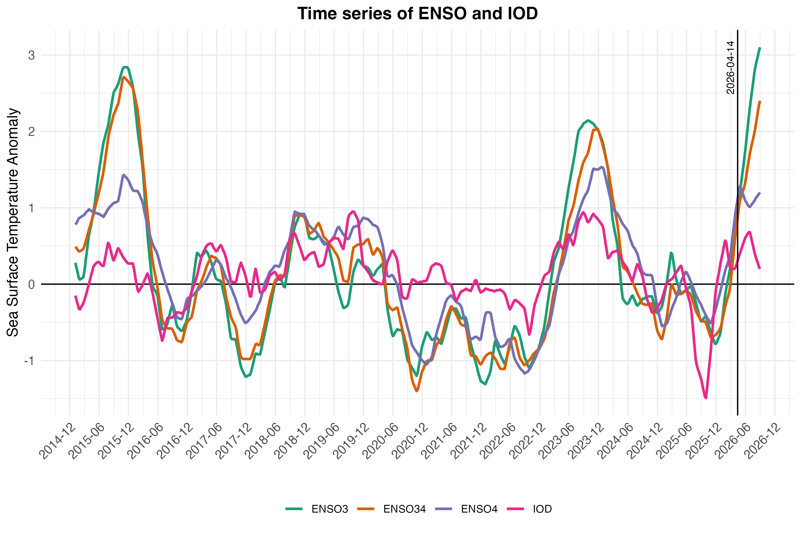

(\#fig:climate-data-enso)Historical and forecasted values of the Indian Ocean Dipole Mode Index (DMI) and the El Niño Southern Oscillation (ENSO) from 2015 to 2025. The ENSO values come from three different regions: Niño3 (central to eastern Pacific), Niño3.4 (central Pacific), and Niño4 (western-central Pacifi). Data are from National Oceanic and Atmospheric Administration (NOAA) and Bureau of Meteorology (BOM).

Table: (\#tab:climate-data-variables)A full list of covariates and their sources used in the LSTM RNN model to predict the environmental suitability of *V. cholerae* ($\psi_{jt}$).

|Covariate                      |Description                                    |Source                                               |
|:------------------------------|:----------------------------------------------|:----------------------------------------------------|
|temperature_2m_mean            |Average temperature at 2 meters                |OpenMeteo [Historical Weather](https://open-meteo.com/en/docs/historical-weather-api) and [Climate Change](https://open-meteo.com/en/docs/climate-api) APIs|
|temperature_2m_max             |Maximum temperature at 2 meters                |OpenMeteo [Historical Weather](https://open-meteo.com/en/docs/historical-weather-api) and [Climate Change](https://open-meteo.com/en/docs/climate-api) APIs|
|temperature_2m_min             |Minimum temperature at 2 meters                |OpenMeteo [Historical Weather](https://open-meteo.com/en/docs/historical-weather-api) and [Climate Change](https://open-meteo.com/en/docs/climate-api) APIs|
|wind_speed_10m_mean            |Average wind speed at 10 meters                |OpenMeteo [Historical Weather](https://open-meteo.com/en/docs/historical-weather-api) and [Climate Change](https://open-meteo.com/en/docs/climate-api) APIs|
|wind_speed_10m_max             |Maximum wind speed at 10 meters                |OpenMeteo [Historical Weather](https://open-meteo.com/en/docs/historical-weather-api) and [Climate Change](https://open-meteo.com/en/docs/climate-api) APIs|
|cloud_cover_mean               |Mean cloud cover                               |OpenMeteo [Historical Weather](https://open-meteo.com/en/docs/historical-weather-api) and [Climate Change](https://open-meteo.com/en/docs/climate-api) APIs|
|shortwave_radiation_sum        |Total shortwave radiation                      |OpenMeteo [Historical Weather](https://open-meteo.com/en/docs/historical-weather-api) and [Climate Change](https://open-meteo.com/en/docs/climate-api) APIs|
|relative_humidity_2m_mean      |Mean relative humidity at 2 meters             |OpenMeteo [Historical Weather](https://open-meteo.com/en/docs/historical-weather-api) and [Climate Change](https://open-meteo.com/en/docs/climate-api) APIs|
|relative_humidity_2m_max       |Maximum relative humidity at 2 meters          |OpenMeteo [Historical Weather](https://open-meteo.com/en/docs/historical-weather-api) and [Climate Change](https://open-meteo.com/en/docs/climate-api) APIs|
|relative_humidity_2m_min       |Minimum relative humidity at 2 meters          |OpenMeteo [Historical Weather](https://open-meteo.com/en/docs/historical-weather-api) and [Climate Change](https://open-meteo.com/en/docs/climate-api) APIs|
|dew_point_2m_mean              |Mean dew point at 2 meters                     |OpenMeteo [Historical Weather](https://open-meteo.com/en/docs/historical-weather-api) and [Climate Change](https://open-meteo.com/en/docs/climate-api) APIs|
|dew_point_2m_min               |Minimum dew point at 2 meters                  |OpenMeteo [Historical Weather](https://open-meteo.com/en/docs/historical-weather-api) and [Climate Change](https://open-meteo.com/en/docs/climate-api) APIs|
|dew_point_2m_max               |Maximum dew point at 2 meters                  |OpenMeteo [Historical Weather](https://open-meteo.com/en/docs/historical-weather-api) and [Climate Change](https://open-meteo.com/en/docs/climate-api) APIs|
|precipitation_sum              |Total precipitation                            |OpenMeteo [Historical Weather](https://open-meteo.com/en/docs/historical-weather-api) and [Climate Change](https://open-meteo.com/en/docs/climate-api) APIs|
|pressure_msl_mean              |Mean sea level pressure                        |OpenMeteo [Historical Weather](https://open-meteo.com/en/docs/historical-weather-api) and [Climate Change](https://open-meteo.com/en/docs/climate-api) APIs|
|soil_moisture_0_to_10cm_mean   |Mean soil moisture at 0 to 10 cm               |OpenMeteo [Historical Weather](https://open-meteo.com/en/docs/historical-weather-api) and [Climate Change](https://open-meteo.com/en/docs/climate-api) APIs|
|et0_fao_evapotranspiration_sum |Total evapotranspiration (FAO method)          |OpenMeteo [Historical Weather](https://open-meteo.com/en/docs/historical-weather-api) and [Climate Change](https://open-meteo.com/en/docs/climate-api) APIs|
|DMI                            |Dipole Mode Index (DMI)                        |[NOAA](https://psl.noaa.gov/enso/) and [BOM](http://www.bom.gov.au/climate/ocean/outlooks/#region=NINO4&region=NINO3&region=NINO34)|
|ENSO3                          |El Niño Southern Oscillation (ENSO) - Region 3 |[NOAA](https://psl.noaa.gov/enso/) and [BOM](http://www.bom.gov.au/climate/ocean/outlooks/#region=NINO4&region=NINO3&region=NINO34)|
|ENSO34                         |ENSO - Region 3.4                              |[NOAA](https://psl.noaa.gov/enso/) and [BOM](http://www.bom.gov.au/climate/ocean/outlooks/#region=NINO4&region=NINO3&region=NINO34)|
|ENSO4                          |ENSO - Region 4                                |[NOAA](https://psl.noaa.gov/enso/) and [BOM](http://www.bom.gov.au/climate/ocean/outlooks/#region=NINO4&region=NINO3&region=NINO34)|
|elevation                      |Mean elevation                                 |[Amazon Web Services Terrain Tiles](https://registry.opendata.aws/terrain-tiles/)|

#### Deep learning neural network model

As mentioned above, we model environmental suitability $\psi_{jt}$ using a Long Short-Term Memory (LSTM) Recurrent Neural Network (RNN) model. The LSTM model was developed using [`keras`](https://cran.r-project.org/package=keras) and [`tensorflow`](https://cran.r-project.org/package=tensorflow) in R to predict binary outcomes. Thus the modeled quantity $\psi_{jt}$ is a proportion implying unsuitable conditions at 0 and perfectly suitable conditions at 1. 

The model was fitted to reported case counts that were converted to a binary variable using a threshold of 200 reported cases per week. Given delays in reporting and likely lead times for environmental suitability ahead of transmission and case reporting, we also set the preceding one week to be suitable and in cases where there were two consecutive weeks of >200 cases per week, we assumed that the preceding two weeks were also suitable. See Figure \@ref(fig:cases-binary) for an example of how reported case counts are converted to a binary variable representing presumed environmental suitability for *V. cholerae*.

(\#fig:cases-binary)Reported cases converted to binary variable for modeling environmental suitability.

The model is a Long Short-Term Memory (LSTM) neural network designed for binary classification, where environmental suitability, $\psi_{jt}$, is modeled as a function of the hidden state $h_t$ and hidden bias term $b_h$. Specifically, $\psi_{jt}$ is defined by a sigmoid activation function applied to the linear combination of the hidden state $h_t$ and the bias $b_h$ which if given by the 3 layers of the LSTM model:

\begin{equation}
\psi_{jt} \sim \text{Sigmoid}(w_h \cdot h_t + b_h)
(\#eq:psi)
\end{equation}

\begin{equation}
h_t = \text{LSTM}\big(\text{temperature}_{jt}, \ \text{precipitation}_{jt}, \ \text{ENSO}_{t}, \dots \big)
\end{equation}

In this formulation, $h_t$ represents the hidden state generated by the LSTM network based on input variables such as temperature, precipitation, and ENSO conditions, while $b_h$ is a bias term added to the output of the hidden state transformation.

The deep learning LSTM model consists of three stacked LSTM-RNN layers. The first LSTM layer has 500 units and the second and third LSTM layers have 250 and 100 units respectively. The architecture the LSTM model is configured to pass node values to subsequent LSTM layers allowing deep learning of more the complex interactions among the climate variable over time. We enforced model sparsity for each LSTM layer using L2 regularization (penalty = 0.001) and used a dropout rate of 0.5 for each LSTM layer to further prevent overfitting on the limited amount of data. The final output layer was a dense layer with a single unit and a sigmoid activation function to produce a probability value for binary classification, i.e. a prediction of environmental suitability $\psi_{jt}$ on a scale of 0 to 1.

To fit the LSTM model to data, we modified the learning rate by applying an exponential decay schedule that started at 0.001 and decayed by a factor of 0.9 every 10,000 steps to enable smoother convergence. The model was compiled using the Adam optimizer with this learning rate schedule, along with binary cross-entropy as the loss function and accuracy as the evaluation metric. The model was trained for a maximum of 200 epochs with a batch size of 1024. We allowed model fitting to stop early with a patience parameter of 10 which halts training if no improvement is observed in validation accuracy for 10 consecutive epochs. To train the model we set aside 20% of the observed data for validation and also used 20% of the training data for model fitting. The training history, including loss and accuracy, was monitored over the course of training and gave a final test accuracy of 0.73 and a final test loss of 0.56 (see Figure \@ref(fig:lstm-model-fit)).

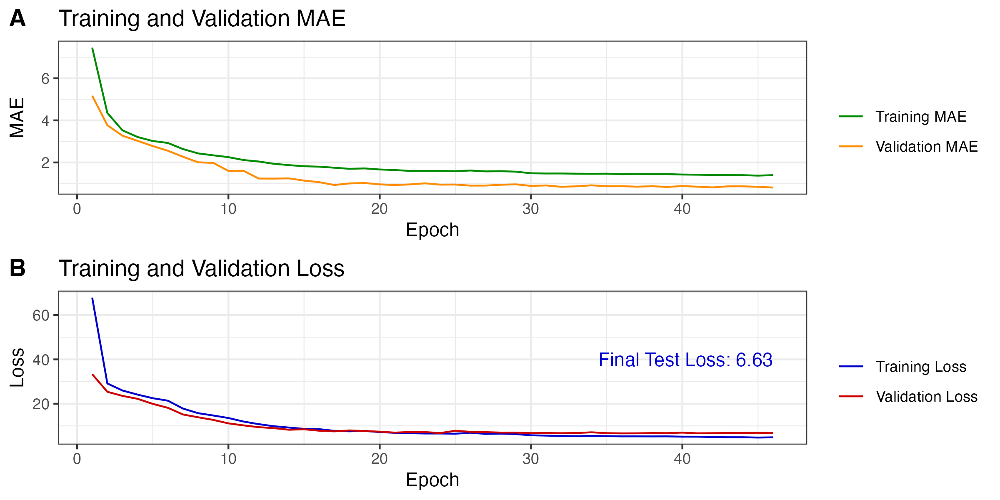

(\#fig:lstm-model-fit)Model performance on training and validation data.

After model training was completed, we predicted the values of environmental suitability $\psi_{jt}$ across all time steps for each location. Predictions start in January 1970 and go up to 5 months past the present date (currently February 2025). Given the amount of noise in the model predictions, we added a simple LOESS spline with logit transformation to smooth model predictions over time and give a more stable value of $\psi_{jt}$ when incorporating it into other model features (e.g. Equations \@ref(eq:beta2) and \@ref(eq:delta)). The resulting model predictions are shown for an example country such as Mozambique in Figure \@ref(fig:psi-prediction-data) which compares model predictions to the original case counts and the binary classification. Predicitons for all model locations are shown in a simplified view in Figure \@ref(fig:psi-prediction-countries).

*Also, please note that this initial version of the model is fitted to a rather small amount of data. Model hyper parameters were specifically chosen to reduce overfitting. Therefore, we recommend to not over-interpret the time series predictions of the model at this early stage since they are likely to change and improve as more historical incidence data is included in future versions.*

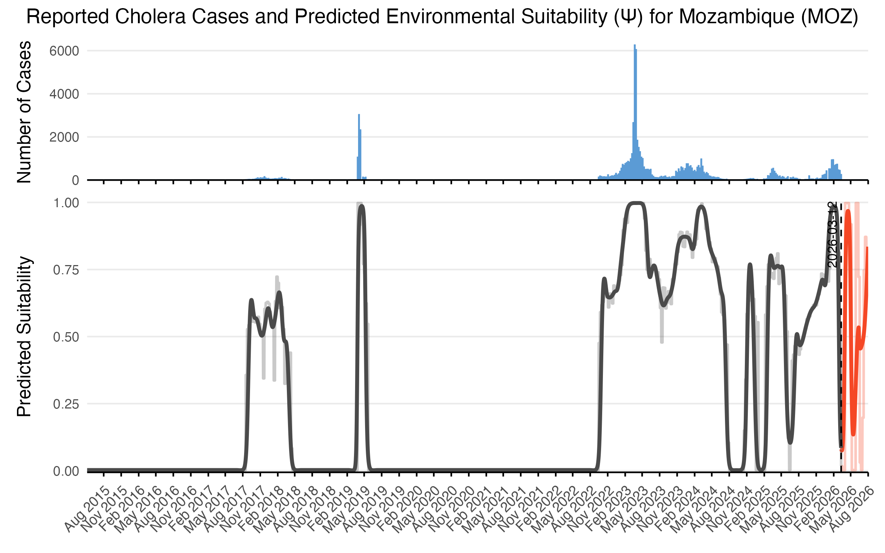

(\#fig:psi-prediction-data)The LSTM model predictions over time and reported cases for an example country such as Mozambique. Reported cases are shown in the top panel and tje shaded areas show the binary classification used to characterize environmental suitability. Raw model predicitons are shown in the transparent brown line with the solid black line showing the LOESS smoothing. Forecasted values beyond the current time point are shown in orange and are limited to 5 month time horizon.

(\#fig:psi-prediction-countries)The smoothed LSTM model predictions (lines) and binary suitability classification (shaded areas) over time for all countries in the MOSAIC framework. Orange lines show forecasts beyond the current date. With ENSO and DMI covariates included in the model, forecasts are limited to 5 months.

#### Calibration of suitability to surveillance ($\psi^{\ast}_{jt}$)

The raw LSTM output $\psi_{jt}$ captures the climate-driven *potential* for *V. cholerae* survival and transmission, but the relationship between this potential and the observed surveillance signal varies by location. In some countries epidemics peak shortly after suitability peaks, while in others there is a lag of several weeks; in some countries the climate-driven seasonality is sharper than the cholera-case signal, while in others it is flatter. Re-training the LSTM to fit case data directly would overfit the sparse surveillance record, so we instead apply a per-location *logit affine calibration* with an optional time offset and causal exponential moving average:

\begin{equation}
\psi^{\ast}_{jt} = z_{\psi^{\ast},j}\, \sigma\!\big(a_{\psi^{\ast},j}\, \text{logit}\big(\psi_{j,\,t - k_{\psi^{\ast},j}}\big) + b_{\psi^{\ast},j}\big) + (1 - z_{\psi^{\ast},j})\, \psi^{\ast}_{j,t-1},
(\#eq:psi-star)
\end{equation}

where $\sigma(\cdot)$ is the logistic function and $\text{logit}(\cdot)$ its inverse. Equivalently, in odds-space the affine step is $\text{odds}^{\ast}_t = e^{b_{\psi^{\ast},j}} \cdot (\text{odds}_t)^{a_{\psi^{\ast},j}}$, so $a_{\psi^{\ast},j} > 1$ sharpens peaks and $a_{\psi^{\ast},j} < 1$ flattens them, while $b_{\psi^{\ast},j}$ shifts the baseline odds up or down. The four calibration parameters have the following priors, fit independently per country:

$$
\begin{aligned}
a_{\psi^{\ast},j} \ \sim\ & \text{Truncnorm}(1,\ 1,\ 0,\ \infty),\\
b_{\psi^{\ast},j} \ \sim\ & \mathcal{N}(0,\ 2.5),\\
z_{\psi^{\ast},j} \ \sim\ & \text{Beta}(2,\ 1),\\
k_{\psi^{\ast},j} \ \sim\ & \text{Truncnorm}(0,\ 25,\ -90,\ 90).
\end{aligned}
(\#eq:psi-star-priors)
$$

The shape prior is centred on the identity transformation $a_{\psi^{\ast},j} = 1$; the offset prior allows the baseline odds to shift by approximately a factor of $e^{2.5} \approx 12$ on either side of unity; the smoothing prior $z_{\psi^{\ast},j} \sim \text{Beta}(2, 1)$ has its mode at $z = 1$ (no smoothing) and discourages aggressive over-smoothing during the staged calibration; and the time offset $k_{\psi^{\ast},j}$ permits both a forward lag of up to 90 days (e.g. epidemics that trail suitability) and a backward advance of up to 90 days (e.g. epidemics that precede suitability peaks). The calibrated quantity $\psi^{\ast}_{jt}$ enters the model wherever the raw LSTM output $\psi_{jt}$ would otherwise be used (Equations \@ref(eq:beta2) and \@ref(eq:delta)). A diagnostic plot comparing $\psi_{jt}$ and $\psi^{\ast}_{jt}$ for each location is produced by `plot_psi_star_diagnostic()` in the calibration pipeline.

### Infectious dose ($\kappa$) {#infectious-dose-kappa}

The half-saturation constant $\kappa$ in Equation \@ref(eq:foi-environment) is the *V. cholerae* concentration at which the per-contact probability of infection is 50%. Historical cholera transmission models have fixed $\kappa = 10^6$ cells, a value traceable to the unbuffered water-only volunteer studies of [Hornick et al. 1971](https://pubmed.ncbi.nlm.nih.gov/5286453/) and adopted by convention in subsequent modelling work (e.g. [Hartley et al. 2006](https://journals.plos.org/plosmedicine/article?id=10.1371/journal.pmed.0030007)). Modern re-analyses of buffered-exposure volunteer studies — in which sodium bicarbonate neutralises gastric acid, mimicking endemic exposure through food or contaminated water — support a lower central estimate near $10^5$ CFU with substantial between-study heterogeneity.

To reflect this evidence base we compiled a meta-analysis of 13 published infectious-dose estimates spanning four types of source: direct human-volunteer challenge studies, Beta-Poisson QMRA fits, expert-review summaries, and conventional modelling values. The volunteer challenge studies (Hornick et al. 1971, [Cash et al. 1974](https://doi.org/10.1093/infdis/129.1.45), Levine et al. 1981, [Levine et al. 1988](https://doi.org/10.1016/S0140-6736(88)90120-1), Tacket et al. 1999) provide the strongest primary evidence; QMRA syntheses ([Haas, Rose & Gerba 1999](https://www.wiley.com/en-us/Quantitative+Microbial+Risk+Assessment-p-9780471183976)) and expert reviews ([Kaper et al. 1995](https://doi.org/10.1128/cmr.8.1.48), [Nelson et al. 2009](https://www.ncbi.nlm.nih.gov/pmc/articles/PMC3842031/)) provide supporting summaries; and conventional modelling values ([Codeço 2001](https://doi.org/10.1186/1471-2334-1-1), [Hartley et al. 2006](https://journals.plos.org/plosmedicine/article?id=10.1371/journal.pmed.0030007)) capture the values adopted in the cholera-transmission literature. Each source is weighted by its evidentiary quality and relevance to the endemic, buffered-exposure context: direct volunteer challenge studies receive a weight of 1.0, while expert reviews and QMRA syntheses receive weights between 0 and 0.5. A weighted lognormal is then fit by maximum-likelihood on the log10 scale:

$$
\kappa \sim \text{Lognormal}(11.77,\ 1.82).
(\#eq:kappa)
$$

The resulting prior has a median of approximately $1.3 \times 10^5$ CFU and a 95% credible interval of approximately $3.6 \times 10^3$ to $4.6 \times 10^6$ CFU (Figure \@ref(fig:kappa-prior)). This is consistent with the lower modern-era central estimate while preserving the order-of-magnitude uncertainty that the volunteer-study literature genuinely reflects.

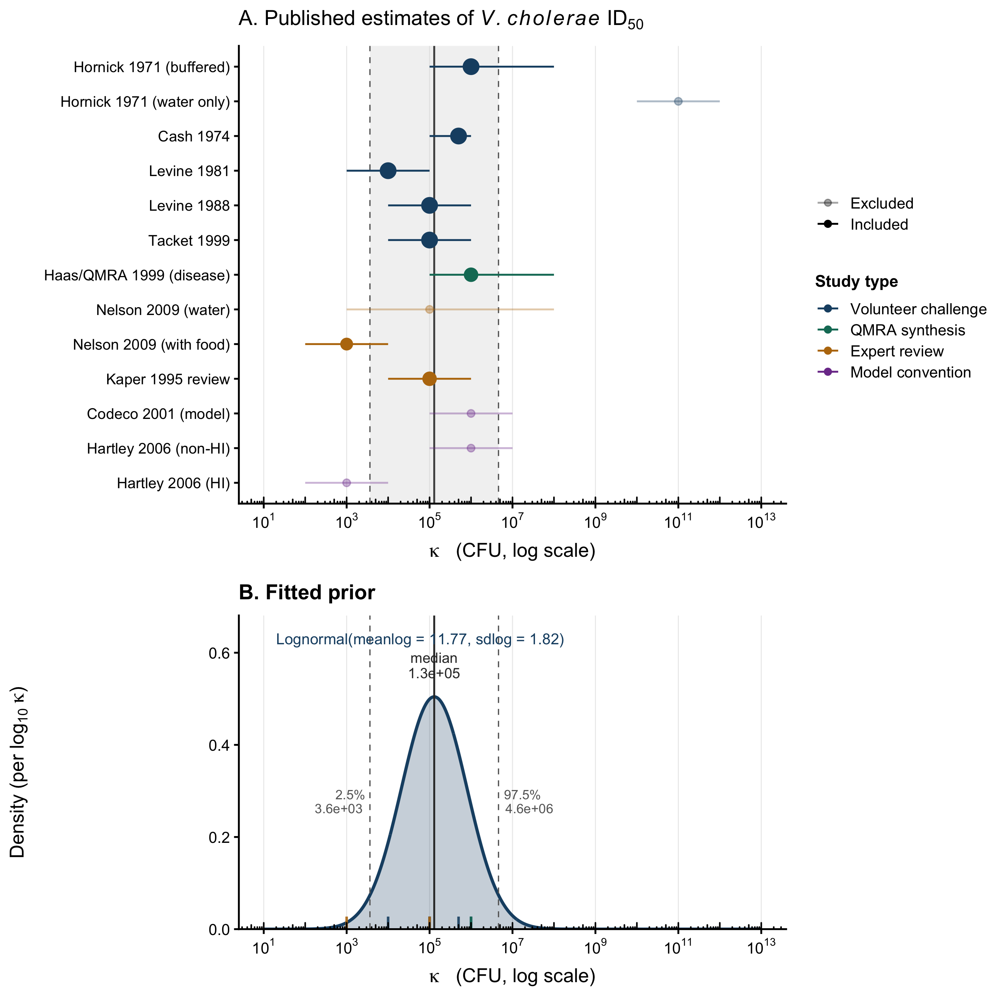

(\#fig:kappa-prior)Prior distribution for the environmental half-saturation constant $\kappa$, the *V. cholerae* concentration at which the per-contact probability of infection is 50%. Points and bars show the 13 literature anchors and their reported bounds; the lognormal fit (solid line) is weighted by evidentiary quality, with direct human-volunteer challenge studies receiving the highest weight.

### Shedding of *V. cholerae* {#sec:shedding}

The rate at which infected individuals shed *Vibrio cholerae* into the environment is a critical factor influencing cholera transmission dynamics. Shedding rates vary widely depending on the severity of infection, the host immune response, and environmental conditions. To reflect this heterogeneity, the model distinguishes between two types of infected individuals:

- Symptomatic individuals ($I_1$), who tend to shed substantially more bacteria for longer due to more severe gastrointestinal symptoms;
- Asymptomatic individuals ($I_2$), who shed less per capita and for a shorter period of time, but may contribute significantly to environmental contamination due to their larger numbers.

According to the modeling study done by  [Fung et al. (2014)](https://www.ncbi.nlm.nih.gov/pmc/articles/PMC3926264/), estimates of *V. cholerae* shedding across the population can range from 0.01 to 10 cells per mL per person per day. However, this estimate does not fully capture the range of possible shedding that can occur depending on the type of infection. In contrast, [Nelson et al. (2009)](https://www.ncbi.nlm.nih.gov/pmc/articles/PMC3842031/) report that individuals may shed between $10^3$ $\text{cells}~\text{g}^{-1}~\text{stool}$ in asymptomatic cases and up to $10^{12}$ $\text{cells}~\text{g}^{-1}~\text{stool}$ in severe symptomatic infections, implying that symptomatic individuals may shed several orders of magnitude more bacteria into the environment per day than asymptomatic individuals.

The shedding-rate parameters $\zeta_1$ and $\zeta_2$ enter the environmental reservoir update as cells deposited per infected person per day (see Equation \@ref(eq:system)). Earlier MOSAIC versions parameterised shedding as a concentration ($\text{cells}~\text{mL}^{-1}~\text{person}^{-1}~\text{day}^{-1}$), but in the current LASER implementation the reservoir $W$ tracks absolute *V. cholerae* cells and the half-saturation constant $\kappa$ is expressed in the same absolute units. Under the assumption that watery stool has approximately the density of water, the two specifications differ only by whether the daily stool-volume integral is absorbed into $\zeta_k$ or left implicit.

The migration to absolute-cell units in v1.0 raised the modal $\zeta_1$ by roughly six orders of magnitude relative to the v0.1 concentration-scale Uniform prior. Because $\kappa$ remains parameterised from volunteer dose-response studies that report concentrations, readers should be aware that the $W$-vs-$\kappa$ scale matching is an open methodological question: at very high simulated $W$, the dose-response $W/(\kappa + W)$ saturates near unity and the environmental force of infection becomes weakly identifying for $\kappa$. The calibration mitigates this by retaining the literature-derived prior on $\kappa$, but joint identifiability of $\zeta_1, \beta_{j0}^{\text{env}}$, and $\kappa$ should be inspected in the marginal-posterior diagnostics before strong conclusions are drawn from the environmental component of the force of infection.

To set priors that span the genuine biological range, we performed a literature meta-analysis. For $\zeta_1$ we assembled per-person-per-day anchors from 14 primary sources reporting *V. cholerae* concentrations in cholera stool (e.g. [Nelson et al. 2009](https://www.ncbi.nlm.nih.gov/pmc/articles/PMC3842031/), [Harris et al. 2012](https://www.sciencedirect.com/science/article/pii/S014067361260436X), [Kaper et al. 1995](https://doi.org/10.1128/cmr.8.1.48), [Merrell et al. 2002](https://www.nature.com/articles/nature00778)) and converted each anchor to a daily rate using time-averaged stool volumes for severe (8 L/day), moderate (4 L/day), and mild (0.5 L/day) infections. A severity-weighted pool --- using a default mix of 20% severe, 40% moderate, and 40% mild, consistent with [Harris et al. 2012](https://www.sciencedirect.com/science/article/pii/S014067361260436X) --- is fit by weighted maximum-likelihood on the log scale. For $\zeta_2$ the evidence base is thin (essentially [Nelson et al. 2009](https://www.ncbi.nlm.nih.gov/pmc/articles/PMC3842031/) and the [Kaper et al. 1995](https://doi.org/10.1128/cmr.8.1.48) expert review); the prior therefore applies a hard floor of $\sigma_{\log} \ge 2$ to honestly reflect that only one primary source contributes.

Rather than treating $\zeta_1$ and $\zeta_2$ as independent draws --- which can produce samples with $\zeta_1 < \zeta_2$ contrary to biology --- we sample $\zeta_1$ together with a shedding ratio $\zeta_{\text{ratio}} = \zeta_1 / \zeta_2$ and derive $\zeta_2$ algebraically. The ratio prior combines two complementary literature channels via precision-weighting on the log scale: a *direct channel* using published symptomatic-to-asymptomatic ratios such as the household transmission odds ratio of [Smith et al. 2026](https://doi.org/10.64898/2026.01.09.26343785) (approximately 1.6), the paired stool concentrations of [Nelson et al. 2009](https://www.ncbi.nlm.nih.gov/pmc/articles/PMC3842031/) (approximately $10^5$), and modelling anchors from [Chao et al. 2011](https://doi.org/10.1073/pnas.1102149108) and [Finger et al. 2018](https://journals.plos.org/plosmedicine/article?id=10.1371/journal.pmed.1002509); and a *derived channel* obtained as the closed-form ratio of the independent $\zeta_1$ and $\zeta_2$ lognormals. The resulting priors are:

$$
\begin{aligned}
\zeta_1 \ \sim \ &\text{Lognormal}(25.65,\ 2.46) \quad \text{(symptomatic shedding)},\\
\zeta_{\text{ratio}} \ \sim \ &\text{Lognormal}(4.31,\ 4.39) \quad \text{(symptomatic-to-asymptomatic ratio)},\\
\zeta_2 \ = \ & \zeta_1 \,/\, \zeta_{\text{ratio}} \quad \text{(asymptomatic shedding, derived)}.
\end{aligned}
(\#eq:shedding)
$$

The medians of these priors correspond to approximately $1.4 \times 10^{11}$ *V. cholerae* cells per symptomatic person per day, a ratio of approximately 75 between symptomatic and asymptomatic shedding, and therefore approximately $1.9 \times 10^9$ cells per asymptomatic person per day (Figures \@ref(fig:zeta1-prior) and \@ref(fig:zeta-ratio-prior)). These central values are several orders of magnitude larger than the older Frame-B Uniform priors used in MOSAIC v0.1, but they are biologically anchored to the volumetric scale of *V. cholerae* shedding observed in clinical studies. The 95% credible intervals span the full range of values reported across the studies in the table below.

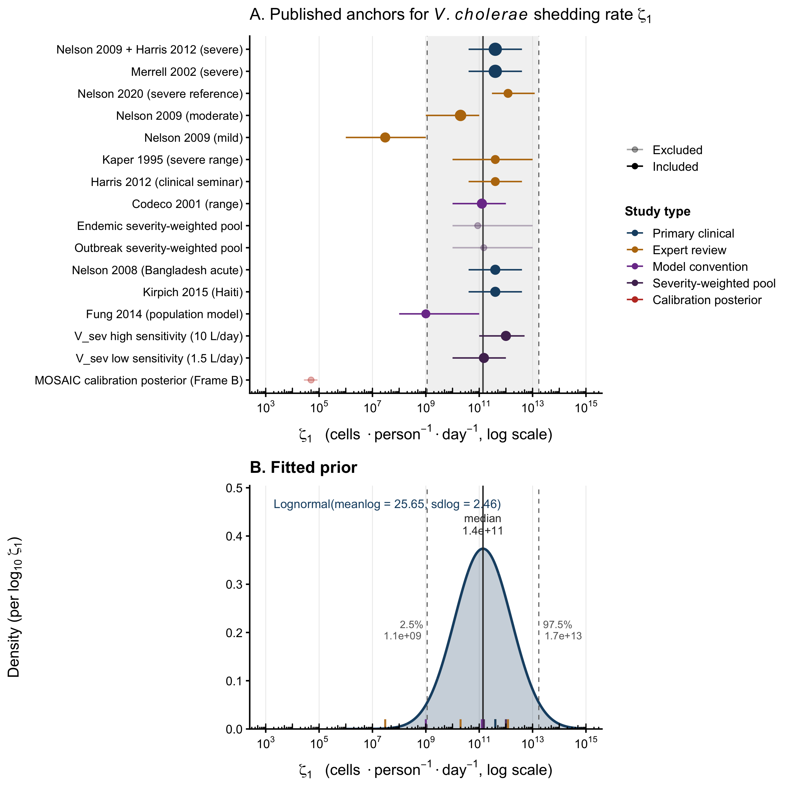

(\#fig:zeta1-prior)Prior distribution for the symptomatic shedding rate $\zeta_1$ (cells per symptomatic person per day, log scale). The lognormal fit is weighted by severity class and anchored to per-person-per-day rates derived from *V. cholerae* stool concentrations and time-averaged stool volumes from 14 literature sources. Points and bars show the literature anchors and their reported bounds.

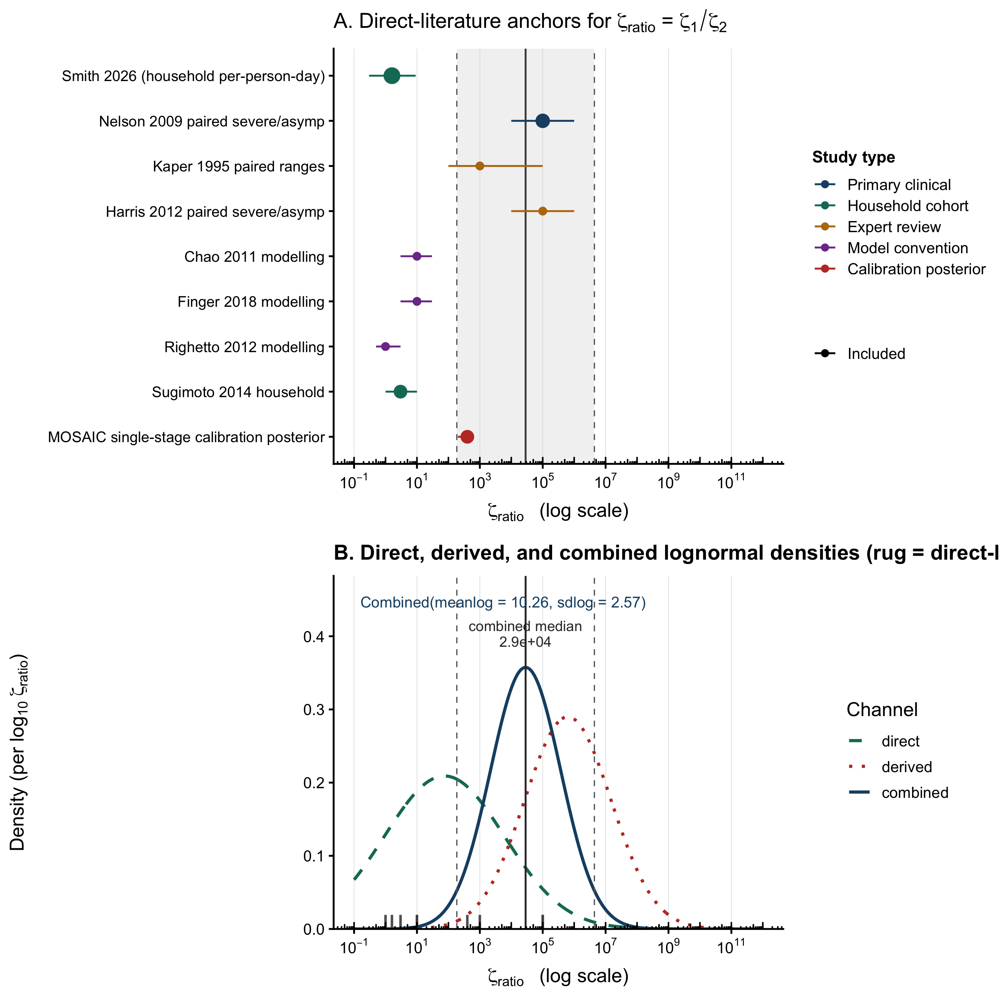

(\#fig:zeta-ratio-prior)Prior distribution for the symptomatic-to-asymptomatic shedding ratio $\zeta_{\text{ratio}} = \zeta_1 / \zeta_2$. The combined channel is a precision-weighted Bayesian combination of a direct literature channel (from household-transmission and paired-stool studies) and a derived channel (the closed-form ratio of the $\zeta_1$ and $\zeta_2$ marginal lognormals).

The table below summarizes key published estimates and assumptions regarding *V. cholerae* and related bacterial shedding rates:

| Value(s)           | Units                                                | Infection     | Description                                                              | Source                       |
|--------------------|------------------------------------------------------|---------------|---------------------------------------------------------------------------|------------------------------|
| $10^3$             | $\text{cells}~\text{g}^{-1}~\text{stool}$            | Asymptomatic  | Approx. 1 day of shedding at ~10³ vibrios per gram of stool              | [Mosley et al. (1968)](https://www.ncbi.nlm.nih.gov/pmc/articles/PMC2554681/) |
| $10^6$--$10^9$     | $\text{cells}~\text{g}^{-1}~\text{stool}$            | NA            | Number of fecal coliform indicator bacteria in human feces               | [Feachem et al. (1983)](https://documents.worldbank.org/en/publication/documents-reports/documentdetail/en/704041468740420118) |
| $1$--$100$         | $\text{cells}~\text{mL}^{-1}~\text{person}^{-1}~\text{day}^{-1}$ | All          | Point estimate of 10; range 1–100 used in sensitivity analysis           | [Codeço (2001)](https://doi.org/10.1186/1471-2334-1-1) |
| $10$               | $\text{cells}~\text{mL}^{-1}~\text{person}^{-1}~\text{day}^{-1}$ | All          | Assumed shedding rate used in epidemic model incorporating hyperinfectivity | [Hartley et al. (2006)](https://journals.plos.org/plosmedicine/article?id=10.1371/journal.pmed.0030007) |
| $\leq 10^5$        | $\text{cells}~\text{g}^{-1}~\text{stool}$            | Asymptomatic  | No symptoms; low-level shedding of vibrios                               | [Nelson et al. (2009)](https://www.ncbi.nlm.nih.gov/pmc/articles/PMC3842031/) |
| $\leq 10^8$        | $\text{cells}~\text{g}^{-1}~\text{stool}$            | Mild          | Diarrhoea with moderate vibrios in stool                                 | [Nelson et al. (2009)](https://www.ncbi.nlm.nih.gov/pmc/articles/PMC3842031/) |
| $10^7$--$10^9$     | $\text{cells}~\text{g}^{-1}~\text{stool}$            | Severe        | Vomiting and profuse diarrhoea with high shedding                        | [Nelson et al. (2009)](https://www.ncbi.nlm.nih.gov/pmc/articles/PMC3842031/) |
| $10^{10}$--$10^{12}$ | $\text{cells}~\text{L}^{-1}~\text{stool}$          | Severe        | Concentration in rice water stool from symptomatic individuals           | [Nelson et al. (2009)](https://www.ncbi.nlm.nih.gov/pmc/articles/PMC3842031/) |
| $0.01$--$10$       | $\text{cells}~\text{mL}^{-1}~\text{person}^{-1}~\text{day}^{-1}$ | All          | Reported as general estimate across all infections                       | [Fung (2014)](https://www.ncbi.nlm.nih.gov/pmc/articles/PMC3926264/) |
| $10$--$100$        | $\text{cells}~\text{mL}^{-1}~\text{person}^{-1}~\text{day}^{-1}$ | All          | Represents shedding rates in two distinct sub-populations                | [Njagarah & Nyabadza (2014)](https://doi.org/10.1016/j.amc.2014.05.036) |

### Recovery rates

The recovery rates in the MOSAIC model are defined as the inverse of the shedding duration for infected individuals. This reflects the period during which individuals contribute to the environmental load of *Vibrio cholerae* and to onward transmission, regardless of the severity of clinical symptoms. The model distinguishes between two compartments with substantially different shedding durations.

**Symptomatic individuals ($\gamma_1$).**

Individuals in the $I_1$ compartment experience acute watery diarrhoea and shed large quantities of *V. cholerae* over an extended infectious period. Clinical reviews place the typical symptomatic shedding duration at approximately one to two weeks ([Nelson et al. 2009](https://www.ncbi.nlm.nih.gov/pmc/articles/PMC3842031/), [Harris et al. 2012](https://doi.org/10.1016/S0140-6736(12)60436-X), [Kaper et al. 1995](https://doi.org/10.1128/cmr.8.1.48)). To preserve this central estimate while admitting the genuine variability across cases, we fit a lognormal prior on the per-day recovery rate with median corresponding to a 10-day shedding duration:

$$
\gamma_1 \sim \text{Lognormal}(-2.303,\ 0.5) \ \ \text{day}^{-1}
\quad (\text{median duration} \approx 10 \ \text{days, 95\% CI} \approx 4\text{--}26 \ \text{days}).
$$

**Asymptomatic individuals ($\gamma_2$).**

Individuals in the $I_2$ compartment do not present clinically and shed *V. cholerae* for a substantially shorter period. The verbatim observation of [Nelson et al. 2009](https://www.ncbi.nlm.nih.gov/pmc/articles/PMC3842031/) is that "asymptomatic patients typically shed vibrios for only one day at approximately $10^3$ vibrios per gram of stool", and the corroborating reviews ([Kaper et al. 1995](https://doi.org/10.1128/cmr.8.1.48), Mosley et al. 1968) place asymptomatic shedding in the range of approximately one to a few days. We therefore set the asymptomatic recovery rate to a lognormal prior with median corresponding to a 2-day shedding duration:

$$
\gamma_2 \sim \text{Lognormal}(-0.693,\ 0.4) \ \ \text{day}^{-1}
\quad (\text{median duration} \approx 2 \ \text{days, 95\% CI} \approx 1\text{--}5 \ \text{days}).
$$

The two priors encode the empirical pattern that symptomatic infections shed for substantially longer than asymptomatic infections, even though the latter outnumber the former: the cumulative *per-infection* environmental load is approximately $\zeta_1/\gamma_1$ for symptomatic and $\zeta_2/\gamma_2$ for asymptomatic, so the differences in $\zeta$ and $\gamma$ work in the same direction and reinforce the dominance of severe cases in the environmental signal. The combined effective removal rate $\gamma_{\mathrm{eff}}$ used in the basic reproductive number (Equation \@ref(eq:gamma-eff)) is the symptomatic-proportion-weighted harmonic mean of $\gamma_1$ and $\gamma_2$ and therefore inherits the same skew toward the symptomatic duration.

For deterministic simulations or sensitivity analyses that prefer point estimates rather than draws from the lognormal priors, the medians serve as defaults:

$$
\gamma_1 \approx \frac{1}{10} = 0.1 \ \text{day}^{-1}, \qquad
\gamma_2 \approx \frac{1}{2} = 0.5 \ \text{day}^{-1}.
$$

These parameterisations reflect the empirical difference in shedding durations by symptom status reported in the cholera literature and are consistent with the environmental shedding structure of the model and with the per-day formulation of $\zeta_1$ and $\zeta_2$ in Section \@ref(sec:shedding).

(\#fig:recovery-rates)Shedding duration (days, x-axis) for symptomatic (red) and asymptomatic (blue) *V. cholerae* infections under the canonical MOSAIC lognormal recovery-rate priors. The shaded rectangles span each prior's 95% credible interval on duration (symptomatic: approximately 4--26 days; asymptomatic: approximately 1--4 days), and the solid vertical lines mark the prior medians (symptomatic: 10 days; asymptomatic: 2 days). The recovery rates $\gamma_1$ and $\gamma_2$ used in the model are the inverses of the corresponding durations.

### WAter, Sanitation, and Hygiene (WASH) 

Since *V. cholerae* is transmitted through fecal contamination of water and other consumables, the level of exposure to contaminated substrates significantly impacts transmission rates. Interventions involving Water, Sanitation, and Hygiene (WASH) have long been a first line of defense in reducing cholera transmission, and in this context, WASH variables can serve as proxy for the rate of contact with environmental risk factors. In the MOSAIC model, WASH variables are incorporated mechanistically, allowing for intervention scenarios that include changes to WASH. However, it is necessary to distill available WASH variables into a single parameter that represents the WASH-determined contact rate with contaminated substrates for each location $j$, which we define as $\theta_j$.

To parameterize $\theta_j$, we calculated a weighted mean of the 8 WASH variables in [Sikder et al 2023](https://doi.org/10.1021/acs.est.3c01317) and originally modeled by the [Local Burden of Disease WaSH Collaborators 2020](https://www.thelancet.com/journals/langlo/article/PIIS2214-109X(20)30278-3/fulltext). The 8 WASH variables (listed in Table \@ref(tab:wash-weights)) provide population-weighted measures of the proportion of the population that either: *i*) have access to WASH resources (e.g., piped water, septic or sewer sanitation), or *ii*) are exposed to risk factors (e.g. surface water, open defecation). For risk associated WASH variables, we used the complement ($1-\text{value}$) to give the proportion of the population *not* exposed to each risk factor. We used the [`optim`](https://www.rdocumentation.org/packages/stats/versions/3.6.2/topics/optim) function in R and the [L-BFGS-B](https://en.wikipedia.org/wiki/Limited-memory_BFGS) algorithm to estimate the set of optimal weights (Table \@ref(tab:wash-weights)) that maximize the correlation between the weighted mean of the 8 WASH variables and reported cholera incidence per 1000 population across 40 SSA countries from 2000 to 2016. The optimal weighted mean had a correlation coefficient of $r =$ -0.33 (-0.51 to -0.09 95% CI) which was higher than the basic mean and all correlations provided by the individual WASH variables (see Figure \@ref(fig:wash-incidence)). The weighted mean then provides a single variable between 0 and 1 that represents the overall proportion of the population that has access to WASH and/or is not exposed to environmental risk factors. Thus, the WASH-mediated contact rate with sources of environmental transmission is represented as ($1-\theta_j$) in the environment-to-human force of infection ($\Psi_{jt}$). Values of $\theta_j$ for all countries are shown in Figure \@ref(fig:wash-country).

<table class="table table-striped table-condensed" style="width: auto !important; margin-left: auto; margin-right: auto;">
<caption>(\#tab:wash-weights)(\#tab:wash-weights)Table of optimized weights used to calculate the single mean WASH index for all countries.</caption>
 <thead>
  <tr>
   <th style="text-align:left;"> WASH variable </th>
   <th style="text-align:right;"> Optimized weight </th>
  </tr>
 </thead>
<tbody>
  <tr>
   <td style="text-align:left;"> Piped Water </td>
   <td style="text-align:right;"> 0.356 </td>
  </tr>
  <tr>
   <td style="text-align:left;"> Septic or Sewer Sanitation </td>
   <td style="text-align:right;"> 0.014 </td>
  </tr>
  <tr>
   <td style="text-align:left;"> Other Improved Water </td>
   <td style="text-align:right;"> 0.000 </td>
  </tr>
  <tr>
   <td style="text-align:left;"> Other Improved Sanitation </td>
   <td style="text-align:right;"> 0.000 </td>
  </tr>
  <tr>
   <td style="text-align:left;"> Surface Water </td>
   <td style="text-align:right;"> 0.504 </td>
  </tr>
  <tr>
   <td style="text-align:left;"> Unimproved Sanitation </td>
   <td style="text-align:right;"> 0.000 </td>
  </tr>
  <tr>
   <td style="text-align:left;"> Unimproved Water </td>
   <td style="text-align:right;"> 0.000 </td>
  </tr>
  <tr>
   <td style="text-align:left;"> Open Defecation </td>
   <td style="text-align:right;"> 0.126 </td>
  </tr>
</tbody>
</table>

(\#fig:wash-incidence)Relationship between WASH variables and cholera incidences.

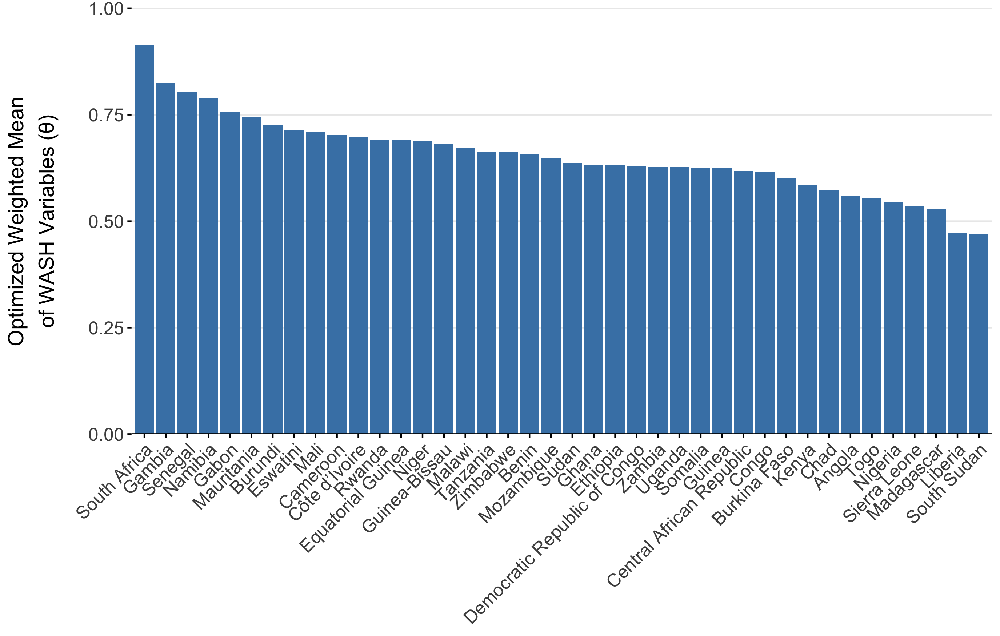

(\#fig:wash-country)The optimized weighted mean of WASH variables for AFRO countries. Countries labeled in orange denote countries with an imputed weighted mean WASH variable. Imputed values are the weighted mean from the 3 most similar countries.

## Immune dynamics

Aside from the current number of infections, population susceptibility is one of the key factors influencing the spread of cholera. Further, since immunity from both vaccination and natural infection provides long-lasting protection, it's crucial to quantify not only the incidence of cholera but also the number of past vaccinations. Additionally, we need to estimate how many individuals with immunity remain in the population at any given time step in the model.

To achieve this, we estimate the vaccination rate over time ($\nu_{jt}$) based on historical vaccination campaigns and incorporate a model of vaccine effectiveness ($\phi$) and immune decay post-vaccination ($\omega$) to estimate the current number of individuals with vaccine-derived immunity. We also account for the immune decay rate from natural infection ($\varepsilon$), which is generally considered to last longer than immunity from vaccination.

### Estimating Vaccination Rates

To estimate the past and current vaccination rates, we sourced data on reported OCV vaccinations from the WHO [International Coordinating Group](https://www.who.int/groups/icg) (ICG) [Cholera vaccine dashboard](https://app.powerbi.com/view?r=eyJrIjoiYmFmZTBmM2EtYWM3Mi00NWYwLTg3YjgtN2Q0MjM5ZmE1ZjFkIiwidCI6ImY2MTBjMGI3LWJkMjQtNGIzOS04MTBiLTNkYzI4MGFmYjU5MCIsImMiOjh9). This resource lists all reactive OCV campaigns conducted from 2016 to the present, with approximately 103 million OCV doses shipped to Sub-Saharan African (SSA) countries as of October 9, 2024. However, these data only capture reactive vaccinations in emergency settings and do not include preventive campaigns organized by GAVI and in-country partners. 

*As a result, our current estimates of the OCV vaccination rate likely underestimate total OCV coverage. We are working to expand our data sources to better reflect the full number of OCV doses distributed in SSA and will update the results here as soon as these are available.*

To translate the reported number of OCV doses into the model parameter $\nu_{jt}$, we take the number of doses shipped and the reported start date of the vaccination campaign, distributing the doses over subsequent days according to a maximum daily vaccination rate. Therefore, the vaccination rate $\nu_t$ is not an estimated quantity, it is defined by the reported number of OCV doses administered with a assumption about the daily rate of distribution for an OCV campaign:

$$
\nu_{jt} = f\big(\text{reported OCV doses distributed}_{jt} \ | \ \text{daily distribution rate}\big).
$$

We separate $\nu_{jt}$ into first doses $\nu_{1,jt}$ and second doses $\nu_{2,jt}$ on the basis of the campaign-level vaccine classification reported by GTFCC: Euvichol-S deliveries contribute exclusively to $\nu_{1,jt}$ (single-dose schedule), while Shanchol and Euvichol deliveries contribute proportionally to $\nu_{1,jt}$ and $\nu_{2,jt}$ according to the campaign's reported dose-1 and dose-2 split. Within each day, doses are *delivered deterministically* (rather than via a Poisson draw, as in earlier MOSAIC versions): the reported number of doses for that day is rounded to the nearest integer and processed without stochastic variation. First doses are then allocated proportionally across the configurable source set $\mathcal{V}^{\text{src}} \subseteq \{S, E, I_1, I_2, R\}$ (default: all five), so that a fraction $X_{jt} / N^{\text{src}}_{jt}$ of $\nu_{1,jt}$ is delivered to each eligible compartment $X$. Second doses are restricted to existing $V_1$ recipients and capped at the current $V_1$ population to prevent over-administration. Two patch-level counters $\text{doses}^{(1)}_{j,t}$ and $\text{doses}^{(2)}_{j,t}$ record the daily totals for comparison with reported OCV-campaign data; these are tracking-only and do not feed back into the model dynamics.

A few features of the implementation deserve explicit mention:

- *Order of operations within a tick.* Second-dose delivery is processed before first-dose delivery so that a recipient who is eligible for a first dose on the same day cannot be advanced to $V_2$ in a single tick.
- *Vaccinating active infectives.* Because the default $\mathcal{V}^{\text{src}}$ includes $I_1$ and $I_2$, a small fraction of doses is delivered to currently-infectious individuals. This is a deliberate simplification that keeps the dose-allocation denominator equal to the eligible population without separately bookkeeping who is shedding; the effect at typical $I/N$ prevalences is negligible. Restrict $\mathcal{V}^{\text{src}}$ to $\{S, E, R\}$ in the LASER config if this simplification is undesired for a particular scenario.
- *V protection is one-sided.* The vaccinated compartments $V_1, V_2$ are excluded from the force-of-infection terms — i.e. an individual in $V$ cannot be reinfected until they wane back to $S$. There is no "vaccinated-but-not-protected" sub-compartment in the v1.0 implementation; the $(1-\phi_k)$ ineffective fraction remains in the source compartment and re-enters the FOI through normal $S$-side dynamics.

See Figure \@ref(fig:vaccination-example) for an example of OCV distribution using a maximum daily vaccination rate of 100,000. The resulting time series for each country is shown in Figure \@ref(fig:vaccination-countries), with current totals based on the WHO ICG data displayed in Figure \@ref(fig:vaccination-maps).

(\#fig:vaccination-example)Example of the estimated vaccination rate during an OCV campaign.

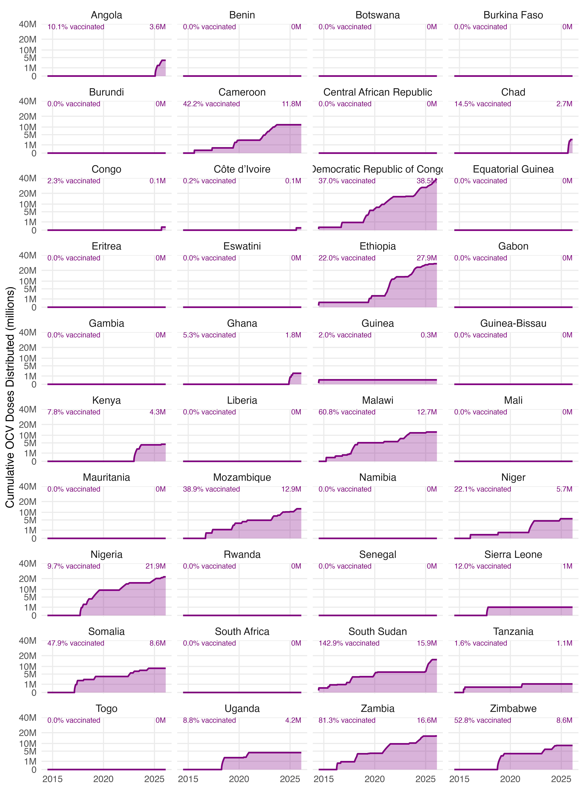

(\#fig:vaccination-countries)The estimated vaccination coverage across all countries with reported vaccination data one the WHO ICG dashboard.

(\#fig:vaccination-maps)The total cumulative number of OCV doses distributed through the WHO ICG from 2016 to present day.

### Immunity from vaccination
The impacts of Oral Cholera Vaccine (OCV) campaigns are incorporated into the model through two vaccinated compartments, $V_1$ (one-dose recipients) and $V_2$ (two-dose recipients), as introduced in the [system of difference equations](#eq:system). Vaccine effectiveness $\phi_1, \phi_2$ acts at the moment of dose delivery: of the $\nu_{1,jt}$ first doses delivered on day $t$, the $\phi_1 \nu_{1,jt}$ *effective* fraction enter $V_1$ while the $(1-\phi_1)\nu_{1,jt}$ ineffective fraction leave the recipient in the source compartment. The same logic applies to second doses with effectiveness $\phi_2$. Waning brings vaccinated individuals back to $S$ at rates $\omega_1, \omega_2$ per day.

To set priors for the effectiveness and waning rates, we draw on the systematic review and meta-regression of [Xu et al. 2024](https://doi.org/10.1101/2024.08.13.24311930v2) (medRxiv preprint; published 2025 in *Lancet Global Health* as [Xu et al. 2025](https://doi.org/10.1016/S2214-109X(25)00107-X)), which pools cohort studies in Bangladesh, South Sudan, and the Democratic Republic of Congo --- including the underlying studies used in earlier MOSAIC versions (Qadri et al. 2016 and 2018, Azman et al. 2016, Malembaka et al. 2024) --- to produce time-varying effectiveness estimates with confidence intervals at five follow-up points for the one-dose schedule (6, 12, 18, 24, 30 months) and four for the two-dose schedule (12, 24, 36, 48 months). We fit an exponential-decay model

$$
\text{VE}_k(t) = \phi_k \exp(-\omega_k\, t)
$$

separately to the mean, lower, and upper effectiveness curves for each dose regimen $k \in \{1,2\}$ using Levenberg--Marquardt nonlinear least squares (the [`minpack.lm`](https://rdrr.io/cran/minpack.lm/) R library), then moment-match the point estimate and 95% CI of each parameter to a Beta prior (for $\phi$) or a Gamma prior (for $\omega$). To enforce the biological monotonicity that two doses cannot reduce protection at the time of delivery, the two-dose fit is constrained so that $\phi_2 \ge \phi_1$; without this constraint the independent backward extrapolations from the later-starting two-dose follow-up window (12--48 months) yields $\phi_2 < \phi_1$, an artefact of the asymmetric follow-up windows rather than a feature of the underlying meta-regression. The resulting priors are:

$$
\begin{aligned}
\phi_1 \ \sim\ & \text{Beta}(91.84,\ 25.49) \quad \text{(one-dose effectiveness, mode} \approx 0.79\text{)},\\
\phi_2 \ \sim\ & \text{Beta}(206.96,\ 56.53) \quad \text{(two-dose effectiveness, mode} \approx 0.79\text{, constrained to } \ge \phi_1\text{)},\\
\omega_1 \ \sim\ & \text{Gamma}(23.33,\ 31{,}693.83) \quad \text{(one-dose waning, mode} \approx 0.00070\ \text{day}^{-1}\text{)},\\
\omega_2 \ \sim\ & \text{Gamma}(2.69,\ 4{,}720.84) \quad \text{(two-dose waning, mode} \approx 0.00036\ \text{day}^{-1}\text{)}.
\end{aligned}
(\#eq:effectiveness)
$$

After applying the constraint, the initial effectiveness is identical at the mode (both schedules reach approximately 0.79 immediately after the last dose), but the two-dose schedule decays substantially more slowly: the modal one-dose half-life of effectiveness is $\log(2) / \omega_1 \approx 984$ days $\approx 2.7$ years, while the modal two-dose half-life is $\log(2) / \omega_2 \approx 1939$ days $\approx 5.3$ years. The Gamma posterior for $\omega_2$ is also more positively skewed (Figure \@ref(fig:effectiveness)F), reflecting the smaller number of two-dose follow-up time points in the meta-regression and the wider 95% CI bounds at later follow-up.

The $\phi_2 \ge \phi_1$ monotonicity constraint is enforced *during the data fit* — so the modes of the two Beta priors satisfy it exactly — but the priors themselves remain independent during BFRS sampling, and individual draws can therefore occasionally produce $\phi_2 < \phi_1$. In practice both Beta priors are tightly concentrated near 0.79 (Beta(91.84, 25.49) and Beta(206.96, 56.53)), so such violations are rare and the marginal posterior summaries are unaffected.

(\#fig:effectiveness)Vaccine-effectiveness priors for the one-dose (top row, blue) and two-dose (bottom row, green) OCV regimens, derived from the [Xu et al. 2024](https://doi.org/10.1101/2024.08.13.24311930v2) meta-regression. Panels A and D show the fitted exponential decay $\text{VE}_k(t) = \phi_k \exp(-\omega_k t)$ (solid line) and 95% prediction envelope (dashed lines), with the Xu et al. mean estimates (filled circles) and 95% CI bars overlaid; the mode estimates from the fits are reported in the upper-right of each panel. The two-dose fit is constrained so that $\phi_2 \ge \phi_1$. Panels B and E show the Beta priors for the initial effectiveness $\phi_1, \phi_2$; panels C and F show the Gamma priors for the daily waning rates $\omega_1, \omega_2$. In each density panel, the solid vertical line marks the mode and the dashed coloured lines mark the 95% CI bounds carried over from the data fit.

### Immunity from natural infection

The duration of immunity after a natural infection is likely to be longer lasting than that from vaccination with OCV (especially given the current one dose strategy). As in most SIR-type models, the rate at which individuals leave the Recovered compartment is governed by the immune decay parameter $\varepsilon$. We estimated the durability of immunity from natural infection based on two cohort studies and fit the following exponential decay model to estimate the rate of immunity decay over time:

$$
\text{Proportion immune}\ t \ \text{days after infection} = 0.99 \times (1 - \varepsilon) ^ {t-t_{\text{infection}}}
$$
Where we make the necessary and simplifying assumption that within 0--90 days after natural infection with *V. cholerae*, individuals are 95--99% immune. We fit this model to reported data from [Ali et al (2011)](https://doi.org/10.1093/infdis/jir416) and [Clemens et al (1991)](https://www.sciencedirect.com/science/article/pii/0140673691902076) (see Table \@ref(tab:immunity-sources)).

Table: (\#tab:immunity-sources)Sources for the duration of immunity fro natural infection.

|  Day| Effectiveness| Upper CI| Lower CI|Source               |
|----:|-------------:|--------:|--------:|:--------------------|
|   90|          0.95|     0.95|     0.95|Assumption           |
| 1080|          0.65|     0.81|     0.37|[Ali et al (2011)](https://doi.org/10.1093/infdis/jir416)|
| 1260|          0.61|     0.81|     0.21|[Clemens et al (1991)](https://www.sciencedirect.com/science/article/pii/0140673691902076)|

We estimated the mean immune decay to be $\bar\varepsilon \approx 3.9 \times 10^{-4}$ day$^{-1}$, equivalent to a mean immune duration of approximately 7 years as shown in Figure \@ref(fig:immune-decay)A. This is slightly longer than previous modeling work estimating the duration of immunity to be approximately 5 years ([King et al. 2008](https://www.nature.com/articles/nature07084)). Uncertainty around $\varepsilon$ in the model is represented by a lognormal prior parameterised on the natural scale by the mean and standard deviation (matching the convention used in `priors_default.json`), as shown in Figure \@ref(fig:immune-decay)B:

$$
\varepsilon \sim \text{Lognormal}\big(\text{mean} = 3.9 \times 10^{-4},\ \text{sd} = 4.0 \times 10^{-4}\big) \ \ \text{day}^{-1}.
$$

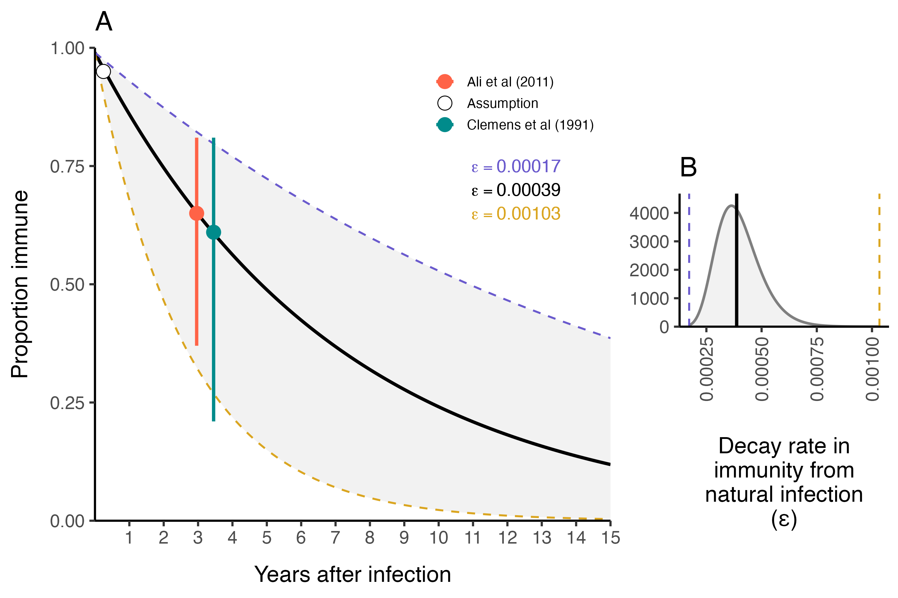

(\#fig:immune-decay)The duration of immunity after natural infection with *V. cholerae*.

## Spatial dynamics

The parameters in the model diagram in Figure \@ref(fig:diagram) that have a $jt$ subscript denote the spatial structure of the model. Each country is modeled as an independent metapopulation that is connected to all others via the spatial force of infection $\Lambda_{jt}$ which moves contagion among metapopulations according to the connectivity provided by parameters $\tau_i$ (the probability departure) and $\pi_{ij}$ (the probability of diffusion to destination $j$). Both parameters are estimated using the departure-diffusion model below which is fitted to average weekly air traffic volume between all of the 41 countries included in the MOSAIC framework (Figure \@ref(fig:mobility-data)).

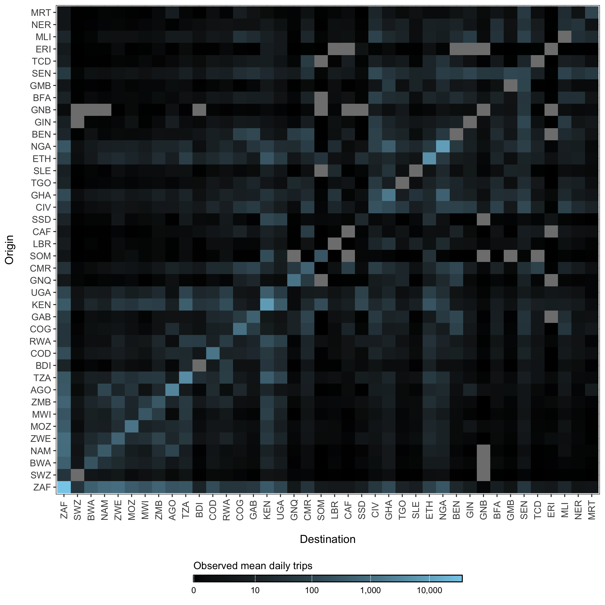

(\#fig:mobility-data)The average number of air passengers per day in 2017 among all countries.

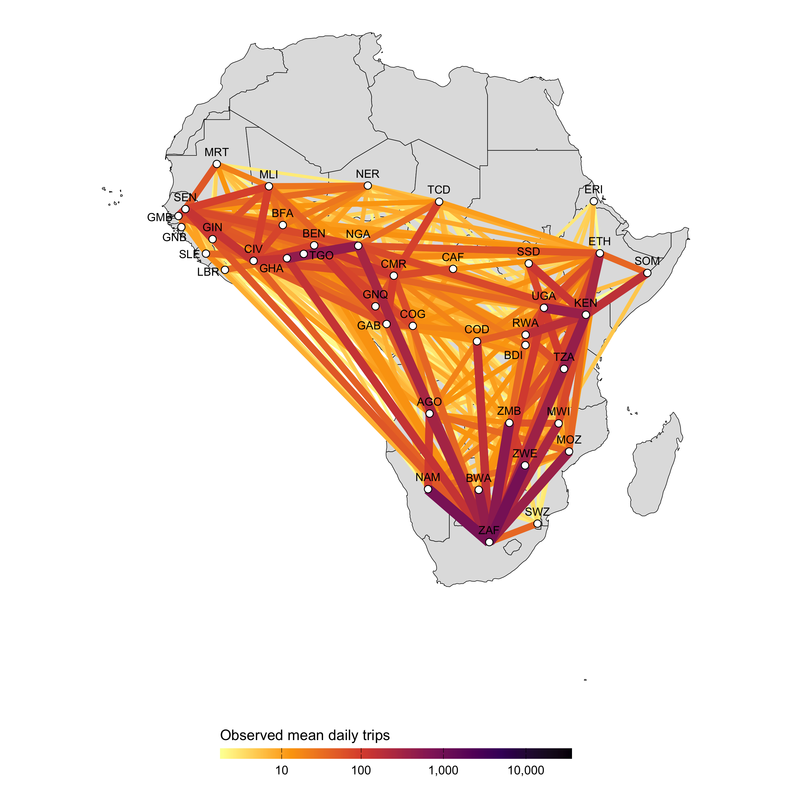

(\#fig:mobility-network)A network map showing the average number of air passengers per day in 2017.

### Human mobility model

The departure-diffusion model estimates diagonal and off-diagonal elements in the mobility matrix ($M$) separately and combines them using conditional probability rules. The model first estimates the probability of travel outside the origin location $i$---the departure process---and then the distribution of travel from the origin location $i$ by normalizing connectivity values across all $j$ destinations---the diffusion process. The values of $\pi_{ij}$ sum to unity along each row, but the diagonal is not included, indicating that this is a relative quantity. That is to say, $\pi_{ij}$ gives the probability of going from $i$ to $j$ given that travel outside origin $i$ occurs. Therefore, we can use basic conditional probability rules to define the travel routes in the diagonal elements (trips made within the origin $i$) as
$$
\Pr( \neg \text{depart}_i ) =  1 - \tau_i
$$
and the off-diagonal elements (trips made outside origin $i$) as
$$
\Pr( \text{depart}_i, \text{diffuse}_{i \rightarrow j}) = \Pr( \text{diffuse}_{i \rightarrow j} \mid \text{depart}_i ) \Pr(\text{depart}_i ) = \pi_{ij} \tau_i.
$$
The expected mean number of trips for route $i \rightarrow j$ is then:

\begin{equation}
M_{ij} = 
\begin{cases}
\theta N_i (1-\tau_i) \ & \text{if} \ i = j \\
\theta N_i \tau_i \pi_{ij} \ & \text{if} \ i \ne j.
\end{cases}
(\#eq:M)
\end{equation}

Where, $\theta$ is a proportionality constant representing the overall number of trips per person in an origin population of size $N_i$, $\tau_i$ is the probability of leaving origin $i$, and $\pi_{ij}$ is the probability of travel to destination $j$ given that travel outside origin $i$ occurs.

### Estimating the departure process
The probability of travel outside the origin is estimated for each location $i$ to give the location-specific departure probability $\tau_i$.
$$
\tau_i \sim \text{Beta}(1+s, 1+r)
$$
Binomial probabilities for each origin $\tau_i$ are drawn from a Beta distributed prior with shape ($s$) and rate ($r$) parameters.
$$
\begin{aligned}
s &\sim \text{Gamma}(0.01, 0.01)\\
r &\sim \text{Gamma}(0.01, 0.01)
\end{aligned}
$$  

### Estimating the diffusion process
We use a normalized formulation of the power law gravity model to defined the diffusion process, the probability of travelling to destination $j$ given travel outside origin $i$ ($\pi_{ij}$) which is defined as:

\begin{equation}
\pi_{ij} = \frac{
N_j^\omega d_{ij}^{-\gamma}
}{
\sum\limits_{\forall j \ne i} N_j^\omega d_{ij}^{-\gamma}
}
(\#eq:gravity)
\end{equation}

Where, $\omega$ scales the attractive force of each $j$ destination based on its population size $N_j$. The kernel function $d_{ij}^{-\gamma}$ serves as a penalty on the proportion of travel from $i$ to $j$ based on distance. Prior distributions of diffusion model parameters are defined as:
$$
\begin{aligned}
\omega &\sim \text{Gamma}(1, 1)\\
\gamma &\sim \text{Gamma}(1, 1)
\end{aligned} 
$$

The models for $\tau_i$ and $\pi_{ij}$ were fitted to air traffic data from [OAG](https://www.oag.com/flight-data-sets) using the `mobility` R package ([Giles 2020](https://covid-19-mobility-data-network.github.io/mobility/)). Estimates for mobility model parameters are shown in Figures \@ref(fig:mobility-departure) and \@ref(fig:mobility-diffusion).

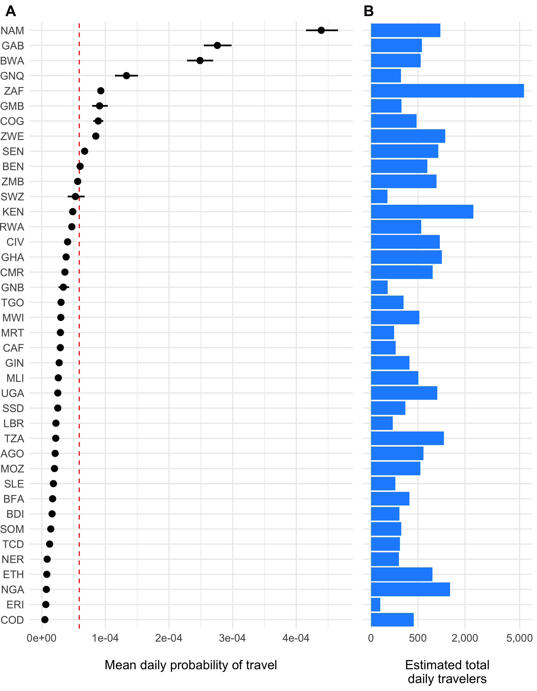

(\#fig:mobility-departure)The estimated weekly probability of travel outside of each origin location $\tau_i$ and 95% confidence intervals is shown in panel A with the population mean indicated as a red dashed line. Panel B shows the estimated total number of travelers leaving origin $i$ each day.

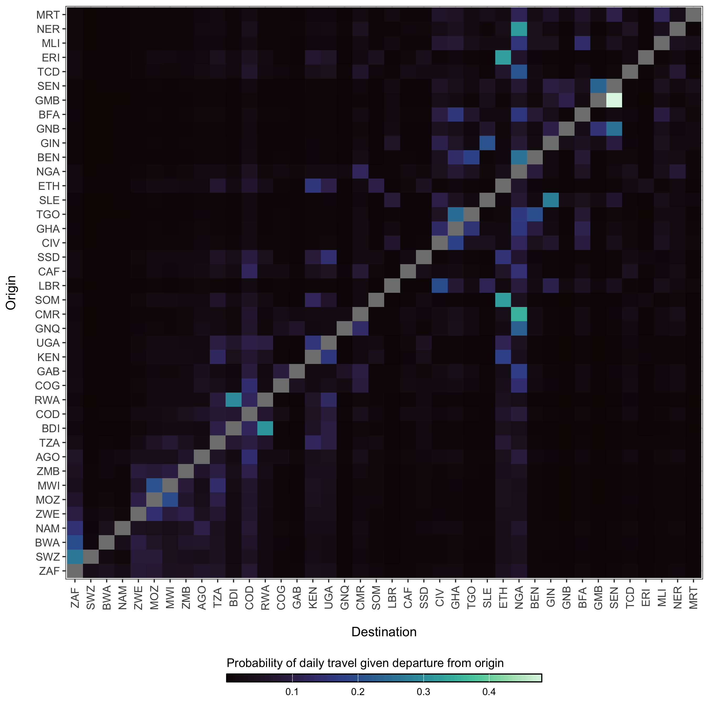

(\#fig:mobility-diffusion)The diffusion process $\pi_{ij}$ which gives the estimated probability of travel from origin $i$ to destination $j$ given that travel outside of origin $i$ has occurred.

### The spatial hazard

Although cholera is endemic in the MOSAIC framework, onward spread across sub-populations can occur whenever infectious individuals travel. We quantify this cross-border seeding risk with a spatial importation hazard adapted from [Bjørnstad & Grenfell (2008)](http://link.springer.com/10.1007/s10651-007-0059-3).

Let $\mathcal{H}_{jt}\in[0,1]$ denote the daily probability that at least one new infection is introduced into destination location $j$ on day $t$. In our implementation the estimated travel probability and gravity-model weights are folded directly into the prevalence terms, and both local and non-local infectious contributions are included:
\begin{equation}
\mathcal{H}_{jt} =
\frac{\displaystyle
  \beta_{jt}\,S^{*}_{jt}
  \left[1-\exp\left(-x_{jt}\,\bar y_{jt}\right)\right]}
     {\displaystyle 1+\beta_{jt}\,S^{*}_{jt}}
(\#eq:spatial-hazard)
\end{equation}

The locally susceptible pool is
\begin{equation}
S^{*}_{jt}
  = \left(1-\tau_{j}\right) S_{jt},
(\#eq:susceptible-pool)
\end{equation}
where $\tau_{j}$ is the daily probability that a resident of $j$ travels outside the home location. The per-capita susceptible probability at the destination is therefore $x_{jt} = S^{*}_{jt}/N_{jt}$, with $N_{jt}$ the total population in location $j$ on day $t$.

The gravity-weighted mean infection prevalence across the metapopulation is
\begin{equation}
\bar y_{jt} =
\frac{\left(1-\tau_{j}\right)\left(I_{1,jt}+I_{2,jt}\right)
      +\sum_{i\neq j}\tau_{i}\,\pi_{ij}\left(I_{1,it}+I_{2,it}\right)}
     {\displaystyle \sum_{k} N_{kt}},
(\#eq:grav-prevalence)
\end{equation}
where $I_{1,it}$ and $I_{2,it}$ denote symptomatic and asymptomatic infections in origin $i$.  These are weighted by the mobility matrix $\pi_{ij}$ and the travel probability $\tau_{i}$, and the denominator normalizes by the total metapopulation size $\sum_{k}N_{kt}$.

In the numerator of Equation \@ref(eq:spatial-hazard) the factor $1-\exp(-x_{jt}\,\bar y_{jt})$ converts a per-capita arrival rate into a daily hazard, while the denominator $1+\beta_{jt}\,S^{*}_{jt}$ keeps $\mathcal{H}_{jt}$ strictly between 0 and 1. This formulation therefore yields the daily probability there is at least one human-derived infection in location $j$ on day $t$, conditional on the local susceptible pool and infection prevalence across all other locations. Note that this does not include infection hazard from the local environmental reservoir, however our aim is to include this in future versions.

### Coupling among locations

To characterize how strongly infection dynamics in one country reflect those in another we follow the spatial–correlation metric of [Keeling & Rohani (2002)](https://onlinelibrary.wiley.com/doi/abs/10.1046/j.1461-0248.2002.00268.x). For each pair of locations $i$ and $j$ observed over days $t = \{1,\dots ,T\}$ we define the prevalence for each location over time as
\begin{equation}
y_{it} = \frac{I_{1,it}+I_{2,it}}{N_i}
\qquad \text{and} \qquad
y_{jt} = \frac{I_{1,jt}+I_{2,jt}}{N_j},
(\#eq:location-prevalence)
\end{equation}
and the corresponding mean prevalence as  
\begin{equation}
\bar y_i = \frac{1}{T}\sum_{t=1}^{T} y_{it}
\qquad \text{and} \qquad
\bar y_j = \frac{1}{T}\sum_{t=1}^{T} y_{jt}.
(\#eq:location-mean-prevalence)
\end{equation}

Using these quantities, we write the spatial–correlation coefficient as a set of explicit sums:
\begin{equation}
\mathcal{C}_{ij} = 
\frac{ \sum_{t=1}^{T}\bigl(y_{it}-\bar y_i\bigr)\bigl(y_{jt}-\bar y_j\bigr) }
     { \sqrt{\sum_{t=1}^{T}\bigl(y_{it}-\bar y_i\bigr)^{2}}
       \;\sqrt{\sum_{t=1}^{T}\bigl(y_{jt}-\bar y_j\bigr)^{2}} }.
(\#eq:correlation)
\end{equation}
The coefficient $\mathcal{C}_{ij}\in[-1,1]$ therefore measures the degree to which fluctuations in infection prevalence are synchronized between metapopulations—providing a complementary view of spatial heterogeneity alongside the importation hazard $\mathcal{H}_{jt}$.

## The observation process

### Rate of symptomatic infection

The presentation of infection with *V. cholerae* can be extremely variable. The severity of infection depends many factors such as the amount of the infectious dose, the age of the host, the level of immunity of the host either through vaccination or previous infection, and naivety to the particular strain of *V. cholerae*. Additional circumstantial factors such as nutritional status and overall pathogen burden may also impact infection severity. At the population level, the observed proportion of infections that are symptomatic is also dependent on the endemicity of cholera in the region. Highly endemic areas (e.g. parts of Bangladesh; [Hegde et al 2024](https://www.nature.com/articles/s41591-024-02810-4)) may have a very low proportion of symptomatic infections due to many previous exposures. Inversely, populations that are largely naive to *V. cholerae* will exhibit a relatively higher proportion of symptomatic infections (e.g. Haiti; [Finger et al 2024](https://www.ncbi.nlm.nih.gov/pmc/articles/PMC10635253/)).

Accounting for all of these nuances in the first version of this model not possible, but we can past studies do contain some information that can help to set some sensible bounds on our definition for the proportion of infections that are symptomatic ($\sigma$). So we have compiled a short list of studies that have done sero-surveys and cohort studies to assess the likelihood of symptomatic infections in different locations and displayed those results in Table (\@ref(tab:symptomatic-table)).  

To provide a reasonably informed prior for the proportion of infections that are symptomatic, we calculated the combine mean and confidence intervals of all studies in Table \@ref(tab:symptomatic-table) and fit a Beta distribution that corresponds to these quantiles using least-squares and a Nelder-Mead algorithm. The resulting prior distribution for the symptomatic proportion $\sigma$ is:

\begin{equation}
\sigma \sim \text{Beta}(4.30, 13.51)
\end{equation}

Table: (\#tab:symptomatic-table)Summary of Studies on Cholera Immunity

|  Mean| Low CI| High CI|Location        |Source                 |Note                                             |
|-----:|------:|-------:|:---------------|:----------------------|:------------------------------------------------|
| 0.570|     NA|      NA|NA              |[Nelson et al (2009)](https://www.ncbi.nlm.nih.gov/pmc/articles/PMC3842031/)|Review                                           |
|    NA|  1.000|   0.250|NA              |[Lueng & Matrajt (2021)](https://journals.plos.org/plosntds/article?id=10.1371/journal.pntd.0009383)|Review                                           |
|    NA|  0.600|   0.200|Endemic regions |[Harris et al (2012)](https://www.sciencedirect.com/science/article/pii/S014067361260436X)|Review                                           |
| 0.238|  0.250|   0.227|Haiti           |[Finger et al (2024)](https://www.ncbi.nlm.nih.gov/pmc/articles/PMC10635253/)|Sero-survey and clinical data                    |
| 0.213|  0.231|   0.194|Haiti           |[Jackson et al (2013)](https://www.ajtmh.org/view/journals/tpmd/89/4/article-p654.xml)|Cross-sectional sero-survey                      |
| 0.204|     NA|      NA|Pakistan        |[Bart et al (1970)](https://doi.org/10.1093/infdis/121.Supplement.S17)|Sero-survey during epidemic; El Tor Ogawa strain |
| 0.371|     NA|      NA|Pakistan        |[Bart et al (1970)](https://doi.org/10.1093/infdis/121.Supplement.S17)|Sero-survey during epidemic; Inaba strain        |
| 0.184|  0.256|   0.112|Bangladesh      |[Harris et al (2008)](https://journals.plos.org/plosntds/article?id=10.1371/journal.pntd.0000221)|Household cohort; mean of all age groups         |
| 0.001|  0.000|   0.001|Bangladesh      |[Hegde et al (2024)](https://www.nature.com/articles/s41591-024-02810-4)|Sero-survey and clinical data                    |

The prior distribution for $\sigma$ is plotted in Figure \@ref(fig:symptomatic-fig)A with the reported values of the proportion symptomatic from previous studies shown in \@ref(fig:symptomatic-fig)B.

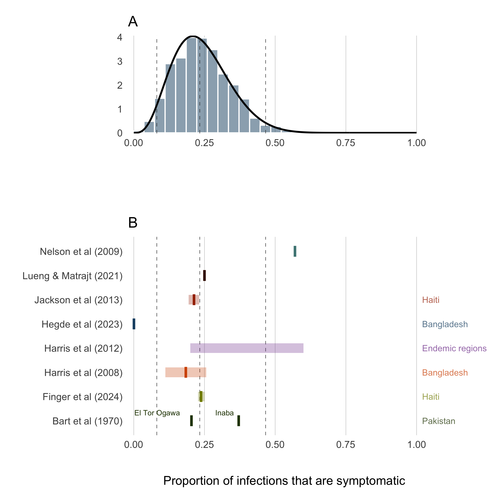

(\#fig:symptomatic-fig)Proportion of infections that are symptomatic.

### Suspected cases, reported cases, and deaths

The clinical presentation of cholera-like illness is similar across diarrhoeal pathogens, so reported case counts are a noisy function of the true symptomatic incidence $I_{1,jt}$ in the model. We resolve this with a two-stage observation model. In the *care-seeking* stage, a true symptomatic infection is presented to the surveillance system as a suspected case with probability $\rho$. In the *confirmation* stage, a suspected case is classified as true cholera with probability $\chi$, the positive predictive value (PPV) of the suspected-case definition. Combining the two stages and accounting for a reporting lag of $l_{\text{cases}}$ days from symptom onset, the modelled count of reported cases at destination $j$ on day $t+1$ is

\begin{equation}
\text{reported cases}_{j,t+1} \;=\; \text{round}\!\left[\, \frac{\rho \cdot I_{1,\,j,t - l_{\text{cases}}}}{\chi_{jt}^{\text{eff}}} \,\right],
(\#eq:reported-cases)
\end{equation}

where $\rho$ enters the numerator as the forward (care-seeking) rate and $\chi_{jt}^{\text{eff}}$ enters the denominator as the back-correction for the PPV. This is the unique relationship consistent with the joint probability of being both truly cholera-positive and presenting as a suspected case:

$$
P(\text{true}\cap\text{suspected}) = P(\text{true}\mid\text{suspected})\,P(\text{suspected}) = P(\text{suspected}\mid\text{true})\,P(\text{true}).
$$

The effective PPV $\chi_{jt}^{\text{eff}}$ switches between an endemic and an epidemic value depending on whether local prevalence is below or above a per-location threshold $\eta_j$:

\begin{equation}
\chi_{jt}^{\text{eff}} =
\begin{cases}
\chi^{\text{end}}, & \text{if} \ \ I_{1,\,j,t - l_{\text{cases}}} \big/ N_{j,\,t - l_{\text{cases}}} < \eta_j,\\[3pt]
\chi^{\text{epi}}, & \text{otherwise}.
\end{cases}
(\#eq:chi-eff)
\end{equation}

The prior on the care-seeking rate $\rho$ is derived from the GEMS multi-country case-ascertainment study together with the meta-analysis by Wiens et al. 2025, fit to a Beta distribution by least-squares:

$$
\rho \sim \text{Beta}(6.81,\ 17.89),
(\#eq:rho)
$$

corresponding to a mean of approximately 0.28 (i.e. roughly one in four true symptomatic infections enters the surveillance pipeline as a suspected case). The endemic and epidemic PPVs are derived from the meta-analysis of [Wiens et al. 2023](https://journals.plos.org/plosmedicine/article?id=10.1371/journal.pmed.1004286), which reports suspected-case PPVs of approximately 0.52 across all settings and 0.78 during outbreaks. Fit to Beta distributions by least-squares:

$$
\begin{aligned}
\chi^{\text{end}} \ \sim\ & \text{Beta}(5.43,\ 5.01) \quad \text{(endemic PPV, mean} \approx 0.52\text{)},\\
\chi^{\text{epi}} \ \sim\ & \text{Beta}(4.79,\ 1.53) \quad \text{(epidemic PPV, mean} \approx 0.76\text{)}.
\end{aligned}
(\#eq:chi-priors)
$$

The lower endemic PPV reflects the higher background rate of acute watery diarrhoea from other pathogens that is misclassified as cholera in non-outbreak settings, while the epidemic PPV is informed by laboratory-confirmed outbreak studies. The case reporting lag is a small truncated-normal prior:

$$
l_{\text{cases}} \sim \text{Truncnorm}(1,\ 1.5,\ 0,\ 7) \ \ \text{(days)}.
(\#eq:reporting-lag-cases)
$$

The epidemic threshold $\eta_j$ is a per-country daily symptomatic prevalence above which the location is considered to be in an epidemic regime. It is set from each country's observed historical median outbreak prevalence with a truncated-normal prior whose mean and standard deviation are location-specific, and is bounded above by 0.01 (a hard cap of 1% daily symptomatic prevalence).

A parallel observation process applies to cholera-attributable deaths. The probability that a true cholera death is captured by surveillance is $\rho_{\text{deaths}}$, and the reporting lag from symptom onset is $l_{\text{deaths}}$:

$$
\begin{aligned}
\rho_{\text{deaths}} \ \sim\ & \text{Beta}(3,\ 2) \quad \text{(mean} \approx 0.60\text{)},\\
l_{\text{deaths}} \ \sim\ & \text{Truncnorm}(4,\ 3,\ 1,\ 14) \ \ \text{(days)}.
\end{aligned}
(\#eq:rho-deaths)
$$

The mean death-detection rate of approximately 0.60 reflects the surveillance-capture estimate of [Finger et al. 2024](https://doi.org/10.1016/S1473-3099(24)00237-8) (*Lancet Infect Dis*; note this is the cholera-deaths-surveillance paper, distinct from the [Finger et al. 2024](https://www.ncbi.nlm.nih.gov/pmc/articles/PMC10635253/) Haiti sero-survey cited above in the symptomatic-proportion subsection). Reported deaths are modelled analogously to reported cases using the dynamic infection-fatality ratio described in the [Case fatality rate](#case-fatality-rate) subsection that follows.

(\#fig:rho)Prior distributions for the suspected/reported-case observation model. The care-seeking rate $\rho$ controls how many true symptomatic infections present as suspected cases ($\rho \sim \text{Beta}(6.81, 17.89)$, mean $\approx 0.28$). The endemic and epidemic positive predictive values $\chi^{\text{end}}$ and $\chi^{\text{epi}}$ control how many suspected cases are confirmed as true cholera; the endemic PPV (mean $\approx 0.52$) is substantially lower than the epidemic PPV (mean $\approx 0.76$) because of higher background diarrhoeal misclassification in non-outbreak settings.

### Case fatality rate {#case-fatality-rate}

In MOSAIC v1.0 the case fatality rate is replaced by a *dynamic infection-fatality ratio* (IFR) implemented as a per-day mortality hazard among symptomatic infections. The hazard $\mu_{j,t}$ is the rate at which a symptomatic individual in location $j$ dies from cholera on day $t$, and the corresponding per-day death-transition probability is $1 - e^{-\mu_{j,t}}$ (see the [Table of stochastic transitions](#transitions-table)). It is factored into three multiplicative components: a per-location baseline $\mu_{j,0}$, a linear time-trend factor $\mu_{j,1}$ that captures slow drift in case-management quality over the simulation period, and an epidemic-period factor $\mu_{j,\text{epi}}$ that captures higher mortality during outbreak surges (e.g. when treatment infrastructure is overwhelmed):

\begin{equation}
\mu_{j,t} \;=\; \mu_{j,0} \,\big(1 + \mu_{j,1}\, t^{\dagger}\big)\,\Big(1 + \mu_{j,\text{epi}} \cdot \mathbb{1}\!\big[\,I_{1,\,j,t - l_{\text{cases}}} \big/ N_{j,\,t - l_{\text{cases}}} > \eta_j\,\big]\Big),
(\#eq:mu-jt)
\end{equation}

where $t^{\dagger} = t / T_{\text{total}}$ is the normalised simulation time, so $\mu_{j,1}$ is interpretable as the proportional change in baseline IFR from the start to the end of the simulation. The indicator $\mathbb{1}[\cdot]$ activates the epidemic factor whenever the lagged daily symptomatic prevalence exceeds the per-location epidemic threshold $\eta_j$ defined in the previous subsection. This dynamic specification replaces the earlier static $\mu_j$ (a per-infection CFR) used in MOSAIC v0.1.

The per-location baseline $\mu_{j,0}$ is derived from each country's reported CFR over the 2014--2024 surveillance window, after accounting for the observation pipeline that converts true symptomatic infections into reported cases. Reporting compresses information in two ways: $\rho$ controls the fraction of true symptomatic infections that are reported as suspected cases, while $\chi$ controls the fraction of those suspected cases that are confirmed as true cholera. The reported CFR is therefore the true daily mortality scaled by the relative reporting rates of cases versus deaths:

$$
\mu_{j,0} \;\approx\; \text{CFR}^{\text{reported}}_{j} \cdot \frac{\rho}{\chi}.
(\#eq:mu-baseline-derivation)
$$

Country-specific reported CFRs and Clopper-Pearson 95% confidence intervals are calculated from the surveillance record using the [Binomial exact test](https://www.rdocumentation.org/packages/stats/versions/3.6.2/topics/binom.test) in R, and the resulting quantiles are fit to a Gamma prior per country by least squares. For example, in Angola the prior is $\mu_{\text{AGO},0} \sim \text{Gamma}(4,\ 482.6)$ with mean approximately 0.0083 per day, which corresponds to an integrated CFR of roughly 8% over a typical 10-day symptomatic infectious period. Priors for the other 39 countries are listed in the [Table of model parameters](#parameters-table).

The temporal-trend factor and the epidemic-period factor share the same prior across countries. The trend is a weak normal centred on no change, allowing for slow drift in case-management quality:

$$
\mu_{j,1} \sim \mathcal{N}(0,\ 0.05).
$$

The epidemic factor is a non-negative Gamma prior with a mean of 0.5, reflecting the approximately 50% increase in cholera CFR typically observed during outbreak surges:

$$
\mu_{j,\text{epi}} \sim \text{Gamma}(1,\ 2).
$$

Reported cholera deaths are modelled with a parallel two-stage observation process. Given the daily death count $\mu_{j,t}\,I_{1,jt}$ generated by the IFR above, the death-detection rate $\rho_{\text{deaths}}$ and the reporting lag $l_{\text{deaths}}$ defined in the previous subsection produce the modelled count of reported deaths. The death-side equivalent of the case-reporting machinery is implemented in [laser-cholera issue #49](https://github.com/InstituteforDiseaseModeling/laser-cholera/issues/49) and consumed by MOSAIC-pkg from version 0.30.2.

<table class="table table-hover table-condensed" style="width: auto !important; margin-left: auto; margin-right: auto;">
<caption>(\#tab:cfr)(\#tab:cfr)CFR Values and Beta Shape Parameters for AFRO Countries</caption>
 <thead>
  <tr>
   <th style="text-align:left;"> Country </th>
   <th style="text-align:right;"> Cases (2014-2024) </th>
   <th style="text-align:right;"> Deaths (2014-2024) </th>
   <th style="text-align:right;"> CFR </th>
   <th style="text-align:right;"> CFR Lower </th>
   <th style="text-align:right;"> CFR Upper </th>
   <th style="text-align:right;"> Beta Shape1 </th>
   <th style="text-align:right;"> Beta Shape2 </th>
  </tr>
 </thead>
<tbody>
  <tr>
   <td style="text-align:left;"> AFRO Region </td>
   <td style="text-align:right;"> 1127096 </td>
   <td style="text-align:right;"> 21721 </td>
   <td style="text-align:right;"> 0.019 </td>
   <td style="text-align:right;"> 0.019 </td>
   <td style="text-align:right;"> 0.020 </td>
   <td style="text-align:right;"> 0.008 </td>
   <td style="text-align:right;"> 1.911 </td>
  </tr>
  <tr>
   <td style="text-align:left;"> Angola </td>
   <td style="text-align:right;"> 3100 </td>
   <td style="text-align:right;"> 85 </td>
   <td style="text-align:right;"> 0.027 </td>
   <td style="text-align:right;"> 0.022 </td>
   <td style="text-align:right;"> 0.034 </td>
   <td style="text-align:right;"> 0.010 </td>
   <td style="text-align:right;"> 1.924 </td>
  </tr>
  <tr>
   <td style="text-align:left;"> Burundi </td>
   <td style="text-align:right;"> 5250 </td>
   <td style="text-align:right;"> 38 </td>
   <td style="text-align:right;"> 0.007 </td>
   <td style="text-align:right;"> 0.005 </td>
   <td style="text-align:right;"> 0.010 </td>
   <td style="text-align:right;"> 0.007 </td>
   <td style="text-align:right;"> 1.934 </td>
  </tr>
  <tr>
   <td style="text-align:left;"> Benin </td>
   <td style="text-align:right;"> 3617 </td>
   <td style="text-align:right;"> 56 </td>
   <td style="text-align:right;"> 0.015 </td>
   <td style="text-align:right;"> 0.012 </td>
   <td style="text-align:right;"> 0.020 </td>
   <td style="text-align:right;"> 0.008 </td>
   <td style="text-align:right;"> 1.906 </td>
  </tr>
  <tr>
   <td style="text-align:left;"> Burkina Faso </td>
   <td style="text-align:right;"> 7 </td>
   <td style="text-align:right;"> 0 </td>
   <td style="text-align:right;"> 0.019 </td>
   <td style="text-align:right;"> 0.019 </td>
   <td style="text-align:right;"> 0.020 </td>
   <td style="text-align:right;"> 0.008 </td>
   <td style="text-align:right;"> 1.911 </td>
  </tr>
  <tr>
   <td style="text-align:left;"> Cote d'Ivoire </td>
   <td style="text-align:right;"> 446 </td>
   <td style="text-align:right;"> 18 </td>
   <td style="text-align:right;"> 0.040 </td>
   <td style="text-align:right;"> 0.024 </td>
   <td style="text-align:right;"> 0.063 </td>
   <td style="text-align:right;"> 0.013 </td>
   <td style="text-align:right;"> 1.863 </td>
  </tr>
  <tr>
   <td style="text-align:left;"> Cameroon </td>
   <td style="text-align:right;"> 29897 </td>
   <td style="text-align:right;"> 925 </td>
   <td style="text-align:right;"> 0.031 </td>
   <td style="text-align:right;"> 0.029 </td>
   <td style="text-align:right;"> 0.033 </td>
   <td style="text-align:right;"> 0.010 </td>
   <td style="text-align:right;"> 1.931 </td>
  </tr>
  <tr>
   <td style="text-align:left;"> Democratic Republic of Congo </td>
   <td style="text-align:right;"> 306023 </td>
   <td style="text-align:right;"> 5809 </td>
   <td style="text-align:right;"> 0.019 </td>
   <td style="text-align:right;"> 0.019 </td>
   <td style="text-align:right;"> 0.019 </td>
   <td style="text-align:right;"> 0.008 </td>
   <td style="text-align:right;"> 1.909 </td>
  </tr>
  <tr>
   <td style="text-align:left;"> Congo </td>
   <td style="text-align:right;"> 359 </td>
   <td style="text-align:right;"> 30 </td>
   <td style="text-align:right;"> 0.084 </td>
   <td style="text-align:right;"> 0.057 </td>
   <td style="text-align:right;"> 0.117 </td>
   <td style="text-align:right;"> 0.019 </td>
   <td style="text-align:right;"> 1.906 </td>
  </tr>
  <tr>
   <td style="text-align:left;"> Ethiopia </td>
   <td style="text-align:right;"> 46877 </td>
   <td style="text-align:right;"> 660 </td>
   <td style="text-align:right;"> 0.014 </td>
   <td style="text-align:right;"> 0.013 </td>
   <td style="text-align:right;"> 0.015 </td>
   <td style="text-align:right;"> 0.008 </td>
   <td style="text-align:right;"> 1.893 </td>
  </tr>
  <tr>
   <td style="text-align:left;"> Ghana </td>
   <td style="text-align:right;"> 29814 </td>
   <td style="text-align:right;"> 251 </td>
   <td style="text-align:right;"> 0.008 </td>
   <td style="text-align:right;"> 0.007 </td>
   <td style="text-align:right;"> 0.010 </td>
   <td style="text-align:right;"> 0.007 </td>
   <td style="text-align:right;"> 1.925 </td>
  </tr>
  <tr>
   <td style="text-align:left;"> Guinea </td>
   <td style="text-align:right;"> 1 </td>
   <td style="text-align:right;"> 0 </td>
   <td style="text-align:right;"> 0.019 </td>
   <td style="text-align:right;"> 0.019 </td>
   <td style="text-align:right;"> 0.020 </td>
   <td style="text-align:right;"> 0.008 </td>
   <td style="text-align:right;"> 1.911 </td>
  </tr>
  <tr>
   <td style="text-align:left;"> Guinea-Bissau </td>
   <td style="text-align:right;"> 11 </td>
   <td style="text-align:right;"> 2 </td>
   <td style="text-align:right;"> 0.019 </td>
   <td style="text-align:right;"> 0.019 </td>
   <td style="text-align:right;"> 0.020 </td>
   <td style="text-align:right;"> 0.008 </td>
   <td style="text-align:right;"> 1.911 </td>
  </tr>
  <tr>
   <td style="text-align:left;"> Kenya </td>
   <td style="text-align:right;"> 47343 </td>
   <td style="text-align:right;"> 678 </td>
   <td style="text-align:right;"> 0.014 </td>
   <td style="text-align:right;"> 0.013 </td>
   <td style="text-align:right;"> 0.015 </td>
   <td style="text-align:right;"> 0.008 </td>
   <td style="text-align:right;"> 1.920 </td>
  </tr>
  <tr>
   <td style="text-align:left;"> Liberia </td>
   <td style="text-align:right;"> 580 </td>
   <td style="text-align:right;"> 0 </td>
   <td style="text-align:right;"> 0.000 </td>
   <td style="text-align:right;"> 0.000 </td>
   <td style="text-align:right;"> 0.006 </td>
   <td style="text-align:right;"> 0.006 </td>
   <td style="text-align:right;"> 1.938 </td>
  </tr>
  <tr>
   <td style="text-align:left;"> Mali </td>
   <td style="text-align:right;"> 12 </td>
   <td style="text-align:right;"> 4 </td>
   <td style="text-align:right;"> 0.019 </td>
   <td style="text-align:right;"> 0.019 </td>
   <td style="text-align:right;"> 0.020 </td>
   <td style="text-align:right;"> 0.008 </td>
   <td style="text-align:right;"> 1.911 </td>
  </tr>
  <tr>
   <td style="text-align:left;"> Mozambique </td>
   <td style="text-align:right;"> 83417 </td>
   <td style="text-align:right;"> 351 </td>
   <td style="text-align:right;"> 0.004 </td>
   <td style="text-align:right;"> 0.004 </td>
   <td style="text-align:right;"> 0.005 </td>
   <td style="text-align:right;"> 0.006 </td>
   <td style="text-align:right;"> 1.893 </td>
  </tr>
  <tr>
   <td style="text-align:left;"> Malawi </td>
   <td style="text-align:right;"> 63625 </td>
   <td style="text-align:right;"> 1864 </td>
   <td style="text-align:right;"> 0.029 </td>
   <td style="text-align:right;"> 0.028 </td>
   <td style="text-align:right;"> 0.031 </td>
   <td style="text-align:right;"> 0.010 </td>
   <td style="text-align:right;"> 1.886 </td>
  </tr>
  <tr>
   <td style="text-align:left;"> Namibia </td>
   <td style="text-align:right;"> 634 </td>
   <td style="text-align:right;"> 13 </td>
   <td style="text-align:right;"> 0.021 </td>
   <td style="text-align:right;"> 0.011 </td>
   <td style="text-align:right;"> 0.035 </td>
   <td style="text-align:right;"> 0.010 </td>
   <td style="text-align:right;"> 1.913 </td>
  </tr>
  <tr>
   <td style="text-align:left;"> Niger </td>
   <td style="text-align:right;"> 11639 </td>
   <td style="text-align:right;"> 334 </td>
   <td style="text-align:right;"> 0.029 </td>
   <td style="text-align:right;"> 0.026 </td>
   <td style="text-align:right;"> 0.032 </td>
   <td style="text-align:right;"> 0.010 </td>
   <td style="text-align:right;"> 1.901 </td>
  </tr>
  <tr>
   <td style="text-align:left;"> Nigeria </td>
   <td style="text-align:right;"> 241522 </td>
   <td style="text-align:right;"> 6521 </td>
   <td style="text-align:right;"> 0.027 </td>
   <td style="text-align:right;"> 0.026 </td>
   <td style="text-align:right;"> 0.028 </td>
   <td style="text-align:right;"> 0.009 </td>
   <td style="text-align:right;"> 1.894 </td>
  </tr>
  <tr>
   <td style="text-align:left;"> Rwanda </td>
   <td style="text-align:right;"> 472 </td>
   <td style="text-align:right;"> 0 </td>
   <td style="text-align:right;"> 0.000 </td>
   <td style="text-align:right;"> 0.000 </td>
   <td style="text-align:right;"> 0.008 </td>
   <td style="text-align:right;"> 0.006 </td>
   <td style="text-align:right;"> 1.928 </td>
  </tr>
  <tr>
   <td style="text-align:left;"> Sudan </td>
   <td style="text-align:right;"> 362 </td>
   <td style="text-align:right;"> 11 </td>
   <td style="text-align:right;"> 0.030 </td>
   <td style="text-align:right;"> 0.015 </td>
   <td style="text-align:right;"> 0.054 </td>
   <td style="text-align:right;"> 0.012 </td>
   <td style="text-align:right;"> 1.855 </td>
  </tr>
  <tr>
   <td style="text-align:left;"> Somalia </td>
   <td style="text-align:right;"> 134839 </td>
   <td style="text-align:right;"> 1849 </td>
   <td style="text-align:right;"> 0.014 </td>
   <td style="text-align:right;"> 0.013 </td>
   <td style="text-align:right;"> 0.014 </td>
   <td style="text-align:right;"> 0.008 </td>
   <td style="text-align:right;"> 1.906 </td>
  </tr>
  <tr>
   <td style="text-align:left;"> South Sudan </td>
   <td style="text-align:right;"> 34635 </td>
   <td style="text-align:right;"> 705 </td>
   <td style="text-align:right;"> 0.020 </td>
   <td style="text-align:right;"> 0.019 </td>
   <td style="text-align:right;"> 0.022 </td>
   <td style="text-align:right;"> 0.009 </td>
   <td style="text-align:right;"> 1.907 </td>
  </tr>
  <tr>
   <td style="text-align:left;"> Eswatini </td>
   <td style="text-align:right;"> 2 </td>
   <td style="text-align:right;"> 0 </td>
   <td style="text-align:right;"> 0.019 </td>
   <td style="text-align:right;"> 0.019 </td>
   <td style="text-align:right;"> 0.020 </td>
   <td style="text-align:right;"> 0.008 </td>
   <td style="text-align:right;"> 1.911 </td>
  </tr>
  <tr>
   <td style="text-align:left;"> Chad </td>
   <td style="text-align:right;"> 1359 </td>
   <td style="text-align:right;"> 90 </td>
   <td style="text-align:right;"> 0.066 </td>
   <td style="text-align:right;"> 0.054 </td>
   <td style="text-align:right;"> 0.081 </td>
   <td style="text-align:right;"> 0.015 </td>
   <td style="text-align:right;"> 1.857 </td>
  </tr>
  <tr>
   <td style="text-align:left;"> Togo </td>
   <td style="text-align:right;"> 405 </td>
   <td style="text-align:right;"> 19 </td>
   <td style="text-align:right;"> 0.047 </td>
   <td style="text-align:right;"> 0.028 </td>
   <td style="text-align:right;"> 0.072 </td>
   <td style="text-align:right;"> 0.014 </td>
   <td style="text-align:right;"> 1.866 </td>
  </tr>
  <tr>
   <td style="text-align:left;"> Tanzania </td>
   <td style="text-align:right;"> 33830 </td>
   <td style="text-align:right;"> 524 </td>
   <td style="text-align:right;"> 0.015 </td>
   <td style="text-align:right;"> 0.014 </td>
   <td style="text-align:right;"> 0.017 </td>
   <td style="text-align:right;"> 0.008 </td>
   <td style="text-align:right;"> 1.913 </td>
  </tr>
  <tr>
   <td style="text-align:left;"> Uganda </td>
   <td style="text-align:right;"> 9110 </td>
   <td style="text-align:right;"> 176 </td>
   <td style="text-align:right;"> 0.019 </td>
   <td style="text-align:right;"> 0.017 </td>
   <td style="text-align:right;"> 0.022 </td>
   <td style="text-align:right;"> 0.009 </td>
   <td style="text-align:right;"> 1.904 </td>
  </tr>
  <tr>
   <td style="text-align:left;"> South Africa </td>
   <td style="text-align:right;"> 1392 </td>
   <td style="text-align:right;"> 47 </td>
   <td style="text-align:right;"> 0.034 </td>
   <td style="text-align:right;"> 0.025 </td>
   <td style="text-align:right;"> 0.045 </td>
   <td style="text-align:right;"> 0.012 </td>
   <td style="text-align:right;"> 2.008 </td>
  </tr>
  <tr>
   <td style="text-align:left;"> Zambia </td>
   <td style="text-align:right;"> 11136 </td>
   <td style="text-align:right;"> 269 </td>
   <td style="text-align:right;"> 0.024 </td>
   <td style="text-align:right;"> 0.021 </td>
   <td style="text-align:right;"> 0.027 </td>
   <td style="text-align:right;"> 0.009 </td>
   <td style="text-align:right;"> 1.891 </td>
  </tr>
  <tr>
   <td style="text-align:left;"> Zimbabwe </td>
   <td style="text-align:right;"> 25380 </td>
   <td style="text-align:right;"> 392 </td>
   <td style="text-align:right;"> 0.015 </td>
   <td style="text-align:right;"> 0.014 </td>
   <td style="text-align:right;"> 0.017 </td>
   <td style="text-align:right;"> 0.008 </td>
   <td style="text-align:right;"> 1.927 </td>
  </tr>
</tbody>
</table>

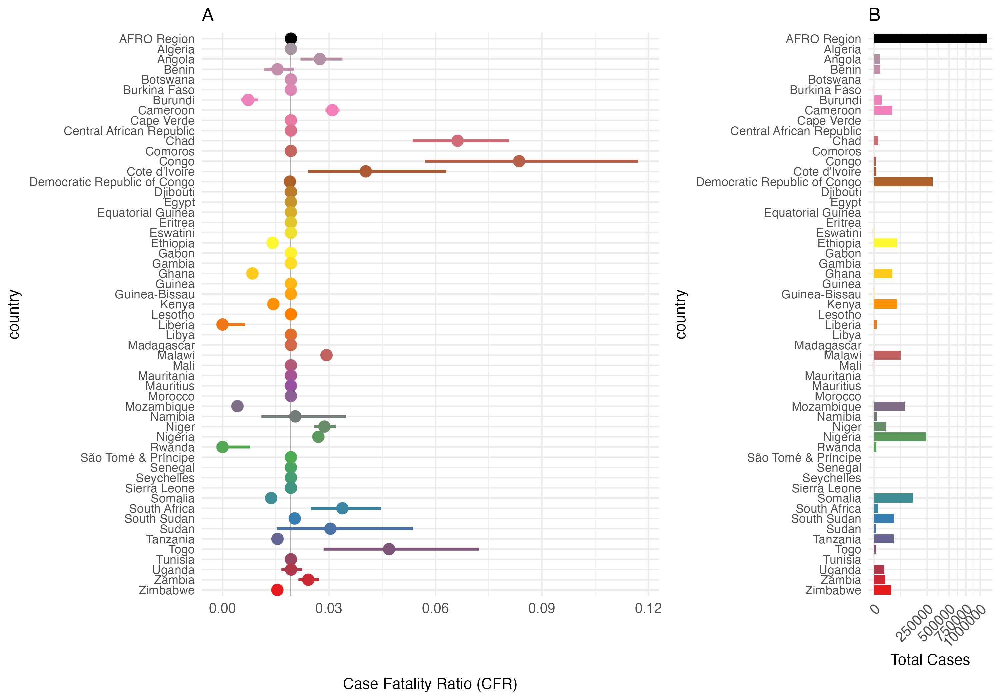

(\#fig:cfr-cases)Case Fatality Rate (CFR) and Total Cases by Country in the AFRO Region from 2014 to 2024. Panel A: Case Fatality Ratio (CFR) with 95% confidence intervals. Panel B: total number of cholera cases. The AFRO Region is highlighted in black, all countries with less than 3/0.2 = 150 total reported cases are assigned the mean CFR for AFRO.

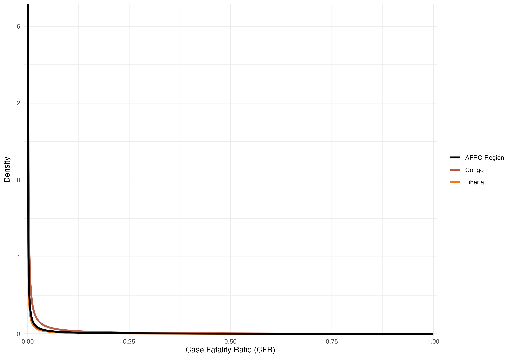

(\#fig:cfr-beta)Beta distributions of the overall Case Fatality Rate (CFR) from 2014 to 2024. Examples show the overall CFR for the AFRO region (2%) in black, Congo with the highest CFR (7%) in red, and South Sudan with the lowest CFR (0.1%) in blue.

## Demographics

The model includes basic demographic change by using reported birth and death rates for each of the $j$ countries, $b_j$ and $d_j$ respectively. These rates are static and defined by the United Nations Department of Economic and Social Affairs Population Division [World Population Prospects 2024](https://population.un.org/wpp/Download/Standard/CSV/). Values for $b_j$ and $d_j$ are derived from crude rates and converted to birth rate per day and death rate per day (shown in Table \@ref(tab:demographics)).

<table class="table table-hover table-condensed" style="width: auto !important; margin-left: auto; margin-right: auto;">
<caption>(\#tab:demographics)(\#tab:demographics)Demographic for AFRO countries in 2023. Data include: total population as of January 1, 2023, daily birth rate, and daily death rate. Values are calculate from crude birth and death rates from UN World Population Prospects 2024.</caption>
 <thead>
  <tr>
   <th style="text-align:left;"> Country </th>
   <th style="text-align:right;"> Population </th>
   <th style="text-align:right;"> Birth rate </th>
   <th style="text-align:right;"> Death rate </th>
  </tr>
 </thead>
<tbody>
  <tr>
   <td style="text-align:left;"> Algeria </td>
   <td style="text-align:right;"> 45831343 </td>
   <td style="text-align:right;"> 0.0000542 </td>
   <td style="text-align:right;"> 1.28e-05 </td>
  </tr>
  <tr>
   <td style="text-align:left;"> Angola </td>
   <td style="text-align:right;"> 36186956 </td>
   <td style="text-align:right;"> 0.0001046 </td>
   <td style="text-align:right;"> 1.93e-05 </td>
  </tr>
  <tr>
   <td style="text-align:left;"> Benin </td>
   <td style="text-align:right;"> 13934166 </td>
   <td style="text-align:right;"> 0.0000940 </td>
   <td style="text-align:right;"> 2.44e-05 </td>
  </tr>
  <tr>
   <td style="text-align:left;"> Botswana </td>
   <td style="text-align:right;"> 2459937 </td>
   <td style="text-align:right;"> 0.0000683 </td>
   <td style="text-align:right;"> 1.58e-05 </td>
  </tr>
  <tr>
   <td style="text-align:left;"> Burkina Faso </td>
   <td style="text-align:right;"> 22765636 </td>
   <td style="text-align:right;"> 0.0000877 </td>
   <td style="text-align:right;"> 2.21e-05 </td>
  </tr>
  <tr>
   <td style="text-align:left;"> Burundi </td>
   <td style="text-align:right;"> 13503998 </td>
   <td style="text-align:right;"> 0.0000935 </td>
   <td style="text-align:right;"> 1.87e-05 </td>
  </tr>
  <tr>
   <td style="text-align:left;"> Cameroon </td>
   <td style="text-align:right;"> 27997833 </td>
   <td style="text-align:right;"> 0.0000937 </td>
   <td style="text-align:right;"> 1.99e-05 </td>
  </tr>
  <tr>
   <td style="text-align:left;"> Cape Verde </td>
   <td style="text-align:right;"> 521047 </td>
   <td style="text-align:right;"> 0.0000339 </td>
   <td style="text-align:right;"> 1.39e-05 </td>
  </tr>
  <tr>
   <td style="text-align:left;"> Central African Republic </td>
   <td style="text-align:right;"> 5064592 </td>
   <td style="text-align:right;"> 0.0001292 </td>
   <td style="text-align:right;"> 2.63e-05 </td>
  </tr>
  <tr>
   <td style="text-align:left;"> Chad </td>
   <td style="text-align:right;"> 18767684 </td>
   <td style="text-align:right;"> 0.0001196 </td>
   <td style="text-align:right;"> 3.11e-05 </td>
  </tr>
  <tr>
   <td style="text-align:left;"> Comoros </td>
   <td style="text-align:right;"> 842267 </td>
   <td style="text-align:right;"> 0.0000793 </td>
   <td style="text-align:right;"> 1.99e-05 </td>
  </tr>
  <tr>
   <td style="text-align:left;"> Congo </td>
   <td style="text-align:right;"> 6108142 </td>
   <td style="text-align:right;"> 0.0000849 </td>
   <td style="text-align:right;"> 1.74e-05 </td>
  </tr>
  <tr>
   <td style="text-align:left;"> Côte d’Ivoire </td>
   <td style="text-align:right;"> 30783520 </td>
   <td style="text-align:right;"> 0.0000887 </td>
   <td style="text-align:right;"> 2.12e-05 </td>
  </tr>
  <tr>
   <td style="text-align:left;"> Democratic Republic of Congo </td>
   <td style="text-align:right;"> 104063312 </td>
   <td style="text-align:right;"> 0.0001150 </td>
   <td style="text-align:right;"> 2.37e-05 </td>
  </tr>
  <tr>
   <td style="text-align:left;"> Equatorial Guinea </td>
   <td style="text-align:right;"> 1825480 </td>
   <td style="text-align:right;"> 0.0000821 </td>
   <td style="text-align:right;"> 2.18e-05 </td>
  </tr>
  <tr>
   <td style="text-align:left;"> Eritrea </td>
   <td style="text-align:right;"> 3438999 </td>
   <td style="text-align:right;"> 0.0000789 </td>
   <td style="text-align:right;"> 1.67e-05 </td>
  </tr>
  <tr>
   <td style="text-align:left;"> Eswatini </td>
   <td style="text-align:right;"> 1224706 </td>
   <td style="text-align:right;"> 0.0000663 </td>
   <td style="text-align:right;"> 2.12e-05 </td>
  </tr>
  <tr>
   <td style="text-align:left;"> Ethiopia </td>
   <td style="text-align:right;"> 127028360 </td>
   <td style="text-align:right;"> 0.0000886 </td>
   <td style="text-align:right;"> 1.65e-05 </td>
  </tr>
  <tr>
   <td style="text-align:left;"> Gabon </td>
   <td style="text-align:right;"> 2457715 </td>
   <td style="text-align:right;"> 0.0000766 </td>
   <td style="text-align:right;"> 1.74e-05 </td>
  </tr>
  <tr>
   <td style="text-align:left;"> Gambia </td>
   <td style="text-align:right;"> 2666786 </td>
   <td style="text-align:right;"> 0.0000843 </td>
   <td style="text-align:right;"> 1.74e-05 </td>
  </tr>
  <tr>
   <td style="text-align:left;"> Ghana </td>
   <td style="text-align:right;"> 33467371 </td>
   <td style="text-align:right;"> 0.0000728 </td>
   <td style="text-align:right;"> 1.95e-05 </td>
  </tr>
  <tr>
   <td style="text-align:left;"> Guinea </td>
   <td style="text-align:right;"> 14229395 </td>
   <td style="text-align:right;"> 0.0000939 </td>
   <td style="text-align:right;"> 2.53e-05 </td>
  </tr>
  <tr>
   <td style="text-align:left;"> Guinea-Bissau </td>
   <td style="text-align:right;"> 2129290 </td>
   <td style="text-align:right;"> 0.0000832 </td>
   <td style="text-align:right;"> 1.95e-05 </td>
  </tr>
  <tr>
   <td style="text-align:left;"> Kenya </td>
   <td style="text-align:right;"> 54793511 </td>
   <td style="text-align:right;"> 0.0000750 </td>
   <td style="text-align:right;"> 2.00e-05 </td>
  </tr>
  <tr>
   <td style="text-align:left;"> Lesotho </td>
   <td style="text-align:right;"> 2298496 </td>
   <td style="text-align:right;"> 0.0000664 </td>
   <td style="text-align:right;"> 2.93e-05 </td>
  </tr>
  <tr>
   <td style="text-align:left;"> Liberia </td>
   <td style="text-align:right;"> 5432670 </td>
   <td style="text-align:right;"> 0.0000858 </td>
   <td style="text-align:right;"> 2.24e-05 </td>
  </tr>
  <tr>
   <td style="text-align:left;"> Madagascar </td>
   <td style="text-align:right;"> 30813475 </td>
   <td style="text-align:right;"> 0.0000890 </td>
   <td style="text-align:right;"> 2.09e-05 </td>
  </tr>
  <tr>
   <td style="text-align:left;"> Malawi </td>
   <td style="text-align:right;"> 20832833 </td>
   <td style="text-align:right;"> 0.0000871 </td>
   <td style="text-align:right;"> 1.49e-05 </td>
  </tr>
  <tr>
   <td style="text-align:left;"> Mali </td>
   <td style="text-align:right;"> 23415909 </td>
   <td style="text-align:right;"> 0.0001113 </td>
   <td style="text-align:right;"> 2.40e-05 </td>
  </tr>
  <tr>
   <td style="text-align:left;"> Mauritania </td>
   <td style="text-align:right;"> 4948362 </td>
   <td style="text-align:right;"> 0.0000957 </td>
   <td style="text-align:right;"> 1.54e-05 </td>
  </tr>
  <tr>
   <td style="text-align:left;"> Mauritius </td>
   <td style="text-align:right;"> 1274659 </td>
   <td style="text-align:right;"> 0.0000254 </td>
   <td style="text-align:right;"> 2.39e-05 </td>
  </tr>
  <tr>
   <td style="text-align:left;"> Mozambique </td>
   <td style="text-align:right;"> 33140626 </td>
   <td style="text-align:right;"> 0.0001042 </td>
   <td style="text-align:right;"> 1.95e-05 </td>
  </tr>
  <tr>
   <td style="text-align:left;"> Namibia </td>
   <td style="text-align:right;"> 2928037 </td>
   <td style="text-align:right;"> 0.0000718 </td>
   <td style="text-align:right;"> 1.71e-05 </td>
  </tr>
  <tr>
   <td style="text-align:left;"> Niger </td>
   <td style="text-align:right;"> 25727295 </td>
   <td style="text-align:right;"> 0.0001167 </td>
   <td style="text-align:right;"> 2.47e-05 </td>
  </tr>
  <tr>
   <td style="text-align:left;"> Nigeria </td>
   <td style="text-align:right;"> 225494749 </td>
   <td style="text-align:right;"> 0.0000912 </td>
   <td style="text-align:right;"> 3.25e-05 </td>
  </tr>
  <tr>
   <td style="text-align:left;"> Rwanda </td>
   <td style="text-align:right;"> 13802596 </td>
   <td style="text-align:right;"> 0.0000785 </td>
   <td style="text-align:right;"> 1.64e-05 </td>
  </tr>
  <tr>
   <td style="text-align:left;"> São Tomé &amp; Príncipe </td>
   <td style="text-align:right;"> 228558 </td>
   <td style="text-align:right;"> 0.0000780 </td>
   <td style="text-align:right;"> 1.54e-05 </td>
  </tr>
  <tr>
   <td style="text-align:left;"> Senegal </td>
   <td style="text-align:right;"> 17867073 </td>
   <td style="text-align:right;"> 0.0000816 </td>
   <td style="text-align:right;"> 1.55e-05 </td>
  </tr>
  <tr>
   <td style="text-align:left;"> Seychelles </td>
   <td style="text-align:right;"> 126694 </td>
   <td style="text-align:right;"> 0.0000377 </td>
   <td style="text-align:right;"> 2.27e-05 </td>
  </tr>
  <tr>
   <td style="text-align:left;"> Sierra Leone </td>
   <td style="text-align:right;"> 8368119 </td>
   <td style="text-align:right;"> 0.0000848 </td>
   <td style="text-align:right;"> 2.30e-05 </td>
  </tr>
  <tr>
   <td style="text-align:left;"> Somalia </td>
   <td style="text-align:right;"> 18031404 </td>
   <td style="text-align:right;"> 0.0001198 </td>
   <td style="text-align:right;"> 2.74e-05 </td>
  </tr>
  <tr>
   <td style="text-align:left;"> South Africa </td>
   <td style="text-align:right;"> 62796883 </td>
   <td style="text-align:right;"> 0.0000518 </td>
   <td style="text-align:right;"> 2.55e-05 </td>
  </tr>
  <tr>
   <td style="text-align:left;"> South Sudan </td>
   <td style="text-align:right;"> 11146895 </td>
   <td style="text-align:right;"> 0.0000807 </td>
   <td style="text-align:right;"> 2.71e-05 </td>
  </tr>
  <tr>
   <td style="text-align:left;"> Tanzania </td>
   <td style="text-align:right;"> 65657004 </td>
   <td style="text-align:right;"> 0.0000979 </td>
   <td style="text-align:right;"> 1.61e-05 </td>
  </tr>
  <tr>
   <td style="text-align:left;"> Togo </td>
   <td style="text-align:right;"> 9196283 </td>
   <td style="text-align:right;"> 0.0000863 </td>
   <td style="text-align:right;"> 2.13e-05 </td>
  </tr>
  <tr>
   <td style="text-align:left;"> Uganda </td>
   <td style="text-align:right;"> 47981110 </td>
   <td style="text-align:right;"> 0.0000978 </td>
   <td style="text-align:right;"> 1.35e-05 </td>
  </tr>
  <tr>
   <td style="text-align:left;"> Zambia </td>
   <td style="text-align:right;"> 20430382 </td>
   <td style="text-align:right;"> 0.0000919 </td>
   <td style="text-align:right;"> 1.45e-05 </td>
  </tr>
  <tr>
   <td style="text-align:left;"> Zimbabwe </td>
   <td style="text-align:right;"> 16203259 </td>
   <td style="text-align:right;"> 0.0000840 </td>
   <td style="text-align:right;"> 2.10e-05 </td>
  </tr>
</tbody>
</table>

## The basic reproductive number \(R_{0,j}\)

To evaluate the *intrinsic* transmission potential of *Vibrio cholerae* in each country \(j\), we compute a location‐specific basic reproductive number.  Vaccination, susceptible depletion, and cross-border travel are set to zero; only baseline contact rates and local WASH coverage remain.

### Effective removal rate

The mean infectious period combines symptomatic (\(\gamma_1^{-1}\)) and asymptomatic (\(\gamma_2^{-1}\)) durations, weighted by the symptomatic proportion \(\sigma\):

\[
\gamma_{\mathrm{eff}}
  = \left[\frac{\sigma}{\gamma_1}
          +\frac{1-\sigma}{\gamma_2}\right]^{-1}.
\]

### Worst-case environmental persistence

Following the “upper-bound” convention for \(R_0\), the pathogen-decay rate is fixed at its **slowest** plausible value:

\[
\widehat{\delta}_j
  = \frac{1}{\text{days}_{\max}}
  = \frac{1}{90}\;\text{day}^{-1},
\]

corresponding to a 90-day survival time in water.

### Decomposition of \(R_{0,j}\)

*Human-to-human contribution*

\[
R_{0,j}^{\text{hum}}
  = \beta_{j0}^{\text{hum}}
    \left[\frac{\sigma}{\gamma_1}
          +\frac{1-\sigma}{\gamma_2}\right].
\]

*Environment-to-human contribution*

\[
R_{0,j}^{\text{env}}
  = \frac{\beta_{j0}^{\text{env}}\,(1-\theta_j)^{2}}
         {\kappa\,\widehat{\delta}_j}
    \left[\zeta_1\frac{\sigma}{\gamma_1}
          +\zeta_2\frac{1-\sigma}{\gamma_2}\right].
\]

*Total basic reproductive number*

\[
R_{0,j}
  = R_{0,j}^{\text{hum}} + R_{0,j}^{\text{env}}.
\]

### Interpretation

* **\(R_{0,j}^{\text{hum}}\)** dominates in settings with high baseline contact (\(\beta_{j0}^{\text{hum}}\)) and short infectious periods.  
* **\(R_{0,j}^{\text{env}}\)** grows when WASH access is poor (\(\theta_j\!\to\!0\)) and pathogen survival is long (\(\widehat{\delta}_j = 1/90\)).  
  Because the WASH factor appears squared, improving basic services reduces both contamination and ingestion, driving \(R_{0,j}^{\text{env}}\) down rapidly.

These patch-specific numbers provide an upper ceiling for every effective reproductive number reported later in the analysis.

### Intrinsic effective reproductive number \(R_{jt}^{\mathrm{intr}}\)

The **intrinsic** reproductive number measures the secondary cases produced *within* location \(j\) when only resident–resident transmission pathways are active.

*Susceptible fraction*
\[
f_{jt}
  = (1-\tau_j)\,
    \frac{S_{jt}}{N_{jt}} .
\]

*Effective removal rate*  
\[
\gamma_{\mathrm{eff}}
  = \left[\frac{\sigma}{\gamma_1}
          +\frac{1-\sigma}{\gamma_2}\right]^{-1}.
\]

*Environmental decay*  
\[
\delta_{jt}
  = \frac{1}{\text{days}_{\text{short}}
             +\text{pbeta}(\psi_{jt}\,|\,s_1,s_2)
              \bigl(\text{days}_{\text{long}}-\text{days}_{\text{short}}\bigr)} .
\]

*Analytic expression*  
\[
R_{jt}^{\mathrm{intr}}
  = f_{jt}\Bigl[
        \beta_{jt}^{\text{hum}}
        \Bigl(\frac{\sigma}{\gamma_1}
              +\frac{1-\sigma}{\gamma_2}\Bigr)
      + \frac{\beta_{jt}^{\text{env}}\,(1-\theta_j)^{2}}
             {\kappa\,\delta_{jt}}
        \Bigl(\zeta_1\frac{\sigma}{\gamma_1}
              +\zeta_2\frac{1-\sigma}{\gamma_2}\Bigr)
    \Bigr].
\]

When \(R_{jt}^{\mathrm{intr}}<1\) local transmission would fade out in the absence of new importations.

---

### Extrinsic effective reproductive number \(R_{jt}^{\mathrm{extr}}\)

The **extrinsic** number augments the human‐to‐human term with infections sparked by visiting infectious travellers.

*Relative imported prevalence*  
\[
I^{\ast}_{jt}
  = \frac{\sum_{i\neq j}\tau_i\pi_{ij}\bigl(I_{1,it}+I_{2,it}\bigr)}
         {(1-\tau_j)\bigl(I_{1,jt}+I_{2,jt}\bigr)} .
\]

*Analytic expression*  
\[
R_{jt}^{\mathrm{extr}}
  = f_{jt}\Bigl[
        \beta_{jt}^{\text{hum}}
        \bigl(1+I^{\ast}_{jt}\bigr)
        \Bigl(\frac{\sigma}{\gamma_1}
              +\frac{1-\sigma}{\gamma_2}\Bigr)
      + \frac{\beta_{jt}^{\text{env}}\,(1-\theta_j)^{2}}
             {\kappa\,\delta_{jt}}
        \Bigl(\zeta_1\frac{\sigma}{\gamma_1}
              +\zeta_2\frac{1-\sigma}{\gamma_2}\Bigr)
    \Bigr].
\]

*Key points*

* \(R_{jt}^{\mathrm{extr}} \ge R_{jt}^{\mathrm{intr}}\); equality holds when imported prevalence is negligible \((I^{\ast}_{jt}\approx0)\).
* Both measures are bounded above by the local basic value \(R_{0,j}\); cross-border seeding accelerates observed growth but cannot raise per-case offspring beyond the worst-case ceiling set by local parameters.

## The effective reproductive number

The effective reproductive number $R_t$ quantifies epidemic growth by capturing the average number of secondary infections generated by a primary case at time $t$. We estimate $R_t$ and account for our two infectious classes *symptomatic $I_{1}$* and *asymptomatic $I_{2}$* by 
letting $\zeta_{1}$ and $\zeta_{2}$ denote the per-capita shedding rates of *V. cholerae* for symptomatic and asymptomatic cases, respectively (see Section \@ref(sec:shedding)). To combine the two classes into a single measure of infectious individuals, we weight asymptomatic cases by the ratio of shedding rates:
\begin{equation}
I_{jt}^{\ast} \;=\; I_{1,jt} \;+\; \mathcal{z}\, I_{2,jt}
\qquad \text{and} \qquad
\mathcal{z} \;=\; \frac{\zeta_{2}}{\zeta_{1}}.
(\#eq:I-star)
\end{equation}
When $\zeta_{1} = \zeta_{2}$, $\mathcal{z} = 1$ and symptomatic and asymptomatic infections contribute equally to transmission.

Following the method of [Cori et al. 2013](https://academic.oup.com/aje/article/178/9/1505/89262), the location-specific instantaneous effective reproductive number is
\begin{equation}
R_{jt} = \frac{I_{jt}^{\ast}}{\displaystyle\sum_{\Delta t = 1}^{t} g\left(\Delta t\right)\, I_{j,t-\Delta t}^{\ast}}
(\#eq:R)
\end{equation}
Here, $g(\Delta t)$ is the generation-time probability mass function at lag $\Delta t$.  
The denominator aggregates the recent infectiousness contributed by past symptomatic and asymptomatic cases—each weighted by $\mathcal{z}$ and by the generation-time distribution—so dividing the current combined incidence $I_{jt}^{\ast}$ by this weighted sum yields the time-varying effective reproductive number $R_{jt}$.

### The generation time distribution

The generation time distribution is the time between when an individual becomes infected and when they infect others. To keep the MOSAIC framework internally consistent, we derive the intrinsic generation interval $\mathcal{G}$ from the same timing parameters that govern the infectious state transitions. Where, $\mathcal{G} = \left(\, \text{latent} + \text{time to first transmission}\, \right)$ as in [Anderson & May 1992](https://www.google.com/books/edition/Infectious_Diseases_of_Humans/HT0--xXBguQC?hl=en) and is assumed to be Gamma distributed. 
\begin{equation}
\mathcal{G} = \left(\, \text{latent} + \text{time to first transmission}\, \right)\\
\Bigg\Updownarrow \\
\mathcal{G} = \left(\, \text{latent} + \text{time to first transmission} + \text{decay in environment}\, \right)
(\#eq:gen-time-range)
\end{equation}
We combine the latent period $\iota$ and the two infectious periods (symptomatic $I_1$ and asymptomatic $I_2$) with removal rates $\gamma_1$ and $\gamma_2$. Because only a proportion $\sigma$ of new infections become symptomatic, the mean infectious period of a randomly chosen case is the weighted harmonic mean of the two class-specific durations.
\begin{equation}
\gamma_{\mathrm{eff}}
  = \left[\,\tfrac{\sigma}{\gamma_{1}} + \tfrac{1-\sigma}{\gamma_{2}}\right]^{-1}
(\#eq:gamma-eff)
\end{equation}
Under these assumptions the we approximate $\mathcal{G}$ with a Gamma distribution and derive its first two moments as
\begin{equation}
\mathbb{E}[\mathcal{G}] \;=\; \frac{1}{\iota} + \frac{1}{\gamma_{\mathrm{eff}}}
\qquad \text{and} \qquad
\mathbb{V}[\mathcal{G}] \;=\; \frac{1}{\iota^{2}} + \frac{1}{\gamma_{\mathrm{eff}}^{2}}.
(\#eq:generation-time-moments)
\end{equation}
Where the shape ($s$) and rate ($r$) parameters that match these moments are
\begin{equation}
s = \frac{\mathbb{E}[\mathcal{G}]^{2}}{\mathbb{V}[\mathcal{G}]}
\qquad \text{and} \qquad
r = \frac{\mathbb{E}[\mathcal{G}]}{\mathbb{V}[\mathcal{G}]}.
(\#eq:gamma-shape-rate)
\end{equation}
The resulting $\mathrm{Gamma}(s,r)$ kernel gives the $g(\Delta t)$ function which is tabulated at each daily time-step and employed in the renewal equation for the effective reproductive number $R_{jt}$ in Equation \@ref(eq:R). 

Because $s$ and $r$ depend solely on $\iota,\,\gamma_{1},\,\gamma_{2}$, and $\sigma$, they update automatically across each sample of the model parameter space, ensuring coherence between the transmission timing in the the generation time distribution and the model’s epidemiological parameters. We also compare our internal derivation of the generation time distribution with those 

In practice we tabulate the renewal kernel as a Gamma distribution with mean equal to the prior-mean generation interval (approximately 5 days under the default $\iota, \gamma_1, \gamma_2, \sigma$ values) and rate fixed at $1/10$. With these conventions, `get_generation_time_distribution()` in MOSAIC-pkg sets the shape parameter as $\text{mean}/10$:
\begin{equation}
g(\cdot) \sim \text{Gamma}(\text{shape} = 0.5,\ \text{rate} = 0.1).
(\#eq:generation-time)
\end{equation}
This yields a kernel with mean $\text{shape}/\text{rate} \approx 5$ days and variance $\text{shape}/\text{rate}^2 \approx 50$ days$^2$, allowing substantial mass at short delays consistent with cholera's rapid transmission. Previous cholera modelling studies have adopted similar mean values around 5 days; means of 3, 7, or 10 days have also been used in the literature (Azman 2012).

### Generation-time distribution (latent + infectious + environmental delay)

For applications that emphasise **environment-to-human transmission** we adopt a
minimal analytic extension of the latent-plus-infectious heuristic:

\[
\mathcal{G}=L+T+E ,
\]

where  

* \(L\sim\mathrm{Exp}(\iota)\) is the **latent (incubation) period**;  
* \(T\) is the waiting time from onset of infectiousness to a potential secondary case **within the host**, modelled as exponential with *effective* removal rate  
  \[
  \gamma_{\mathrm{eff}}
    =\Bigl[\tfrac{\sigma}{\gamma_{1}}+\tfrac{1-\sigma}{\gamma_{2}}\Bigr]^{-1};
  \]
* \(E\sim\mathrm{Exp}(\delta_{jt})\) is an **environmental delay** that captures the survival of *V.* *cholerae* in water at location \(j\) and day \(t\); the decay rate \(\delta_{jt}\) is given by Eq. \@ref(eq:delta) and varies with the suitability index \(\psi_{jt}\).

Assuming independence of the three exponential clocks, the first two moments are

\[
\mathbb{E}[\mathcal{G}]
   = \frac{1}{\iota} + \frac{1}{\gamma_{\mathrm{eff}}} + \frac{1}{\delta_{jt}}
\qquad\text{and}\qquad
\mathbb{V}[\mathcal{G}]
   = \frac{1}{\iota^{2}} + \frac{1}{\gamma_{\mathrm{eff}}^{2}} + \frac{1}{\delta_{jt}^{2}}.
\]

Moment–matching to a Gamma distribution \(\text{Gamma}(s_{jt},r_{jt})\) yields

\[
s_{jt} \;=\; \frac{\bigl(\mathbb{E}[\mathcal{G}]\bigr)^{2}}{\mathbb{V}[\mathcal{G}]}
\quad\text{and}\quad
r_{jt} \;=\; \frac{\mathbb{E}[\mathcal{G}]}{\mathbb{V}[\mathcal{G}]},
\]

so both **shape** \(s_{jt}\) and **rate** \(r_{jt}\) evolve in time and space
through \(\delta_{jt}\).  
When suitability is **high** \((\psi_{jt}\!\to\!1 \;\Rightarrow\; \delta_{jt}\!\to\!\delta_{\min})\) the extra
delay lengthens the mean generation interval and can inflate \(R_{jt}\);
when suitability is **low** the term \(1/\delta_{jt}\) shrinks towards zero and the kernel converges to the purely human-to-human specification.

> **Interpretation.**  
> This formulation assumes that *every* successful transmission is mediated
> by an environmental survival step; direct person-to-person contacts are
> implicitly folded into \(\gamma_{\mathrm{eff}}\).
> Empirically, it therefore provides an **upper-bound** on the true mean
> generation time when waterborne spread dominates, and only a mild
> adjustment (≤ ≈ 2 d) when \(\psi_{jt}\) is low.

The daily table \(g_{jt}(\Delta t)\) derived from \(\text{Gamma}(s_{jt},r_{jt})\)
is passed to the *parametric* renewal equation, enabling
location-specific, time-varying estimates of the effective reproductive number.

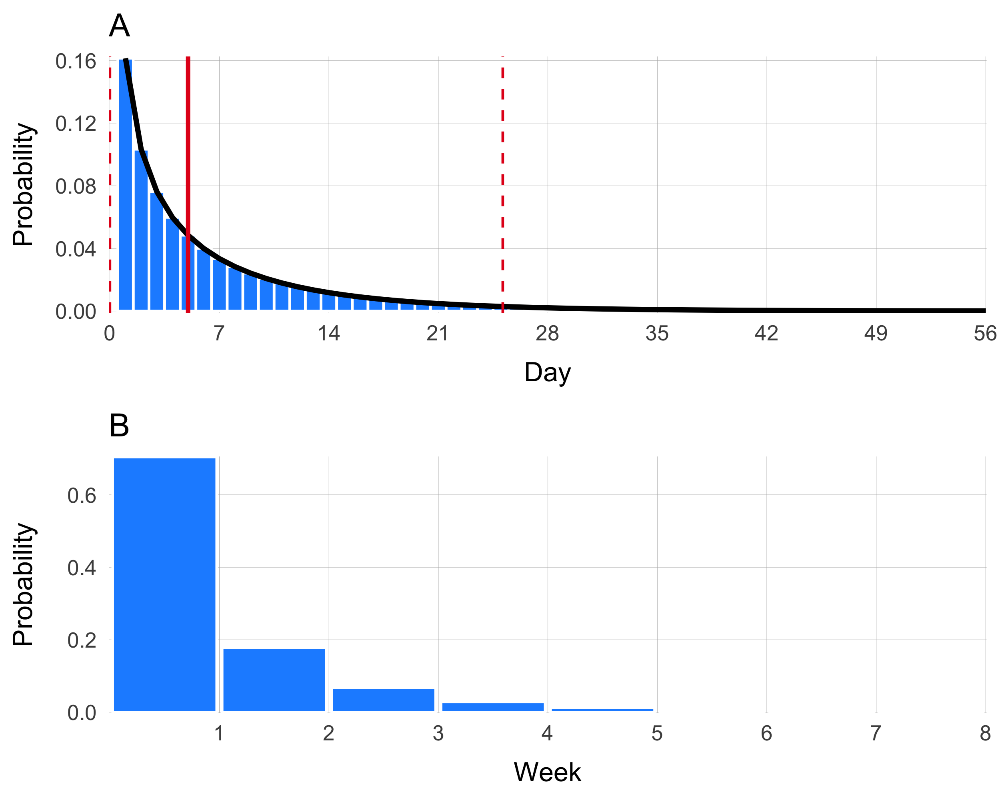

(\#fig:generation-time)Daily probability mass function of the cholera generation time, modeled as a Gamma distribution (shape = 0.5, rate = 0.1; mean ≈ 5 days). Blue bars give per-day probabilities, the solid red line marks the mean, and dashed red lines bound the 95 % credible intervals used to weight past infections when computing the time-varying reproductive number $R_{jt}$.

## Initial conditions

The first MOSAIC version begins on 1 January 2023 (the earliest date for which weekly cholera surveillance is uniformly available across the AFRO region), so each compartment must be initialised at $t = 0$. Rather than treating the initial counts as free fit parameters, we derive informative per-country priors on the *proportions* of the population in each compartment from independent data sources, then sample the priors as part of the BFRS workflow and normalise so that the six proportions sum to unity within each location.

### Vaccinated initial conditions ($V_1, V_2$)

The proportions in $V_1$ and $V_2$ at $t = 0$ are derived from each country's OCV campaign history as recorded in the [GTFCC OCV Dashboard](https://apps.epicentre-msf.org/public/app/gtfcc). Reported deliveries are classified by vaccine product: Euvichol-S deliveries contribute to the $V_1$ pool (single-dose schedule), while Shanchol and Euvichol deliveries contribute proportionally to $V_1$ and $V_2$ according to the campaign's reported dose-1 and dose-2 split. Each historical campaign contributes a residual immune fraction at $t = 0$, calculated as the cumulative effective coverage multiplied by an exponential waning factor $e^{-\omega_k \Delta t}$ where $\omega_k$ is the per-dose waning rate (Equation \@ref(eq:effectiveness)) and $\Delta t$ is the elapsed time since the campaign. The aggregate per-country immune fraction is capped at 70% coverage, consistent with reported maximum reachable coverage in mass-administration settings (Abubakar et al. 2018). The mean and standard deviation are then moment-matched to Beta priors with coefficient of variation 0.40 to honestly reflect campaign-record uncertainty:

$$
\text{prop}V_{1,j} \sim \text{Beta}(s_{1,j}^{V_1},\ s_{2,j}^{V_1}), \quad \text{prop}V_{2,j} \sim \text{Beta}(s_{1,j}^{V_2},\ s_{2,j}^{V_2}),
$$

with shape parameters $(s_1, s_2)$ derived per country (e.g. for Mozambique the $V_1$ prior mean is approximately 0.016, reflecting the residual one-dose immunity from the 2022--2023 OCV response). Per-country prior means range from effectively zero (countries with no reported recent campaigns) to several percent of the population (countries with multiple recent reactive campaigns). This replaces the static Beta priors used in earlier MOSAIC versions, which placed identical, weakly informative shapes on $V_1$ and $V_2$ regardless of country history.

### Susceptible and recovered initial conditions ($S, R$)

The proportion in $R$ at $t = 0$ is derived from the cumulative reported cholera incidence over the years preceding 1 January 2023, scaled by $1/\sigma$ to back out the total number of true infections, then adjusted by the natural-immunity waning rate $\varepsilon$ to give the surviving immune fraction at $t = 0$. Countries with extensive recent outbreaks (e.g. parts of the Horn of Africa) carry a substantially larger $R$ at $t = 0$ than countries with sparse historical incidence.

The proportion in $S$ is then derived as the residual once the other five proportions have been placed:

$$
\text{prop}S_{,j} = 1 - \text{prop}V_{1,j} - \text{prop}V_{2,j} - \text{prop}R_{,j} - \text{prop}E_{,j} - \text{prop}I_{,j},
$$

and the resulting per-country values are fit to a Beta prior. Across the 40 MOSAIC countries the prior mean for $\text{prop}S$ ranges from approximately 0.39 to 0.98 with a standard deviation of 0.11, with the lowest values in countries with the highest combined vaccine-derived and natural immunity.

### Exposed and infected initial conditions ($E, I_1, I_2$)

The proportions in $E$ and the combined infectious pool $I = I_1 + I_2$ at $t = 0$ are derived from the reported case count in the weeks leading up to 1 January 2023, scaled by the observation pipeline (Equation \@ref(eq:reported-cases)) to back out the true infectious population. The $E$ and $I$ priors are placed on the log scale with relatively wide support to reflect the substantial uncertainty in the immediate pre-start state. Per-country prior medians vary by orders of magnitude across the AFRO region, in line with the surveillance signal. The combined $I$ is split into $I_1$ and $I_2$ at $t = 0$ using the symptomatic proportion $\sigma$.

After sampling, the six per-country proportions are normalised to sum to unity and converted to integer compartment counts by multiplying by the country's $t = 0$ population.

---

## Model calibration

After the transmission model is fully specified, we tune its numerical parameters by maximizing the log-likelihood of the observed cholera cases and deaths in a Bayesian inference framework that uses brute-force random-sampling approach to parameter estimation. A detailed walk-through---including likelihood equations, importance-sampling weights, and convergence diagnostics---is provided on the dedicated [Model Calibration page](https://www.mosaicmod.org/model-calibration-1.html).

## Table of MOSAIC framework countries

Table: (\#tab:mosaic-table)Listof MOSAIC Countries with Cholera News

|ISO |Country                          |Region          |Cholera News                                   |
|:---|:--------------------------------|:---------------|:----------------------------------------------|
|BDI |Burundi                          |Eastern Africa  |[Cholera News: Burundi](https://news.google.com/search?q=Cholera+Burundi&hl=en-US&gl=US&ceid=US:en&sort=date)|
|ERI |Eritrea                          |Eastern Africa  |[Cholera News: Eritrea](https://news.google.com/search?q=Cholera+Eritrea&hl=en-US&gl=US&ceid=US:en&sort=date)|
|ETH |Ethiopia                         |Eastern Africa  |[Cholera News: Ethiopia](https://news.google.com/search?q=Cholera+Ethiopia&hl=en-US&gl=US&ceid=US:en&sort=date)|
|KEN |Kenya                            |Eastern Africa  |[Cholera News: Kenya](https://news.google.com/search?q=Cholera+Kenya&hl=en-US&gl=US&ceid=US:en&sort=date)|
|MWI |Malawi                           |Eastern Africa  |[Cholera News: Malawi](https://news.google.com/search?q=Cholera+Malawi&hl=en-US&gl=US&ceid=US:en&sort=date)|
|MOZ |Mozambique                       |Eastern Africa  |[Cholera News: Mozambique](https://news.google.com/search?q=Cholera+Mozambique&hl=en-US&gl=US&ceid=US:en&sort=date)|
|RWA |Rwanda                           |Eastern Africa  |[Cholera News: Rwanda](https://news.google.com/search?q=Cholera+Rwanda&hl=en-US&gl=US&ceid=US:en&sort=date)|
|SOM |Somalia                          |Eastern Africa  |[Cholera News: Somalia](https://news.google.com/search?q=Cholera+Somalia&hl=en-US&gl=US&ceid=US:en&sort=date)|
|SSD |South Sudan                      |Eastern Africa  |[Cholera News: South Sudan](https://news.google.com/search?q=Cholera+South+Sudan&hl=en-US&gl=US&ceid=US:en&sort=date)|
|TZA |Tanzania                         |Eastern Africa  |[Cholera News: Tanzania](https://news.google.com/search?q=Cholera+Tanzania&hl=en-US&gl=US&ceid=US:en&sort=date)|
|UGA |Uganda                           |Eastern Africa  |[Cholera News: Uganda](https://news.google.com/search?q=Cholera+Uganda&hl=en-US&gl=US&ceid=US:en&sort=date)|
|ZMB |Zambia                           |Eastern Africa  |[Cholera News: Zambia](https://news.google.com/search?q=Cholera+Zambia&hl=en-US&gl=US&ceid=US:en&sort=date)|
|ZWE |Zimbabwe                         |Eastern Africa  |[Cholera News: Zimbabwe](https://news.google.com/search?q=Cholera+Zimbabwe&hl=en-US&gl=US&ceid=US:en&sort=date)|
|AGO |Angola                           |Middle Africa   |[Cholera News: Angola](https://news.google.com/search?q=Cholera+Angola&hl=en-US&gl=US&ceid=US:en&sort=date)|
|CMR |Cameroon                         |Middle Africa   |[Cholera News: Cameroon](https://news.google.com/search?q=Cholera+Cameroon&hl=en-US&gl=US&ceid=US:en&sort=date)|
|CAF |Central African Republic         |Middle Africa   |[Cholera News: Central African Republic](https://news.google.com/search?q=Cholera+Central+African+Republic&hl=en-US&gl=US&ceid=US:en&sort=date)|
|TCD |Chad                             |Middle Africa   |[Cholera News: Chad](https://news.google.com/search?q=Cholera+Chad&hl=en-US&gl=US&ceid=US:en&sort=date)|
|COD |Democratic Republic of the Congo |Middle Africa   |[Cholera News: Democratic Republic of the Congo](https://news.google.com/search?q=Cholera+Democratic+Republic+of+the+Congo&hl=en-US&gl=US&ceid=US:en&sort=date)|
|GNQ |Equatorial Guinea                |Middle Africa   |[Cholera News: Equatorial Guinea](https://news.google.com/search?q=Cholera+Equatorial+Guinea&hl=en-US&gl=US&ceid=US:en&sort=date)|
|GAB |Gabon                            |Middle Africa   |[Cholera News: Gabon](https://news.google.com/search?q=Cholera+Gabon&hl=en-US&gl=US&ceid=US:en&sort=date)|
|COG |Republic of the Congo            |Middle Africa   |[Cholera News: Republic of the Congo](https://news.google.com/search?q=Cholera+Republic+of+the+Congo&hl=en-US&gl=US&ceid=US:en&sort=date)|
|BWA |Botswana                         |Southern Africa |[Cholera News: Botswana](https://news.google.com/search?q=Cholera+Botswana&hl=en-US&gl=US&ceid=US:en&sort=date)|
|SWZ |Kingdom of eSwatini              |Southern Africa |[Cholera News: Kingdom of eSwatini](https://news.google.com/search?q=Cholera+Kingdom+of+eSwatini&hl=en-US&gl=US&ceid=US:en&sort=date)|
|NAM |Namibia                          |Southern Africa |[Cholera News: Namibia](https://news.google.com/search?q=Cholera+Namibia&hl=en-US&gl=US&ceid=US:en&sort=date)|
|ZAF |South Africa                     |Southern Africa |[Cholera News: South Africa](https://news.google.com/search?q=Cholera+South+Africa&hl=en-US&gl=US&ceid=US:en&sort=date)|
|BEN |Benin                            |Western Africa  |[Cholera News: Benin](https://news.google.com/search?q=Cholera+Benin&hl=en-US&gl=US&ceid=US:en&sort=date)|
|BFA |Burkina Faso                     |Western Africa  |[Cholera News: Burkina Faso](https://news.google.com/search?q=Cholera+Burkina+Faso&hl=en-US&gl=US&ceid=US:en&sort=date)|
|CIV |Côte d'Ivoire                    |Western Africa  |[Cholera News: Côte d'Ivoire](https://news.google.com/search?q=Cholera+Côte+d'Ivoire&hl=en-US&gl=US&ceid=US:en&sort=date)|
|GHA |Ghana                            |Western Africa  |[Cholera News: Ghana](https://news.google.com/search?q=Cholera+Ghana&hl=en-US&gl=US&ceid=US:en&sort=date)|
|GIN |Guinea                           |Western Africa  |[Cholera News: Guinea](https://news.google.com/search?q=Cholera+Guinea&hl=en-US&gl=US&ceid=US:en&sort=date)|
|GNB |Guinea-Bissau                    |Western Africa  |[Cholera News: Guinea-Bissau](https://news.google.com/search?q=Cholera+Guinea-Bissau&hl=en-US&gl=US&ceid=US:en&sort=date)|
|LBR |Liberia                          |Western Africa  |[Cholera News: Liberia](https://news.google.com/search?q=Cholera+Liberia&hl=en-US&gl=US&ceid=US:en&sort=date)|
|MLI |Mali                             |Western Africa  |[Cholera News: Mali](https://news.google.com/search?q=Cholera+Mali&hl=en-US&gl=US&ceid=US:en&sort=date)|
|MRT |Mauritania                       |Western Africa  |[Cholera News: Mauritania](https://news.google.com/search?q=Cholera+Mauritania&hl=en-US&gl=US&ceid=US:en&sort=date)|
|NER |Niger                            |Western Africa  |[Cholera News: Niger](https://news.google.com/search?q=Cholera+Niger&hl=en-US&gl=US&ceid=US:en&sort=date)|
|NGA |Nigeria                          |Western Africa  |[Cholera News: Nigeria](https://news.google.com/search?q=Cholera+Nigeria&hl=en-US&gl=US&ceid=US:en&sort=date)|
|SEN |Senegal                          |Western Africa  |[Cholera News: Senegal](https://news.google.com/search?q=Cholera+Senegal&hl=en-US&gl=US&ceid=US:en&sort=date)|
|SLE |Sierra Leone                     |Western Africa  |[Cholera News: Sierra Leone](https://news.google.com/search?q=Cholera+Sierra+Leone&hl=en-US&gl=US&ceid=US:en&sort=date)|
|GMB |The Gambia                       |Western Africa  |[Cholera News: The Gambia](https://news.google.com/search?q=Cholera+The+Gambia&hl=en-US&gl=US&ceid=US:en&sort=date)|
|TGO |Togo                             |Western Africa  |[Cholera News: Togo](https://news.google.com/search?q=Cholera+Togo&hl=en-US&gl=US&ceid=US:en&sort=date)|

## Table of model parameters

|Parameter                 |Description                                                                                                                                                                                                                       |Distribution                                          |Source                                                                        |
|:-------------------------|:---------------------------------------------------------------------------------------------------------------------------------------------------------------------------------------------------------------------------------|:-----------------------------------------------------|:-----------------------------------------------------------------------------|
|$i$                       |Index representing the origin metapopulation.                                                                                                                                                                                     |                                                      |                                                                              |
|$j$                       |Index representing the destination metapopulation.                                                                                                                                                                                |                                                      |                                                                              |
|$t$                       |Time step (one week).                                                                                                                                                                                                             |                                                      |                                                                              |
|$b_{jt}$                  |Birth rate of population $j$.                                                                                                                                                                                                     |                                                      |[UN World Population Prospects](https://population.un.org/wpp/)               |
|$d_{jt}$                  |Mortality rate of population $j$.                                                                                                                                                                                                 |                                                      |[UN World Population Prospects](https://population.un.org/wpp/)               |
|$N_{jt}$                  |Population size of destination $j$ at time $t$.                                                                                                                                                                                   |                                                      |                                                                              |
|$S_{jt}$                  |Number of susceptible individuals in destination $j$ at time $t$.                                                                                                                                                                 |                                                      |                                                                              |
|$V_{1,jt}$                |Number of individuals with one-dose vaccination in destination $j$ at time $t$.                                                                                                                                                   |                                                      |                                                                              |
|$V_{2,jt}$                |Number of individuals with two-dose vaccination in destination $j$ at time $t$.                                                                                                                                                   |                                                      |                                                                              |
|$I_{1,jt}$                |Number of symptomatic infected individuals in destination $j$ at time $t$.                                                                                                                                                        |                                                      |                                                                              |
|$I_{2,jt}$                |Number of asymptomatic infected individuals in destination $j$ at time $t$.                                                                                                                                                       |                                                      |                                                                              |
|$W_{jt}$                  |Amount of *V. cholerae* in the environment in destination $j$ at time $t$.                                                                                                                                                        |                                                      |                                                                              |
|$R_{jt}$                  |Number of recovered (immune) individuals in destination $j$ at time $t$.                                                                                                                                                          |                                                      |                                                                              |
|$\Lambda_{j,t+1}$         |Human-to-human force of infection in destination $j$ at time $t+1$.                                                                                                                                                               |                                                      |                                                                              |
|$\Psi_{j,t+1}$            |Environment-to-human force of infection in destination $j$ at time $t+1$.                                                                                                                                                         |                                                      |                                                                              |
|$\iota$                   |The incubation period of cholera infection                                                                                                                                                                                        |$1.4 \ \text{days} \ (1.3–1.6 \ 95\% \text{CI})$      |[Azman et al 2013](http://www.sciencedirect.com/science/article/pii/S0163445312003477)|
|$\phi_1$                  |Vaccine effectiveness of one-dose OCV.                                                                                                                                                                                            |                                                      |                                                                              |
|$\phi_2$                  |Vaccine effectiveness of two-dose OCV.                                                                                                                                                                                            |                                                      |                                                                              |
|$\nu_{jt}$                |Total OCV vaccination rate in destination $j$ at time $t$. In MOSAIC v1.0 this is split into separate first-dose ($\nu_{1,jt}$) and second-dose ($\nu_{2,jt}$) rates --- see the supplementary parameter table below for details. |                                                      |                                                                              |
|$\omega_1$                |Waning immunity rate of vaccinated individuals with one-dose OCV.                                                                                                                                                                 |                                                      |                                                                              |
|$\omega_2$                |Waning immunity rate of vaccinated individuals with two-dose OCV.                                                                                                                                                                 |                                                      |                                                                              |
|$\varepsilon$             |Waning immunity rate of recovered individuals.                                                                                                                                                                                    |                                                      |                                                                              |
|$\gamma_1$                |Recovery rate of symptomatic infected individuals.                                                                                                                                                                                |                                                      |                                                                              |
|$\gamma_2$                |Recovery rate of asymptomatic infected individuals.                                                                                                                                                                               |                                                      |                                                                              |
|$\mu_{j,t}$               |Dynamic infection-fatality ratio (per-day mortality hazard) among symptomatic individuals. Decomposed into $\mu_{j,0}, \mu_{j,1}, \mu_{j,\text{epi}}$; see \@ref(eq:mu-jt).                                                       |                                                      |                                                                              |
|$\sigma$                  |Proportion of infections that are symptomatic.                                                                                                                                                                                    |                                                      |                                                                              |
|$\rho$                    |Care-seeking rate: probability a true symptomatic infection is reported as a suspected case.                                                                                                                                      |                                                      |                                                                              |
|$\zeta_1$                 |Shedding rate (cells per symptomatic person per day) of *V. cholerae* by symptomatic individuals.                                                                                                                                 |$\text{Lognormal}(25.65, 2.46)$                       |<a href='https://www.ncbi.nlm.nih.gov/pmc/articles/PMC3926264/'>Fung 2014</a> |
|$\zeta_2$                 |Shedding rate (cells per asymptomatic person per day) of *V. cholerae* by asymptomatic individuals; derived as $\zeta_1/\zeta_{\text{ratio}}$.                                                                                    |Derived from $\zeta_1$ and $\zeta_{\text{ratio}}$     |<a href='https://www.ncbi.nlm.nih.gov/pmc/articles/PMC3926264/'>Fung 2014</a> |
|$\delta$                  |Environmental decay rate of *V. cholerae*.                                                                                                                                                                                        |Determined dynamically in model based on $\psi_{jt}$. |                                                                              |
|$\delta_{\text{min}}$     |Minimum decay rate when $\psi_{jt}=0$.                                                                                                                                                                                            |$0.333 \ (3 \ \text{days})$                           |                                                                              |
|$\delta_{\text{max}}$     |Maximum decay rate when $\psi_{jt}=1$.                                                                                                                                                                                            |$0.011 \ (90 \ \text{days})$                          |                                                                              |
|$\psi_{jt}$               |Environmental suitability of *V. cholerae* in destination $j$ at time $t$.                                                                                                                                                        |Estimated by LSTM-RNN model.                          |                                                                              |
|$\beta_{j0}^{\text{hum}}$ |Baseline human-to-human transmission rate in destination $j$.                                                                                                                                                                     |                                                      |                                                                              |
|$\beta_{jt}^{\text{hum}}$ |Seasonal human-to-human transmission rate in destination $j$ at time $t$.                                                                                                                                                         |                                                      |                                                                              |
|$\beta_{j0}^{\text{env}}$ |Baseline environment-to-human transmission rate in destination $j$.                                                                                                                                                               |                                                      |                                                                              |
|$\beta_{jt}^{\text{env}}$ |Environment-to-human transmission rate in destination $j$ at time $t$.                                                                                                                                                            |                                                      |                                                                              |
|$a_1$                     |First Fourier cosine coefficient for seasonality.                                                                                                                                                                                 |See Table \@ref(tab:seasonal-table).                  |[Altizer et al 2006](https://onlinelibrary.wiley.com/doi/epdf/10.1111/j.1461-0248.2005.00879.x)|
|$b_1$                     |First Fourier sine coefficient for seasonality.                                                                                                                                                                                   |See Table \@ref(tab:seasonal-table).                  |[Altizer et al 2006](https://onlinelibrary.wiley.com/doi/epdf/10.1111/j.1461-0248.2005.00879.x)|
|$a_2$                     |Second Fourier cosine coefficient for seasonality.                                                                                                                                                                                |See Table \@ref(tab:seasonal-table).                  |[Altizer et al 2006](https://onlinelibrary.wiley.com/doi/epdf/10.1111/j.1461-0248.2005.00879.x)|
|$b_2$                     |Second Fourier sine coefficient for seasonality.                                                                                                                                                                                  |See Table \@ref(tab:seasonal-table).                  |[Altizer et al 2006](https://onlinelibrary.wiley.com/doi/epdf/10.1111/j.1461-0248.2005.00879.x)|
|$p$                       |Period of the seasonal cycle (set to days).                                                                                                                                                                                       |$365$                                                 |                                                                              |
|$\alpha_1$                |Exponent on infectious individuals in the force of infection numerator.                                                                                                                                                           |$0.95$                                                |[Glass et al 2003](https://www.sciencedirect.com/science/article/abs/pii/S0022519303000316)|
|$\alpha_2$                |Exponent on population size in the force of infection denominator; determines density (0) vs frequency (1) dependence.                                                                                                            |$0.95$                                                |[McCallum et al 2001](https://pubmed.ncbi.nlm.nih.gov/11369107/)              |
|$\tau_i$                  |Probability an individual departs from origin $i$.                                                                                                                                                                                |                                                      |                                                                              |
|$\pi_{ij}$                |Probability of travel from origin $i$ to destination $j$ given departure.                                                                                                                                                         |                                                      |                                                                              |
|$\theta_{j}$              |Proportion with adequate WASH in destination $j$.                                                                                                                                                                                 |See Figure \@ref(fig:wash-country).                   |[Sikder et al 2023](https://doi.org/10.1021/acs.est.3c01317)                  |
|$\kappa$                  |Concentration of *V. cholerae* (cells/mL) required for 50% infection probability.                                                                                                                                                 |$\text{Lognormal}(11.77, 1.82)$                       |Meta-analysis (see \@ref(eq:kappa))                                           |

Table: (\#tab:params)Parameters added or substantially reparameterised in MOSAIC v1.0.

|Parameter                     |Description                                                                                                                                   |Distribution                                                      |Source                                                                                              |
|:-----------------------------|:---------------------------------------------------------------------------------------------------------------------------------------------|:-----------------------------------------------------------------|:---------------------------------------------------------------------------------------------------|
|$\nu_{1,jt}$                  |First-dose vaccination rate (deterministic delivery) in destination $j$ at time $t$.                                                          |Derived from GTFCC OCV campaign data.                             |[GTFCC OCV Dashboard](https://apps.epicentre-msf.org/public/app/gtfcc)                              |
|$\nu_{2,jt}$                  |Second-dose vaccination rate in destination $j$ at time $t$; restricted to existing $V_1$ recipients.                                         |Derived from GTFCC OCV campaign data.                             |[GTFCC OCV Dashboard](https://apps.epicentre-msf.org/public/app/gtfcc)                              |
|$\mathcal{V}^{\text{src}}$    |Set of compartments eligible for first-dose vaccination (subset of $\{S, E, I_1, I_2, R\}$).                                                  |Default: $\{S, E, I_1, I_2, R\}$.                                 |laser-cholera issue #42.                                                                            |
|$N^{\text{src}}_{jt}$         |Total population eligible for first-dose vaccination on day $t$: $\sum_{X \in \mathcal{V}^{\text{src}}} X_{jt}$.                              |Computed.                                                         |Computed from compartment populations.                                                              |
|$\zeta_{\text{ratio}}$        |Symptomatic-to-asymptomatic shedding ratio $\zeta_1/\zeta_2$.                                                                                 |$\text{Lognormal}(4.31, 4.39)$                                    |Literature meta-analysis (Smith 2026, Nelson 2009, Chao 2011, Finger 2018, etc.)                    |
|$\text{days}_{\text{short}}$  |Survival time of *V. cholerae* at low environmental suitability ($\psi_{jt}\!\to\!0$).                                                        |$\text{Truncnorm}(16, 7, 0.01, 60)$                               |Literature anchor; staged calibration.                                                              |
|$\text{days}_{\text{long}}$   |Survival time at high environmental suitability ($\psi_{jt}\!\to\!1$). Derived as $\text{days}_{\text{short}} + \text{days}_{\text{spread}}$. |Derived.                                                          |Algebraic.                                                                                          |
|$\text{days}_{\text{spread}}$ |Algebraic spread between minimum and maximum *V. cholerae* survival time.                                                                     |$\text{Truncnorm}(180, 95, 1, 365)$                               |Literature anchor; staged calibration.                                                              |
|$s_1, s_2$                    |Shape parameters of the cumulative Beta transformation $f(\psi_{jt}) = \text{pbeta}(\psi_{jt}\mid s_1, s_2)$ for the decay rate.              |$\text{Truncnorm}(3, 5, 0.1, 10)$ each                            |Bayesian regularisation (v0.26).                                                                    |
|$\psi^{\ast}_{jt}$            |Calibrated (EWMA-smoothed, logit-affine, time-shifted) environmental suitability used in the FOI and decay rate; see \@ref(eq:psi-star).      |Computed (Eq. \@ref(eq:psi-star)).                                |Computed (per-country logit calibration).                                                           |
|$a_{\psi^{\ast},j}$           |Per-country shape/gain parameter for the $\psi \to \psi^{\ast}$ logit calibration.                                                            |$\text{Truncnorm}(1, 1, 0, \infty)$                               |Per-country posterior (calibration).                                                                |
|$b_{\psi^{\ast},j}$           |Per-country scale/offset parameter for the $\psi \to \psi^{\ast}$ logit calibration.                                                          |$\mathcal{N}(0, 2.5)$                                             |Per-country posterior (calibration).                                                                |
|$z_{\psi^{\ast},j}$           |Per-country EWMA smoothing weight ($z = 1$: no smoothing).                                                                                    |$\text{Beta}(2, 1)$                                               |Per-country posterior; Beta(2,1) tightening from v0.28.5.                                           |
|$k_{\psi^{\ast},j}$           |Per-country time offset in days for the $\psi \to \psi^{\ast}$ calibration.                                                                   |$\text{Truncnorm}(0, 25, -90, 90)$                                |Per-country posterior (calibration).                                                                |
|$\eta_j$                      |Per-country daily symptomatic-prevalence threshold for the epidemic regime (Isym/N).                                                          |$\text{Truncnorm}$ per country, capped at 0.01.                   |Per-country historical median epidemic prevalence.                                                  |
|$\chi^{\text{end}}$           |Positive predictive value of a suspected cholera case during endemic periods.                                                                 |$\text{Beta}(5.43, 5.01)$                                         |[Wiens et al. 2023](https://journals.plos.org/plosmedicine/article?id=10.1371/journal.pmed.1004286) |
|$\chi^{\text{epi}}$           |Positive predictive value of a suspected cholera case during epidemic periods.                                                                |$\text{Beta}(4.79, 1.53)$                                         |[Wiens et al. 2023](https://journals.plos.org/plosmedicine/article?id=10.1371/journal.pmed.1004286) |
|$\rho_{\text{deaths}}$        |Probability that a true cholera death is captured by surveillance.                                                                            |$\text{Beta}(3, 2)$                                               |Finger et al. 2024 surveillance-capture estimate.                                                   |
|$l_{\text{cases}}$            |Reporting lag in days from symptom onset to case reporting.                                                                                   |$\text{Truncnorm}(1, 1.5, 0, 7)$ days                             |Surveillance reporting practice.                                                                    |
|$l_{\text{deaths}}$           |Reporting lag in days from symptom onset to death reporting.                                                                                  |$\text{Truncnorm}(4, 3, 1, 14)$ days                              |Surveillance reporting practice.                                                                    |
|$\mu_{j,0}$                   |Baseline daily mortality hazard $\mu_{j,0}$ in destination $j$.                                                                               |$\text{Gamma}$ per country (e.g., AGO: $\text{Gamma}(4, 482.6)$). |Derived from reported CFR via $\mu_{j,0} \approx \text{CFR}^{\text{reported}}_j \cdot \rho / \chi$. |
|$\mu_{j,1}$                   |Proportional time-trend factor for $\mu_{j,t}$ over the simulation period.                                                                    |$\mathcal{N}(0, 0.05)$                                            |Weakly informative.                                                                                 |
|$\mu_{j,\text{epi}}$          |Proportional increase in $\mu_{j,t}$ during epidemic periods.                                                                                 |$\text{Gamma}(1, 2)$                                              |Reflects typical surge-period IFR increase.                                                         |
|$w_{\text{gibbs}}$            |Inverse-temperature parameter for the Gibbs-posterior model weighting (see calibration chapter).                                              |Calibration control parameter.                                    |[Bissiri et al. 2016](https://doi.org/10.1111/rssb.12158)                                           |

## Table of stochastic transitions

|Term                                                 |Description                                                                                      |Stochastic.Transition                                                                                                                                                                                                     |
|:----------------------------------------------------|:------------------------------------------------------------------------------------------------|:-------------------------------------------------------------------------------------------------------------------------------------------------------------------------------------------------------------------------|
|**$\mathbf{S}$ (susceptible)**                       |                                                                                                 |                                                                                                                                                                                                                          |
|$+ b_{jt} N_{jt}$                                    |New individuals entering the susceptible class from births.                                      |$\text{Pois}\big( N_{jt}b_{jt} \big)$                                                                                                                                                                                     |
|$+ \varepsilon R_{jt}$                               |Loss of immunity for recovered individuals.                                                      |$\text{Binom}\big( R_{jt},\; 1 - \exp(-\varepsilon) \big)$                                                                                                                                                                |
|$+ \omega_1 V_{1,jt}$                                |Waning of one-dose vaccine immunity (return to $S$).                                             |$\text{Binom}\big( V_{1,jt},\; 1 - \exp(-\omega_1) \big)$                                                                                                                                                                 |
|$+ \omega_2 V_{2,jt}$                                |Waning of two-dose vaccine immunity (return to $S$).                                             |$\text{Binom}\big( V_{2,jt},\; 1 - \exp(-\omega_2) \big)$                                                                                                                                                                 |
|$- \phi_1 \nu_{1,jt} S_{jt} / N^{\text{src}}_{jt}$   |Effective first doses leaving $S$ for $V_1$.                                                     |$\text{round}\!\big( \phi_1 \nu_{1,jt} \cdot S_{jt} / N^{\text{src}}_{jt} \big)$                                                                                                                                          |
|$- \Lambda_{j,t+1}$                                  |Human-to-human force of infection on the susceptible class.                                      |$\text{Binom}\Big((1-\tau_{j})S_{jt},\ 1 - \exp\big({-\beta_{jt}^{\text{hum}} ((1-\tau_{j})(I_{1,jt}+I_{2,jt}) + \sum_{\forall i \not= j} (\pi_{ij}\tau_i(I_{1,it}+I_{2,it})))^{\alpha_1} / N_{jt}^{\alpha_2}}\big)\Big)$ |
|$- \Psi_{j,t+1}$                                     |Environment-to-human force of infection on the susceptible class.                                |$\text{Binom}\Big((1-\tau_{j})S_{jt},\ 1 - \exp\big({-\beta_{jt}^{\text{env}} (1-\theta_j) W_{jt} / (\kappa+W_{jt})}\big)\Big)$                                                                                           |
|$- d_{jt} S_{jt}$                                    |Background death among susceptible individuals.                                                  |$\text{Binom}\big( S_{jt},\; 1 - \exp(-d_{jt}) \big)$                                                                                                                                                                     |
|**$\mathbf{V_1}$ (one-dose OCV)**                    |                                                                                                 |                                                                                                                                                                                                                          |
|$+ \phi_1 \nu_{1,jt}$                                |Effective first doses entering $V_1$ from all source compartments.                               |$\text{round}\!\big( \phi_1 \nu_{1,jt} \big)$                                                                                                                                                                             |
|$- \phi_2 \nu_{2,jt}$                                |Effective second doses leaving $V_1$ for $V_2$.                                                  |$\text{round}\!\big( \phi_2 \nu_{2,jt} \big)$                                                                                                                                                                             |
|$- \omega_1 V_{1,jt}$                                |Waning of one-dose vaccine immunity (return to $S$).                                             |$\text{Binom}\big( V_{1,jt},\; 1 - \exp(-\omega_1) \big)$                                                                                                                                                                 |
|$- d_{jt} V_{1,jt}$                                  |Background death among one-dose vaccinated individuals.                                          |$\text{Binom}\big( V_{1,jt},\; 1 - \exp(-d_{jt}) \big)$                                                                                                                                                                   |
|**$\mathbf{V_2}$ (two-dose OCV)**                    |                                                                                                 |                                                                                                                                                                                                                          |
|$+ \phi_2 \nu_{2,jt}$                                |Effective second doses entering $V_2$ from $V_1$.                                                |$\text{round}\!\big( \phi_2 \nu_{2,jt} \big)$                                                                                                                                                                             |
|$- \omega_2 V_{2,jt}$                                |Waning of two-dose vaccine immunity (return to $S$).                                             |$\text{Binom}\big( V_{2,jt},\; 1 - \exp(-\omega_2) \big)$                                                                                                                                                                 |
|$- d_{jt} V_{2,jt}$                                  |Background death among two-dose vaccinated individuals.                                          |$\text{Binom}\big( V_{2,jt},\; 1 - \exp(-d_{jt}) \big)$                                                                                                                                                                   |
|**$\mathbf{E}$ (exposed)**                           |                                                                                                 |                                                                                                                                                                                                                          |
|$+ \Lambda_{j,t+1} + \Psi_{j,t+1}$                   |Total force of infection on the susceptible class entering the exposed class.                    |$\Lambda_{j,t+1} + \Psi_{j,t+1}$                                                                                                                                                                                          |
|$- \phi_1 \nu_{1,jt} E_{jt} / N^{\text{src}}_{jt}$   |Effective first doses leaving $E$ for $V_1$.                                                     |$\text{round}\!\big( \phi_1 \nu_{1,jt} \cdot E_{jt} / N^{\text{src}}_{jt} \big)$                                                                                                                                          |
|$- \iota E_{jt}$                                     |Progression of exposed individuals to the infectious class.                                      |$\text{Binom}\big( E_{jt},\; 1 - \exp(-\iota) \big)$                                                                                                                                                                      |
|$- d_{jt} E_{jt}$                                    |Background death among exposed individuals.                                                      |$\text{Binom}\big( E_{jt},\; 1 - \exp(-d_{jt}) \big)$                                                                                                                                                                     |
|**$\mathbf{I_1}$ (symptomatic)**                     |                                                                                                 |                                                                                                                                                                                                                          |
|$+ \sigma\,\iota\,E_{jt}$                            |Exposed individuals progressing to symptomatic infection.                                        |$\text{Binom}\big( \sigma E_{jt},\; 1 - \exp(-\iota) \big)$                                                                                                                                                               |
|$- \phi_1 \nu_{1,jt} I_{1,jt} / N^{\text{src}}_{jt}$ |Effective first doses leaving $I_1$ for $V_1$.                                                   |$\text{round}\!\big( \phi_1 \nu_{1,jt} \cdot I_{1,jt} / N^{\text{src}}_{jt} \big)$                                                                                                                                        |
|$- \gamma_1 I_{1,jt}$                                |Recovery from symptomatic infection.                                                             |$\text{Binom}\big( I_{1,jt},\; 1 - \exp(-\gamma_1) \big)$                                                                                                                                                                 |
|$- \mu_{j,t} I_{1,jt}$                               |Cholera-attributable mortality among symptomatic individuals (dynamic IFR, see \@ref(eq:mu-jt)). |$\text{Binom}\big( I_{1,jt},\; 1 - \exp(-\mu_{j,t}) \big)$                                                                                                                                                                |
|$- d_{jt} I_{1,jt}$                                  |Background death among individuals with symptomatic infection.                                   |$\text{Binom}\big( I_{1,jt},\; 1 - \exp(-d_{jt}) \big)$                                                                                                                                                                   |
|**$\mathbf{I_2}$ (asymptomatic)**                    |                                                                                                 |                                                                                                                                                                                                                          |
|$+ (1-\sigma)\,\iota\,E_{jt}$                        |Exposed individuals progressing to asymptomatic infection.                                       |$\text{Binom}\big( (1-\sigma) E_{jt},\; 1 - \exp(-\iota) \big)$                                                                                                                                                           |
|$- \phi_1 \nu_{1,jt} I_{2,jt} / N^{\text{src}}_{jt}$ |Effective first doses leaving $I_2$ for $V_1$.                                                   |$\text{round}\!\big( \phi_1 \nu_{1,jt} \cdot I_{2,jt} / N^{\text{src}}_{jt} \big)$                                                                                                                                        |
|$- \gamma_2 I_{2,jt}$                                |Recovery from asymptomatic infection.                                                            |$\text{Binom}\big( I_{2,jt},\; 1 - \exp(-\gamma_2) \big)$                                                                                                                                                                 |
|$- d_{jt} I_{2,jt}$                                  |Background death among individuals with asymptomatic infection.                                  |$\text{Binom}\big( I_{2,jt},\; 1 - \exp(-d_{jt}) \big)$                                                                                                                                                                   |
|**$\mathbf{W}$ (environment)**                       |                                                                                                 |                                                                                                                                                                                                                          |
|$+ \zeta_1 I_{1,jt}$                                 |Cells shed into the environment by symptomatic individuals.                                      |$(1-\theta_j)\,\text{Pois}\big( \zeta_1 I_{1,jt} \big)$                                                                                                                                                                   |
|$+ \zeta_2 I_{2,jt}$                                 |Cells shed into the environment by asymptomatic individuals.                                     |$(1-\theta_j)\,\text{Pois}\big( \zeta_2 I_{2,jt} \big)$                                                                                                                                                                   |
|$- \delta_{jt} W_{jt}$                               |Decay of viable *V. cholerae* in the environment.                                                |$\text{Pois}\big( \delta_{jt} W_{jt} \big)$                                                                                                                                                                               |
|**$\mathbf{R}$ (recovered)**                         |                                                                                                 |                                                                                                                                                                                                                          |
|$+ \gamma_1 I_{1,jt}$                                |Recovery of individuals with symptomatic infection.                                              |$\text{Binom}\big( I_{1,jt},\; 1 - \exp(-\gamma_1) \big)$                                                                                                                                                                 |
|$+ \gamma_2 I_{2,jt}$                                |Recovery of individuals with asymptomatic infection.                                             |$\text{Binom}\big( I_{2,jt},\; 1 - \exp(-\gamma_2) \big)$                                                                                                                                                                 |
|$- \phi_1 \nu_{1,jt} R_{jt} / N^{\text{src}}_{jt}$   |Effective first doses leaving $R$ for $V_1$.                                                     |$\text{round}\!\big( \phi_1 \nu_{1,jt} \cdot R_{jt} / N^{\text{src}}_{jt} \big)$                                                                                                                                          |
|$- \varepsilon R_{jt}$                               |Loss of immunity for recovered individuals.                                                      |$\text{Binom}\big( R_{jt},\; 1 - \exp(-\varepsilon) \big)$                                                                                                                                                                |
|$- d_{jt} R_{jt}$                                    |Background death among recovered individuals.                                                    |$\text{Binom}\big( R_{jt},\; 1 - \exp(-d_{jt}) \big)$                                                                                                                                                                     |

## Table of vaccination model terms

| Term | Population | Dynamics | Notes |
| ---- | ---------- | -------- | ----- |
| $V_{1,j,t}$ | Effectively-vaccinated one-dose recipients | $V_{1,j,t+1} = V_{1,jt} + \phi_1\nu_{1,jt} - \phi_2\nu_{2,jt} - \omega_1 V_{1,jt} - d_{jt}V_{1,jt}$ | + Effective first doses from $\mathcal{V}^{\text{src}}$.   $-$ Effective second doses (move to $V_2$).   $-$ Waning (move to $S$).   $-$ Background mortality.   Not subject to forces of infection. |
| $V_{2,j,t}$ | Effectively-vaccinated two-dose recipients | $V_{2,j,t+1} = V_{2,jt} + \phi_2\nu_{2,jt} - \omega_2 V_{2,jt} - d_{jt}V_{2,jt}$ | + Effective second doses (from $V_1$).   $-$ Waning (move to $S$).   $-$ Background mortality.   Not subject to forces of infection. |
| $\text{doses}^{(1)}_{j,t}$ | Total first doses delivered on day $t$ | $\text{doses}^{(1)}_{j,t} = \nu_{1,jt}$ | Tracking-only patch counter; sum across $t$ approximates the reported OCV-campaign total. |
| $\text{doses}^{(2)}_{j,t}$ | Total second doses delivered on day $t$ | $\text{doses}^{(2)}_{j,t} = \nu_{2,jt}$ | Tracking-only patch counter; capped at the current $V_1$ population. |

In the simplified SVEIRWS structure introduced in laser-cholera 0.12, only the *effective* fraction of each delivered dose enters $V_1$ or $V_2$; ineffective doses are returned (notionally) to the source compartment without changing anyone's compartment membership. Total dose counts on day $t$ are tracked separately as $\text{doses}^{(1)}_{j,t}$ and $\text{doses}^{(2)}_{j,t}$ for comparison with reported OCV-campaign data; these counters are stored as patch-level vectors of length $T_{\text{total}}$ and are not used in the model dynamics.
