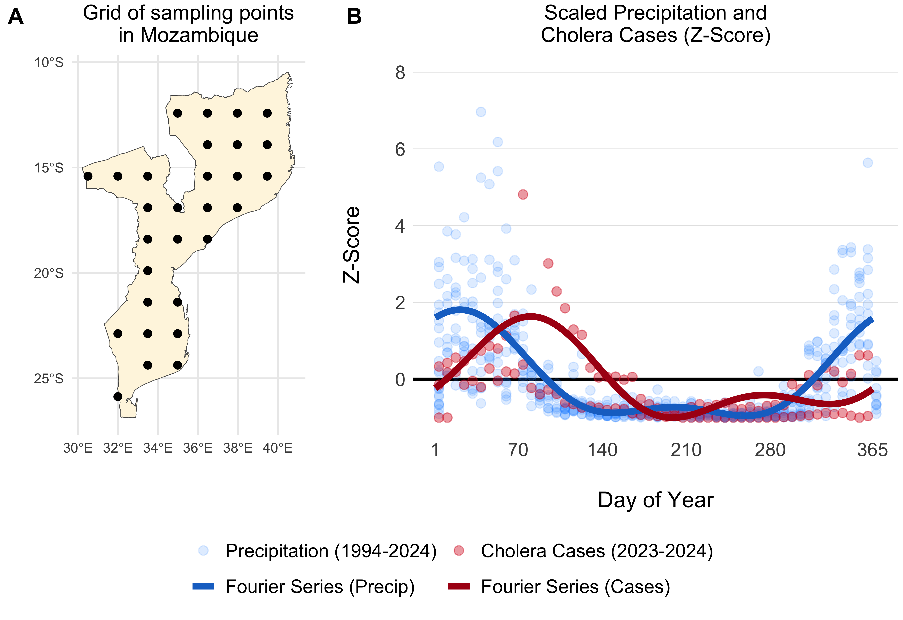
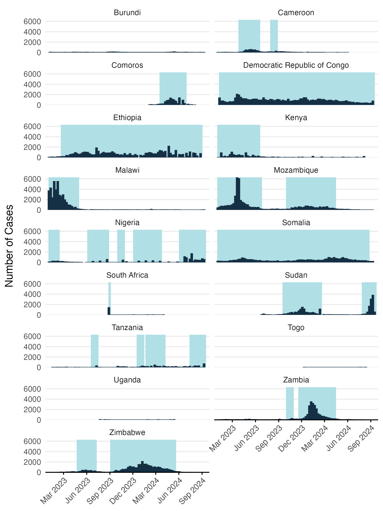
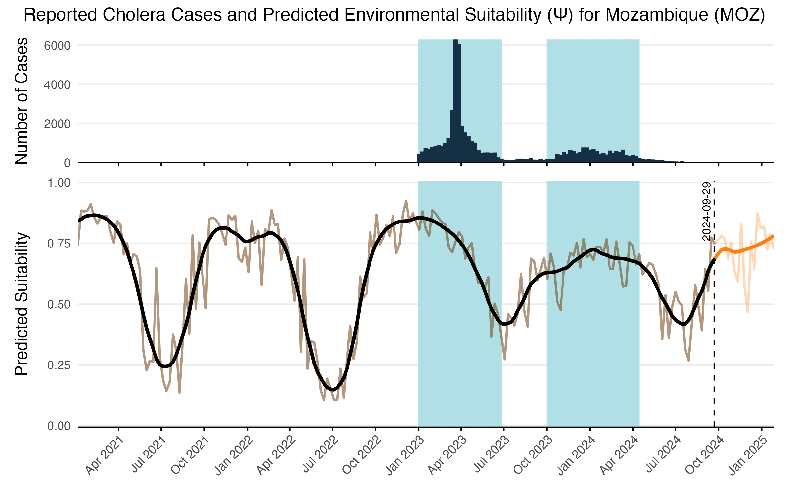
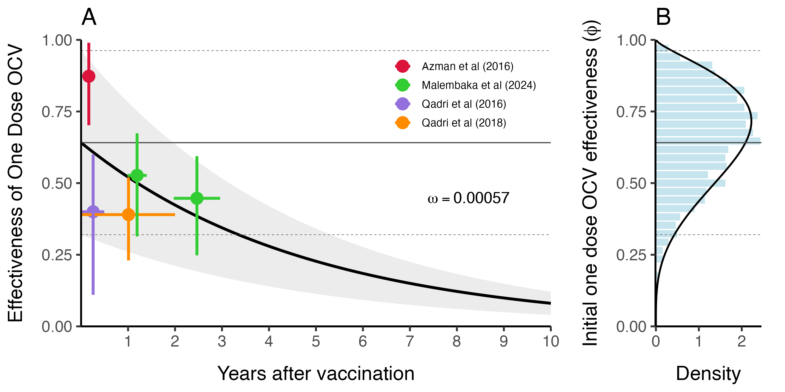
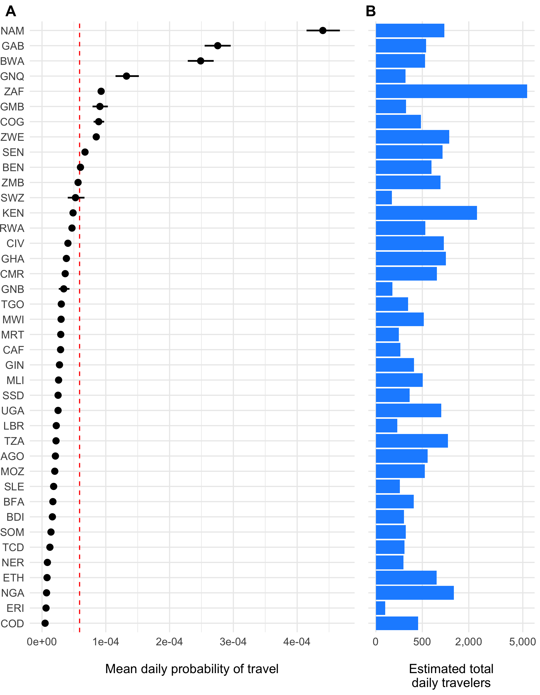

# Model description

Here we describe the methods of MOSAIC version 1.0. This model version provides a starting point for understanding cholera transmission in Sub-Saharan Africa, incorporating important drivers of disease dynamics such as human mobility, environmental conditions, and vaccination schedules. As MOSAIC continues to evolve, future iterations will refine model components based on available data and improved model mechanisms, which we hope will increase its applicability to real-world scenarios.

The model operates on daily time steps and will be fitted to historical incidence data, however current development is based on data from January 2023 to August 2024 and includes 40 countries in Sub-Saharan Africa (SSA), see Figure \@ref(fig:map) and the [Table of MOSAIC framework countries](#mosaic-table).

(\#fig:map)A map of Sub-Saharan Africa with countries that have experienced a cholera outbreak in the past 5 and 10 years highlighted in green. The 40 countires included in the MOSAIC modeling framework are indicated in blue.

## Transmission dynamics

The model has a metapopulation structure with familiar compartments for Susceptible, Exposed, Infected, and Recovered individuals with SEIRS dynamics. The model also contains compartments for one- and two-dose vaccination ($V_1$ and $V_2$) and Water & environment based transmission (W) which we refer to as SVEIWRS.

(\#fig:diagram)This diagram of the SVEIWRS (Susceptible-Vaccinated-Exposed-Infected-Water/environmental-Recovered-Susceptible) model shows model compartments as circles with rate parameters displayed. The primary data sources the model is fit to are shown as square nodes (Vaccination data, and reported cases and deaths).

The SVEIWRS metapopulation model, shown in Figure \@ref(fig:diagram), is governed by the following difference equations:

\begin{equation}
\begin{aligned}
\mathbf{\text{Susceptible population:}}\\[1mm]
S_{j,t+1} = \ & 
S_{jt} 
+ b_{jt}\,N_{jt} 
+ \varepsilon\,R_{jt} 
- \frac{\nu_{1,jt}\,S_{jt}}{\left(S_{jt}+E_{jt}\right)} 
- \left( \Lambda^{S}_{j,t+1} + \Psi^{S}_{j,t+1} \right) 
- d_{jt}\,S_{jt}\\[3mm]
\mathbf{\text{One-dose vaccination:}}\\[1mm]
V^{\text{imm}}_{1,j,t+1} = \ & 
V^{\text{imm}}_{1,jt} 
+ \frac{\phi_1\,\nu_{1,jt}\,S_{jt}}{\left(S_{jt}+E_{jt}\right)}
- \omega_1\,V^{\text{imm}}_{1,jt} 
- \frac{\nu_{2,jt}\,V^{\text{imm}}_{1,jt}}{\left(V^{\text{imm}}_{1,jt}+V^{\text{sus}}_{1,jt}\right)}
- d_{jt}\,V^{\text{imm}}_{1,jt}\\[1mm]
V^{\text{sus}}_{1,j,t+1} = \ & 
V^{\text{sus}}_{1,jt} 
+ \frac{\left(1-\phi_1\right)\,\nu_{1,jt}\,S_{jt}}{\left(S_{jt}+E_{jt}\right)}
+ \omega_1\,V^{\text{imm}}_{1,jt} 
- \left( \Lambda^{V_1}_{j,t+1} + \Psi^{V_1}_{j,t+1} \right) 
- \frac{\nu_{2,jt}\,V^{\text{sus}}_{1,jt}}{\left(V^{\text{imm}}_{1,jt}+V^{\text{sus}}_{1,jt}\right)} 
- d_{jt}\,V^{\text{sus}}_{1,jt}\\[1mm]
V^{\text{inf}}_{1,j,t+1} = \ & 
V^{\text{inf}}_{1,jt} 
+ \left( \Lambda^{V_1}_{j,t+1} + \Psi^{V_1}_{j,t+1} \right) 
- d_{jt}\,V^{\text{inf}}_{1,jt} \quad \mathbf{\text{(tracking only)}}\\[6mm]
\mathbf{\text{Two-dose vaccination:}}\\[3mm]
V^{\text{imm}}_{2,j,t+1} = \ & 
V^{\text{imm}}_{2,jt} 
+ \phi_2\,\nu_{2,jt} 
- \omega_2\,V^{\text{imm}}_{2,jt} 
- d_{jt}\,V^{\text{imm}}_{2,jt}\\[3mm]
V^{\text{sus}}_{2,j,t+1} = \ & 
V^{\text{sus}}_{2,jt} 
+ \left(1-\phi_2\right)\,\nu_{2,jt} 
+ \omega_2\,V^{\text{imm}}_{2,jt} 
- \left( \Lambda^{V_2}_{j,t+1} + \Psi^{V_2}_{j,t+1} \right) 
- d_{jt}\,V^{\text{sus}}_{2,jt}\\[3mm]
V^{\text{inf}}_{2,j,t+1} = \ &
V^{\text{inf}}_{2,jt} 
+ \left( \Lambda^{V_2}_{j,t+1} + \Psi^{V_2}_{j,t+1} \right) 
- d_{jt}\,V^{\text{inf}}_{2,jt} \quad \mathbf{\text{(tracking only)}}\\[6mm]
\mathbf{\text{Infection dynamics:}}\\[3mm]
E_{j,t+1} = \ &
E_{jt} 
+ \left( \Lambda_{j,t+1} + \Psi_{j,t+1}\right) 
- \iota\,E_{jt} 
- d_{jt}\,E_{jt}\\[3mm]
I_{1,j,t+1} = \ &
I_{1,jt} 
+ \sigma\,\iota\,E_{jt} 
- \gamma_1\,I_{1,jt} 
- \mu_j\,I_{1,jt} 
- d_{jt}\,I_{1,jt}\\[3mm]
I_{2,j,t+1} = \ &
I_{2,jt} 
+ \left(1-\sigma\right)\,\iota\,E_{jt} 
- \gamma_2\,I_{2,jt} 
- d_{jt}\,I_{2,jt}\\[3mm]
R_{j,t+1} = \ &
R_{jt} 
+ \left( \gamma_1\,I_{1,jt} + \gamma_2\,I_{2,jt} \right) 
- \varepsilon\,R_{jt} 
- d_{jt}\,R_{jt}\\[5mm]
\mathbf{\text{Environment:}}\\[3mm]
W_{j,t+1} = \ &
W_{jt} 
+ \left(1-\theta_j\right)\left( \zeta_1\,I_{1,jt} + \zeta_2\,I_{2,jt} \right) 
- \delta_{jt}\,W_{jt}\\[3mm]
\end{aligned}
(\#eq:system)
\end{equation}

For detailed descriptions of all parameters appearing in Equation \@ref(eq:system), see the [Table of model parameters](#parameters-table). Transmission dynamics in the model are governed primarily by two distinct force-of-infection terms: the human-to-human force of infection, $\Lambda_{jt}$, and the environmental force of infection, $\Psi_{jt}$.

The human-to-human transmission component at time $t+1$ in location $j$ is defined separately for susceptible ($S$), one-dose vaccinated ($V_1$), and two-dose vaccinated ($V_2$) individuals as:

\begin{equation}
\begin{aligned}
\Lambda^S_{j,t+1} &= \frac{
\beta_{jt}^{\text{hum}} \, (1-\tau_{j})S_{jt} \, \left[ (1-\tau_{j}) (I_{1,jt} + I_{2,jt}) + \sum_{\forall i \neq j} \pi_{ij}\tau_i(I_{1,jt} + I_{2,jt}) \right]^{\alpha_1}}{N_{jt}^{\alpha_2}},\\[4mm]
\Lambda^{V_1}_{j,t+1} &= \frac{
\beta_{jt}^{\text{hum}} \, (1-\tau_{j})V^{\text{sus}}_{1,jt}  \, \left[ (1-\tau_{j})(I_{1,jt} + I_{2,jt}) + \sum_{\forall i \neq j} \pi_{ij}\tau_i(I_{1,jt} + I_{2,jt}) \right]^{\alpha_1}}{N_{jt}^{\alpha_2}},\\[4mm]
\Lambda^{V_2}_{j,t+1} &= \frac{
\beta_{jt}^{\text{hum}} \, (1-\tau_{j})V^{\text{sus}}_{2,jt} \, \left[ (1-\tau_{j})(I_{1,jt} + I_{2,jt}) + \sum_{\forall i \neq j} \pi_{ij}\tau_i(I_{1,jt} + I_{2,jt}) \right]^{\alpha_1}}{N_{jt}^{\alpha_2}}.
\end{aligned}
(\#eq:foi-human)
\end{equation}

The total human-to-human force of infection is then the sum of these three components:

\begin{equation}
\Lambda_{j,t+1} =  \Lambda^S_{j,t+1} + \Lambda^{V_1}_{j,t+1} + \Lambda^{V_2}_{j,t+1}.
(\#eq:foi-human-total)
\end{equation}

In these equations, $\beta_{jt}^{\text{hum}}$ represents the rate of human-to-human transmission. Movement within and among metapopulations is governed by the parameter $\tau_i$, indicating the probability of departing origin location $i$, while $\pi_{ij}$ describes the relative probability of travel from origin $i$ to destination $j$ (see section on [spatial dynamics][Spatial dynamics]). The terms $\Lambda^{S}_{jt}$, $\Lambda^{V_1}_{jt}$, and $\Lambda^{V_2}_{jt}$ explicitly partition the overall human-to-human force of infection into separate contributions from susceptible, one-dose vaccinated, and two-dose vaccinated individuals, linking directly to the compartmental structure of the model described by the system of difference equations.

The environmental force of infection ($\Psi_{jt}$), capturing environment-to-human transmission at location $j$ and time $t+1$, is also explicitly partitioned into susceptible ($S$), one-dose vaccinated ($V_1$), and two-dose vaccinated ($V_2$) compartments:

\begin{equation}
\begin{aligned}
\Psi^S_{j,t+1} &= \frac{\beta_{jt}^{\text{env}}\, (1-\tau_{j})S_{jt}\,(1-\theta_j)W_{jt}}{\kappa + W_{jt}},\\[4mm]
\Psi^{V_1}_{j,t+1} &= \frac{\beta_{jt}^{\text{env}}\, (1-\tau_{j})V^{\text{sus}}_{1,jt}\,(1-\theta_j)W_{jt}}{\kappa + W_{jt}},\\[4mm]
\Psi^{V_2}_{j,t+1} &= \frac{\beta_{jt}^{\text{env}}\, (1-\tau_{j})V^{\text{sus}}_{2,jt}\,(1-\theta_j)W_{jt}}{\kappa + W_{jt}}.
\end{aligned}
(\#eq:foi-environment)
\end{equation}

The total environmental force of infection is then the sum of these three components:

\begin{equation}
\Psi_{j,t+1} = \Psi^S_{j,t+1} + \Psi^{V_1}_{j,t+1} + \Psi^{V_2}_{j,t+1}.
(\#eq:foi-environment-total)
\end{equation}

Here, $\beta_{jt}^{\text{env}}$ denotes the rate of environment-to-human transmission, and $\theta_j$ is the proportion of the population at location $j$ with at least basic access to Water, Sanitation, and Hygiene (WASH). The environmental exposure is scaled by the concentration of *V. cholerae* (cells per mL) associated with a 50% probability of infection ([Fung 2014](https://www.ncbi.nlm.nih.gov/pmc/articles/PMC3926264/)). Additional details regarding environmental compartments, water reservoirs, and climatic factors influencing transmission

Note that all model processes are stochastic. Transition rates are converted to probabilities with the commonly used method based on the exponential waiting time distribution $p(t) = 1-e^{-rt}$ (see [Ross 2007](https://www.google.com/books/edition/Introduction_to_Probability_Models/1uxBwhAb_zYC?hl=en)). Integer quantities are thus moved between model compartments at each time step according to a binomial process similar to the recovery of infected individuals $\gamma I_{jt}$:

\begin{equation}
\frac{\partial R}{\partial t} \sim \text{Binom}(I_{jt}, 1-e^{-\gamma}).
\end{equation}

For a detailed list of all stochastic transitions in the model, see the [Table of stochastic transitions](#transitions-table) below.

## Latency

An important feature of the SVEIWRS model is the inclusion of an exposed compartment $\left(E\right)$ , which captures the latent period between exposure and the onset of infectiousness. In our model, individuals who become infected first enter the $E$ compartment, where they remain for a period governed by the incubation period $\iota$, before progressing to the infectious compartments $I_1$ (severe symptomatic infection) or $I_2$ (mild and/or asymptomatic infection).

A systematic review by [Azman et al (2013)](http://www.sciencedirect.com/science/article/pii/S0163445312003477) estimated the median incubation period for cholera to be approximately $1.4 \ \text{days} \ (1.3–1.6 \ 95\% \text{CI})$. This relatively short latency is one of the key characteristic governing cholera dynamics and is critical for accurately capturing the rapid spatial spread observed during outbreaks.

## Seasonality
Cholera transmission is seasonal and is typically associated with the rainy season, so both transmission rate terms $\beta_{jt}^{\text{*}}$ are temporally forced. For human-to-human transmission we used a sinusoidal mechanism as in [Altizer et al 2006](https://onlinelibrary.wiley.com/doi/epdf/10.1111/j.1461-0248.2005.00879.x). Specifically, the function is a truncated sine-cosine form of the [Fourier series](https://en.wikipedia.org/wiki/Fourier_series) with two harmonic features which has the flexibility to capture seasonal transmission dynamics driven by extended rainy seasons and/or biannual trends:

\begin{equation}
\beta_{jt}^{\text{hum}} = \beta_{j0}^{\text{hum}} \left(1 + a_1 \cos\left(\frac{2\pi t}{p}\right) + b_1 \sin\left(\frac{2\pi t}{p}\right) + a_2 \cos\left(\frac{4\pi t}{p}\right) + b_2 \sin\left(\frac{4\pi t}{p}\right)\right).
(\#eq:beta1)
\end{equation}

Where, $\beta_{j0}^{\text{hum}}$ is the mean human-to-human transmission rate at location $j$ over all time steps. Seasonal dynamics are determined by the parameters $a_1$, $b_1$ and $a_2$, $b_2$ which gives the amplitude of the first and second waves respectively. The periodic cycle $p$ is 365, so the function controls the temporal variation in $\beta_{jt}^{\text{hum}}$ over each day of the year.

We estimated the parameters in the Fourier series ($a_1$, $b_1$, $a_2$, $b_2$) using the [Levenberg–Marquardt](https://en.wikipedia.org/wiki/Levenberg%E2%80%93Marquardt_algorithm) algorithm in the [`minpack.lm`](https://rdrr.io/cran/minpack.lm/) R library. Given the lack of reported cholera case data for many countries in SSA and the association between cholera transmission and the rainy season, we leveraged seasonal precipitation data to help fit the Fourier wave function to all countries. We first gathered weekly precipitation values from 1994 to 2024 for 30 uniformly distributed points within each country from the [Open-Meteo Historical Weather Data API](https://open-meteo.com/en/docs/historical-weather-api). Then we fit the Fourier series to the weekly precipitation data and used these parameters as the starting values when fitting the model to the more sparse cholera case data.

(\#fig:seasonal-example)Example of a grid of 30 uniformly distributed points within Mozambique (A). The scatterplot shows weekly summed precipitation values at those 30 grid points and cholera cases plotted on the same scale of the Z-Score which shows the variance around the mean in terms of the standard deviation. Fitted Fourier series fucntions are shown as blue (fit precipitation data) and red (fit to cholera case data) lines.

For countries with no reported case data, we inferred seasonal dynamics using the fitted wave function of a neighboring country with available case data. The selected neighbor was chosen from the same cluster of countries (grouped hierarchically into four clusters based on precipitation seasonality using [Ward's method](https://en.wikipedia.org/wiki/Ward%27s_method); see Figure \@ref(fig:seasonal-cluster)) that had the highest correlation in seasonal precipitation with the country lacking case data. In the rare event that no country with reported case data was found within the same seasonal cluster, we expanded the search to the 10 nearest neighbors and continued expanding by adding the next nearest neighbor until a match was found.

(\#fig:seasonal-cluster)A) Map showing the clustering of African countries based on their seasonal precipitation patterns (2014-2024). Countries are colored according to their cluster assignments, identified using hierarchical clustering. B) Fourier series fitted to weekly precipitation for each country. Each line plot shows the seasonal pattern for countries within a given cluster. Clusteres are used to infer the seasonal transmission dynamics for countries where there are no reported cholera cases.

Using the model fitting methods described above, and the cluster-based approach for inferring the seasonal Fourier series pattern in countries without reported cholera cases, we modeled the seasonal dynamics for all 40 countries in the MOSAIC framework. These dynamics are visualized in Figure \@ref(fig:seasonal-all), with the corresponding Fourier model coefficients presented in Table \@ref(tab:seasonal-table).

(\#fig:seasonal-all)Seasonal transmission patterns for all countries modeled in MOSAIC as modeled by the truncated Fourier series in Equation \@ref(eq:beta1). Blues lines give the Fourier series model fits for precipitation (1994-2024) and the red lines give models fits to reported cholera cases (2023-2024). For countries where reported case data were not available, the Fourier model was inferred by the nearest country with the most similar seasonal precipitation patterns as determined by the hierarchical clustering. Countries with inferred case data from neighboring locations are annotated in red. The X-axis represents the weeks of the year (1-52), while the Y-axis shows the Z-score of weekly precipitation and cholera cases.

<table class="table" style="font-size: 11.75px; width: auto !important; margin-left: auto; margin-right: auto;">
<caption style="font-size: initial !important;">(\#tab:seasonal-table)(\#tab:seasonal-table)Estimated coefficients for the truncated Fourier model in Equation \@ref(eq:beta1) fit to countries with reported cholera cases. Model fits are shown in Figure \@ref(fig:seasonal-all).</caption>
 <thead>
<tr>
<th style="empty-cells: hide;border-bottom:hidden;" colspan="1"></th>
<th style="border-bottom:hidden;padding-bottom:0; padding-left:3px;padding-right:3px;text-align: center; " colspan="4">
Fourier Coefficients
</th>
</tr>
  <tr>
   <th style="text-align:left;"> Country </th>
   <th style="text-align:left;"> $a_1$ </th>
   <th style="text-align:left;"> $a_2$ </th>
   <th style="text-align:left;"> $b_1$ </th>
   <th style="text-align:left;"> $b_2$ </th>
  </tr>
 </thead>
<tbody>
  <tr>
   <td style="text-align:left;"> Burundi </td>
   <td style="text-align:left;"> -0.42 (-0.52 to -0.32) </td>
   <td style="text-align:left;"> -0.3 (-0.4 to -0.21) </td>
   <td style="text-align:left;"> -0.06 (-0.16 to 0.04) </td>
   <td style="text-align:left;"> -0.22 (-0.32 to -0.12) </td>
  </tr>
  <tr>
   <td style="text-align:left;"> Cameroon </td>
   <td style="text-align:left;"> -0.97 (-1.15 to -0.78) </td>
   <td style="text-align:left;"> -0.08 (-0.26 to 0.1) </td>
   <td style="text-align:left;"> 0.44 (0.27 to 0.62) </td>
   <td style="text-align:left;"> -0.71 (-0.89 to -0.53) </td>
  </tr>
  <tr>
   <td style="text-align:left;"> DRC </td>
   <td style="text-align:left;"> 0.01 (-0.03 to 0.05) </td>
   <td style="text-align:left;"> -0.08 (-0.12 to -0.04) </td>
   <td style="text-align:left;"> 0.23 (0.19 to 0.27) </td>
   <td style="text-align:left;"> -0.04 (-0.08 to 0) </td>
  </tr>
  <tr>
   <td style="text-align:left;"> Ethiopia </td>
   <td style="text-align:left;"> -0.42 (-0.47 to -0.36) </td>
   <td style="text-align:left;"> -0.12 (-0.17 to -0.06) </td>
   <td style="text-align:left;"> 0.22 (0.16 to 0.27) </td>
   <td style="text-align:left;"> 0.05 (0 to 0.11) </td>
  </tr>
  <tr>
   <td style="text-align:left;"> Ghana </td>
   <td style="text-align:left;"> -0.71 (-1.7 to 0.27) </td>
   <td style="text-align:left;"> 1.31 (0.47 to 2.15) </td>
   <td style="text-align:left;"> -0.29 (-0.95 to 0.37) </td>
   <td style="text-align:left;"> -1.17 (-1.73 to -0.6) </td>
  </tr>
  <tr>
   <td style="text-align:left;"> Kenya </td>
   <td style="text-align:left;"> 0.12 (-0.08 to 0.31) </td>
   <td style="text-align:left;"> -0.28 (-0.48 to -0.08) </td>
   <td style="text-align:left;"> 0.93 (0.73 to 1.13) </td>
   <td style="text-align:left;"> 0.25 (0.05 to 0.45) </td>
  </tr>
  <tr>
   <td style="text-align:left;"> Malawi </td>
   <td style="text-align:left;"> 1.29 (1.06 to 1.53) </td>
   <td style="text-align:left;"> 0.29 (0.05 to 0.53) </td>
   <td style="text-align:left;"> 1.11 (0.87 to 1.35) </td>
   <td style="text-align:left;"> 1.23 (0.99 to 1.47) </td>
  </tr>
  <tr>
   <td style="text-align:left;"> Mozambique </td>
   <td style="text-align:left;"> 0.4 (0.23 to 0.57) </td>
   <td style="text-align:left;"> -0.7 (-0.87 to -0.53) </td>
   <td style="text-align:left;"> 1.2 (1.03 to 1.37) </td>
   <td style="text-align:left;"> 0.19 (0.02 to 0.36) </td>
  </tr>
  <tr>
   <td style="text-align:left;"> Niger </td>
   <td style="text-align:left;"> 2.95 (1.4 to 4.51) </td>
   <td style="text-align:left;"> -3.42 (-4.63 to -2.2) </td>
   <td style="text-align:left;"> 1.79 (0.8 to 2.79) </td>
   <td style="text-align:left;"> 1.72 (0.94 to 2.51) </td>
  </tr>
  <tr>
   <td style="text-align:left;"> Nigeria </td>
   <td style="text-align:left;"> -0.25 (-0.39 to -0.11) </td>
   <td style="text-align:left;"> -0.3 (-0.43 to -0.16) </td>
   <td style="text-align:left;"> -0.91 (-1.05 to -0.77) </td>
   <td style="text-align:left;"> 0.17 (0.04 to 0.31) </td>
  </tr>
  <tr>
   <td style="text-align:left;"> Somalia </td>
   <td style="text-align:left;"> -0.22 (-0.28 to -0.17) </td>
   <td style="text-align:left;"> -0.24 (-0.29 to -0.18) </td>
   <td style="text-align:left;"> 0.91 (0.86 to 0.97) </td>
   <td style="text-align:left;"> -0.37 (-0.42 to -0.32) </td>
  </tr>
  <tr>
   <td style="text-align:left;"> South Africa </td>
   <td style="text-align:left;"> -2.33 (-3.43 to -1.22) </td>
   <td style="text-align:left;"> 1.06 (0.06 to 2.07) </td>
   <td style="text-align:left;"> -2.72 (-3.74 to -1.71) </td>
   <td style="text-align:left;"> 3.23 (2.1 to 4.36) </td>
  </tr>
  <tr>
   <td style="text-align:left;"> South Sudan </td>
   <td style="text-align:left;"> 1.01 (0.73 to 1.29) </td>
   <td style="text-align:left;"> 1.54 (1.3 to 1.78) </td>
   <td style="text-align:left;"> 0.18 (-0.05 to 0.41) </td>
   <td style="text-align:left;"> 0.02 (-0.22 to 0.26) </td>
  </tr>
  <tr>
   <td style="text-align:left;"> Tanzania </td>
   <td style="text-align:left;"> 0.49 (0.37 to 0.61) </td>
   <td style="text-align:left;"> -0.13 (-0.25 to -0.02) </td>
   <td style="text-align:left;"> -0.6 (-0.71 to -0.48) </td>
   <td style="text-align:left;"> -0.29 (-0.41 to -0.18) </td>
  </tr>
  <tr>
   <td style="text-align:left;"> Togo </td>
   <td style="text-align:left;"> 1.11 (0.77 to 1.46) </td>
   <td style="text-align:left;"> 0.02 (-0.33 to 0.36) </td>
   <td style="text-align:left;"> -1 (-1.36 to -0.63) </td>
   <td style="text-align:left;"> -0.91 (-1.27 to -0.55) </td>
  </tr>
  <tr>
   <td style="text-align:left;"> Uganda </td>
   <td style="text-align:left;"> -0.17 (-0.56 to 0.22) </td>
   <td style="text-align:left;"> 0.52 (0.13 to 0.9) </td>
   <td style="text-align:left;"> 0.6 (0.22 to 0.99) </td>
   <td style="text-align:left;"> 0.42 (0.04 to 0.81) </td>
  </tr>
  <tr>
   <td style="text-align:left;"> Zambia </td>
   <td style="text-align:left;"> 1.53 (1.29 to 1.77) </td>
   <td style="text-align:left;"> 0.88 (0.64 to 1.12) </td>
   <td style="text-align:left;"> 0.67 (0.44 to 0.91) </td>
   <td style="text-align:left;"> 0.78 (0.55 to 1.02) </td>
  </tr>
  <tr>
   <td style="text-align:left;"> Zimbabwe </td>
   <td style="text-align:left;"> 0.99 (0.87 to 1.11) </td>
   <td style="text-align:left;"> 0.34 (0.23 to 0.46) </td>
   <td style="text-align:left;"> 0.54 (0.42 to 0.65) </td>
   <td style="text-align:left;"> 0.12 (0 to 0.23) </td>
  </tr>
</tbody>
</table>

## Environmental transmission

Environmental transmission is a critical factor in cholera spread and consists of several key components: the rate at which infected individuals shed *V. cholerae* into the environment, the pathogen's survival rate in environmental conditions, and the overall suitability of the environment for sustaining the bacteria over time.

To capture the impacts of climate-drivers on cholera transmission, we have included the parameter $\psi_{jt}$, which represents the current state of environmental suitability with respect to: *i*) the survival time of *V. cholerae* in the environment and, *ii*) the rate of environment-to-human transmission which contributes to the overall force of infection. 

\begin{equation}
\beta_{jt}^{\text{env}} = \beta_{j0}^{\text{env}} \Bigg(1 + \frac{\psi_{jt}-\bar\psi_j}{\bar\psi_j} \Bigg) \quad \text{and} \quad \bar\psi_j = \frac{1}{T} \sum_{t=1}^{T} \psi_{jt}
(\#eq:beta2)
\end{equation}

This formulation effectively scales the base environmental transmission rate $\beta_{jt}^{\text{env}}$ so that it varies over time according to the climatically driven model of suitability. Note that, unlike the the cosine wave function of $\beta_{jt}^{\text{hum}}$, this temporal term can increase or decrease over time following multi-annual cycles.

### Suitability-dependent decay rate

Suitability also influences how long *V. cholerae* survives in the environment. The decay rate \( \delta_{jt} \) is modeled as the inverse of survival time, which varies with suitability. This is defined as:

$$
\delta_{jt} = \frac{1}{\text{days}_{\text{short}} + f\big(\psi_{jt}\big) \cdot \big(\text{days}_{\text{long}} - \text{days}_{\text{short}}\big)}.
(\#eq:delta)
$$

Where $\text{days}_{\text{short}}$ is the shortest survival time (e.g., 3 days) and $\text{days}_{\text{long}}$ is the longest survival time (e.g., 90 days). Suitability is mapped to *V. cholerae* decay rate through a transformation function $f(\psi_{jt})$ that scales suitability values using a cumulative [Beta distribution](https://en.wikipedia.org/wiki/Beta_distribution) and two shape parameters $s_1$ and $s_2$: $f\big(\psi_{jt}\big) = \text{pbeta}(\psi_{jt} \mid s_1, \, s_2)$.

The transformation $f\big(\psi_{jt}\big) \in [0, 1]$ enables a range of functional forms, including linear, convex, concave, sigmoidal, or arcsine responses to suitability. This flexibility ensures that survival dynamics can reflect a variety of empirically plausible relationships with environmental conditions which can be seen in Figure \@ref(fig:vibrio-decay-rate).

(\#fig:vibrio-decay-rate)Relationship between environmental suitability ($\psi_{jt}$) and the survival and decay rate of *V. cholerae* in the environment ($\delta_{jt}$). Curves represent four transformation types used to map suitability to survival time via the cumulative Beta distribution with different shape parameters ($s_1$, $s_2$). The primary y-axis shows survival time in days; the secondary y-axis shows the corresponding decay rate, defined as $\delta_{jt} = 1/\text{days}(\psi_{jt})$. Horizontal dashed lines indicate the bounds on survival time, from 3 days (low suitability) to 90 days (high suitability) in this example.

### Modeling environmental suitability

#### Environmental data

The mechanism for environment-to-human transmission (Equation \@ref(eq:beta2)) and rate of decay of *V. cholerae* in the environment (Equation \@ref(eq:delta)) is driven by the parameter $\psi_{jt}$, which we refer to as environmental suitability. The parameter $\psi_{jt}$ is modeled as a time series for each location using a Long Short-Term Memory (LSTM) Recurrent Neural Network (RNN) model and a suite of 24 covariates which include 19 historical and forecasted climate variables under the [MRI-AGCM3-2-S](https://www.wdc-climate.de/ui/cmip6?input=CMIP6.HighResMIP.MRI.MRI-AGCM3-2-S.highresSST-present) climate model. Covariates also include 4 large-scale climate drivers such as the Indian Ocean Dipole Mode Index (DMI), and the El Niño Southern Oscillation (ENSO) from 3 different Pacific Ocean regions. We also included a location specific variable giving the mean elevation for each country. See example time series of climate variables from one country (Mozambique) in Figure \@ref(fig:climate-data-moz) and DMI and ENSO variables in Figure \@ref(fig:climate-data-enso). A list of all covariates and their sources can be seen in Table \@ref(tab:climate-data-variables).

Note that while the 19 climate variables offer forecasts up to 2030 and beyond, the forecasts of the DMI and ENSO variables are limited to 5 months into the future. So, environmental suitability model predictions are currently limited to a 5 month time horizon but future iterations may allow for longer forecasts. Additional data sources will be integrated into subsequent versions of the suitability model. For instance, flood and cyclone data will likely be incorporated later, though not in the initial version of the model.

(\#fig:climate-data-moz)Climate data acquired from the OpenMeteo data API. Data were collected from 30 uniformly distributed points across each country and then aggregated to give weekly values of 17 climate variable from 1970 to 2030.

(\#fig:climate-data-enso)Historical and forecasted values of the Indian Ocean Dipole Mode Index (DMI) and the El Niño Southern Oscillation (ENSO) from 2015 to 2025. The ENSO values come from three different regions: Niño3 (central to eastern Pacific), Niño3.4 (central Pacific), and Niño4 (western-central Pacifi). Data are from National Oceanic and Atmospheric Administration (NOAA) and Bureau of Meteorology (BOM).

Table: (\#tab:climate-data-variables)A full list of covariates and their sources used in the LSTM RNN model to predict the environmental suitability of *V. cholerae* ($\psi_{jt}$).

|Covariate                      |Description                                    |Source                                               |
|:------------------------------|:----------------------------------------------|:----------------------------------------------------|
|temperature_2m_mean            |Average temperature at 2 meters                |OpenMeteo [Historical Weather](https://open-meteo.com/en/docs/historical-weather-api) and [Climate Change](https://open-meteo.com/en/docs/climate-api) APIs|
|temperature_2m_max             |Maximum temperature at 2 meters                |OpenMeteo [Historical Weather](https://open-meteo.com/en/docs/historical-weather-api) and [Climate Change](https://open-meteo.com/en/docs/climate-api) APIs|
|temperature_2m_min             |Minimum temperature at 2 meters                |OpenMeteo [Historical Weather](https://open-meteo.com/en/docs/historical-weather-api) and [Climate Change](https://open-meteo.com/en/docs/climate-api) APIs|
|wind_speed_10m_mean            |Average wind speed at 10 meters                |OpenMeteo [Historical Weather](https://open-meteo.com/en/docs/historical-weather-api) and [Climate Change](https://open-meteo.com/en/docs/climate-api) APIs|
|wind_speed_10m_max             |Maximum wind speed at 10 meters                |OpenMeteo [Historical Weather](https://open-meteo.com/en/docs/historical-weather-api) and [Climate Change](https://open-meteo.com/en/docs/climate-api) APIs|
|cloud_cover_mean               |Mean cloud cover                               |OpenMeteo [Historical Weather](https://open-meteo.com/en/docs/historical-weather-api) and [Climate Change](https://open-meteo.com/en/docs/climate-api) APIs|
|shortwave_radiation_sum        |Total shortwave radiation                      |OpenMeteo [Historical Weather](https://open-meteo.com/en/docs/historical-weather-api) and [Climate Change](https://open-meteo.com/en/docs/climate-api) APIs|
|relative_humidity_2m_mean      |Mean relative humidity at 2 meters             |OpenMeteo [Historical Weather](https://open-meteo.com/en/docs/historical-weather-api) and [Climate Change](https://open-meteo.com/en/docs/climate-api) APIs|
|relative_humidity_2m_max       |Maximum relative humidity at 2 meters          |OpenMeteo [Historical Weather](https://open-meteo.com/en/docs/historical-weather-api) and [Climate Change](https://open-meteo.com/en/docs/climate-api) APIs|
|relative_humidity_2m_min       |Minimum relative humidity at 2 meters          |OpenMeteo [Historical Weather](https://open-meteo.com/en/docs/historical-weather-api) and [Climate Change](https://open-meteo.com/en/docs/climate-api) APIs|
|dew_point_2m_mean              |Mean dew point at 2 meters                     |OpenMeteo [Historical Weather](https://open-meteo.com/en/docs/historical-weather-api) and [Climate Change](https://open-meteo.com/en/docs/climate-api) APIs|
|dew_point_2m_min               |Minimum dew point at 2 meters                  |OpenMeteo [Historical Weather](https://open-meteo.com/en/docs/historical-weather-api) and [Climate Change](https://open-meteo.com/en/docs/climate-api) APIs|
|dew_point_2m_max               |Maximum dew point at 2 meters                  |OpenMeteo [Historical Weather](https://open-meteo.com/en/docs/historical-weather-api) and [Climate Change](https://open-meteo.com/en/docs/climate-api) APIs|
|precipitation_sum              |Total precipitation                            |OpenMeteo [Historical Weather](https://open-meteo.com/en/docs/historical-weather-api) and [Climate Change](https://open-meteo.com/en/docs/climate-api) APIs|
|pressure_msl_mean              |Mean sea level pressure                        |OpenMeteo [Historical Weather](https://open-meteo.com/en/docs/historical-weather-api) and [Climate Change](https://open-meteo.com/en/docs/climate-api) APIs|
|soil_moisture_0_to_10cm_mean   |Mean soil moisture at 0 to 10 cm               |OpenMeteo [Historical Weather](https://open-meteo.com/en/docs/historical-weather-api) and [Climate Change](https://open-meteo.com/en/docs/climate-api) APIs|
|et0_fao_evapotranspiration_sum |Total evapotranspiration (FAO method)          |OpenMeteo [Historical Weather](https://open-meteo.com/en/docs/historical-weather-api) and [Climate Change](https://open-meteo.com/en/docs/climate-api) APIs|
|DMI                            |Dipole Mode Index (DMI)                        |[NOAA](https://psl.noaa.gov/enso/) and [BOM](http://www.bom.gov.au/climate/ocean/outlooks/#region=NINO4&region=NINO3&region=NINO34)|
|ENSO3                          |El Niño Southern Oscillation (ENSO) - Region 3 |[NOAA](https://psl.noaa.gov/enso/) and [BOM](http://www.bom.gov.au/climate/ocean/outlooks/#region=NINO4&region=NINO3&region=NINO34)|
|ENSO34                         |ENSO - Region 3.4                              |[NOAA](https://psl.noaa.gov/enso/) and [BOM](http://www.bom.gov.au/climate/ocean/outlooks/#region=NINO4&region=NINO3&region=NINO34)|
|ENSO4                          |ENSO - Region 4                                |[NOAA](https://psl.noaa.gov/enso/) and [BOM](http://www.bom.gov.au/climate/ocean/outlooks/#region=NINO4&region=NINO3&region=NINO34)|
|elevation                      |Mean elevation                                 |[Amazon Web Services Terrain Tiles](https://registry.opendata.aws/terrain-tiles/)|

#### Deep learning neural network model

As mentioned above, we model environmental suitability $\psi_{jt}$ using a Long Short-Term Memory (LSTM) Recurrent Neural Network (RNN) model. The LSTM model was developed using [`keras`](https://cran.r-project.org/package=keras) and [`tensorflow`](https://cran.r-project.org/package=tensorflow) in R to predict binary outcomes. Thus the modeled quantity $\psi_{jt}$ is a proportion implying unsuitable conditions at 0 and perfectly suitable conditions at 1. 

The model was fitted to reported case counts that were converted to a binary variable using a threshold of 200 reported cases per week. Given delays in reporting and likely lead times for environmental suitability ahead of transmission and case reporting, we also set the preceding one week to be suitable and in cases where there were two consecutive weeks of >200 cases per week, we assumed that the preceding two weeks were also suitable. See Figure \@ref(fig:cases-binary) for an example of how reported case counts are converted to a binary variable representing presumed environmental suitability for *V. cholerae*.

(\#fig:cases-binary)Reported cases converted to binary variable for modeling environmental suitability.

The model is a Long Short-Term Memory (LSTM) neural network designed for binary classification, where environmental suitability, $\psi_{jt}$, is modeled as a function of the hidden state $h_t$ and hidden bias term $b_h$. Specifically, $\psi_{jt}$ is defined by a sigmoid activation function applied to the linear combination of the hidden state $h_t$ and the bias $b_h$ which if given by the 3 layers of the LSTM model:

\begin{equation}
\psi_{jt} \sim \text{Sigmoid}(w_h \cdot h_t + b_h)
(\#eq:psi)
\end{equation}

\begin{equation}
h_t = \text{LSTM}\big(\text{temperature}_{jt}, \ \text{precipitation}_{jt}, \ \text{ENSO}_{t}, \dots \big)
\end{equation}

In this formulation, $h_t$ represents the hidden state generated by the LSTM network based on input variables such as temperature, precipitation, and ENSO conditions, while $b_h$ is a bias term added to the output of the hidden state transformation.

The deep learning LSTM model consists of three stacked LSTM-RNN layers. The first LSTM layer has 500 units and the second and third LSTM layers have 250 and 100 units respectively. The architecture the LSTM model is configured to pass node values to subsequent LSTM layers allowing deep learning of more the complex interactions among the climate variable over time. We enforced model sparsity for each LSTM layer using L2 regularization (penalty = 0.001) and used a dropout rate of 0.5 for each LSTM layer to further prevent overfitting on the limited amount of data. The final output layer was a dense layer with a single unit and a sigmoid activation function to produce a probability value for binary classification, i.e. a prediction of environmental suitability $\psi_{jt}$ on a scale of 0 to 1.

To fit the LSTM model to data, we modified the learning rate by applying an exponential decay schedule that started at 0.001 and decayed by a factor of 0.9 every 10,000 steps to enable smoother convergence. The model was compiled using the Adam optimizer with this learning rate schedule, along with binary cross-entropy as the loss function and accuracy as the evaluation metric. The model was trained for a maximum of 200 epochs with a batch size of 1024. We allowed model fitting to stop early with a patience parameter of 10 which halts training if no improvement is observed in validation accuracy for 10 consecutive epochs. To train the model we set aside 20% of the observed data for validation and also used 20% of the training data for model fitting. The training history, including loss and accuracy, was monitored over the course of training and gave a final test accuracy of 0.73 and a final test loss of 0.56 (see Figure \@ref(fig:lstm-model-fit)).

(\#fig:lstm-model-fit)Model performance on training and validation data.

After model training was completed, we predicted the values of environmental suitability $\psi_{jt}$ across all time steps for each location. Predictions start in January 1970 and go up to 5 months past the present date (currently February 2025). Given the amount of noise in the model predictions, we added a simple LOESS spline with logit transformation to smooth model predictions over time and give a more stable value of $\psi_{jt}$ when incorporating it into other model features (e.g. Equations \@ref(eq:beta2) and \@ref(eq:delta)). The resulting model predictions are shown for an example country such as Mozambique in Figure \@ref(fig:psi-prediction-data) which compares model predictions to the original case counts and the binary classification. Predicitons for all model locations are shown in a simplified view in Figure \@ref(fig:psi-prediction-countries).

*Also, please note that this initial version of the model is fitted to a rather small amount of data. Model hyper parameters were specifically chosen to reduce overfitting. Therefore, we recommend to not over-interpret the time series predictions of the model at this early stage since they are likely to change and improve as more historical incidence data is included in future versions.*

(\#fig:psi-prediction-data)The LSTM model predictions over time and reported cases for an example country such as Mozambique. Reported cases are shown in the top panel and tje shaded areas show the binary classification used to characterize environmental suitability. Raw model predicitons are shown in the transparent brown line with the solid black line showing the LOESS smoothing. Forecasted values beyond the current time point are shown in orange and are limited to 5 month time horizon.

(\#fig:psi-prediction-countries)The smoothed LSTM model predictions (lines) and binary suitability classification (shaded areas) over time for all countries in the MOSAIC framework. Orange lines show forecasts beyond the current date. With ENSO and DMI covariates included in the model, forecasts are limited to 5 months.

### Shedding of *V. cholerae*

The rate at which infected individuals shed *Vibrio cholerae* into the environment is a critical factor influencing cholera transmission dynamics. Shedding rates vary widely depending on the severity of infection, the host immune response, and environmental conditions. To reflect this heterogeneity, the model distinguishes between two types of infected individuals:

- Symptomatic individuals ($I_1$), who tend to shed substantially more bacteria for longer due to more severe gastrointestinal symptoms;
- Asymptomatic individuals ($I_2$), who shed less per capita and for a shorter period of time, but may contribute significantly to environmental contamination due to their larger numbers.

According to the modeling study done by  [Fung et al. (2014)](https://www.ncbi.nlm.nih.gov/pmc/articles/PMC3926264/), estimates of *V. cholerae* shedding across the population can range from 0.01 to 10 cells per mL per person per day. However, this estimate does not fully capture the range of possible shedding that can occur depending on the type of infection. In contrast, [Nelson et al. (2009)](https://www.ncbi.nlm.nih.gov/pmc/articles/PMC3842031/) report that individuals may shed between $10^3$ $\text{cells}~\text{g}^{-1}~\text{stool}$ in asymptomatic cases and up to $10^{12}$ $\text{cells}~\text{g}^{-1}~\text{stool}$ in severe symptomatic infections. While these quantities are slightly different from the $\text{cells}~\text{mL}^{-1}~\text{person}^{-1}~\text{day}^{-1}$ units used in cholera transmission models, it implies that symptomatic individuals may shed several orders of magnitude more bacteria into the environment per day than asymptomatic individuals.

To account for the uncertainty in levels of *V. cholerae* shedding, we collated a short list of studies that either report empirical findings or modeling analyses that set priors for shedding parameters. These sources reflect a wide range of assumptions and contexts, but nonetheless provide a spectrum of estimated *V. cholerae* shedding rates that we can use to inform our model (see the [table of shedding parameters below](#shedding-table) below).

We currently assume that shedding rates are constant and drawn from independent uniform distributions in units of $\mathbf{\text{cells}~\text{mL}^{-1}~\text{person}^{-1}~\text{day}^{-1}}$, which is consistent with the frequently cited sources for shedding rates of [Codeço 2001](https://doi.org/10.1186/1471-2334-1-1) and others:

$$
\begin{aligned}
\zeta_1 \ \sim \ &\text{Uniform}(10^4,\ 10^{8}) \quad \mathbf{\text{(symptomatic shedding)}},\\
\zeta_2 \ \sim \ &\text{Uniform}(0.01,\ 10^3) \quad \mathbf{\text{(asymptomatic shedding)}}.
\end{aligned}
(\#eq:shedding)
$$

The definition of these priors assumes that:

1) the watery stool of infected individuals has approximately the same density as water (1kg/L), such that $10^5 \text{cells}~\text{g}^{-1}\text{day}^{-1} \approx 10^5 \text{cells}~\text{mL}^{-1}\text{person}^{-1}\text{day}^{-1}$, and
2) shedding in symptomatic individuals is always greater than that of asymptomatic individuals with the potential to be many orders of magnitude greater.

These priors also reflect the observed variability in the literature while preserving identifiability in model fitting. The upper bound for symptomatic shedding ($10^8$) is conservative relative to extreme values (e.g., $10^{12}$ cells/L in rice water stool), but comfortably spans values seen in both clinical observations and theoretical models. The lower bound ($10^4$) ensures that small but still epidemiologically significant shedding is captured. For asymptomatic individuals, the range of 0.01 to $10^3$ $\text{cells}~\text{mL}^{-1}~\text{person}^{-1}~\text{day}^{-1}$ captures both low empirical estimates (e.g. [Mosley et al. 1968](https://www.ncbi.nlm.nih.gov/pmc/articles/PMC2554681/)) and broader assumptions made in cholera transmission models (e.g. [Codeço 2001](https://doi.org/10.1186/1471-2334-1-1)). The range of these priors therefore provides sufficient flexibility to represent both high-intensity shedding in severe cases and low-level contributions distributed across a larger number of asymptomatic individuals.

The table below summarizes key published estimates and assumptions regarding *V. cholerae* and related bacterial shedding rates:

| Value(s)           | Units                                                | Infection     | Description                                                              | Source                       |
|--------------------|------------------------------------------------------|---------------|---------------------------------------------------------------------------|------------------------------|
| $10^3$             | $\text{cells}~\text{g}^{-1}~\text{stool}$            | Asymptomatic  | Approx. 1 day of shedding at ~10³ vibrios per gram of stool              | [Mosley et al. (1968)](https://www.ncbi.nlm.nih.gov/pmc/articles/PMC2554681/) |
| $10^6$--$10^9$     | $\text{cells}~\text{g}^{-1}~\text{stool}$            | NA            | Number of fecal coliform indicator bacteria in human feces               | [Feachem et al. (1983)](https://documents.worldbank.org/en/publication/documents-reports/documentdetail/en/704041468740420118) |
| $1$--$100$         | $\text{cells}~\text{mL}^{-1}~\text{person}^{-1}~\text{day}^{-1}$ | All          | Point estimate of 10; range 1–100 used in sensitivity analysis           | [Codeço (2001)](https://doi.org/10.1186/1471-2334-1-1) |
| $10$               | $\text{cells}~\text{mL}^{-1}~\text{person}^{-1}~\text{day}^{-1}$ | All          | Assumed shedding rate used in epidemic model incorporating hyperinfectivity | [Hartley et al. (2006)](https://journals.plos.org/plosmedicine/article?id=10.1371/journal.pmed.0030007) |
| $\leq 10^5$        | $\text{cells}~\text{g}^{-1}~\text{stool}$            | Asymptomatic  | No symptoms; low-level shedding of vibrios                               | [Nelson et al. (2009)](https://www.ncbi.nlm.nih.gov/pmc/articles/PMC3842031/) |
| $\leq 10^8$        | $\text{cells}~\text{g}^{-1}~\text{stool}$            | Mild          | Diarrhoea with moderate vibrios in stool                                 | [Nelson et al. (2009)](https://www.ncbi.nlm.nih.gov/pmc/articles/PMC3842031/) |
| $10^7$--$10^9$     | $\text{cells}~\text{g}^{-1}~\text{stool}$            | Severe        | Vomiting and profuse diarrhoea with high shedding                        | [Nelson et al. (2009)](https://www.ncbi.nlm.nih.gov/pmc/articles/PMC3842031/) |
| $10^{10}$--$10^{12}$ | $\text{cells}~\text{L}^{-1}~\text{stool}$          | Severe        | Concentration in rice water stool from symptomatic individuals           | [Nelson et al. (2009)](https://www.ncbi.nlm.nih.gov/pmc/articles/PMC3842031/) |
| $0.01$--$10$       | $\text{cells}~\text{mL}^{-1}~\text{person}^{-1}~\text{day}^{-1}$ | All          | Reported as general estimate across all infections                       | [Fung (2014)](https://www.ncbi.nlm.nih.gov/pmc/articles/PMC3926264/) |
| $10$--$100$        | $\text{cells}~\text{mL}^{-1}~\text{person}^{-1}~\text{day}^{-1}$ | All          | Represents shedding rates in two distinct sub-populations                | [Njagarah & Nyabadza (2014)](https://doi.org/10.1016/j.amc.2014.05.036) |

### Recovery rates

The recovery rates in the MOSAIC model are defined as the inverse of the shedding duration for infected individuals. This reflects the period during which individuals contribute to the environmental load of *Vibrio cholerae*, regardless of the presence of clinical symptoms. The model distinguishes between:

**Symptomatic individuals ($\gamma_1$):**  
Individuals in the $I_1$ compartment typically experience acute watery diarrhea and may shed large quantities of *V. cholerae* for several days. Clinical studies and reviews suggest that symptomatic patients shed vibrios for approximately **3 to 5 days**, with shedding sometimes persisting up to 14 days  ([Nelson et al. 2009](https://www.ncbi.nlm.nih.gov/pmc/articles/PMC3842031/), [Harris et al. 2012](https://www.sciencedirect.com/science/article/pii/S014067361260436X)). Based on these estimates, we define the recovery rate as a uniform distribution over plausible durations:

$$
\gamma_1 \sim \text{Uniform}(1/7,\ 1/3) \quad \text{day}^{-1}
$$

**Asymptomatic individuals ($\gamma_2$):**  
Asymptomatic individuals in the $I_2$ compartment may not show clinical symptoms but can still shed *V. cholerae* for extended periods. Observational studies indicate shedding can persist for **7 to 14 days**, and potentially longer ([Mosley et al. 1968](https://www.ncbi.nlm.nih.gov/pmc/articles/PMC2554681/), [Public Health Ontario 2022](https://files.ontario.ca/moh-ophs-cholera-en-2022.pdf)). To capture this range, we define the asymptomatic recovery rate as:

$$
\gamma_2 \sim \text{Uniform}(1/14,\ 1/7) \quad \text{day}^{-1}
$$

In cases where point estimates are preferred or required for model fitting, we use the mean values of each distribution:

$$
\gamma_1 = \frac{1}{5} = 0.2 \ \text{day}^{-1}, \qquad
\gamma_2 = \frac{1}{10} = 0.1 \ \text{day}^{-1}
$$

These parameterizations reflect the empirical difference in shedding durations by symptom status and are consistent with previous cholera transmission models  
(e.g., [Codeço 2001](https://doi.org/10.1186/1471-2334-1-1)). They also align with the structure of the environmental shedding process and the $I_1$, $I_2$ compartments in the model.

(\#fig:recovery-rates)Estimated shedding duration (x-axis) for symptomatic and asymptomatic *V. cholerae* infections. Shaded bars indicate the assumed range of plausible durations; solid vertical lines mark the mean value for each group. These durations are used to derive recovery rates ($\gamma_1$ and $\gamma_2$) as the inverse of duration and parameterize the infectious period in the MOSAIC transmission model.

### WAter, Sanitation, and Hygiene (WASH) 

Since *V. cholerae* is transmitted through fecal contamination of water and other consumables, the level of exposure to contaminated substrates significantly impacts transmission rates. Interventions involving Water, Sanitation, and Hygiene (WASH) have long been a first line of defense in reducing cholera transmission, and in this context, WASH variables can serve as proxy for the rate of contact with environmental risk factors. In the MOSAIC model, WASH variables are incorporated mechanistically, allowing for intervention scenarios that include changes to WASH. However, it is necessary to distill available WASH variables into a single parameter that represents the WASH-determined contact rate with contaminated substrates for each location $j$, which we define as $\theta_j$.

To parameterize $\theta_j$, we calculated a weighted mean of the 8 WASH variables in [Sikder et al 2023](https://doi.org/10.1021/acs.est.3c01317) and originally modeled by the [Local Burden of Disease WaSH Collaborators 2020](https://www.thelancet.com/journals/langlo/article/PIIS2214-109X(20)30278-3/fulltext). The 8 WASH variables (listed in Table \@ref(tab:wash-weights)) provide population-weighted measures of the proportion of the population that either: *i*) have access to WASH resources (e.g., piped water, septic or sewer sanitation), or *ii*) are exposed to risk factors (e.g. surface water, open defecation). For risk associated WASH variables, we used the complement ($1-\text{value}$) to give the proportion of the population *not* exposed to each risk factor. We used the [`optim`](https://www.rdocumentation.org/packages/stats/versions/3.6.2/topics/optim) function in R and the [L-BFGS-B](https://en.wikipedia.org/wiki/Limited-memory_BFGS) algorithm to estimate the set of optimal weights (Table \@ref(tab:wash-weights)) that maximize the correlation between the weighted mean of the 8 WASH variables and reported cholera incidence per 1000 population across 40 SSA countries from 2000 to 2016. The optimal weighted mean had a correlation coefficient of $r =$ -0.33 (-0.51 to -0.09 95% CI) which was higher than the basic mean and all correlations provided by the individual WASH variables (see Figure \@ref(fig:wash-incidence)). The weighted mean then provides a single variable between 0 and 1 that represents the overall proportion of the population that has access to WASH and/or is not exposed to environmental risk factors. Thus, the WASH-mediated contact rate with sources of environmental transmission is represented as ($1-\theta_j$) in the environment-to-human force of infection ($\Psi_{jt}$). Values of $\theta_j$ for all countries are shown in Figure \@ref(fig:wash-country).

<table class="table table-striped table-condensed" style="width: auto !important; margin-left: auto; margin-right: auto;">
<caption>(\#tab:wash-weights)(\#tab:wash-weights)Table of optimized weights used to calculate the single mean WASH index for all countries.</caption>
 <thead>
  <tr>
   <th style="text-align:left;"> WASH variable </th>
   <th style="text-align:right;"> Optimized weight </th>
  </tr>
 </thead>
<tbody>
  <tr>
   <td style="text-align:left;"> Piped Water </td>
   <td style="text-align:right;"> 0.356 </td>
  </tr>
  <tr>
   <td style="text-align:left;"> Septic or Sewer Sanitation </td>
   <td style="text-align:right;"> 0.014 </td>
  </tr>
  <tr>
   <td style="text-align:left;"> Other Improved Water </td>
   <td style="text-align:right;"> 0.000 </td>
  </tr>
  <tr>
   <td style="text-align:left;"> Other Improved Sanitation </td>
   <td style="text-align:right;"> 0.000 </td>
  </tr>
  <tr>
   <td style="text-align:left;"> Surface Water </td>
   <td style="text-align:right;"> 0.504 </td>
  </tr>
  <tr>
   <td style="text-align:left;"> Unimproved Sanitation </td>
   <td style="text-align:right;"> 0.000 </td>
  </tr>
  <tr>
   <td style="text-align:left;"> Unimproved Water </td>
   <td style="text-align:right;"> 0.000 </td>
  </tr>
  <tr>
   <td style="text-align:left;"> Open Defecation </td>
   <td style="text-align:right;"> 0.126 </td>
  </tr>
</tbody>
</table>

(\#fig:wash-incidence)Relationship between WASH variables and cholera incidences.

(\#fig:wash-country)The optimized weighted mean of WASH variables for AFRO countries. Countries labeled in orange denote countries with an imputed weighted mean WASH variable. Imputed values are the weighted mean from the 3 most similar countries.

## Immune dynamics

Aside from the current number of infections, population susceptibility is one of the key factors influencing the spread of cholera. Further, since immunity from both vaccination and natural infection provides long-lasting protection, it's crucial to quantify not only the incidence of cholera but also the number of past vaccinations. Additionally, we need to estimate how many individuals with immunity remain in the population at any given time step in the model.

To achieve this, we estimate the vaccination rate over time ($\nu_{jt}$) based on historical vaccination campaigns and incorporate a model of vaccine effectiveness ($\phi$) and immune decay post-vaccination ($\omega$) to estimate the current number of individuals with vaccine-derived immunity. We also account for the immune decay rate from natural infection ($\varepsilon$), which is generally considered to last longer than immunity from vaccination.

### Estimating Vaccination Rates

To estimate the past and current vaccination rates, we sourced data on reported OCV vaccinations from the WHO [International Coordinating Group](https://www.who.int/groups/icg) (ICG) [Cholera vaccine dashboard](https://app.powerbi.com/view?r=eyJrIjoiYmFmZTBmM2EtYWM3Mi00NWYwLTg3YjgtN2Q0MjM5ZmE1ZjFkIiwidCI6ImY2MTBjMGI3LWJkMjQtNGIzOS04MTBiLTNkYzI4MGFmYjU5MCIsImMiOjh9). This resource lists all reactive OCV campaigns conducted from 2016 to the present, with approximately 103 million OCV doses shipped to Sub-Saharan African (SSA) countries as of October 9, 2024. However, these data only capture reactive vaccinations in emergency settings and do not include preventive campaigns organized by GAVI and in-country partners. 

*As a result, our current estimates of the OCV vaccination rate likely underestimate total OCV coverage. We are working to expand our data sources to better reflect the full number of OCV doses distributed in SSA and will update the results here as soon as these are available.*

To translate the reported number of OCV doses into the model parameter $\nu_{jt}$, we take the number of doses shipped and the reported start date of the vaccination campaign, distributing the doses over subsequent days according to a maximum daily vaccination rate. Therefore, the vaccination rate $\nu_t$ is not an estimated quantity, it is defined by the reported number of OCV doses administered with a assumption about the daily rate of distribution for an OCV campaign:

$$
\nu_{jt} = f\big(\text{reported OCV doses distributed}_{jt} \ | \ \text{daily distribution rate}\big).    
$$

See Figure \@ref(fig:vaccination-example) for an example of OCV distribution using a maximum daily vaccination rate of 100,000. The resulting time series for each country is shown in Figure \@ref(fig:vaccination-countries), with current totals based on the WHO ICG data displayed in Figure \@ref(fig:vaccination-maps).

(\#fig:vaccination-example)Example of the estimated vaccination rate during an OCV campaign.

(\#fig:vaccination-countries)The estimated vaccination coverage across all countries with reported vaccination data one the WHO ICG dashboard.

(\#fig:vaccination-maps)The total cumulative number of OCV doses distributed through the WHO ICG from 2016 to present day.

### Immunity from vaccination
The impacts of Oral Cholera Vaccine (OCV) campaigns is incorporated into the model through the Vaccinated compartment (V). The rate that individuals are effectively vaccinated is defined as $\phi\nu_t$, where $\nu_t$ is the number of OCV doses administered in location $j$ at time $t$ and $\phi$ is the estimated vaccine effectiveness. The vaccination rate $\nu_{jt}$ is not an estimated quantity. Rather, it is directly defined by the reported number of OCV doses administered as described above. Note that there is just one vaccinated compartment at this time, though future model versions may include $V_1$ an $V_2$ compartments to explore two dose vaccination strategies or to emulate more complex waning patterns.

The evidence for waning immunity comes from 4 cohort studies (Table \@ref(tab:effectiveness-papers)) from Bangladesh ([Qadri et al 2016](https://www.nejm.org/doi/full/10.1056/NEJMoa1510330) and [2018](https://www.thelancet.com/journals/laninf/article/PIIS1473-3099(18)30108-7/fulltext)), South Sudan ([Azman et al 2016](https://www.thelancet.com/journals/langlo/article/PIIS2214-109X(16)30211-X/fulltext)), and Democratic Republic of Congo ([Malembaka et al 2024](https://www.thelancet.com/journals/laninf/article/PIIS1473-3099(23)00742-9/fulltext)). 

Table: (\#tab:effectiveness-papers)Summary of Effectiveness Data

| Effectiveness| Upper CI| Lower CI| Day (midpoint)| Day (min)| Day (max)|Source                 |
|-------------:|--------:|--------:|--------------:|---------:|---------:|:----------------------|
|          60.0|    0.873|    0.990|          0.702|        NA|        NA|Azman et al (2016)     |
|          93.5|    0.400|    0.600|          0.110|         7|       180|Qadri et al (2016)     |
|         368.5|    0.390|    0.520|          0.230|         7|       730|Qadri et al (2018)     |
|         435.0|    0.527|    0.674|          0.314|       360|       510|Malembaka et al (2024) |
|         900.0|    0.447|    0.594|          0.248|       720|      1080|Malembaka et al (2024) |

We estimated vaccine effectiveness and waning immunity by fitting an exponential decay model to the reported effectiveness of one dose OCV in these studies using the following formulation:

\begin{equation} 
\text{Proportion immune}\ t \ \text{days after vaccination} = \phi \times (1 - \omega) ^ {t-t_{\text{vaccination}}}
(\#eq:omega)
\end{equation}

Where $\phi$ is the effectiveness of one dose OCV, and the based on this specification, it is also the initial proportion immune directly after vaccination. The decay rate parameter $\omega$ is the rate at which initial vaccine derived immunity decays per day post vaccination, and $t$ and $t_{\text{vaccination}}$ are the time (in days) the function is evaluated at and the time of vaccination respectively. When we fitted the model to the data from the cohort studies shown in Table (\@ref(tab:effectiveness-papers)) we found that $\omega = 0.00057$ ($0-0.0019$ 95% CI), which gives a mean estimate of 4.8 years for vaccine derived immune duration with unreasonably large confidence intervals (1.4 years to infinite immunity). However, the point estimate of 4.8 years is consistent with anecdotes that one dose OCV is effective for up to at least 3 years.

The wide confidence intervals are likely due to the wide range of reported estimates for proportion immune after a short duration in the 7--90 days range ([Azman et al 2016](https://www.thelancet.com/journals/langlo/article/PIIS2214-109X(16)30211-X/fulltext) and [Qadri et al 2016](https://www.nejm.org/doi/full/10.1056/NEJMoa1510330)). Therefore, we chose to use the point estimate of $\omega$ and incorporate uncertainty based on the initial proportion immune (i.e. vaccine effectiveness $\phi$) shortly after vaccination. Using the decay model in Equation \@ref(eq:omega) we estimated $\phi$ to be $0.64$ ($0.32-0.96$ 95% CI). We then fit a Beta distribution to the quantiles of $\phi$ by minimizing the sums of squares using the Nelder-Mead optimization algorithm to render the following distribution (shown in Figure \@ref(fig:effectiveness)B):

\begin{equation} 
\phi \sim \text{Beta}(4.57, 2.41).
(\#eq:effectiveness)
\end{equation}

(\#fig:effectiveness)This is vaccine effectiveness

### Immunity from natural infection

The duration of immunity after a natural infection is likely to be longer lasting than that from vaccination with OCV (especially given the current one dose strategy). As in most SIR-type models, the rate at which individuals leave the Recovered compartment is governed by the immune decay parameter $\varepsilon$. We estimated the durability of immunity from natural infection based on two cohort studies and fit the following exponential decay model to estimate the rate of immunity decay over time:

$$
\text{Proportion immune}\ t \ \text{days after infection} = 0.99 \times (1 - \varepsilon) ^ {t-t_{\text{infection}}}
$$
Where we make the necessary and simplifying assumption that within 0--90 days after natural infection with *V. cholerae*, individuals are 95--99% immune. We fit this model to reported data from [Ali et al (2011)](https://doi.org/10.1093/infdis/jir416) and [Clemens et al (1991)](https://www.sciencedirect.com/science/article/pii/0140673691902076) (see Table \@ref(tab:immunity-sources)).

Table: (\#tab:immunity-sources)Sources for the duration of immunity fro natural infection.

|  Day| Effectiveness| Upper CI| Lower CI|Source               |
|----:|-------------:|--------:|--------:|:--------------------|
|   90|          0.95|     0.95|     0.95|Assumption           |
| 1080|          0.65|     0.81|     0.37|[Ali et al (2011)](https://doi.org/10.1093/infdis/jir416)|
| 1260|          0.61|     0.81|     0.21|[Clemens et al (1991)](https://www.sciencedirect.com/science/article/pii/0140673691902076)|

We estimated the mean immune decay to be $\bar\varepsilon = 3.9 \times 10^{-4}$ ($1.7 \times 10^{-4}-1.03 \times 10^{-3}$ 95% CI) which is equivalent to an immune duration of $7.21$ years ($2.66-16.1$ years 95% CI) as shown in Figure \@ref(fig:immune-decay)A. This is slightly longer than previous modeling work estimating the duration of immunity to be ~5 years ([King et al 2008](https://www.nature.com/articles/nature07084)). Uncertainty around $\varepsilon$ in the model is then represented by a Log-Normal distribution as shown in Figure \@ref(fig:immune-decay)B:

$$
\varepsilon \sim \text{Lognormal}(\bar\varepsilon+\frac{\sigma^2}{2}, 0.25)
$$

(\#fig:immune-decay)The duration of immunity after natural infection with *V. cholerae*.

## Spatial dynamics

The parameters in the model diagram in Figure \@ref(fig:diagram) that have a $jt$ subscript denote the spatial structure of the model. Each country is modeled as an independent metapopulation that is connected to all others via the spatial force of infection $\Lambda_{jt}$ which moves contagion among metapopulations according to the connectivity provided by parameters $\tau_i$ (the probability departure) and $\pi_{ij}$ (the probability of diffusion to destination $j$). Both parameters are estimated using the departure-diffusion model below which is fitted to average weekly air traffic volume between all of the 41 countries included in the MOSAIC framework (Figure \@ref(fig:mobility-data)).

(\#fig:mobility-data)The average number of air passengers per day in 2017 among all countries.

(\#fig:mobility-network)A network map showing the average number of air passengers per day in 2017.

### Human mobility model

The departure-diffusion model estimates diagonal and off-diagonal elements in the mobility matrix ($M$) separately and combines them using conditional probability rules. The model first estimates the probability of travel outside the origin location $i$---the departure process---and then the distribution of travel from the origin location $i$ by normalizing connectivity values across all $j$ destinations---the diffusion process. The values of $\pi_{ij}$ sum to unity along each row, but the diagonal is not included, indicating that this is a relative quantity. That is to say, $\pi_{ij}$ gives the probability of going from $i$ to $j$ given that travel outside origin $i$ occurs. Therefore, we can use basic conditional probability rules to define the travel routes in the diagonal elements (trips made within the origin $i$) as
$$
\Pr( \neg \text{depart}_i ) =  1 - \tau_i
$$
and the off-diagonal elements (trips made outside origin $i$) as
$$
\Pr( \text{depart}_i, \text{diffuse}_{i \rightarrow j}) = \Pr( \text{diffuse}_{i \rightarrow j} \mid \text{depart}_i ) \Pr(\text{depart}_i ) = \pi_{ij} \tau_i.
$$
The expected mean number of trips for route $i \rightarrow j$ is then:

\begin{equation}
M_{ij} = 
\begin{cases}
\theta N_i (1-\tau_i) \ & \text{if} \ i = j \\
\theta N_i \tau_i \pi_{ij} \ & \text{if} \ i \ne j.
\end{cases}
(\#eq:M)
\end{equation}

Where, $\theta$ is a proportionality constant representing the overall number of trips per person in an origin population of size $N_i$, $\tau_i$ is the probability of leaving origin $i$, and $\pi_{ij}$ is the probability of travel to destination $j$ given that travel outside origin $i$ occurs.

### Estimating the departure process
The probability of travel outside the origin is estimated for each location $i$ to give the location-specific departure probability $\tau_i$.
$$
\tau_i \sim \text{Beta}(1+s, 1+r)
$$
Binomial probabilities for each origin $\tau_i$ are drawn from a Beta distributed prior with shape ($s$) and rate ($r$) parameters.
$$
\begin{aligned}
s &\sim \text{Gamma}(0.01, 0.01)\\
r &\sim \text{Gamma}(0.01, 0.01)
\end{aligned}
$$  

### Estimating the diffusion process
We use a normalized formulation of the power law gravity model to defined the diffusion process, the probability of travelling to destination $j$ given travel outside origin $i$ ($\pi_{ij}$) which is defined as:

\begin{equation}
\pi_{ij} = \frac{
N_j^\omega d_{ij}^{-\gamma}
}{
\sum\limits_{\forall j \ne i} N_j^\omega d_{ij}^{-\gamma}
}
(\#eq:gravity)
\end{equation}

Where, $\omega$ scales the attractive force of each $j$ destination based on its population size $N_j$. The kernel function $d_{ij}^{-\gamma}$ serves as a penalty on the proportion of travel from $i$ to $j$ based on distance. Prior distributions of diffusion model parameters are defined as:
$$
\begin{aligned}
\omega &\sim \text{Gamma}(1, 1)\\
\gamma &\sim \text{Gamma}(1, 1)
\end{aligned} 
$$

The models for $\tau_i$ and $\pi_{ij}$ were fitted to air traffic data from [OAG](https://www.oag.com/flight-data-sets) using the `mobility` R package ([Giles 2020](https://covid-19-mobility-data-network.github.io/mobility/)). Estimates for mobility model parameters are shown in Figures \@ref(fig:mobility-departure) and \@ref(fig:mobility-diffusion).

(\#fig:mobility-departure)The estimated weekly probability of travel outside of each origin location $\tau_i$ and 95% confidence intervals is shown in panel A with the population mean indicated as a red dashed line. Panel B shows the estimated total number of travelers leaving origin $i$ each day.

(\#fig:mobility-diffusion)The diffusion process $\pi_{ij}$ which gives the estimated probability of travel from origin $i$ to destination $j$ given that travel outside of origin $i$ has occurred.

### The spatial hazard

Although cholera is endemic in the MOSAIC framework, infection can still be seeded across borders by infectious travelers. We quantify that risk with a spatial importation hazard similar to that described by [Bjørnstad & Grenfell (2008)](http://link.springer.com/10.1007/s10651-007-0059-3), where we give $\mathcal{H}_{jt}\in(0,1)$, the daily probability that at least one new infection is introduced into destination $j$ on day $t$. Adapting the notation of the human force of infection (Equation \@ref(eq:foi-human)), the hazard is:
\begin{equation}
\mathcal{H}_{jt} =
\frac{
  \beta^{\text{hum}}_{jt}\,
  \left[
    1-\exp\!\left(
      -\dfrac{\left(1-\tau_j\right)\,
        \left(S_{jt}+V^{\text{sus}}_{1,jt}+V^{\text{sus}}_{2,jt}\right)}{N_{jt}}
      \sum_{\substack{i=1\\ i\neq j}}^{J}
        \pi_{ij}\,\tau_i\,
        \dfrac{I_{1,it}+I_{2,it}}{N_{it}}
    \right)
  \right]
}{
  1\,/\,\left(
    1+\beta^{\text{hum}}_{jt}\,\left(1-\tau_j\right)\,
      \left(S_{jt}+V^{\text{sus}}_{1,jt}+V^{\text{sus}}_{2,jt}\right)
  \right)
}.
\label{eq:spatial-hazard}
\end{equation}

The term in square brackets converts a per-capita arrival rate into a per-day probability, while the denominator keeps $\mathcal{H}_{jt}$ bounded between
0 and 1. The susceptible pool now explicitly includes individuals whose vaccine-derived immunity has waned
$\bigl(S_{jt}+V^{\text{sus}}_{1,jt}+V^{\text{sus}}_{2,jt}\bigr)$, and both symptomatic and asymptomatic infections
$(I_{1,it}+I_{2,it})$ in origin $i$ contribute to the export pressure weighted by the gravity-model mobility terms $\pi_{ij}\tau_i$.

### Coupling among locations

To characterize how strongly infection dynamics in one country reflect those in another we follow the spatial–correlation metric of [Keeling & Rohani (2002)](https://onlinelibrary.wiley.com/doi/abs/10.1046/j.1461-0248.2002.00268.x). For each pair of locations $i$ and $j$ observed over days $t = \{1,\dots ,T\}$ we define the prevalence for each location over time as
\begin{equation}
y_{it} = \frac{I_{1,it}+I_{2,it}}{N_i}
\qquad \text{and} \qquad
y_{jt} = \frac{I_{1,jt}+I_{2,jt}}{N_j},
\label{eq:location-prevalence}
\end{equation}
and the corresponding mean prevalence as  
\begin{equation}
\bar y_i = \frac{1}{T}\sum_{t=1}^{T} y_{it}
\qquad \text{and} \qquad
\bar y_j = \frac{1}{T}\sum_{t=1}^{T} y_{jt}.
\label{eq:location-mean-prevalence}
\end{equation}

Using these quantities, we write the *spatial–correlation coefficient* as a set of explicit sums:
\begin{equation}
\mathcal{C}_{ij} = 
\frac{ \sum_{t=1}^{T}\bigl(y_{it}-\bar y_i\bigr)\bigl(y_{jt}-\bar y_j\bigr) }
     { \sqrt{\sum_{t=1}^{T}\bigl(y_{it}-\bar y_i\bigr)^{2}}
       \;\sqrt{\sum_{t=1}^{T}\bigl(y_{jt}-\bar y_j\bigr)^{2}} }.
\label{eq:correlation}
\end{equation}
The coefficient $\mathcal{C}_{ij}\in[-1,1]$ therefore measures the degree to which fluctuations in infection prevalence are synchronized between metapopulations—providing a complementary view of spatial heterogeneity alongside the importation hazard $\mathcal{H}_{jt}$.

## The observation process

### Rate of symptomatic infection

The presentation of infection with *V. cholerae* can be extremely variable. The severity of infection depends many factors such as the amount of the infectious dose, the age of the host, the level of immunity of the host either through vaccination or previous infection, and naivety to the particular strain of *V. cholerae*. Additional circumstantial factors such as nutritional status and overall pathogen burden may also impact infection severity. At the population level, the observed proportion of infections that are symptomatic is also dependent on the endemicity of cholera in the region. Highly endemic areas (e.g. parts of Bangladesh; [Hegde et al 2024](https://www.nature.com/articles/s41591-024-02810-4)) may have a very low proportion of symptomatic infections due to many previous exposures. Inversely, populations that are largely naive to *V. cholerae* will exhibit a relatively higher proportion of symptomatic infections (e.g. Haiti; [Finger et al 2024](https://www.ncbi.nlm.nih.gov/pmc/articles/PMC10635253/)).

Accounting for all of these nuances in the first version of this model not possible, but we can past studies do contain some information that can help to set some sensible bounds on our definition for the proportion of infections that are symptomatic ($\sigma$). So we have compiled a short list of studies that have done sero-surveys and cohort studies to assess the likelihood of symptomatic infections in different locations and displayed those results in Table (\@ref(tab:symptomatic-table)).  

To provide a reasonably informed prior for the proportion of infections that are symptomatic, we calculated the combine mean and confidence intervals of all studies in Table \@ref(tab:symptomatic-table) and fit a Beta distribution that corresponds to these quantiles using least-squares and a Nelder-Mead algorithm. The resulting prior distribution for the symptomatic proportion $\sigma$ is:

\begin{equation}
\sigma \sim \text{Beta}(4.30, 13.51)
\end{equation}

Table: (\#tab:symptomatic-table)Summary of Studies on Cholera Immunity

|  Mean| Low CI| High CI|Location        |Source                 |Note                                             |
|-----:|------:|-------:|:---------------|:----------------------|:------------------------------------------------|
| 0.570|     NA|      NA|NA              |[Nelson et al (2009)](https://www.ncbi.nlm.nih.gov/pmc/articles/PMC3842031/)|Review                                           |
|    NA|  1.000|   0.250|NA              |[Lueng & Matrajt (2021)](https://journals.plos.org/plosntds/article?id=10.1371/journal.pntd.0009383)|Review                                           |
|    NA|  0.600|   0.200|Endemic regions |[Harris et al (2012)](https://www.sciencedirect.com/science/article/pii/S014067361260436X)|Review                                           |
| 0.238|  0.250|   0.227|Haiti           |[Finger et al (2024)](https://www.ncbi.nlm.nih.gov/pmc/articles/PMC10635253/)|Sero-survey and clinical data                    |
| 0.213|  0.231|   0.194|Haiti           |[Jackson et al (2013)](https://www.ajtmh.org/view/journals/tpmd/89/4/article-p654.xml)|Cross-sectional sero-survey                      |
| 0.204|     NA|      NA|Pakistan        |[Bart et al (1970)](https://doi.org/10.1093/infdis/121.Supplement.S17)|Sero-survey during epidemic; El Tor Ogawa strain |
| 0.371|     NA|      NA|Pakistan        |[Bart et al (1970)](https://doi.org/10.1093/infdis/121.Supplement.S17)|Sero-survey during epidemic; Inaba strain        |
| 0.184|  0.256|   0.112|Bangladesh      |[Harris et al (2008)](https://journals.plos.org/plosntds/article?id=10.1371/journal.pntd.0000221)|Household cohort; mean of all age groups         |
| 0.001|  0.000|   0.001|Bangladesh      |[Hegde et al (2024)](https://www.nature.com/articles/s41591-024-02810-4)|Sero-survey and clinical data                    |

The prior distribution for $\sigma$ is plotted in Figure \@ref(fig:symptomatic-fig)A with the reported values of the proportion symptomatic from previous studies shown in \@ref(fig:symptomatic-fig)B.

(\#fig:symptomatic-fig)Proportion of infections that are symptomatic.

### Suspected cases
The clinical presentation of diarrheal diseases is often similar across various pathogens, which can lead to systematic biases in the reported number of cholera cases. It is anticipated that the number of suspected cholera cases is related to the actual number of infections by a factor of \(1/\rho\), where \(\rho\) represents the proportion of suspected cases that are true infections. To adjust for this bias, we use estimates from the meta-analysis by [Weins et al. (2023)](https://journals.plos.org/plosmedicine/article?id=10.1371/journal.pmed.1004286), which suggests that suspected cholera cases outnumber true infections by approximately 2 to 1, with a mean across studies indicating that 52% (24-80% 95% CI) of suspected cases are actual cholera infections. A higher estimate was reported for ourbreak settings (78%, 40-99% 95% CI). To account for the variability in this estimate, we fit a Beta distribution to the reported quantiles using a least squares approach and the Nelder-Mead algorithm, resulting in the prior distribution shown in Figure \@ref(fig:rho)B:

\begin{equation}
\rho \sim \text{Beta}(4.79, 1.53).
\end{equation}

(\#fig:rho)Proportion of suspected cholera cases that are true infections. Panel A shows the 'low' assumption which estimates across all settings: $\rho \sim \text{Beta}(5.43, 5.01)$. Panel B shows the 'high' assumption where the estimate reflects high-quality studies during outbreaks: $\rho \sim \text{Beta}(4.79, 1.53)$

### Case fatality rate

The Case Fatality Rate (CFR) among symptomatic infections was calculated using reported cases and deaths data from January 2021 to August 2024. The data were collated from various issues of the WHO Weekly Epidemiological Record the Global Cholera and Acute Watery Diarrhea (AWD) Dashboard (see Data section) which provide annual aggregations of reported cholera cases and deaths. We then used the Binomial exact test ([`binom.test`](https://www.rdocumentation.org/packages/stats/versions/3.6.2/topics/binom.test) in R) to calculate the mean probability for the number of deaths (successes) given the number of reported cases (sample size), and the [Clopper-Pearson method](https://en.wikipedia.org/wiki/Binomial_proportion_confidence_interval#Clopper%E2%80%93Pearson_interval) for calculating the binomial confidence intervals. We then fit Beta distributions to the mean CFR and 95% confidence intervals calculated for each country using least squares and the Nelder-Mead algorithm to give the distributional uncertainty around the CFR estimate for each country ($\mu_j$).

$$
\mu_j \sim \text{Beta}(s_{1,j}, s_{2,j})
$$

Where $s_{1,i}$ and $s_{2,j}$ are the two positive shape parameters of the Beta distribution estimated for destination $j$. By definition $\mu_j$ is the CFR for reported cases which are a subset of the total number of infections. Therefore, to infer the total number of deaths attributable to cholera infection, we assume that the CFR of observed cases is proportionally equivalent to the CFR of all cases and then calculate total deaths $D$ as follows:

\begin{equation}
\begin{aligned}
\text{CFR}_{\text{observed}} &= \text{CFR}_{\text{total}}\\
\\[3pt]
\frac{[\text{observed deaths}]}{[\text{observed cases}]} &= 
\frac{[\text{total deaths}]}{[\text{all infections}]}\\
\\[3pt]
\text{total deaths} &= \frac{[\text{observed deaths}] \times [\text{true infections}]}{[\text{observed cases}]}\\
\\[3pt]
D_{jt} &= \frac{ [\sigma\rho\mu_j I_{jt}] \times [I_{jt}] }{ [\sigma\rho I_{jt}] }
\end{aligned}
(\#eq:deaths)
\end{equation}

<table class="table table-hover table-condensed" style="width: auto !important; margin-left: auto; margin-right: auto;">
<caption>(\#tab:cfr)(\#tab:cfr)CFR Values and Beta Shape Parameters for AFRO Countries</caption>
 <thead>
  <tr>
   <th style="text-align:left;"> Country </th>
   <th style="text-align:right;"> Cases (2014-2024) </th>
   <th style="text-align:right;"> Deaths (2014-2024) </th>
   <th style="text-align:right;"> CFR </th>
   <th style="text-align:right;"> CFR Lower </th>
   <th style="text-align:right;"> CFR Upper </th>
   <th style="text-align:right;"> Beta Shape1 </th>
   <th style="text-align:right;"> Beta Shape2 </th>
  </tr>
 </thead>
<tbody>
  <tr>
   <td style="text-align:left;"> AFRO Region </td>
   <td style="text-align:right;"> 1290616 </td>
   <td style="text-align:right;"> 24610 </td>
   <td style="text-align:right;"> 0.019 </td>
   <td style="text-align:right;"> 0.019 </td>
   <td style="text-align:right;"> 0.019 </td>
   <td style="text-align:right;"> 0.008 </td>
   <td style="text-align:right;"> 1.912 </td>
  </tr>
  <tr>
   <td style="text-align:left;"> Angola </td>
   <td style="text-align:right;"> 3881 </td>
   <td style="text-align:right;"> 122 </td>
   <td style="text-align:right;"> 0.031 </td>
   <td style="text-align:right;"> 0.026 </td>
   <td style="text-align:right;"> 0.037 </td>
   <td style="text-align:right;"> 0.011 </td>
   <td style="text-align:right;"> 1.911 </td>
  </tr>
  <tr>
   <td style="text-align:left;"> Burundi </td>
   <td style="text-align:right;"> 5695 </td>
   <td style="text-align:right;"> 41 </td>
   <td style="text-align:right;"> 0.007 </td>
   <td style="text-align:right;"> 0.005 </td>
   <td style="text-align:right;"> 0.010 </td>
   <td style="text-align:right;"> 0.007 </td>
   <td style="text-align:right;"> 1.902 </td>
  </tr>
  <tr>
   <td style="text-align:left;"> Benin </td>
   <td style="text-align:right;"> 3617 </td>
   <td style="text-align:right;"> 56 </td>
   <td style="text-align:right;"> 0.015 </td>
   <td style="text-align:right;"> 0.012 </td>
   <td style="text-align:right;"> 0.020 </td>
   <td style="text-align:right;"> 0.008 </td>
   <td style="text-align:right;"> 1.906 </td>
  </tr>
  <tr>
   <td style="text-align:left;"> Burkina Faso </td>
   <td style="text-align:right;"> 7 </td>
   <td style="text-align:right;"> 0 </td>
   <td style="text-align:right;"> 0.019 </td>
   <td style="text-align:right;"> 0.019 </td>
   <td style="text-align:right;"> 0.019 </td>
   <td style="text-align:right;"> 0.008 </td>
   <td style="text-align:right;"> 1.912 </td>
  </tr>
  <tr>
   <td style="text-align:left;"> Cote d'Ivoire </td>
   <td style="text-align:right;"> 446 </td>
   <td style="text-align:right;"> 18 </td>
   <td style="text-align:right;"> 0.040 </td>
   <td style="text-align:right;"> 0.024 </td>
   <td style="text-align:right;"> 0.063 </td>
   <td style="text-align:right;"> 0.013 </td>
   <td style="text-align:right;"> 1.863 </td>
  </tr>
  <tr>
   <td style="text-align:left;"> Cameroon </td>
   <td style="text-align:right;"> 29978 </td>
   <td style="text-align:right;"> 926 </td>
   <td style="text-align:right;"> 0.031 </td>
   <td style="text-align:right;"> 0.029 </td>
   <td style="text-align:right;"> 0.033 </td>
   <td style="text-align:right;"> 0.010 </td>
   <td style="text-align:right;"> 1.929 </td>
  </tr>
  <tr>
   <td style="text-align:left;"> Democratic Republic of Congo </td>
   <td style="text-align:right;"> 324021 </td>
   <td style="text-align:right;"> 5857 </td>
   <td style="text-align:right;"> 0.018 </td>
   <td style="text-align:right;"> 0.018 </td>
   <td style="text-align:right;"> 0.019 </td>
   <td style="text-align:right;"> 0.008 </td>
   <td style="text-align:right;"> 1.899 </td>
  </tr>
  <tr>
   <td style="text-align:left;"> Congo </td>
   <td style="text-align:right;"> 144 </td>
   <td style="text-align:right;"> 10 </td>
   <td style="text-align:right;"> 0.019 </td>
   <td style="text-align:right;"> 0.019 </td>
   <td style="text-align:right;"> 0.019 </td>
   <td style="text-align:right;"> 0.008 </td>
   <td style="text-align:right;"> 1.912 </td>
  </tr>
  <tr>
   <td style="text-align:left;"> Comoros </td>
   <td style="text-align:right;"> 11171 </td>
   <td style="text-align:right;"> 153 </td>
   <td style="text-align:right;"> 0.014 </td>
   <td style="text-align:right;"> 0.012 </td>
   <td style="text-align:right;"> 0.016 </td>
   <td style="text-align:right;"> 0.008 </td>
   <td style="text-align:right;"> 1.896 </td>
  </tr>
  <tr>
   <td style="text-align:left;"> Ethiopia </td>
   <td style="text-align:right;"> 73920 </td>
   <td style="text-align:right;"> 928 </td>
   <td style="text-align:right;"> 0.013 </td>
   <td style="text-align:right;"> 0.012 </td>
   <td style="text-align:right;"> 0.013 </td>
   <td style="text-align:right;"> 0.007 </td>
   <td style="text-align:right;"> 1.912 </td>
  </tr>
  <tr>
   <td style="text-align:left;"> Ghana </td>
   <td style="text-align:right;"> 35107 </td>
   <td style="text-align:right;"> 293 </td>
   <td style="text-align:right;"> 0.008 </td>
   <td style="text-align:right;"> 0.007 </td>
   <td style="text-align:right;"> 0.009 </td>
   <td style="text-align:right;"> 0.007 </td>
   <td style="text-align:right;"> 1.908 </td>
  </tr>
  <tr>
   <td style="text-align:left;"> Guinea </td>
   <td style="text-align:right;"> 1 </td>
   <td style="text-align:right;"> 0 </td>
   <td style="text-align:right;"> 0.019 </td>
   <td style="text-align:right;"> 0.019 </td>
   <td style="text-align:right;"> 0.019 </td>
   <td style="text-align:right;"> 0.008 </td>
   <td style="text-align:right;"> 1.912 </td>
  </tr>
  <tr>
   <td style="text-align:left;"> Guinea-Bissau </td>
   <td style="text-align:right;"> 11 </td>
   <td style="text-align:right;"> 2 </td>
   <td style="text-align:right;"> 0.019 </td>
   <td style="text-align:right;"> 0.019 </td>
   <td style="text-align:right;"> 0.019 </td>
   <td style="text-align:right;"> 0.008 </td>
   <td style="text-align:right;"> 1.912 </td>
  </tr>
  <tr>
   <td style="text-align:left;"> Kenya </td>
   <td style="text-align:right;"> 47956 </td>
   <td style="text-align:right;"> 683 </td>
   <td style="text-align:right;"> 0.014 </td>
   <td style="text-align:right;"> 0.013 </td>
   <td style="text-align:right;"> 0.015 </td>
   <td style="text-align:right;"> 0.008 </td>
   <td style="text-align:right;"> 1.925 </td>
  </tr>
  <tr>
   <td style="text-align:left;"> Liberia </td>
   <td style="text-align:right;"> 580 </td>
   <td style="text-align:right;"> 0 </td>
   <td style="text-align:right;"> 0.000 </td>
   <td style="text-align:right;"> 0.000 </td>
   <td style="text-align:right;"> 0.006 </td>
   <td style="text-align:right;"> 0.006 </td>
   <td style="text-align:right;"> 1.938 </td>
  </tr>
  <tr>
   <td style="text-align:left;"> Mali </td>
   <td style="text-align:right;"> 12 </td>
   <td style="text-align:right;"> 4 </td>
   <td style="text-align:right;"> 0.019 </td>
   <td style="text-align:right;"> 0.019 </td>
   <td style="text-align:right;"> 0.019 </td>
   <td style="text-align:right;"> 0.008 </td>
   <td style="text-align:right;"> 1.912 </td>
  </tr>
  <tr>
   <td style="text-align:left;"> Mozambique </td>
   <td style="text-align:right;"> 85493 </td>
   <td style="text-align:right;"> 335 </td>
   <td style="text-align:right;"> 0.004 </td>
   <td style="text-align:right;"> 0.004 </td>
   <td style="text-align:right;"> 0.004 </td>
   <td style="text-align:right;"> 0.006 </td>
   <td style="text-align:right;"> 1.881 </td>
  </tr>
  <tr>
   <td style="text-align:left;"> Malawi </td>
   <td style="text-align:right;"> 62916 </td>
   <td style="text-align:right;"> 1859 </td>
   <td style="text-align:right;"> 0.030 </td>
   <td style="text-align:right;"> 0.028 </td>
   <td style="text-align:right;"> 0.031 </td>
   <td style="text-align:right;"> 0.010 </td>
   <td style="text-align:right;"> 1.888 </td>
  </tr>
  <tr>
   <td style="text-align:left;"> Namibia </td>
   <td style="text-align:right;"> 485 </td>
   <td style="text-align:right;"> 13 </td>
   <td style="text-align:right;"> 0.027 </td>
   <td style="text-align:right;"> 0.014 </td>
   <td style="text-align:right;"> 0.045 </td>
   <td style="text-align:right;"> 0.012 </td>
   <td style="text-align:right;"> 2.021 </td>
  </tr>
  <tr>
   <td style="text-align:left;"> Niger </td>
   <td style="text-align:right;"> 12705 </td>
   <td style="text-align:right;"> 357 </td>
   <td style="text-align:right;"> 0.028 </td>
   <td style="text-align:right;"> 0.025 </td>
   <td style="text-align:right;"> 0.031 </td>
   <td style="text-align:right;"> 0.010 </td>
   <td style="text-align:right;"> 1.897 </td>
  </tr>
  <tr>
   <td style="text-align:left;"> Nigeria </td>
   <td style="text-align:right;"> 265652 </td>
   <td style="text-align:right;"> 7242 </td>
   <td style="text-align:right;"> 0.027 </td>
   <td style="text-align:right;"> 0.027 </td>
   <td style="text-align:right;"> 0.028 </td>
   <td style="text-align:right;"> 0.009 </td>
   <td style="text-align:right;"> 1.891 </td>
  </tr>
  <tr>
   <td style="text-align:left;"> Rwanda </td>
   <td style="text-align:right;"> 453 </td>
   <td style="text-align:right;"> 0 </td>
   <td style="text-align:right;"> 0.000 </td>
   <td style="text-align:right;"> 0.000 </td>
   <td style="text-align:right;"> 0.008 </td>
   <td style="text-align:right;"> 0.007 </td>
   <td style="text-align:right;"> 1.926 </td>
  </tr>
  <tr>
   <td style="text-align:left;"> Sudan </td>
   <td style="text-align:right;"> 362 </td>
   <td style="text-align:right;"> 11 </td>
   <td style="text-align:right;"> 0.030 </td>
   <td style="text-align:right;"> 0.015 </td>
   <td style="text-align:right;"> 0.054 </td>
   <td style="text-align:right;"> 0.012 </td>
   <td style="text-align:right;"> 1.855 </td>
  </tr>
  <tr>
   <td style="text-align:left;"> Somalia </td>
   <td style="text-align:right;"> 134839 </td>
   <td style="text-align:right;"> 1849 </td>
   <td style="text-align:right;"> 0.014 </td>
   <td style="text-align:right;"> 0.013 </td>
   <td style="text-align:right;"> 0.014 </td>
   <td style="text-align:right;"> 0.008 </td>
   <td style="text-align:right;"> 1.906 </td>
  </tr>
  <tr>
   <td style="text-align:left;"> South Sudan </td>
   <td style="text-align:right;"> 56108 </td>
   <td style="text-align:right;"> 1140 </td>
   <td style="text-align:right;"> 0.020 </td>
   <td style="text-align:right;"> 0.019 </td>
   <td style="text-align:right;"> 0.022 </td>
   <td style="text-align:right;"> 0.009 </td>
   <td style="text-align:right;"> 1.915 </td>
  </tr>
  <tr>
   <td style="text-align:left;"> Eswatini </td>
   <td style="text-align:right;"> 2 </td>
   <td style="text-align:right;"> 0 </td>
   <td style="text-align:right;"> 0.019 </td>
   <td style="text-align:right;"> 0.019 </td>
   <td style="text-align:right;"> 0.019 </td>
   <td style="text-align:right;"> 0.008 </td>
   <td style="text-align:right;"> 1.912 </td>
  </tr>
  <tr>
   <td style="text-align:left;"> Chad </td>
   <td style="text-align:right;"> 1359 </td>
   <td style="text-align:right;"> 90 </td>
   <td style="text-align:right;"> 0.066 </td>
   <td style="text-align:right;"> 0.054 </td>
   <td style="text-align:right;"> 0.081 </td>
   <td style="text-align:right;"> 0.015 </td>
   <td style="text-align:right;"> 1.857 </td>
  </tr>
  <tr>
   <td style="text-align:left;"> Togo </td>
   <td style="text-align:right;"> 771 </td>
   <td style="text-align:right;"> 38 </td>
   <td style="text-align:right;"> 0.049 </td>
   <td style="text-align:right;"> 0.035 </td>
   <td style="text-align:right;"> 0.067 </td>
   <td style="text-align:right;"> 0.014 </td>
   <td style="text-align:right;"> 1.866 </td>
  </tr>
  <tr>
   <td style="text-align:left;"> Tanzania </td>
   <td style="text-align:right;"> 45865 </td>
   <td style="text-align:right;"> 667 </td>
   <td style="text-align:right;"> 0.015 </td>
   <td style="text-align:right;"> 0.013 </td>
   <td style="text-align:right;"> 0.016 </td>
   <td style="text-align:right;"> 0.008 </td>
   <td style="text-align:right;"> 1.915 </td>
  </tr>
  <tr>
   <td style="text-align:left;"> Uganda </td>
   <td style="text-align:right;"> 9286 </td>
   <td style="text-align:right;"> 182 </td>
   <td style="text-align:right;"> 0.020 </td>
   <td style="text-align:right;"> 0.017 </td>
   <td style="text-align:right;"> 0.023 </td>
   <td style="text-align:right;"> 0.009 </td>
   <td style="text-align:right;"> 1.906 </td>
  </tr>
  <tr>
   <td style="text-align:left;"> South Africa </td>
   <td style="text-align:right;"> 1403 </td>
   <td style="text-align:right;"> 47 </td>
   <td style="text-align:right;"> 0.033 </td>
   <td style="text-align:right;"> 0.025 </td>
   <td style="text-align:right;"> 0.044 </td>
   <td style="text-align:right;"> 0.012 </td>
   <td style="text-align:right;"> 2.008 </td>
  </tr>
  <tr>
   <td style="text-align:left;"> Zambia </td>
   <td style="text-align:right;"> 30686 </td>
   <td style="text-align:right;"> 894 </td>
   <td style="text-align:right;"> 0.029 </td>
   <td style="text-align:right;"> 0.027 </td>
   <td style="text-align:right;"> 0.031 </td>
   <td style="text-align:right;"> 0.010 </td>
   <td style="text-align:right;"> 1.893 </td>
  </tr>
  <tr>
   <td style="text-align:left;"> Zimbabwe </td>
   <td style="text-align:right;"> 45684 </td>
   <td style="text-align:right;"> 793 </td>
   <td style="text-align:right;"> 0.017 </td>
   <td style="text-align:right;"> 0.016 </td>
   <td style="text-align:right;"> 0.019 </td>
   <td style="text-align:right;"> 0.008 </td>
   <td style="text-align:right;"> 1.903 </td>
  </tr>
</tbody>
</table>

(\#fig:cfr-cases)Case Fatality Rate (CFR) and Total Cases by Country in the AFRO Region from 2014 to 2024. Panel A: Case Fatality Ratio (CFR) with 95% confidence intervals. Panel B: total number of cholera cases. The AFRO Region is highlighted in black, all countries with less than 3/0.2 = 150 total reported cases are assigned the mean CFR for AFRO.

(\#fig:cfr-beta)Beta distributions of the overall Case Fatality Rate (CFR) from 2014 to 2024. Examples show the overall CFR for the AFRO region (2%) in black, Congo with the highest CFR (7%) in red, and South Sudan with the lowest CFR (0.1%) in blue.

## Demographics

The model includes basic demographic change by using reported birth and death rates for each of the $j$ countries, $b_j$ and $d_j$ respectively. These rates are static and defined by the United Nations Department of Economic and Social Affairs Population Division [World Population Prospects 2024](https://population.un.org/wpp/Download/Standard/CSV/). Values for $b_j$ and $d_j$ are derived from crude rates and converted to birth rate per day and death rate per day (shown in Table \@ref(tab:demographics)).

<table class="table table-hover table-condensed" style="width: auto !important; margin-left: auto; margin-right: auto;">
<caption>(\#tab:demographics)(\#tab:demographics)Demographic for AFRO countries in 2023. Data include: total population as of January 1, 2023, daily birth rate, and daily death rate. Values are calculate from crude birth and death rates from UN World Population Prospects 2024.</caption>
 <thead>
  <tr>
   <th style="text-align:left;"> Country </th>
   <th style="text-align:right;"> Population </th>
   <th style="text-align:right;"> Birth rate </th>
   <th style="text-align:right;"> Death rate </th>
  </tr>
 </thead>
<tbody>
  <tr>
   <td style="text-align:left;"> Algeria </td>
   <td style="text-align:right;"> 45831343 </td>
   <td style="text-align:right;"> 0.0000542 </td>
   <td style="text-align:right;"> 1.28e-05 </td>
  </tr>
  <tr>
   <td style="text-align:left;"> Angola </td>
   <td style="text-align:right;"> 36186956 </td>
   <td style="text-align:right;"> 0.0001046 </td>
   <td style="text-align:right;"> 1.93e-05 </td>
  </tr>
  <tr>
   <td style="text-align:left;"> Benin </td>
   <td style="text-align:right;"> 13934166 </td>
   <td style="text-align:right;"> 0.0000940 </td>
   <td style="text-align:right;"> 2.44e-05 </td>
  </tr>
  <tr>
   <td style="text-align:left;"> Botswana </td>
   <td style="text-align:right;"> 2459937 </td>
   <td style="text-align:right;"> 0.0000683 </td>
   <td style="text-align:right;"> 1.58e-05 </td>
  </tr>
  <tr>
   <td style="text-align:left;"> Burkina Faso </td>
   <td style="text-align:right;"> 22765636 </td>
   <td style="text-align:right;"> 0.0000877 </td>
   <td style="text-align:right;"> 2.21e-05 </td>
  </tr>
  <tr>
   <td style="text-align:left;"> Burundi </td>
   <td style="text-align:right;"> 13503998 </td>
   <td style="text-align:right;"> 0.0000935 </td>
   <td style="text-align:right;"> 1.87e-05 </td>
  </tr>
  <tr>
   <td style="text-align:left;"> Cameroon </td>
   <td style="text-align:right;"> 27997833 </td>
   <td style="text-align:right;"> 0.0000937 </td>
   <td style="text-align:right;"> 1.99e-05 </td>
  </tr>
  <tr>
   <td style="text-align:left;"> Cape Verde </td>
   <td style="text-align:right;"> 521047 </td>
   <td style="text-align:right;"> 0.0000339 </td>
   <td style="text-align:right;"> 1.39e-05 </td>
  </tr>
  <tr>
   <td style="text-align:left;"> Central African Republic </td>
   <td style="text-align:right;"> 5064592 </td>
   <td style="text-align:right;"> 0.0001292 </td>
   <td style="text-align:right;"> 2.63e-05 </td>
  </tr>
  <tr>
   <td style="text-align:left;"> Chad </td>
   <td style="text-align:right;"> 18767684 </td>
   <td style="text-align:right;"> 0.0001196 </td>
   <td style="text-align:right;"> 3.11e-05 </td>
  </tr>
  <tr>
   <td style="text-align:left;"> Comoros </td>
   <td style="text-align:right;"> 842267 </td>
   <td style="text-align:right;"> 0.0000793 </td>
   <td style="text-align:right;"> 1.99e-05 </td>
  </tr>
  <tr>
   <td style="text-align:left;"> Congo </td>
   <td style="text-align:right;"> 6108142 </td>
   <td style="text-align:right;"> 0.0000849 </td>
   <td style="text-align:right;"> 1.74e-05 </td>
  </tr>
  <tr>
   <td style="text-align:left;"> Côte d’Ivoire </td>
   <td style="text-align:right;"> 30783520 </td>
   <td style="text-align:right;"> 0.0000887 </td>
   <td style="text-align:right;"> 2.12e-05 </td>
  </tr>
  <tr>
   <td style="text-align:left;"> Democratic Republic of Congo </td>
   <td style="text-align:right;"> 104063312 </td>
   <td style="text-align:right;"> 0.0001150 </td>
   <td style="text-align:right;"> 2.37e-05 </td>
  </tr>
  <tr>
   <td style="text-align:left;"> Equatorial Guinea </td>
   <td style="text-align:right;"> 1825480 </td>
   <td style="text-align:right;"> 0.0000821 </td>
   <td style="text-align:right;"> 2.18e-05 </td>
  </tr>
  <tr>
   <td style="text-align:left;"> Eritrea </td>
   <td style="text-align:right;"> 3438999 </td>
   <td style="text-align:right;"> 0.0000789 </td>
   <td style="text-align:right;"> 1.67e-05 </td>
  </tr>
  <tr>
   <td style="text-align:left;"> Eswatini </td>
   <td style="text-align:right;"> 1224706 </td>
   <td style="text-align:right;"> 0.0000663 </td>
   <td style="text-align:right;"> 2.12e-05 </td>
  </tr>
  <tr>
   <td style="text-align:left;"> Ethiopia </td>
   <td style="text-align:right;"> 127028360 </td>
   <td style="text-align:right;"> 0.0000886 </td>
   <td style="text-align:right;"> 1.65e-05 </td>
  </tr>
  <tr>
   <td style="text-align:left;"> Gabon </td>
   <td style="text-align:right;"> 2457715 </td>
   <td style="text-align:right;"> 0.0000766 </td>
   <td style="text-align:right;"> 1.74e-05 </td>
  </tr>
  <tr>
   <td style="text-align:left;"> Gambia </td>
   <td style="text-align:right;"> 2666786 </td>
   <td style="text-align:right;"> 0.0000843 </td>
   <td style="text-align:right;"> 1.74e-05 </td>
  </tr>
  <tr>
   <td style="text-align:left;"> Ghana </td>
   <td style="text-align:right;"> 33467371 </td>
   <td style="text-align:right;"> 0.0000728 </td>
   <td style="text-align:right;"> 1.95e-05 </td>
  </tr>
  <tr>
   <td style="text-align:left;"> Guinea </td>
   <td style="text-align:right;"> 14229395 </td>
   <td style="text-align:right;"> 0.0000939 </td>
   <td style="text-align:right;"> 2.53e-05 </td>
  </tr>
  <tr>
   <td style="text-align:left;"> Guinea-Bissau </td>
   <td style="text-align:right;"> 2129290 </td>
   <td style="text-align:right;"> 0.0000832 </td>
   <td style="text-align:right;"> 1.95e-05 </td>
  </tr>
  <tr>
   <td style="text-align:left;"> Kenya </td>
   <td style="text-align:right;"> 54793511 </td>
   <td style="text-align:right;"> 0.0000750 </td>
   <td style="text-align:right;"> 2.00e-05 </td>
  </tr>
  <tr>
   <td style="text-align:left;"> Lesotho </td>
   <td style="text-align:right;"> 2298496 </td>
   <td style="text-align:right;"> 0.0000664 </td>
   <td style="text-align:right;"> 2.93e-05 </td>
  </tr>
  <tr>
   <td style="text-align:left;"> Liberia </td>
   <td style="text-align:right;"> 5432670 </td>
   <td style="text-align:right;"> 0.0000858 </td>
   <td style="text-align:right;"> 2.24e-05 </td>
  </tr>
  <tr>
   <td style="text-align:left;"> Madagascar </td>
   <td style="text-align:right;"> 30813475 </td>
   <td style="text-align:right;"> 0.0000890 </td>
   <td style="text-align:right;"> 2.09e-05 </td>
  </tr>
  <tr>
   <td style="text-align:left;"> Malawi </td>
   <td style="text-align:right;"> 20832833 </td>
   <td style="text-align:right;"> 0.0000871 </td>
   <td style="text-align:right;"> 1.49e-05 </td>
  </tr>
  <tr>
   <td style="text-align:left;"> Mali </td>
   <td style="text-align:right;"> 23415909 </td>
   <td style="text-align:right;"> 0.0001113 </td>
   <td style="text-align:right;"> 2.40e-05 </td>
  </tr>
  <tr>
   <td style="text-align:left;"> Mauritania </td>
   <td style="text-align:right;"> 4948362 </td>
   <td style="text-align:right;"> 0.0000957 </td>
   <td style="text-align:right;"> 1.54e-05 </td>
  </tr>
  <tr>
   <td style="text-align:left;"> Mauritius </td>
   <td style="text-align:right;"> 1274659 </td>
   <td style="text-align:right;"> 0.0000254 </td>
   <td style="text-align:right;"> 2.39e-05 </td>
  </tr>
  <tr>
   <td style="text-align:left;"> Mozambique </td>
   <td style="text-align:right;"> 33140626 </td>
   <td style="text-align:right;"> 0.0001042 </td>
   <td style="text-align:right;"> 1.95e-05 </td>
  </tr>
  <tr>
   <td style="text-align:left;"> Namibia </td>
   <td style="text-align:right;"> 2928037 </td>
   <td style="text-align:right;"> 0.0000718 </td>
   <td style="text-align:right;"> 1.71e-05 </td>
  </tr>
  <tr>
   <td style="text-align:left;"> Niger </td>
   <td style="text-align:right;"> 25727295 </td>
   <td style="text-align:right;"> 0.0001167 </td>
   <td style="text-align:right;"> 2.47e-05 </td>
  </tr>
  <tr>
   <td style="text-align:left;"> Nigeria </td>
   <td style="text-align:right;"> 225494749 </td>
   <td style="text-align:right;"> 0.0000912 </td>
   <td style="text-align:right;"> 3.25e-05 </td>
  </tr>
  <tr>
   <td style="text-align:left;"> Rwanda </td>
   <td style="text-align:right;"> 13802596 </td>
   <td style="text-align:right;"> 0.0000785 </td>
   <td style="text-align:right;"> 1.64e-05 </td>
  </tr>
  <tr>
   <td style="text-align:left;"> São Tomé &amp; Príncipe </td>
   <td style="text-align:right;"> 228558 </td>
   <td style="text-align:right;"> 0.0000780 </td>
   <td style="text-align:right;"> 1.54e-05 </td>
  </tr>
  <tr>
   <td style="text-align:left;"> Senegal </td>
   <td style="text-align:right;"> 17867073 </td>
   <td style="text-align:right;"> 0.0000816 </td>
   <td style="text-align:right;"> 1.55e-05 </td>
  </tr>
  <tr>
   <td style="text-align:left;"> Seychelles </td>
   <td style="text-align:right;"> 126694 </td>
   <td style="text-align:right;"> 0.0000377 </td>
   <td style="text-align:right;"> 2.27e-05 </td>
  </tr>
  <tr>
   <td style="text-align:left;"> Sierra Leone </td>
   <td style="text-align:right;"> 8368119 </td>
   <td style="text-align:right;"> 0.0000848 </td>
   <td style="text-align:right;"> 2.30e-05 </td>
  </tr>
  <tr>
   <td style="text-align:left;"> Somalia </td>
   <td style="text-align:right;"> 18031404 </td>
   <td style="text-align:right;"> 0.0001198 </td>
   <td style="text-align:right;"> 2.74e-05 </td>
  </tr>
  <tr>
   <td style="text-align:left;"> South Africa </td>
   <td style="text-align:right;"> 62796883 </td>
   <td style="text-align:right;"> 0.0000518 </td>
   <td style="text-align:right;"> 2.55e-05 </td>
  </tr>
  <tr>
   <td style="text-align:left;"> South Sudan </td>
   <td style="text-align:right;"> 11146895 </td>
   <td style="text-align:right;"> 0.0000807 </td>
   <td style="text-align:right;"> 2.71e-05 </td>
  </tr>
  <tr>
   <td style="text-align:left;"> Tanzania </td>
   <td style="text-align:right;"> 65657004 </td>
   <td style="text-align:right;"> 0.0000979 </td>
   <td style="text-align:right;"> 1.61e-05 </td>
  </tr>
  <tr>
   <td style="text-align:left;"> Togo </td>
   <td style="text-align:right;"> 9196283 </td>
   <td style="text-align:right;"> 0.0000863 </td>
   <td style="text-align:right;"> 2.13e-05 </td>
  </tr>
  <tr>
   <td style="text-align:left;"> Uganda </td>
   <td style="text-align:right;"> 47981110 </td>
   <td style="text-align:right;"> 0.0000978 </td>
   <td style="text-align:right;"> 1.35e-05 </td>
  </tr>
  <tr>
   <td style="text-align:left;"> Zambia </td>
   <td style="text-align:right;"> 20430382 </td>
   <td style="text-align:right;"> 0.0000919 </td>
   <td style="text-align:right;"> 1.45e-05 </td>
  </tr>
  <tr>
   <td style="text-align:left;"> Zimbabwe </td>
   <td style="text-align:right;"> 16203259 </td>
   <td style="text-align:right;"> 0.0000840 </td>
   <td style="text-align:right;"> 2.10e-05 </td>
  </tr>
</tbody>
</table>

## The reproductive number

The reproductive number is a common metric of epidemic growth that represents the average number of secondary cases generated by a primary case at a specific time during an epidemic. We track how $R$ changes over time by estimating the instantaneous reproductive number $R_t$ as described in [Cori et al 2013](https://academic.oup.com/aje/article/178/9/1505/89262). We track $R_t$ across all metapopulations in the model to give $R_{jt}$ using the following formula:

\begin{equation}
R_{jt} = \frac{I_{jt}}{\sum_{\Delta t=1}^{t} g(\Delta t) I_{j,t-\Delta t}}
(\#eq:R)
\end{equation}

Where $I_{jt}$ is the number of new infections in destination $j$ at time $t$, and
$g(\Delta t)$ represents the probability value from the generation time distribution of cholera. This is accomplished by using the weighed sum in the denominator which is highly influenced by the generation time distribution. 

## Initial conditions

Since the first version of the model begins in January 2023 (to leverage available weekly data), we must estimate the initial state of population immunity. Our approach is as follows:

1. **Reported Cases and Infections:**  
We start by using historical data to determine the total number of reported cholera cases for a given location over the previous *X* years. Because only symptomatic cases are reported, we multiply the reported case counts by \(1/\sigma\) (where \(\sigma\) is the proportion of infections that are symptomatic) to approximate the total number of infections.

2. **Natural Immunity:**  
Next, we estimate the number of individuals who acquired immunity through natural infection during the past *X* years. This involves adjusting the total infections by accounting for immune decay, governed by the parameter \(\varepsilon\).

3. **Vaccine-derived Immunity:**  
We also sum the total number of vaccinations administered over the past *X* years. This number is adjusted by the vaccine effectiveness (denoted \(\phi\)) and the waning immunity rate (\(\omega\)) to estimate the current number of individuals with vaccine-derived immunity.

4. **Deconvolution:**  
Finally, we combine these estimates using a deconvolution approach based on the estimated immune decay parameters (from both vaccination and natural infection) to set the model’s initial conditions.

In total, the initial conditions reflect:
- The estimated total number infected (backed out from reported cases),
- The number immune due to natural infection, and
- The number immune from past vaccination campaigns.

---

## Model calibration

After the transmission model is fully specified, we tune its numerical parameters by maximizing the log-likelihood of the observed cholera cases and deaths in a Bayesian inference framework that uses brute-force random-sampling approach to parameter estimation. A detailed walk-through---including likelihood equations, importance-sampling weights, and convergence diagnostics---is provided on the dedicated [Model Calibration page](https://www.mosaicmod.org/model-calibration-1.html).

## Table of MOSAIC framework countries

Table: (\#tab:mosaic-table)Listof MOSAIC Countries with Cholera News

|ISO |Country                          |Region          |Cholera News                                   |
|:---|:--------------------------------|:---------------|:----------------------------------------------|
|BDI |Burundi                          |Eastern Africa  |[Cholera News: Burundi](https://news.google.com/search?q=Cholera+Burundi&hl=en-US&gl=US&ceid=US:en&sort=date)|
|ERI |Eritrea                          |Eastern Africa  |[Cholera News: Eritrea](https://news.google.com/search?q=Cholera+Eritrea&hl=en-US&gl=US&ceid=US:en&sort=date)|
|ETH |Ethiopia                         |Eastern Africa  |[Cholera News: Ethiopia](https://news.google.com/search?q=Cholera+Ethiopia&hl=en-US&gl=US&ceid=US:en&sort=date)|
|KEN |Kenya                            |Eastern Africa  |[Cholera News: Kenya](https://news.google.com/search?q=Cholera+Kenya&hl=en-US&gl=US&ceid=US:en&sort=date)|
|MWI |Malawi                           |Eastern Africa  |[Cholera News: Malawi](https://news.google.com/search?q=Cholera+Malawi&hl=en-US&gl=US&ceid=US:en&sort=date)|
|MOZ |Mozambique                       |Eastern Africa  |[Cholera News: Mozambique](https://news.google.com/search?q=Cholera+Mozambique&hl=en-US&gl=US&ceid=US:en&sort=date)|
|RWA |Rwanda                           |Eastern Africa  |[Cholera News: Rwanda](https://news.google.com/search?q=Cholera+Rwanda&hl=en-US&gl=US&ceid=US:en&sort=date)|
|SOM |Somalia                          |Eastern Africa  |[Cholera News: Somalia](https://news.google.com/search?q=Cholera+Somalia&hl=en-US&gl=US&ceid=US:en&sort=date)|
|SSD |South Sudan                      |Eastern Africa  |[Cholera News: South Sudan](https://news.google.com/search?q=Cholera+South+Sudan&hl=en-US&gl=US&ceid=US:en&sort=date)|
|TZA |Tanzania                         |Eastern Africa  |[Cholera News: Tanzania](https://news.google.com/search?q=Cholera+Tanzania&hl=en-US&gl=US&ceid=US:en&sort=date)|
|UGA |Uganda                           |Eastern Africa  |[Cholera News: Uganda](https://news.google.com/search?q=Cholera+Uganda&hl=en-US&gl=US&ceid=US:en&sort=date)|
|ZMB |Zambia                           |Eastern Africa  |[Cholera News: Zambia](https://news.google.com/search?q=Cholera+Zambia&hl=en-US&gl=US&ceid=US:en&sort=date)|
|ZWE |Zimbabwe                         |Eastern Africa  |[Cholera News: Zimbabwe](https://news.google.com/search?q=Cholera+Zimbabwe&hl=en-US&gl=US&ceid=US:en&sort=date)|
|AGO |Angola                           |Middle Africa   |[Cholera News: Angola](https://news.google.com/search?q=Cholera+Angola&hl=en-US&gl=US&ceid=US:en&sort=date)|
|CMR |Cameroon                         |Middle Africa   |[Cholera News: Cameroon](https://news.google.com/search?q=Cholera+Cameroon&hl=en-US&gl=US&ceid=US:en&sort=date)|
|CAF |Central African Republic         |Middle Africa   |[Cholera News: Central African Republic](https://news.google.com/search?q=Cholera+Central+African+Republic&hl=en-US&gl=US&ceid=US:en&sort=date)|
|TCD |Chad                             |Middle Africa   |[Cholera News: Chad](https://news.google.com/search?q=Cholera+Chad&hl=en-US&gl=US&ceid=US:en&sort=date)|
|COD |Democratic Republic of the Congo |Middle Africa   |[Cholera News: Democratic Republic of the Congo](https://news.google.com/search?q=Cholera+Democratic+Republic+of+the+Congo&hl=en-US&gl=US&ceid=US:en&sort=date)|
|GNQ |Equatorial Guinea                |Middle Africa   |[Cholera News: Equatorial Guinea](https://news.google.com/search?q=Cholera+Equatorial+Guinea&hl=en-US&gl=US&ceid=US:en&sort=date)|
|GAB |Gabon                            |Middle Africa   |[Cholera News: Gabon](https://news.google.com/search?q=Cholera+Gabon&hl=en-US&gl=US&ceid=US:en&sort=date)|
|COG |Republic of the Congo            |Middle Africa   |[Cholera News: Republic of the Congo](https://news.google.com/search?q=Cholera+Republic+of+the+Congo&hl=en-US&gl=US&ceid=US:en&sort=date)|
|BWA |Botswana                         |Southern Africa |[Cholera News: Botswana](https://news.google.com/search?q=Cholera+Botswana&hl=en-US&gl=US&ceid=US:en&sort=date)|
|SWZ |Kingdom of eSwatini              |Southern Africa |[Cholera News: Kingdom of eSwatini](https://news.google.com/search?q=Cholera+Kingdom+of+eSwatini&hl=en-US&gl=US&ceid=US:en&sort=date)|
|NAM |Namibia                          |Southern Africa |[Cholera News: Namibia](https://news.google.com/search?q=Cholera+Namibia&hl=en-US&gl=US&ceid=US:en&sort=date)|
|ZAF |South Africa                     |Southern Africa |[Cholera News: South Africa](https://news.google.com/search?q=Cholera+South+Africa&hl=en-US&gl=US&ceid=US:en&sort=date)|
|BEN |Benin                            |Western Africa  |[Cholera News: Benin](https://news.google.com/search?q=Cholera+Benin&hl=en-US&gl=US&ceid=US:en&sort=date)|
|BFA |Burkina Faso                     |Western Africa  |[Cholera News: Burkina Faso](https://news.google.com/search?q=Cholera+Burkina+Faso&hl=en-US&gl=US&ceid=US:en&sort=date)|
|CIV |Côte d'Ivoire                    |Western Africa  |[Cholera News: Côte d'Ivoire](https://news.google.com/search?q=Cholera+Côte+d'Ivoire&hl=en-US&gl=US&ceid=US:en&sort=date)|
|GHA |Ghana                            |Western Africa  |[Cholera News: Ghana](https://news.google.com/search?q=Cholera+Ghana&hl=en-US&gl=US&ceid=US:en&sort=date)|
|GIN |Guinea                           |Western Africa  |[Cholera News: Guinea](https://news.google.com/search?q=Cholera+Guinea&hl=en-US&gl=US&ceid=US:en&sort=date)|
|GNB |Guinea-Bissau                    |Western Africa  |[Cholera News: Guinea-Bissau](https://news.google.com/search?q=Cholera+Guinea-Bissau&hl=en-US&gl=US&ceid=US:en&sort=date)|
|LBR |Liberia                          |Western Africa  |[Cholera News: Liberia](https://news.google.com/search?q=Cholera+Liberia&hl=en-US&gl=US&ceid=US:en&sort=date)|
|MLI |Mali                             |Western Africa  |[Cholera News: Mali](https://news.google.com/search?q=Cholera+Mali&hl=en-US&gl=US&ceid=US:en&sort=date)|
|MRT |Mauritania                       |Western Africa  |[Cholera News: Mauritania](https://news.google.com/search?q=Cholera+Mauritania&hl=en-US&gl=US&ceid=US:en&sort=date)|
|NER |Niger                            |Western Africa  |[Cholera News: Niger](https://news.google.com/search?q=Cholera+Niger&hl=en-US&gl=US&ceid=US:en&sort=date)|
|NGA |Nigeria                          |Western Africa  |[Cholera News: Nigeria](https://news.google.com/search?q=Cholera+Nigeria&hl=en-US&gl=US&ceid=US:en&sort=date)|
|SEN |Senegal                          |Western Africa  |[Cholera News: Senegal](https://news.google.com/search?q=Cholera+Senegal&hl=en-US&gl=US&ceid=US:en&sort=date)|
|SLE |Sierra Leone                     |Western Africa  |[Cholera News: Sierra Leone](https://news.google.com/search?q=Cholera+Sierra+Leone&hl=en-US&gl=US&ceid=US:en&sort=date)|
|GMB |The Gambia                       |Western Africa  |[Cholera News: The Gambia](https://news.google.com/search?q=Cholera+The+Gambia&hl=en-US&gl=US&ceid=US:en&sort=date)|
|TGO |Togo                             |Western Africa  |[Cholera News: Togo](https://news.google.com/search?q=Cholera+Togo&hl=en-US&gl=US&ceid=US:en&sort=date)|

## Table of model parameters

|Parameter                 |Description                                                                                                            |Distribution                                          |Source                                                                        |
|:-------------------------|:----------------------------------------------------------------------------------------------------------------------|:-----------------------------------------------------|:-----------------------------------------------------------------------------|
|$i$                       |Index representing the origin metapopulation.                                                                          |                                                      |                                                                              |
|$j$                       |Index representing the destination metapopulation.                                                                     |                                                      |                                                                              |
|$t$                       |Time step (one week).                                                                                                  |                                                      |                                                                              |
|$b_{jt}$                  |Birth rate of population $j$.                                                                                          |                                                      |[UN World Population Prospects](https://population.un.org/wpp/)               |
|$d_{jt}$                  |Mortality rate of population $j$.                                                                                      |                                                      |[UN World Population Prospects](https://population.un.org/wpp/)               |
|$N_{jt}$                  |Population size of destination $j$ at time $t$.                                                                        |                                                      |                                                                              |
|$S_{jt}$                  |Number of susceptible individuals in destination $j$ at time $t$.                                                      |                                                      |                                                                              |
|$V_{1,jt}$                |Number of individuals with one-dose vaccination in destination $j$ at time $t$.                                        |                                                      |                                                                              |
|$V_{2,jt}$                |Number of individuals with two-dose vaccination in destination $j$ at time $t$.                                        |                                                      |                                                                              |
|$I_{1,jt}$                |Number of symptomatic infected individuals in destination $j$ at time $t$.                                             |                                                      |                                                                              |
|$I_{2,jt}$                |Number of asymptomatic infected individuals in destination $j$ at time $t$.                                            |                                                      |                                                                              |
|$W_{jt}$                  |Amount of *V. cholerae* in the environment in destination $j$ at time $t$.                                             |                                                      |                                                                              |
|$R_{jt}$                  |Number of recovered (immune) individuals in destination $j$ at time $t$.                                               |                                                      |                                                                              |
|$\Lambda_{j,t+1}$         |Human-to-human force of infection in destination $j$ at time $t+1$.                                                    |                                                      |                                                                              |
|$\Psi_{j,t+1}$            |Environment-to-human force of infection in destination $j$ at time $t+1$.                                              |                                                      |                                                                              |
|$\iota$                   |The incubation period of cholera infection                                                                             |$1.4 \ \text{days} \ (1.3–1.6 \ 95\% \text{CI})$      |[Azman et al 2013](http://www.sciencedirect.com/science/article/pii/S0163445312003477)|
|$\phi_1$                  |Vaccine effectiveness of one-dose OCV.                                                                                 |                                                      |                                                                              |
|$\phi_2$                  |Vaccine effectiveness of two-dose OCV.                                                                                 |                                                      |                                                                              |
|$\nu_{jt}$                |Vaccination rate (OCV doses administered) in destination $j$ at time $t$.                                              |                                                      |                                                                              |
|$\omega_1$                |Waning immunity rate of vaccinated individuals with one-dose OCV.                                                      |                                                      |                                                                              |
|$\omega_2$                |Waning immunity rate of vaccinated individuals with two-dose OCV.                                                      |                                                      |                                                                              |
|$\varepsilon$             |Waning immunity rate of recovered individuals.                                                                         |                                                      |                                                                              |
|$\gamma_1$                |Recovery rate of symptomatic infected individuals.                                                                     |                                                      |                                                                              |
|$\gamma_2$                |Recovery rate of asymptomatic infected individuals.                                                                    |                                                      |                                                                              |
|$\mu$                     |Mortality rate due to *V. cholerae* infection.                                                                         |                                                      |                                                                              |
|$\sigma$                  |Proportion of infections that are symptomatic.                                                                         |                                                      |                                                                              |
|$\rho$                    |Proportion of suspected cases that are true infections.                                                                |                                                      |                                                                              |
|$\zeta_1$                 |Shedding rate of *V. cholerae* by symptomatic individuals.                                                             |$0.1\mbox{-}10$                                       |<a href='https://www.ncbi.nlm.nih.gov/pmc/articles/PMC3926264/'>Fung 2014</a> |
|$\zeta_2$                 |Shedding rate of *V. cholerae* by asymptomatic individuals.                                                            |$0.1\mbox{-}10$                                       |<a href='https://www.ncbi.nlm.nih.gov/pmc/articles/PMC3926264/'>Fung 2014</a> |
|$\delta$                  |Environmental decay rate of *V. cholerae*.                                                                             |Determined dynamically in model based on $\psi_{jt}$. |                                                                              |
|$\delta_{\text{min}}$     |Minimum decay rate when $\psi_{jt}=0$.                                                                                 |$0.333 \ (3 \ \text{days})$                           |                                                                              |
|$\delta_{\text{max}}$     |Maximum decay rate when $\psi_{jt}=1$.                                                                                 |$0.011 \ (90 \ \text{days})$                          |                                                                              |
|$\psi_{jt}$               |Environmental suitability of *V. cholerae* in destination $j$ at time $t$.                                             |Estimated by LSTM-RNN model.                          |                                                                              |
|$\beta_{j0}^{\text{hum}}$ |Baseline human-to-human transmission rate in destination $j$.                                                          |                                                      |                                                                              |
|$\beta_{jt}^{\text{hum}}$ |Seasonal human-to-human transmission rate in destination $j$ at time $t$.                                              |                                                      |                                                                              |
|$\beta_{j0}^{\text{env}}$ |Baseline environment-to-human transmission rate in destination $j$.                                                    |                                                      |                                                                              |
|$\beta_{jt}^{\text{env}}$ |Environment-to-human transmission rate in destination $j$ at time $t$.                                                 |                                                      |                                                                              |
|$a_1$                     |First Fourier cosine coefficient for seasonality.                                                                      |See Table \@ref(tab:seasonal-table).                  |[Altizer et al 2006](https://onlinelibrary.wiley.com/doi/epdf/10.1111/j.1461-0248.2005.00879.x)|
|$b_1$                     |First Fourier sine coefficient for seasonality.                                                                        |See Table \@ref(tab:seasonal-table).                  |[Altizer et al 2006](https://onlinelibrary.wiley.com/doi/epdf/10.1111/j.1461-0248.2005.00879.x)|
|$a_2$                     |Second Fourier cosine coefficient for seasonality.                                                                     |See Table \@ref(tab:seasonal-table).                  |[Altizer et al 2006](https://onlinelibrary.wiley.com/doi/epdf/10.1111/j.1461-0248.2005.00879.x)|
|$b_2$                     |Second Fourier sine coefficient for seasonality.                                                                       |See Table \@ref(tab:seasonal-table).                  |[Altizer et al 2006](https://onlinelibrary.wiley.com/doi/epdf/10.1111/j.1461-0248.2005.00879.x)|
|$p$                       |Period of the seasonal cycle (set to days).                                                                            |$365$                                                 |                                                                              |
|$\alpha_1$                |Exponent on infectious individuals in the force of infection numerator.                                                |$0.95$                                                |[Glass et al 2003](https://www.sciencedirect.com/science/article/abs/pii/S0022519303000316)|
|$\alpha_2$                |Exponent on population size in the force of infection denominator; determines density (0) vs frequency (1) dependence. |$0.95$                                                |[McCallum et al 2001](https://pubmed.ncbi.nlm.nih.gov/11369107/)              |
|$\tau_i$                  |Probability an individual departs from origin $i$.                                                                     |                                                      |                                                                              |
|$\pi_{ij}$                |Probability of travel from origin $i$ to destination $j$ given departure.                                              |                                                      |                                                                              |
|$\theta_{j}$              |Proportion with adequate WASH in destination $j$.                                                                      |See Figure \@ref(fig:wash-country).                   |[Sikder et al 2023](https://doi.org/10.1021/acs.est.3c01317)                  |
|$\kappa$                  |Concentration of *V. cholerae* (cells/mL) required for 50% infection probability.                                      |$10^5\mbox{-}10^6$                                    |[Fung 2014](https://www.ncbi.nlm.nih.gov/pmc/articles/PMC3926264/)            |

## Table of stochastic transitions

|Term                                    |Description                                                                                          |Stochastic.Transition                                                                                                                                                                                       |
|:---------------------------------------|:----------------------------------------------------------------------------------------------------|:-----------------------------------------------------------------------------------------------------------------------------------------------------------------------------------------------------------|
|**$\mathbf{S}$ (susceptible)**          |                                                                                                     |                                                                                                                                                                                                            |
|$+ b_{jt} N_{jt}$                       |New individuals entering the susceptible class from births.                                          |$\text{Pois}\big( N_{jt}b_{jt} \big)$                                                                                                                                                                       |
|$+ \varepsilon R_{jt}$                  |Loss of immunity for recovered individuals.                                                          |$\text{Binom}\big( R_{jt},\; 1 - \exp(-\varepsilon) \big)$                                                                                                                                                  |
|$+ \omega_1 V_{1,jt}$                   |Waning immunity from one-dose OCV.                                                                   |$\text{Binom}\big( V_{1,jt},\; 1 - \exp(-\omega_1) \big)$                                                                                                                                                   |
|$+ \omega_2 V_{2,jt}$                   |Waning immunity from two-dose OCV.                                                                   |$\text{Binom}\big( V_{2,jt},\; 1 - \exp(-\omega_2) \big)$                                                                                                                                                   |
|$- \nu_{1,jt}S_{jt}/(S_{jt} + E_{jt})$  |Susceptible individuals receiving one-dose OCV (leaving $S$).                                        |$\text{Pois}\Big( \nu_{1,jt} \cdot \frac{S_{jt}}{(S_{jt}+E_{jt})} \Big)$                                                                                                                                    |
|$- \Lambda^{S}_{j,t+1}$                 |Human-to-human force of infection on the susceptible class.                                          |$\text{Binom}\Big((1-\tau_{j})S_{jt},\ 1 - \exp\big({-\beta_{jt}^{\text{hum}} ((1-\tau_{j})I_{jt} + \sum_{\forall i \not= j} (\pi_{ij}\tau_iI_{it}))^{\alpha_1} / N_{jt}^{\alpha_2}}\big)\Big)$             |
|$+ \Psi^S_{j,t+1}$                      |Environment-to-human force of infection on the susceptible class.                                    |$\text{Binom}\Big((1-\tau_{j})S_{jt},\ 1 - \exp\big({-\beta_{jt}^{\text{env}} (1-\theta_j) W_{jt} / (\kappa+W_{jt})}\big)\Big)$                                                                             |
|$- d_{jt} S_{jt}$                       |Background death among susceptible individuals.                                                      |$\text{Binom}\big( S_{jt},\; 1 - \exp(-d_{jt}) \big)$                                                                                                                                                       |
|**$\mathbf{V_1}$ (one-dose OCV)**       |                                                                                                     |                                                                                                                                                                                                            |
|$+ \nu_{1,jt} S_{jt}/(S_{jt} + E_{jt})$ |Entry of susceptible individuals into the one-dose vaccinated class.                                 |$\text{Pois}\Big( \nu_{1,jt} \cdot \frac{S_{jt}}{(S_{jt}+E_{jt})} \Big)$                                                                                                                                    |
|$- \omega_1 V_{1,jt}$                   |Waning immunity in the one-dose vaccinated class.                                                    |$\text{Binom}\big( V_{1,jt},\; 1 - \exp(-\omega_1) \big)$                                                                                                                                                   |
|$- \Lambda^{V_1}_{j,t+1}$               |Human-to-human force of infection on the one-dose vaccinated class.                                  |$\text{Binom}\Big((1-\tau_{j})(1-\phi_1)V_{1,jt},\ 1 - \exp\big({-\beta_{jt}^{\text{hum}} ((1-\tau_{j})I_{jt} + \sum_{\forall i \not= j} (\pi_{ij}\tau_iI_{it}))^{\alpha_1} / N_{jt}^{\alpha_2}}\big)\Big)$ |
|$+ \Psi^{V_1}_{j,t+1}$                  |Environment-to-human force of infection on one-dose vaccinated class.                                |$\text{Binom}\Big((1-\tau_{j})(1-\phi_1)V_{1,jt},\ 1 - \exp\big({-\beta_{jt}^{\text{env}} (1-\theta_j) W_{jt} / (\kappa+W_{jt})}\big)\Big)$                                                                 |
|$- d_{jt} V_{1,jt}$                     |Background death among one-dose vaccinated individuals.                                              |$\text{Binom}\big( V_{1,jt},\; 1 - \exp(-d_{jt}) \big)$                                                                                                                                                     |
|**$\mathbf{V_2}$ (two-dose OCV)**       |                                                                                                     |                                                                                                                                                                                                            |
|$+ \nu_{2,jt}$                          |Transition of one-dose vaccinated individuals to the two-dose vaccinated class (full course of OCV). |$\text{Pois}\big( \nu_{2,jt} \big)$                                                                                                                                                                         |
|$- \omega_2 V_{2,jt}$                   |Waning immunity in the two-dose vaccinated class.                                                    |$\text{Binom}\big( V_{2,jt},\; 1 - \exp(-\omega_2) \big)$                                                                                                                                                   |
|$- \Lambda^{V_2}_{j,t+1}$               |Human-to-human force of infection on the two-dose vaccinated class.                                  |$\text{Binom}\Big((1-\tau_{j})(1-\phi_2)V_{2,jt},\ 1 - \exp\big({-\beta_{jt}^{\text{hum}} ((1-\tau_{j})I_{jt} + \sum_{\forall i \not= j} (\pi_{ij}\tau_iI_{it}))^{\alpha_1} / N_{jt}^{\alpha_2}}\big)\Big)$ |
|$+ \Psi^{V_2}_{j,t+1}$                  |Environment-to-human force of infection on the two-dose vaccinated class.                            |$\text{Binom}\Big((1-\tau_{j})(1-\phi_2)V_{2,jt},\ 1 - \exp\big({-\beta_{jt}^{\text{env}} (1-\theta_j) W_{jt} / (\kappa+W_{jt})}\big)\Big)$                                                                 |
|$- d_{jt} V_{2,jt}$                     |Background death among two-dose vaccinated individuals.                                              |$\text{Binom}\big( V_{2,jt},\; 1 - \exp(-d_{jt}) \big)$                                                                                                                                                     |
|**$\mathbf{E}$ (exposed)**              |                                                                                                     |                                                                                                                                                                                                            |
|$+ \Lambda_{j,t+1}$                     |Human-to-human force of infection contributing to new exposures.                                     |$\Lambda^{S}_{j,t+1} + \Lambda^{V_1}_{j,t+1} + \Lambda^{V_2}_{j,t+1}$                                                                                                                                       |
|$+ \Psi_{j,t+1}$                        |Environment-to-human force of infection contributing to new exposures.                               |$\Psi^{S}_{j,t+1} + \Psi^{V_1}_{j,t+1} + \Psi^{V_2}_{j,t+1}$                                                                                                                                                |
|$- \iota E_{jt}$                        |Progression of exposed individuals toward the infectious class.                                      |$\text{Binom}\big( E_{jt},\; 1 - \exp(-\iota) \big)$                                                                                                                                                        |
|$- d_{jt} E_{jt}$                       |Background death among exposed individuals.                                                          |$\text{Binom}\big( E_{jt},\; 1 - \exp(-d_{jt}) \big)$                                                                                                                                                       |
|**$\mathbf{I_1}$ (symptomatic)**        |                                                                                                     |                                                                                                                                                                                                            |
|$+ \sigma\,\iota\,E_{jt}$               |Exposed individuals progressing to symptomatic infection.                                            |$\text{Binom}\big( \sigma E_{jt},\; 1 - \exp(-\iota) \big)$                                                                                                                                                 |
|$- \gamma_1 I_{1,jt}$                   |Recovery from symptomatic infection.                                                                 |$\text{Binom}\big( I_{1,jt},\; 1 - \exp(-\gamma_1) \big)$                                                                                                                                                   |
|$- \mu_j I_{1,jt}$                      |Deaths due to symptomatic infection.                                                                 |$\text{Binom}\big( I_{1,jt},\; 1 - \exp(-\mu_j) \big)$                                                                                                                                                      |
|$- d_{jt} I_{1,jt}$                     |Background death among individuals with symptomatic infection.                                       |$\text{Binom}\big( I_{1,jt},\; 1 - \exp(-d_{jt}) \big)$                                                                                                                                                     |
|**$\mathbf{I_2}$ (asymptomatic)**       |                                                                                                     |                                                                                                                                                                                                            |
|$+ (1-\sigma)\,\iota\,E_{jt}$           |Exposed individuals progressing to asymptomatic infection.                                           |$\text{Binom}\big( (1-\sigma) E_{jt},\; 1 - \exp(-\iota) \big)$                                                                                                                                             |
|$- \gamma_2 I_{2,jt}$                   |Recovery from asymptomatic infection.                                                                |$\text{Binom}\big( I_{2,jt},\; 1 - \exp(-\gamma_2) \big)$                                                                                                                                                   |
|$- d_{jt} I_{2,jt}$                     |Background death among individuals with asymptomatic infection.                                      |$\text{Binom}\big( I_{2,jt},\; 1 - \exp(-d_{jt}) \big)$                                                                                                                                                     |
|**$\mathbf{W}$ (environment)**          |                                                                                                     |                                                                                                                                                                                                            |
|$+ \zeta_1 I_{1,jt}$                    |Amount of *V. cholerae* (cells/ml) shed into the environment by symptomatic individuals.             |$\text{Pois}\big( \zeta_1 I_{1,jt} \big)$                                                                                                                                                                   |
|$+ \zeta_2 I_{2,jt}$                    |Amount of *V. cholerae* (cells/ml) shed into the environment by asymptomatic individuals.            |$\text{Pois}\big( \zeta_2 I_{2,jt} \big)$                                                                                                                                                                   |
|$- \delta_{jt} W_{jt}$                  |Decay of viable *V. cholerae* in the environment.                                                    |$\text{Pois}\big( \delta_{jt} W_{jt} \big)$                                                                                                                                                                 |
|**$\mathbf{R}$ (recovered)**            |                                                                                                     |                                                                                                                                                                                                            |
|$+ \gamma_1 I_{1,jt}$                   |Recovery of individuals with symptomatic infection.                                                  |$\text{Binom}\big( I_{1,jt},\; 1 - \exp(-\gamma_1) \big)$                                                                                                                                                   |
|$+ \gamma_2 I_{2,jt}$                   |Recovery of individuals with asymptomatic infection.                                                 |$\text{Binom}\big( I_{2,jt},\; 1 - \exp(-\gamma_2) \big)$                                                                                                                                                   |
|$- \varepsilon R_{jt}$                  |Loss of immunity for recovered individuals.                                                          |$\text{Binom}\big( R_{jt},\; 1 - \exp(-\varepsilon) \big)$                                                                                                                                                  |
|$- d_{jt} R_{jt}$                       |Background death among recovered individuals.                                                        |$\text{Binom}\big( R_{jt},\; 1 - \exp(-d_{jt}) \big)$                                                                                                                                                       |

## Table of vaccination model terms

| Term | Population | Equation | Notes 
| ------ | ------------ | ------------ | ------------------------------------------------------------ |
| $V^{\text{imm}}_{1,j,t+1}$   | Effectively immunized one-dose recipients      | $V^{\text{imm}}_{1,j,t+1} = V^{\text{imm}}_{1,jt}$   $+ \ \phi_1 \nu_{1, jt} \cdot S_{jt} \big/ \big(S_{jt} + E_{jt}\big)$   $- \ \omega_1 V^{\text{imm}}_{1,jt}$   $- \ \nu_{2,jt} \cdot V^{\text{imm}}_{1,jt} \big/ \big(V^{\text{imm}}_{1,jt} + V^{\text{sus}}_{1,jt} \big)$                                 | + Incoming newly vaccinated   - Waning vaccine immunity (⇒ $V^{\text{sus}}_{1}$)   - Second dose recipients (⇒ $V_2$ compartment)  |
| $V^{\text{sus}}_{1,j,t+1}$   | Still susceptible one-dose recipients          | $V^{\text{sus}}_{1,j,t+1} = V^{\text{sus}}_{1,jt}$   $+ \ (1 - \phi_1) \nu_{1, jt}$   $+ \ \omega_1 V^{\text{imm}}_{1,jt}$   $- \ \big(\Lambda^{V_1}_{j,t+1} + \Psi^{V_1}_{j,t+1}\big)$   $- \ \nu_{2, jt} \cdot V^{\text{sus}}_{1,jt} \big/ \big(V^{\text{imm}}_{1,jt} + V^{\text{sus}}_{1,jt} \big)$       | + Incoming newly vaccinated   + Waning vaccine immunity   - Infected (⇒ $E_{j,t}$)   - Second dose recipients (⇒ $V_2$ compartment) |
| $V^{\text{inf}}_{1,j,t+1}$   | Infected one-dose recipients                   | $V^{\text{inf}}_{1,j,t+1} = V^{\text{inf}}_{1,jt}$   $+ \ \big(\Lambda^{V_1}_{j,t+1} + \Psi^{V_1}_{j,t+1}\big)$                                                                                                                                                                                                       | + One-dose recipients infected (⇒ $E_{j,t}$)   **Compartment used for tracking only.** |
| $V^{\text{imm}}_{2,j,t+1}$   | Effectively immunized two-dose recipients      | $V^{\text{imm}}_{2,j,t+1} = V^{\text{imm}}_{2,jt}$   $+ \ \phi_2 \nu_{2, jt}$    $- \ \omega_2 V^{\text{imm}}_{2,jt}$                                                                                                                                                                                              | + Incoming second dose recipients   - Waning vaccine immunity (⇒ $V^{\text{sus}}_{2}$) |
| $V^{\text{sus}}_{2,j,t+1}$   | Still susceptible two-dose recipients          | $V^{\text{sus}}_{2,j,t+1} = V^{\text{sus}}_{2,jt}$   $+ \ (1 - \phi_2) \nu_{2,jt}$   $+ \ \omega_2 V^{\text{imm}}_{2,jt}$   $- \ \big(\Lambda^{V_2}_{j,t+1} + \Psi^{V_2}_{j,t+1}\big)$                                                                                                                          | + Incoming second dose recipients   + Waning vaccine immunity   - Infected (⇒ $E_{j,t}$)   |
| $V^{\text{inf}}_{2,j,t+1}$   | Infected two-dose recipients                   | $V^{\text{inf}}_{2,j,t+1} = V^{\text{inf}}_{2}$   $+ \ \big(\Lambda^{V_2}_{j,t+1} + \Psi^{V_2}_{j,t+1}\big)$                                                                                                                                                                                                          | + Infected two-dose recipients (⇒ $E_{j,t}$). **Compartment used for tracking only.** |
| $V_{1,j,t}$                  | Total one-dose recipients                      | $V_{1,j,t} = V^{\text{imm}}_{1,j,t} + V^{\text{sus}}_{1,j,t} + V^{\text{inf}}_{1,j,t}$                                                                                                                                                                                                                                   | Sum of all one-dose sub-compartments. Tracked only and approximately equal to reported OCV campaign data. **Compartment used for tracking only.** |
| $V_{2,j,t}$                  | Total two-dose recipients                      | $V_{2,j,t} = V^{\text{imm}}_{2,j,t} + V^{\text{sus}}_{2,j,t} + V^{\text{inf}}_{2,j,t}$                                                                                                                                                                                                                                   | Sum of all two-dose sub-compartments. Tracked only and approximately equal to reported OCV campaign data. **Compartment used for tracking only.** |
