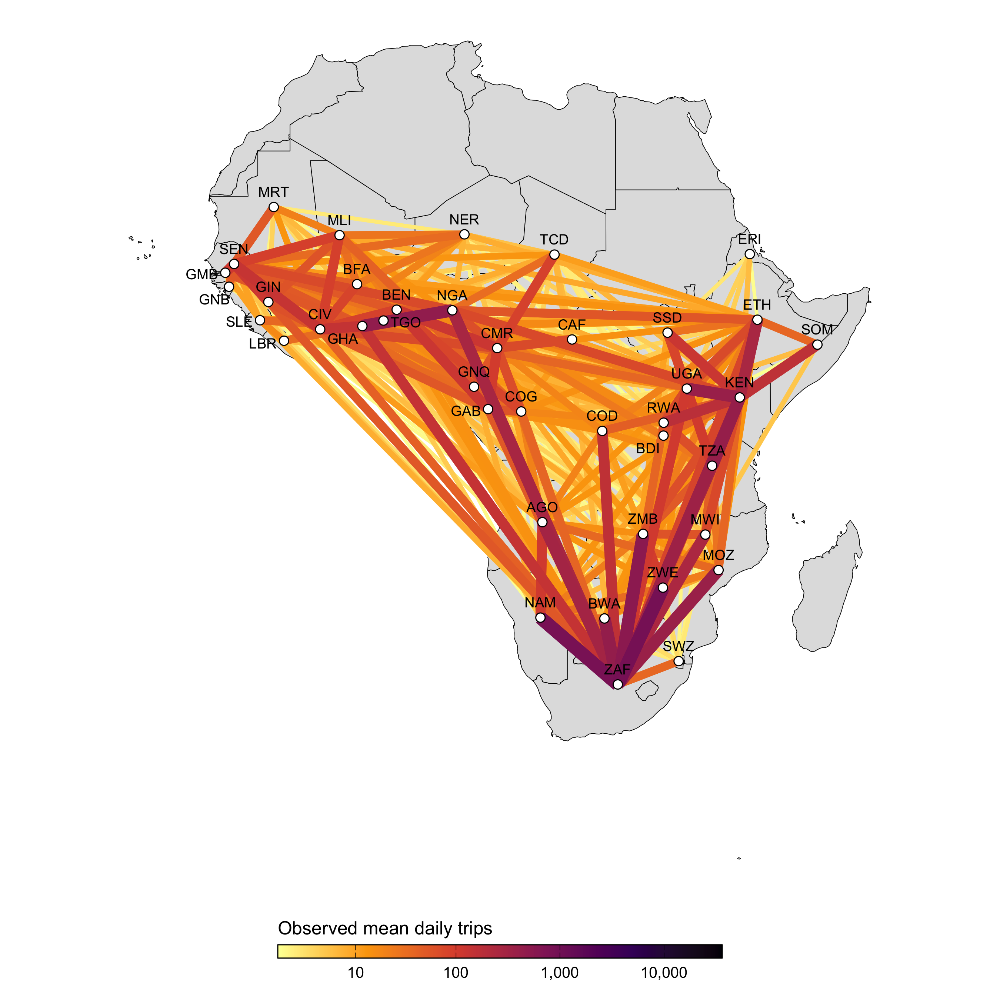
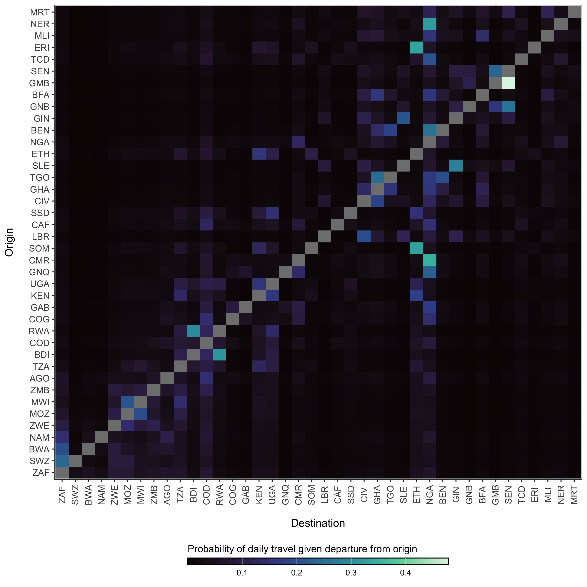

# Model description

Here we describe the methods of MOSAIC beta version 0.1. This model version provides a starting point for understanding cholera transmission in Sub-Saharan Africa, incorporating important drivers of disease dynamics such as human mobility, environmental conditions, and vaccination schedules. As MOSAIC continues to evolve, future iterations will refine model components based on available data and improved model mechanisms, which we hope will increase its applicability to real-world scenarios.

The model operates on weekly time steps from January 2023 to August 2024 and includes the 46 countries in Sub-Saharan Africa (SSA) shown in Figure \@ref(fig:map).

(\#fig:map)A map of Sub-Saharan Africa with countries that have experienced a cholera outbreak in the past 5 and 10 years highlighted in green.

## Transmission dynamics

The model has a metapopulation structure with familiar compartments for Susceptible, Infected, and Recovered individuals with SIRS dynamics. The model also contains compartments for vaccinated individuals (V) and Water & environment based transmission (W) which we refer to as SVIWRS.

(\#fig:diagram)This diagram of the SVIWRS (Susceptible-Vaccinated-Infected-Water/environmental-Recovered-Susceptible) model shows model compartments as circles with rate parameters displayed. The primary data sources the model is fit to are shown as square nodes (Vaccination data, and reported cases and deaths).

The SVIWRS metapopulation model, shown in Figure \@ref(fig:diagram), is governed by the following difference equations:

\begin{equation}
\begin{aligned}
S_{j,t+1} &= b_j N_{jt} + S_{jt} - \phi \nu_{jt} S_{jt} + \omega V_{jt} - \Lambda_{j,t+1} - \Psi_{j,t+1} + \varepsilon R_{jt} - d_j S_{jt}\\[11pt]
V_{j,t+1} &= V_{jt} + \phi \nu_{jt} S_{jt} - \omega V_{jt} - d_j V_{jt}\\[11pt]
I_{j,t+1} &= I_{jt} + \Lambda_{j,t+1} + \Psi_{j,t+1} - \gamma I_{jt} - \mu \sigma I_{jt} - d_j I_{jt}\\[11pt]
W_{j,t+1} &= W_{jt} + \zeta I_{jt} - \delta_{jt} W_{jt}\\[11pt]
R_{j,t+1} &= R_{jt} + \gamma I_{jt} - \varepsilon R_{jt} - d_j R_{jt}\\[11pt]
\end{aligned}
(\#eq:system)
\end{equation}

For descriptions of all parameters in Equation \@ref(eq:system), see Table (\@ref(tab:params)). Transmission dynamics are driven by the two force of infection terms, $\Lambda_{jt}$ and $\Psi_{jt}$. The force of infection due to human-to-human ($\Lambda_{jt}$) is:

\begin{equation}
\begin{aligned}
\Lambda_{j,t+1} &= \frac{
\beta_{jt}^{\text{hum}} \Big(\big(S_{jt}(1-\tau_{j})\big)  \big(I_{jt}(1-\tau_{j}) + \sum_{\forall i \not= j} (\pi_{ij}\tau_iI_{it}) \big)\Big)^\alpha}{N_{jt}}.\\[11pt]
\end{aligned}
(\#eq:foi-human)
\end{equation}

Where $\beta_{jt}^{\text{hum}}$ is the rate of human-to-human transmission. Movement within and among metapopulations is governed by $\tau_i$, the probability of departing origin location $i$, and $\pi_{ij}$ is the relative probability of travel from origin $i$ to destination $j$ (see section on [spatial dynamics][Spatial dynamics]). To include environmental effects, the force of infection due to environment-to-human transmission ($\Psi_{jt}$) is defined as:

\begin{equation}
\begin{aligned}
\Psi_{j,t+1} &= \frac{\beta_{jt}^{\text{env}} \big(S_{jt}(1-\tau_{j})\big) (1-\theta_j) W_{jt}}{\kappa+W_{jt}},\\[11pt]
\end{aligned}
(\#eq:foi-environment)
\end{equation}

where $\beta_{jt}^{\text{env}}$ is the rate of environment-to-human transmission and $\theta_j$ is the proportion of the population at location $j$ that at least basic access to Water, Sanitation, and Hygiene (WASH). The environmental compartment of the model is also scaled by the concentration (cells per mL) of *V. cholerae* that is required for a 50% probability of infection [Fung 2014](https://www.ncbi.nlm.nih.gov/pmc/articles/PMC3926264/). See the section on [environmental transmission][Environmental transmission] below for more on the water/environment compartment and climatic drivers of transmission.

Note that all model processes are stochastic. Transition rates are converted to probabilities with the commonly used formula $p(t) = 1-e^{-rt}$ (see Ross 2007), and then integer quantities are moved between model compartments at each time step according to a binomial process like the example below for the recovery of infected individuals ($\gamma I_{jt}$):

\begin{equation}
\frac{\partial R}{\partial t} \sim \text{Binom}(I_{jt}, 1-\exp(-\gamma))
(\#eq:stoch)
\end{equation}

## Seasonality
Cholera transmission is seasonal and is typically associated with the rainy season, so both transmission rate terms $\beta_{jt}^{\text{*}}$ are temporally forced. For human-to-human transmission we used a truncated sine-cosine form of the [Fourier series](https://en.wikipedia.org/wiki/Fourier_series) with two harmonic features which has the flexibility to capture seasonal transmission dynamics driven by extended rainy seasons and/or biannual trends:

\begin{equation}
\beta_{jt}^{\text{hum}} = \beta_{j0}^{\text{hum}} + a_1 \cos\left(\frac{2\pi t}{p}\right) + b_1 \sin\left(\frac{2\pi t}{p}\right) + a_2 \cos\left(\frac{4\pi t}{p}\right) + b_2 \sin\left(\frac{4\pi t}{p}\right)
(\#eq:beta1)
\end{equation}

Where, $\beta_{j0}^{\text{hum}}$ is the mean human-to-human transmission rate at location $j$ over all time steps. Seasonal dynamics are determined by the parameters $a_1$, $b_1$ and $a_2$, $b_2$ which gives the amplitude of the first and second waves respectively. The periodic cycle $p$ is 52, so the function controls the temporal variation in $\beta_{jt}^{\text{hum}}$ over the 52 weeks of the year. 

(\#fig:seasonal-concept)An example of the temporal distribution of the human-to-human transmission rate across each of the 52 weeks of the year given by the cosine wave function. The wave function is fitted to each country and is designed to align with the rainy season as indicated by the shaded region in this figure.

We estimated the parameters in the Fourier series ($a_1$, $b_1$, $a_2$, $b_2$) using the [Levenberg–Marquardt](https://en.wikipedia.org/wiki/Levenberg%E2%80%93Marquardt_algorithm) algorithm in the [`minpack.lm`](https://rdrr.io/cran/minpack.lm/) R library. Given the lack of reported cholera case data for many countries in SSA and the association between cholera transmission and the rainy season, we leveraged seasonal precipitation data to help fit the Fourier wave function to all countries. We first gathered weekly precipitation values from 1994 to 2024 for 30 uniformly distributed points within each country from the [Open-Meteo Historical Weather Data API](https://open-meteo.com/en/docs/historical-weather-api). Then we fit the Fourier series to the weekly precipitation data and used these parameters as the starting values when fitting the model to the more sparse cholera case data.

(\#fig:seasonal-example)Example of a grid of 30 uniformly distributed points within Mozambique (A). The scatterplot shows weekly summed precipitation values at those 30 grid points and cholera cases plotted on the same scale of the Z-Score which shows the variance around the mean in terms of the standard deviation. Fitted Fourier series fucntions are shown as blue (fit precipitation data) and red (fit to cholera case data) lines.

For countries with no reported case data, we inferred seasonal dynamics using the fitted wave function of a neighboring country with available case data. The selected neighbor was chosen from the same cluster of countries (grouped hierarchically into four clusters based on precipitation seasonality using [Ward's method](https://en.wikipedia.org/wiki/Ward%27s_method); see Figure \@ref(fig:seasonal-cluster)) that had the highest correlation in seasonal precipitation with the country lacking case data. In the rare event that no country with reported case data was found within the same seasonal cluster, we expanded the search to the 10 nearest neighbors and continued expanding by adding the next nearest neighbor until a match was found.

(\#fig:seasonal-cluster)A) Map showing the clustering of African countries based on their seasonal precipitation patterns (1994-2024). Countries are colored according to their cluster assignments, identified using hierarchical clustering. B) Fourier series fitted to weekly precipitation for each country. Each line plot shows the seasonal pattern for countries within a given cluster. Clusteres are used to infer the seasonal transmission dynamics for countries where there are no reported cholera cases.

Using the model fitting methods described above, and the cluster-based approach for inferring the seasonal Fourier series pattern in countries without reported cholera cases, we modeled the seasonal dynamics for all 41 countries in the MOSAIC framework. These dynamics are visualized in Figure \@ref(fig:seasonal-all), with the corresponding Fourier model coefficients presented in Table \@ref(tab:seasonal-table).

(\#fig:seasonal-all)Seasonal transmission patterns for all countries modeled in MOSAIC as modeled by the truncated Fourier series in Equation \@ref(eq:beta1). Blues lines give the Fourier series model fits for precipitation (1994-2024) and the red lines give models fits to reported cholera cases (2023-2024). For countries where reported case data were not available, the Fourier model was inferred by the nearest country with the most similar seasonal precipitation patterns as determined by the hierarchical clustering. Countries with inferred case data from neighboring locations are annotated in red. The X-axis represents the weeks of the year (1-52), while the Y-axis shows the Z-score of weekly precipitation and cholera cases.

<table class="table" style="font-size: 11.75px; width: auto !important; margin-left: auto; margin-right: auto;">
<caption style="font-size: initial !important;">(\#tab:seasonal-table)(\#tab:seasonal-table)Estimated coefficients for the truncated Fourier model in Equation \@ref(eq:beta1) fit to countries with reported cholera cases. Model fits are shown in Figure \@ref(fig:seasonal-all).</caption>
 <thead>
<tr>
<th style="empty-cells: hide;border-bottom:hidden;" colspan="1"></th>
<th style="border-bottom:hidden;padding-bottom:0; padding-left:3px;padding-right:3px;text-align: center; " colspan="4">
Fourier Coefficients
</th>
</tr>
  <tr>
   <th style="text-align:left;"> Country </th>
   <th style="text-align:left;"> $a_1$ </th>
   <th style="text-align:left;"> $a_2$ </th>
   <th style="text-align:left;"> $b_1$ </th>
   <th style="text-align:left;"> $b_2$ </th>
  </tr>
 </thead>
<tbody>
  <tr>
   <td style="text-align:left;"> Burundi </td>
   <td style="text-align:left;"> -0.31 (-0.35 to -0.27) </td>
   <td style="text-align:left;"> -0.49 (-0.53 to -0.45) </td>
   <td style="text-align:left;"> -0.42 (-0.45 to -0.39) </td>
   <td style="text-align:left;"> -0.36 (-0.41 to -0.31) </td>
  </tr>
  <tr>
   <td style="text-align:left;"> Cameroon </td>
   <td style="text-align:left;"> -0.64 (-0.67 to -0.62) </td>
   <td style="text-align:left;"> 0.08 (0.04 to 0.11) </td>
   <td style="text-align:left;"> 0.01 (-0.04 to 0.06) </td>
   <td style="text-align:left;"> -0.28 (-0.31 to -0.26) </td>
  </tr>
  <tr>
   <td style="text-align:left;"> DRC </td>
   <td style="text-align:left;"> 0.28 (0.26 to 0.31) </td>
   <td style="text-align:left;"> -0.22 (-0.31 to -0.13) </td>
   <td style="text-align:left;"> 0.15 (0.08 to 0.23) </td>
   <td style="text-align:left;"> -0.2 (-0.28 to -0.13) </td>
  </tr>
  <tr>
   <td style="text-align:left;"> Ethiopia </td>
   <td style="text-align:left;"> -0.52 (-0.59 to -0.46) </td>
   <td style="text-align:left;"> -0.38 (-0.41 to -0.34) </td>
   <td style="text-align:left;"> -0.04 (-0.12 to 0.03) </td>
   <td style="text-align:left;"> -0.03 (-0.13 to 0.07) </td>
  </tr>
  <tr>
   <td style="text-align:left;"> Kenya </td>
   <td style="text-align:left;"> 0.03 (-0.02 to 0.07) </td>
   <td style="text-align:left;"> -0.16 (-0.19 to -0.12) </td>
   <td style="text-align:left;"> 0.5 (0.46 to 0.53) </td>
   <td style="text-align:left;"> 0.12 (0.09 to 0.15) </td>
  </tr>
  <tr>
   <td style="text-align:left;"> Malawi </td>
   <td style="text-align:left;"> 0.51 (0.47 to 0.54) </td>
   <td style="text-align:left;"> 0.16 (0.12 to 0.2) </td>
   <td style="text-align:left;"> 0.39 (0.36 to 0.43) </td>
   <td style="text-align:left;"> 0.4 (0.37 to 0.44) </td>
  </tr>
  <tr>
   <td style="text-align:left;"> Mozambique </td>
   <td style="text-align:left;"> 0.22 (0.19 to 0.26) </td>
   <td style="text-align:left;"> -0.36 (-0.39 to -0.33) </td>
   <td style="text-align:left;"> 0.48 (0.44 to 0.53) </td>
   <td style="text-align:left;"> 0.02 (-0.04 to 0.07) </td>
  </tr>
  <tr>
   <td style="text-align:left;"> Nigeria </td>
   <td style="text-align:left;"> -0.27 (-0.3 to -0.24) </td>
   <td style="text-align:left;"> 0.22 (0.15 to 0.29) </td>
   <td style="text-align:left;"> -0.16 (-0.2 to -0.11) </td>
   <td style="text-align:left;"> 0.42 (0.38 to 0.46) </td>
  </tr>
  <tr>
   <td style="text-align:left;"> Somalia </td>
   <td style="text-align:left;"> -0.16 (-0.2 to -0.12) </td>
   <td style="text-align:left;"> -0.24 (-0.3 to -0.17) </td>
   <td style="text-align:left;"> 0.84 (0.82 to 0.86) </td>
   <td style="text-align:left;"> -0.59 (-0.61 to -0.57) </td>
  </tr>
  <tr>
   <td style="text-align:left;"> South Africa </td>
   <td style="text-align:left;"> -0.41 (-0.62 to -0.19) </td>
   <td style="text-align:left;"> 0.13 (-0.07 to 0.33) </td>
   <td style="text-align:left;"> -0.54 (-0.67 to -0.41) </td>
   <td style="text-align:left;"> 0.63 (0.54 to 0.72) </td>
  </tr>
  <tr>
   <td style="text-align:left;"> Tanzania </td>
   <td style="text-align:left;"> 0.03 (0 to 0.06) </td>
   <td style="text-align:left;"> -0.06 (-0.12 to -0.01) </td>
   <td style="text-align:left;"> 0.09 (0.06 to 0.12) </td>
   <td style="text-align:left;"> 0.23 (0.2 to 0.26) </td>
  </tr>
  <tr>
   <td style="text-align:left;"> Togo </td>
   <td style="text-align:left;"> -0.17 (-0.45 to 0.12) </td>
   <td style="text-align:left;"> -0.28 (-0.43 to -0.13) </td>
   <td style="text-align:left;"> -0.63 (-0.72 to -0.54) </td>
   <td style="text-align:left;"> 0.28 (0.06 to 0.51) </td>
  </tr>
  <tr>
   <td style="text-align:left;"> Uganda </td>
   <td style="text-align:left;"> -0.79 (-0.9 to -0.69) </td>
   <td style="text-align:left;"> 0.39 (0.32 to 0.46) </td>
   <td style="text-align:left;"> 0.12 (-0.07 to 0.31) </td>
   <td style="text-align:left;"> 0.04 (-0.16 to 0.23) </td>
  </tr>
  <tr>
   <td style="text-align:left;"> Zambia </td>
   <td style="text-align:left;"> 0.69 (0.63 to 0.74) </td>
   <td style="text-align:left;"> 0.43 (0.39 to 0.46) </td>
   <td style="text-align:left;"> 0.23 (0.18 to 0.28) </td>
   <td style="text-align:left;"> 0.2 (0.14 to 0.26) </td>
  </tr>
  <tr>
   <td style="text-align:left;"> Zimbabwe </td>
   <td style="text-align:left;"> 1.12 (1.08 to 1.17) </td>
   <td style="text-align:left;"> 0.51 (0.48 to 0.53) </td>
   <td style="text-align:left;"> 0.3 (0.24 to 0.35) </td>
   <td style="text-align:left;"> -0.08 (-0.13 to -0.03) </td>
  </tr>
</tbody>
</table>

## Environmental transmission

Environmental transmission is a critical factor in cholera spread and consists of several key components: the rate at which infected individuals shed *V. cholerae* into the environment, the pathogen's survival rate in environmental conditions, and the overall suitability of the environment for sustaining the bacteria over time.

### Climate-driven transmission

To capture the impacts of climate-drivers on cholera transmission, we have included the parameter $\psi_{jt}$, which represents the current state of environmental suitability with respect to: *i*) the survival time of *V. cholerae* in the environment and, *ii*) the rate of environment-to-human transmission which contributes to the overall force of infection. 

\begin{equation}
\beta_{jt}^{\text{env}} = \beta_{j0}^{\text{env}} \Bigg(1 + \frac{\psi_{jt}-\bar\psi_j}{\bar\psi_j} \Bigg) \quad \text{and} \quad \bar\psi_j = \frac{1}{T} \sum_{t=1}^{T} \psi_{jt}
(\#eq:beta2)
\end{equation}

This formulation effectively scales the base environmental transmission rate $\beta_{jt}^{\text{env}}$ so that it varies over time according to the climatically driven model of suitability. Note that, unlike the the cosine wave function of $\beta_{jt}^{\text{hum}}$, this temporal term can increase or decrease over time following multi-annual cycles.

[Fig: Example temporal forcing of environment-to-human transmission]

Environmental suitability ($\psi_{jt}$) also impacts the survival rate of *V. cholerae* in the environment ($\delta_{jt}$) with the form:

\begin{equation}
\delta_{jt} = \delta_{\text{min}} + \psi_{jt} \times (\delta_{\text{max}} - \delta_{\text{min}})
(\#eq:delta)
\end{equation}

which normalizes the variance of the suitability parameter to be bounded within the minimum ($\delta_{\text{min}}$) and maximum ($\delta_{\text{max}}$) survival times of *V. cholerae*.

(\#fig:unnamed-chunk-2)Relationship between environmental suitability ($\psi_{jt}$) and the rate of *V. cholerae* decay in the environment ($\delta_j$). The green line shows the mildest penalty on *V. cholerae* survival, where survival in the environment is $1/\delta_{\text{min}}$ = 3 days when suitability = 0 and $1/\delta_{\text{max}}$ = 90 days when suitability = 1.

### Modeling suitability

The environmental suitability ($\psi_{jt}$) of *V. cholerae* is modeled as a time series for each location, using covariates that include environmental factors, past and present climate measures, severe weather events, and large-scale regional climate drivers. Most of these factors are influenced by climate change, so we will source data that projects each covariate into the future under different climate change scenarios. Environmental suitability, $\psi_{jt}$, is generally defined as:

$$
\psi_{jt} = f(\text{temperature, precipitation, humidity, wind speed, soil moisture})
$$

The function $f(\cdot)$ can be modeled using various approaches, including Generalized Linear Models (GLMs), Generalized Additive Models (GAMs), Boosted Regression Trees (BRTs), or machine learning methods such as Recurrent Neural Networks (RNNs) or Long Short-Term Memory Networks (LSTMs). A simpler approach might involve Bayesian variable selection using the `BAS` R package. The model will be fitted to all available data, with projections of suitability for each location. Implementing a rolling-window validation across the time series would help assess model performance. The model can be directly fitted to reported case counts or converted to a binary threshold, depending on the analysis needs. The primary goal is to explain a portion of the variance in reported case counts as a proxy for environmental suitability.

Covariates will include both historical climate variables and those predicted under climate change scenarios. For example, the [MRI-AGCM3-2-S](https://www.wdc-climate.de/ui/cmip6?input=CMIP6.HighResMIP.MRI.MRI-AGCM3-2-S.highresSST-present) and [EC_Earth3P_HR](https://www.wdc-climate.de/ui/cmip6?input=CMIP6.HighResMIP.EC-Earth-Consortium.EC-Earth3P-HR) models provide weather variables at ~20km resolution, including temperature, relative humidity, wind, precipitation, solar radiation, cloud cover, and soil moisture. These covariates should have time-lagged or short-term cumulative versions. The initial version of the model will likely use data from the [OpenMeteo Historical Weather Data API](https://open-meteo.com/en/docs/historical-weather-api). Additional data sources will be integrated into subsequent versions of the suitability model. For instance, flood and cyclone data will be incorporated later, though not in the initial version of the model. We will also seek data on ENSO (El Niño, Neutral, La Niña) and the Indian Ocean sea surface temperature index. Open-source projections of these variables into the near future (months to a year or two) will likely be available.

### Shedding

The rate at which infected individuals shed *V. cholerae* into the environment ($\zeta$) is a critical factor influencing cholera transmission. Shedding rates can vary widely depending on the severity of the infection, the immune response of the individual, and environmental factors. According to [Fung 2014](https://www.ncbi.nlm.nih.gov/pmc/articles/PMC3926264/), the shedding rate is estimated to range from 0.01 to 10 cells per mL per person per day.

Further studies support these findings, indicating that shedding rates can indeed fluctuate significantly. For instance, [Nelson et al (2009)](https://www.ncbi.nlm.nih.gov/pmc/articles/PMC3842031/) note that during the, depending on the phase of infection, individuals can shed $10^3$ (asymptomatic cases) to $10^12$ (severe cases) *V. cholerae* cells per gram of stool. Future version of the model may attempt to capture the nuances of shedding dynamics, but here we make the simplifying assumption that shedding is constant across infected individuals and has a wide range of variability with no prior distributional assumptions:

$$
\zeta \sim \text{Uniform}(0.01, 10).
$$

### WAter, Sanitation, and Hygiene (WASH) 

Since *V. cholerae* is transmitted through fecal contamination of water and other consumables, the level of exposure to contaminated substrates significantly impacts transmission rates. Interventions involving Water, Sanitation, and Hygiene (WASH) have long been a first line of defense in reducing cholera transmission, and in this context, WASH variables can serve as proxy for the rate of contact with environmental risk factors. In the MOSAIC model, WASH variables are incorporated mechanistically, allowing for intervention scenarios that include changes to WASH. However, it is necessary to distill available WASH variables into a single parameter that represents the WASH-determined contact rate with contaminated substrates for each location $j$, which we define as $\theta_j$.

To parameterize $\theta_j$, we calculated a weighted mean of the 8 WASH variables in [Sikder et al 2023](https://doi.org/10.1021/acs.est.3c01317) and originally modeled by the [Local Burden of Disease WaSH Collaborators 2020](https://www.thelancet.com/journals/langlo/article/PIIS2214-109X(20)30278-3/fulltext). The 8 WASH variables (listed in Table \@ref(tab:wash-weights)) provide population-weighted measures of the proportion of the population that either: *i*) have access to WASH resources (e.g., piped water, septic or sewer sanitation), or *ii*) are exposed to risk factors (e.g. surface water, open defecation). For risk associated WASH variables, we used the complement ($1-\text{value}$) to give the proportion of the population *not* exposed to each risk factor. We used the [`optim`](https://www.rdocumentation.org/packages/stats/versions/3.6.2/topics/optim) function in R and the [L-BFGS-B](https://en.wikipedia.org/wiki/Limited-memory_BFGS) algorithm to estimate the set of optimal weights (Table \@ref(tab:wash-weights)) that maximize the correlation between the weighted mean of the 8 WASH variables and reported cholera incidence per 1000 population across 40 SSA countries from 2000 to 2016. The optimal weighted mean had a correlation coefficient of $r =$ -0.33 (-0.51 to -0.09 95% CI) which was higher than the basic mean and all correlations provided by the individual WASH variables (see Figure \@ref(fig:wash-incidence)). The weighted mean then provides a single variable between 0 and 1 that represents the overall proportion of the population that has access to WASH and/or is not exposed to environmental risk factors. Thus, the WASH-mediated contact rate with sources of environmental transmission is represented as ($1-\theta_j$) in the environment-to-human force of infection ($\Psi_{jt}$). Values of $\theta_j$ for all countries are shown in Figure \@ref(fig:wash-country).

<table class="table table-striped table-hover table-condensed" style="width: auto !important; margin-left: auto; margin-right: auto;">
<caption>(\#tab:wash-weights)(\#tab:wash-weights)Table of optimized weights used to calculate the single mean WASH index for all countries.</caption>
 <thead>
  <tr>
   <th style="text-align:left;"> WASH variable </th>
   <th style="text-align:right;"> Optimized weight </th>
  </tr>
 </thead>
<tbody>
  <tr>
   <td style="text-align:left;"> Piped Water </td>
   <td style="text-align:right;"> 0.356 </td>
  </tr>
  <tr>
   <td style="text-align:left;"> Septic or Sewer Sanitation </td>
   <td style="text-align:right;"> 0.014 </td>
  </tr>
  <tr>
   <td style="text-align:left;"> Other Improved Water </td>
   <td style="text-align:right;"> 0.000 </td>
  </tr>
  <tr>
   <td style="text-align:left;"> Other Improved Sanitation </td>
   <td style="text-align:right;"> 0.000 </td>
  </tr>
  <tr>
   <td style="text-align:left;"> Surface Water </td>
   <td style="text-align:right;"> 0.504 </td>
  </tr>
  <tr>
   <td style="text-align:left;"> Unimproved Sanitation </td>
   <td style="text-align:right;"> 0.000 </td>
  </tr>
  <tr>
   <td style="text-align:left;"> Unimproved Water </td>
   <td style="text-align:right;"> 0.000 </td>
  </tr>
  <tr>
   <td style="text-align:left;"> Open Defecation </td>
   <td style="text-align:right;"> 0.126 </td>
  </tr>
</tbody>
</table>

(\#fig:wash-incidence)Relationship between WASH variables and cholera incidences.

(\#fig:wash-country)The optimized weighted mean of WASH variables for AFRO countries

## Immune dynamics

### Immunity from vaccination
The impacts of Oral Cholera Vaccine (OCV) campaigns is incorporated into the model through the Vaccinated compartment (V). The rate that individuals are effectively vaccinated is defined as $\phi\nu_tS_{jt}$, where $S_{jt}$ are the available number of susceptible individuals in location $j$ at time $t$, $\nu_t$ is the number of OCV doses administered at time $t$ and $\phi$ is the estimated vaccine effectiveness. Note that there is just one vaccinated compartment at this time, though future model versions may include $V_1$ an $V_2$ compartments to explore two dose vaccination strategies or to emulate more complex waning patterns.

The vaccination rate $\nu_t$ is not an estimated quantity. Rather, it is directly defined by the reported number of OCV doses administered on the WHO OCV dashboard here: [https://www.who.int/groups/icg/cholera](https://www.who.int/groups/icg/cholera).

$$
\nu_t := \text{Reported rate of OCV administration}         
$$

The evidence for waning immunity comes from 4 cohort studies (Table \@ref(tab:effectiveness-papers)) from Bangladesh ([Qadri et al 2016](https://www.nejm.org/doi/full/10.1056/NEJMoa1510330) and [2018](https://www.thelancet.com/journals/laninf/article/PIIS1473-3099(18)30108-7/fulltext)), South Sudan ([Azman et al 2016](https://www.thelancet.com/journals/langlo/article/PIIS2214-109X(16)30211-X/fulltext)), and Democratic Republic of Congo ([Malembaka et al 2024](https://www.thelancet.com/journals/laninf/article/PIIS1473-3099(23)00742-9/fulltext)). 

Table: (\#tab:effectiveness-papers)Summary of Effectiveness Data

| Effectiveness| Upper CI| Lower CI| Day (midpoint)| Day (min)| Day (max)|Source                 |
|-------------:|--------:|--------:|--------------:|---------:|---------:|:----------------------|
|          60.0|    0.873|    0.990|          0.702|        NA|        NA|Azman et al (2016)     |
|          93.5|    0.400|    0.600|          0.110|         7|       180|Qadri et al (2016)     |
|         368.5|    0.390|    0.520|          0.230|         7|       730|Qadri et al (2018)     |
|         435.0|    0.527|    0.674|          0.314|       360|       510|Malembaka et al (2024) |
|         900.0|    0.447|    0.594|          0.248|       720|      1080|Malembaka et al (2024) |

We estimated vaccine effectiveness and waning immunity by fitting an exponential decay model to the reported effectiveness of one dose OCV in these studies using the following formulation:

\begin{equation} 
\text{Proportion immune}\ t \ \text{days after vaccination} = \phi \times (1 - \omega) ^ {t-t_{\text{vaccination}}}
(\#eq:omega)
\end{equation}

Where $\phi$ is the effectiveness of one dose OCV, and the based on this specification, it is also the initial proportion immune directly after vaccination. The decay rate parameter $\omega$ is the rate at which initial vaccine derived immunity decays per day post vaccination, and $t$ and $t_{\text{vaccination}}$ are the time (in days) the function is evaluated at and the time of vaccination respectively. When we fitted the model to the data from the cohort studies shown in Table (\@ref(tab:effectiveness-papers)) we found that $\omega = 0.00057$ ($0-0.0019$ 95% CI), which gives a mean estimate of 4.8 years for vaccine derived immune duration with unreasonably large confidence intervals (1.4 years to infinite immunity). However, the point estimate of 4.8 years is consistent with anecdotes that one dose OCV is effective for up to at least 3 years.

The wide confidence intervals are likely due to the wide range of reported estimates for proportion immune after a short duration in the 7--90 days range ([Azman et al 2016](https://www.thelancet.com/journals/langlo/article/PIIS2214-109X(16)30211-X/fulltext) and [Qadri et al 2016](https://www.nejm.org/doi/full/10.1056/NEJMoa1510330)). Therefore, we chose to use the point estimate of $\omega$ and incorporate uncertainty based on the initial proportion immune (i.e. vaccine effectiveness $\phi$) shortly after vaccination. Using the decay model in Equation \@ref(eq:omega) we estimated $\phi$ to be $0.64$ ($0.32-0.96$ 95% CI). We then fit a Beta distribution to the quantiles of $\phi$ by minimizing the sums of squares using the Nelder-Mead optimization algorithm to render the following distribution (shown in Figure \@ref(fig:effectiveness)B):

\begin{equation} 
\phi \sim \text{Beta}(4.57, 2.41).
(\#eq:effectiveness)
\end{equation}

(\#fig:effectiveness)This is vaccine effectiveness

### Immunity from natural infection

The duration of immunity after a natural infection is likely to be longer lasting than that from vaccination with OCV (especially given the current one dose strategy). As in most SIR-type models, the rate at which individuals leave the Recovered compartment is governed by the immune decay parameter $\varepsilon$. We estimated the durability of immunity from natural infection based on two cohort studies and fit the following exponential decay model to estimate the rate of immunity decay over time:

$$
\text{Proportion immune}\ t \ \text{days after infection} = 0.99 \times (1 - \varepsilon) ^ {t-t_{\text{infection}}}
$$
Where we make the necessary and simplifying assumption that within 0--90 days after natural infection with *V. cholerae*, individuals are 95--99% immune. We fit this model to reported data from [Ali et al (2011)](https://doi.org/10.1093/infdis/jir416) and [Clemens et al (1991)](https://www.sciencedirect.com/science/article/pii/0140673691902076) (see Table \@ref(tab:immunity-sources)).

Table: (\#tab:immunity-sources)Sources for the duration of immunity fro natural infection.

|  Day| Effectiveness| Upper CI| Lower CI|Source               |
|----:|-------------:|--------:|--------:|:--------------------|
|   90|          0.95|     0.95|     0.95|Assumption           |
| 1080|          0.65|     0.81|     0.37|[Ali et al (2011)](https://doi.org/10.1093/infdis/jir416)|
| 1260|          0.61|     0.81|     0.21|[Clemens et al (1991)](https://www.sciencedirect.com/science/article/pii/0140673691902076)|

We estimated the mean immune decay to be $\bar\varepsilon = 3.9 \times 10^{-4}$ ($1.7 \times 10^{-4}-1.03 \times 10^{-3}$ 95% CI) which is equivalent to an immune duration of $7.21$ years ($2.66-16.1$ years 95% CI) as shown in Figure \@ref(fig:immune-decay)A. This is slightly longer than previous modeling work estimating the duration of immunity to be ~5 years ([King et al 2008](https://www.nature.com/articles/nature07084)). Uncertainty around $\varepsilon$ in the model is then represented by a Log-Normal distribution as shown in Figure \@ref(fig:immune-decay)B:

$$
\varepsilon \sim \text{Lognormal}(\bar\varepsilon+\frac{\sigma^2}{2}, 0.25)
$$

(\#fig:immune-decay)The duration of immunity after natural infection with *V. cholerae*.

## Spatial dynamics

The parameters in the model diagram in Figure \@ref(fig:diagram) that have a $jt$ subscript denote the spatial structure of the model. Each country is modeled as an independent metapopulation that is connected to all others via the spatial force of infection $\Lambda_{jt}$ which moves contagion among metapopulations according to the connectivity provided by parameters $\tau_i$ (the probability departure) and $\pi_{ij}$ (the probability of diffusion to destination $j$). Both parameters are estimated using the departure-diffusion model below which is fitted to average weekly air traffic volume between all of the 41 countries included in the MOSAIC framework (Figure \@ref(fig:mobility-data)).

(\#fig:mobility-data)The average number of air passengers per week in 2017 among all countries.

(\#fig:mobility-network)A network map showing the average number of air passengers per week in 2017.

### Human mobility model

The departure-diffusion model estimates diagonal and off-diagonal elements in the mobility matrix ($M$) separately and combines them using conditional probability rules. The model first estimates the probability of travel outside the origin location $i$---the departure process---and then the distribution of travel from the origin location $i$ by normalizing connectivity values across all $j$ destinations---the diffusion process. The values of $\pi_{ij}$ sum to unity along each row, but the diagonal is not included, indicating that this is a relative quantity. That is to say, $\pi_{ij}$ gives the probability of going from $i$ to $j$ given that travel outside origin $i$ occurs. Therefore, we can use basic conditional probability rules to define the travel routes in the diagonal elements (trips made within the origin $i$) as
$$
\Pr( \neg \text{depart}_i ) =  1 - \tau_i
$$
and the off-diagonal elements (trips made outside origin $i$) as
$$
\Pr( \text{depart}_i, \text{diffuse}_{i \rightarrow j}) = \Pr( \text{diffuse}_{i \rightarrow j} \mid \text{depart}_i ) \Pr(\text{depart}_i ) = \pi_{ij} \tau_i.
$$
The expected mean number of trips for route $i \rightarrow j$ is then:

\begin{equation}
M_{ij} = 
\begin{cases}
\theta N_i (1-\tau_i) \ & \text{if} \ i = j \\
\theta N_i \tau_i \pi_{ij} \ & \text{if} \ i \ne j.
\end{cases}
(\#eq:M)
\end{equation}

Where, $\theta$ is a proportionality constant representing the overall number of trips per person in an origin population of size $N_i$, $\tau_i$ is the probability of leaving origin $i$, and $\pi_{ij}$ is the probability of travel to destination $j$ given that travel outside origin $i$ occurs.

### Estimating the departure process
The probability of travel outside the origin is estimated for each location $i$ to give the location-specific departure probability $\tau_i$.
$$
\tau_i \sim \text{Beta}(1+s, 1+r)
$$
Binomial probabilities for each origin $\tau_i$ are drawn from a Beta distributed prior with shape ($s$) and rate ($r$) parameters.
$$
\begin{aligned}
s &\sim \text{Gamma}(0.01, 0.01)\\
r &\sim \text{Gamma}(0.01, 0.01)
\end{aligned}
$$  

### Estimating the diffusion process
We use a normalized formulation of the power law gravity model to defined the diffusion process, the probability of travelling to destination $j$ given travel outside origin $i$ ($\pi_{ij}$) which is defined as:

\begin{equation}
\pi_{ij} = \frac{
N_j^\omega d_{ij}^{-\gamma}
}{
\sum\limits_{\forall j \ne i} N_j^\omega d_{ij}^{-\gamma}
}
(\#eq:gravity)
\end{equation}

Where, $\omega$ scales the attractive force of each $j$ destination based on its population size $N_j$. The kernel function $d_{ij}^{-\gamma}$ serves as a penalty on the proportion of travel from $i$ to $j$ based on distance. Prior distributions of diffusion model parameters are defined as:
$$
\begin{aligned}
\omega &\sim \text{Gamma}(1, 1)\\
\gamma &\sim \text{Gamma}(1, 1)
\end{aligned} 
$$

The models for $\tau_i$ and $\pi_{ij}$ were fitted to air traffic data from [OAG](https://www.oag.com/flight-data-sets) using the `mobility` R package ([Giles 2020](https://covid-19-mobility-data-network.github.io/mobility/)). Estimates for mobility model parameters are shown in Figures \@ref(fig:mobility-departure) and \@ref(fig:mobility-diffusion).

(\#fig:mobility-departure)The estimated weekly probability of travel outside of each origin location $\tau_i$ and 95% confidence intervals is shown in panel A with the population mean indicated as a red dashed line. Panel B shows the estimated total number of travelers leaving origin $i$ each week.

(\#fig:mobility-diffusion)The diffusion process $\pi_{ij}$ which gives the estimated probability of travel from origin $i$ to destination $j$ given that travel outside of origin $i$ has occurred.

### The probability of spatial transmission

The likelihood of introductions of cholera from disparate locations is a major concern during cholera outbreaks. However, this can be difficult to characterize given the endemic dynamics and patterns of human movement. We include a few measures of spatial heterogeneity here and the first is a simple importation probability based on connectivity and the possibility of incoming infections. The basic probability of transmission from an origin $i$ to a particular destination $j$ and time $t$ is defined as:

\begin{equation} 
p(i,j,t) = 1 - e^{-\beta_{jt}^{\text{hum}} (((1-\tau_j)S_{jt})/N_{jt}) \pi_{ij}\tau_iI_{it}}
(\#eq:prob)
\end{equation}

### The spatial hazard
Although we are more concerned with endemic dynamics here, there are likely to be periods of time early in the rainy season where cholera cases and the rate of transmission is low enough for spatial spread to resemble epidemic dynamics for a time. During such times periods, we can estimate the arrival time of contagion for any location where cases are yet to be reported. We do this be estimating the spatial hazard of transmission:

\begin{equation} 
h(j,t) = \frac{
\beta_{jt}^{\text{hum}} \Big(1 - \exp\big(-((1-\tau_j)S_{jt}/N_{jt}) \sum_{\forall i \not= j} \pi_{ij}\tau_i (I_{it}/N_{it}) \big) \Big)
}{
1/\big(1 + \beta_{jt}^{\text{hum}} (1-\tau_j)S_{jt}\big)
}.
(\#eq:hazard)
\end{equation}

And then normalizing to give the waiting time distribution for all locations:

\begin{equation} 
w(j,t) = h(j,T) \prod_{t=1}^{T-1}1-h(j,t).
(\#eq:waiting)
\end{equation}

### Coupling among locations

Another measure of spatial heterogeneity is to quantify the coupling of disease dynamics among metapopulations using a correlation coefficient. Here, we use the definition of spatial correlation between locations $i$ and $j$ as $C_{ij}$ described in [Keeling and Rohani (2002)](https://onlinelibrary.wiley.com/doi/abs/10.1046/j.1461-0248.2002.00268.x), which gives a measure of how similar infection dynamics are between locations.

\begin{equation} 
C_{ij} = \frac{
( y_{it} - \bar{y}_i )( y_{jt} - \bar{y}_j )
}{
\sqrt{\text{var}(y_i) \text{var}(y_j)}
}
(\#eq:correlation)
\end{equation}
Where $y_{it} = I_{it}/N_i$ and $y_{jt} = I_{jt}/N_j$. Mean prevalence in each location is $\bar{y_i} = \frac{1}{T} \sum_{t=1}^{T} y_{it}$ and $\bar{y_j} = \frac{1}{T} \sum_{t=1}^{T} y_{jt}$.

## The observation process

### Rate of symptomatic infection

The presentation of infection with *V. cholerae* can be extremely variable. The severity of infection depends many factors such as the amount of the infectious dose, the age of the host, the level of immunity of the host either through vaccination or previous infection, and naivety to the particular strain of *V. cholerae*. Additional circumstantial factors such as nutritional status and overall pathogen burden may also impact infection severity. At the population level, the observed proportion of infections that are symptomatic is also dependent on the endemicity of cholera in the region. Highly endemic areas (e.g. parts of Bangladesh; [Hegde et al 2024](https://www.nature.com/articles/s41591-024-02810-4)) may have a very low proportion of symptomatic infections due to many previous exposures. Inversely, populations that are largely naive to *V. cholerae* will exhibit a relatively higher proportion of symptomatic infections (e.g. Haiti; [Finger et al 2024](https://www.ncbi.nlm.nih.gov/pmc/articles/PMC10635253/)).

Accounting for all of these nuances in the first version of this model not possible, but we can past studies do contain some information that can help to set some sensible bounds on our definition for the proportion of infections that are symptomatic ($\sigma$). So we have compiled a short list of studies that have done sero-surveys and cohort studies to assess the likelihood of symptomatic infections in different locations and displayed those results in Table (\@ref(tab:symptomatic-table)).  

To provide a reasonably informed prior for the proportion of infections that are symptomatic, we calculated the combine mean and confidence intervals of all studies in Table \@ref(tab:symptomatic-table) and fit a Beta distribution that corresponds to these quantiles using least-squares and a Nelder-Mead algorithm. The resulting prior distribution for the symptomatic proportion $\sigma$ is:

\begin{equation}
\sigma \sim \text{Beta}(4.30, 13.51)
\end{equation}

Table: (\#tab:symptomatic-table)Summary of Studies on Cholera Immunity

|  Mean| Low CI| High CI|Location        |Source                 |Note                                             |
|-----:|------:|-------:|:---------------|:----------------------|:------------------------------------------------|
| 0.570|     NA|      NA|NA              |[Nelson et al (2009)](https://www.ncbi.nlm.nih.gov/pmc/articles/PMC3842031/)|Review                                           |
|    NA|  1.000|   0.250|NA              |[Lueng & Matrajt (2021)](https://journals.plos.org/plosntds/article?id=10.1371/journal.pntd.0009383)|Review                                           |
|    NA|  0.600|   0.200|Endemic regions |[Harris et al (2012)](https://www.sciencedirect.com/science/article/pii/S014067361260436X)|Review                                           |
| 0.238|  0.250|   0.227|Haiti           |[Finger et al (2024)](https://www.ncbi.nlm.nih.gov/pmc/articles/PMC10635253/)|Sero-survey and clinical data                    |
| 0.213|  0.231|   0.194|Haiti           |[Jackson et al (2013)](https://www.ajtmh.org/view/journals/tpmd/89/4/article-p654.xml)|Cross-sectional sero-survey                      |
| 0.204|     NA|      NA|Pakistan        |[Bart et al (1970)](https://doi.org/10.1093/infdis/121.Supplement.S17)|Sero-survey during epidemic; El Tor Ogawa strain |
| 0.371|     NA|      NA|Pakistan        |[Bart et al (1970)](https://doi.org/10.1093/infdis/121.Supplement.S17)|Sero-survey during epidemic; Inaba strain        |
| 0.184|  0.256|   0.112|Bangladesh      |[Harris et al (2008)](https://journals.plos.org/plosntds/article?id=10.1371/journal.pntd.0000221)|Household cohort; mean of all age groups         |
| 0.001|  0.000|   0.001|Bangladesh      |[Hegde et al (2024)](https://www.nature.com/articles/s41591-024-02810-4)|Sero-survey and clinical data                    |

The prior distribution for $\sigma$ is plotted in Figure \@ref(fig:symptomatic-fig)A with the reported values of the proportion symptomatic from previous studies shown in \@ref(fig:symptomatic-fig)B.

(\#fig:symptomatic-fig)Proportion of infections that are symptomatic.

### Suspected cases
The clinical presentation of diarrheal diseases is often similar across various pathogens, which can lead to systematic biases in the reported number of cholera cases. It is anticipated that the number of suspected cholera cases is related to the actual number of infections by a factor of \(1/\rho\), where \(\rho\) represents the proportion of suspected cases that are true infections. To adjust for this bias, we use estimates from the meta-analysis by [Weins et al. (2023)](https://journals.plos.org/plosmedicine/article?id=10.1371/journal.pmed.1004286), which suggests that suspected cholera cases outnumber true infections by approximately 2 to 1, with a mean across studies indicating that 52% (24-80% 95% CI) of suspected cases are actual cholera infections. A higher estimate was reported for ourbreak settings (78%, 40-99% 95% CI). To account for the variability in this estimate, we fit a Beta distribution to the reported quantiles using a least squares approach and the Nelder-Mead algorithm, resulting in the prior distribution shown in Figure \@ref(fig:rho)B:

\begin{equation}
\rho \sim \text{Beta}(4.79, 1.53).
\end{equation}

(\#fig:rho)Proportion of suspected cholera cases that are true infections. Panel A shows the 'low' assumption which estimates across all settings: $\rho \sim \text{Beta}(5.43, 5.01)$. Panel B shows the 'high' assumption where the estimate reflects high-quality studies during outbreaks: $\rho \sim \text{Beta}(4.79, 1.53)$

### Case fatality rate

The Case Fatality Rate (CFR) among symptomatic infections was calculated using reported cases and deaths data from January 2021 to August 2024. The data were collated from various issues of the WHO Weekly Epidemiological Record the Global Cholera and Acute Watery Diarrhea (AWD) Dashboard (see Data section) which provide annual aggregations of reported cholera cases and deaths. We then used the Binomial exact test ([`binom.test`](https://www.rdocumentation.org/packages/stats/versions/3.6.2/topics/binom.test) in R) to calculate the mean probability for the number of deaths (successes) given the number of reported cases (sample size), and the [Clopper-Pearson method](https://en.wikipedia.org/wiki/Binomial_proportion_confidence_interval#Clopper%E2%80%93Pearson_interval) for calculating the binomial confidence intervals. We then fit Beta distributions to the mean CFR and 95% confidence intervals calculated for each country using least squares and the Nelder-Mead algorithm to give the distributional uncertainty around the CFR estimate for each country ($\mu_j$).

$$
\mu_j \sim \text{Beta}(s_{1,j}, s_{2,j})
$$

Where $s_{1,i}$ and $s_{2,j}$ are the two positive shape parameters of the Beta distribution estimated for destination $j$. By definition $\mu_j$ is the CFR for reported cases which are a subset of the total number of infections. Therefore, to infer the total number of deaths attributable to cholera infection, we assume that the CFR of observed cases is proportionally equivalent to the CFR of all cases and then calculate total deaths $D$ as follows:

\begin{equation}
\begin{aligned}
\text{CFR}_{\text{observed}} &= \text{CFR}_{\text{total}}\\
\\[3pt]
\frac{[\text{observed deaths}]}{[\text{observed cases}]} &= 
\frac{[\text{total deaths}]}{[\text{all infections}]}\\
\\[3pt]
\text{total deaths} &= \frac{[\text{observed deaths}] \times [\text{true infections}]}{[\text{observed cases}]}\\
\\[3pt]
D_{jt} &= \frac{ [\sigma\rho\mu_j I_{jt}] \times [I_{jt}] }{ [\sigma\rho I_{jt}] }
\end{aligned}
\end{equation}

<table class="table table-hover table-condensed" style="width: auto !important; margin-left: auto; margin-right: auto;">
<caption>(\#tab:cfr)(\#tab:cfr)CFR Values and Beta Shape Parameters for AFRO Countries</caption>
 <thead>
  <tr>
   <th style="text-align:left;"> Country </th>
   <th style="text-align:right;"> Cases (2014-2024) </th>
   <th style="text-align:right;"> Deaths (2014-2024) </th>
   <th style="text-align:right;"> CFR </th>
   <th style="text-align:right;"> CFR Lower </th>
   <th style="text-align:right;"> CFR Upper </th>
   <th style="text-align:right;"> Beta Shape1 </th>
   <th style="text-align:right;"> Beta Shape2 </th>
  </tr>
 </thead>
<tbody>
  <tr>
   <td style="text-align:left;"> AFRO Region </td>
   <td style="text-align:right;"> 1219386 </td>
   <td style="text-align:right;"> 23215 </td>
   <td style="text-align:right;"> 0.019 </td>
   <td style="text-align:right;"> 0.019 </td>
   <td style="text-align:right;"> 0.019 </td>
   <td style="text-align:right;"> 0.008 </td>
   <td style="text-align:right;"> 1.914 </td>
  </tr>
  <tr>
   <td style="text-align:left;"> Angola </td>
   <td style="text-align:right;"> 2665 </td>
   <td style="text-align:right;"> 74 </td>
   <td style="text-align:right;"> 0.028 </td>
   <td style="text-align:right;"> 0.022 </td>
   <td style="text-align:right;"> 0.035 </td>
   <td style="text-align:right;"> 0.010 </td>
   <td style="text-align:right;"> 1.918 </td>
  </tr>
  <tr>
   <td style="text-align:left;"> Burundi </td>
   <td style="text-align:right;"> 5553 </td>
   <td style="text-align:right;"> 41 </td>
   <td style="text-align:right;"> 0.007 </td>
   <td style="text-align:right;"> 0.005 </td>
   <td style="text-align:right;"> 0.010 </td>
   <td style="text-align:right;"> 0.007 </td>
   <td style="text-align:right;"> 1.908 </td>
  </tr>
  <tr>
   <td style="text-align:left;"> Benin </td>
   <td style="text-align:right;"> 3617 </td>
   <td style="text-align:right;"> 56 </td>
   <td style="text-align:right;"> 0.015 </td>
   <td style="text-align:right;"> 0.012 </td>
   <td style="text-align:right;"> 0.020 </td>
   <td style="text-align:right;"> 0.008 </td>
   <td style="text-align:right;"> 1.906 </td>
  </tr>
  <tr>
   <td style="text-align:left;"> Burkina Faso </td>
   <td style="text-align:right;"> 7 </td>
   <td style="text-align:right;"> 0 </td>
   <td style="text-align:right;"> 0.019 </td>
   <td style="text-align:right;"> 0.019 </td>
   <td style="text-align:right;"> 0.019 </td>
   <td style="text-align:right;"> 0.008 </td>
   <td style="text-align:right;"> 1.914 </td>
  </tr>
  <tr>
   <td style="text-align:left;"> Cote d'Ivoire </td>
   <td style="text-align:right;"> 446 </td>
   <td style="text-align:right;"> 18 </td>
   <td style="text-align:right;"> 0.040 </td>
   <td style="text-align:right;"> 0.024 </td>
   <td style="text-align:right;"> 0.063 </td>
   <td style="text-align:right;"> 0.013 </td>
   <td style="text-align:right;"> 1.863 </td>
  </tr>
  <tr>
   <td style="text-align:left;"> Cameroon </td>
   <td style="text-align:right;"> 29946 </td>
   <td style="text-align:right;"> 925 </td>
   <td style="text-align:right;"> 0.031 </td>
   <td style="text-align:right;"> 0.029 </td>
   <td style="text-align:right;"> 0.033 </td>
   <td style="text-align:right;"> 0.010 </td>
   <td style="text-align:right;"> 1.929 </td>
  </tr>
  <tr>
   <td style="text-align:left;"> Democratic Republic of Congo </td>
   <td style="text-align:right;"> 314256 </td>
   <td style="text-align:right;"> 5705 </td>
   <td style="text-align:right;"> 0.018 </td>
   <td style="text-align:right;"> 0.018 </td>
   <td style="text-align:right;"> 0.019 </td>
   <td style="text-align:right;"> 0.008 </td>
   <td style="text-align:right;"> 1.903 </td>
  </tr>
  <tr>
   <td style="text-align:left;"> Congo </td>
   <td style="text-align:right;"> 144 </td>
   <td style="text-align:right;"> 10 </td>
   <td style="text-align:right;"> 0.019 </td>
   <td style="text-align:right;"> 0.019 </td>
   <td style="text-align:right;"> 0.019 </td>
   <td style="text-align:right;"> 0.008 </td>
   <td style="text-align:right;"> 1.914 </td>
  </tr>
  <tr>
   <td style="text-align:left;"> Comoros </td>
   <td style="text-align:right;"> 10342 </td>
   <td style="text-align:right;"> 149 </td>
   <td style="text-align:right;"> 0.014 </td>
   <td style="text-align:right;"> 0.012 </td>
   <td style="text-align:right;"> 0.017 </td>
   <td style="text-align:right;"> 0.008 </td>
   <td style="text-align:right;"> 1.913 </td>
  </tr>
  <tr>
   <td style="text-align:left;"> Ethiopia </td>
   <td style="text-align:right;"> 70755 </td>
   <td style="text-align:right;"> 877 </td>
   <td style="text-align:right;"> 0.012 </td>
   <td style="text-align:right;"> 0.012 </td>
   <td style="text-align:right;"> 0.013 </td>
   <td style="text-align:right;"> 0.007 </td>
   <td style="text-align:right;"> 1.921 </td>
  </tr>
  <tr>
   <td style="text-align:left;"> Ghana </td>
   <td style="text-align:right;"> 29816 </td>
   <td style="text-align:right;"> 251 </td>
   <td style="text-align:right;"> 0.008 </td>
   <td style="text-align:right;"> 0.007 </td>
   <td style="text-align:right;"> 0.010 </td>
   <td style="text-align:right;"> 0.007 </td>
   <td style="text-align:right;"> 1.913 </td>
  </tr>
  <tr>
   <td style="text-align:left;"> Guinea </td>
   <td style="text-align:right;"> 1 </td>
   <td style="text-align:right;"> 0 </td>
   <td style="text-align:right;"> 0.019 </td>
   <td style="text-align:right;"> 0.019 </td>
   <td style="text-align:right;"> 0.019 </td>
   <td style="text-align:right;"> 0.008 </td>
   <td style="text-align:right;"> 1.914 </td>
  </tr>
  <tr>
   <td style="text-align:left;"> Guinea-Bissau </td>
   <td style="text-align:right;"> 11 </td>
   <td style="text-align:right;"> 2 </td>
   <td style="text-align:right;"> 0.019 </td>
   <td style="text-align:right;"> 0.019 </td>
   <td style="text-align:right;"> 0.019 </td>
   <td style="text-align:right;"> 0.008 </td>
   <td style="text-align:right;"> 1.914 </td>
  </tr>
  <tr>
   <td style="text-align:left;"> Kenya </td>
   <td style="text-align:right;"> 47956 </td>
   <td style="text-align:right;"> 683 </td>
   <td style="text-align:right;"> 0.014 </td>
   <td style="text-align:right;"> 0.013 </td>
   <td style="text-align:right;"> 0.015 </td>
   <td style="text-align:right;"> 0.008 </td>
   <td style="text-align:right;"> 1.925 </td>
  </tr>
  <tr>
   <td style="text-align:left;"> Liberia </td>
   <td style="text-align:right;"> 580 </td>
   <td style="text-align:right;"> 0 </td>
   <td style="text-align:right;"> 0.000 </td>
   <td style="text-align:right;"> 0.000 </td>
   <td style="text-align:right;"> 0.006 </td>
   <td style="text-align:right;"> 0.006 </td>
   <td style="text-align:right;"> 1.938 </td>
  </tr>
  <tr>
   <td style="text-align:left;"> Mali </td>
   <td style="text-align:right;"> 12 </td>
   <td style="text-align:right;"> 4 </td>
   <td style="text-align:right;"> 0.019 </td>
   <td style="text-align:right;"> 0.019 </td>
   <td style="text-align:right;"> 0.019 </td>
   <td style="text-align:right;"> 0.008 </td>
   <td style="text-align:right;"> 1.914 </td>
  </tr>
  <tr>
   <td style="text-align:left;"> Mozambique </td>
   <td style="text-align:right;"> 85191 </td>
   <td style="text-align:right;"> 306 </td>
   <td style="text-align:right;"> 0.004 </td>
   <td style="text-align:right;"> 0.003 </td>
   <td style="text-align:right;"> 0.004 </td>
   <td style="text-align:right;"> 0.006 </td>
   <td style="text-align:right;"> 1.882 </td>
  </tr>
  <tr>
   <td style="text-align:left;"> Malawi </td>
   <td style="text-align:right;"> 62654 </td>
   <td style="text-align:right;"> 1846 </td>
   <td style="text-align:right;"> 0.029 </td>
   <td style="text-align:right;"> 0.028 </td>
   <td style="text-align:right;"> 0.031 </td>
   <td style="text-align:right;"> 0.010 </td>
   <td style="text-align:right;"> 1.881 </td>
  </tr>
  <tr>
   <td style="text-align:left;"> Namibia </td>
   <td style="text-align:right;"> 485 </td>
   <td style="text-align:right;"> 13 </td>
   <td style="text-align:right;"> 0.027 </td>
   <td style="text-align:right;"> 0.014 </td>
   <td style="text-align:right;"> 0.045 </td>
   <td style="text-align:right;"> 0.012 </td>
   <td style="text-align:right;"> 2.021 </td>
  </tr>
  <tr>
   <td style="text-align:left;"> Niger </td>
   <td style="text-align:right;"> 11959 </td>
   <td style="text-align:right;"> 344 </td>
   <td style="text-align:right;"> 0.029 </td>
   <td style="text-align:right;"> 0.026 </td>
   <td style="text-align:right;"> 0.032 </td>
   <td style="text-align:right;"> 0.010 </td>
   <td style="text-align:right;"> 1.882 </td>
  </tr>
  <tr>
   <td style="text-align:left;"> Nigeria </td>
   <td style="text-align:right;"> 249406 </td>
   <td style="text-align:right;"> 6774 </td>
   <td style="text-align:right;"> 0.027 </td>
   <td style="text-align:right;"> 0.027 </td>
   <td style="text-align:right;"> 0.028 </td>
   <td style="text-align:right;"> 0.009 </td>
   <td style="text-align:right;"> 1.891 </td>
  </tr>
  <tr>
   <td style="text-align:left;"> Rwanda </td>
   <td style="text-align:right;"> 453 </td>
   <td style="text-align:right;"> 0 </td>
   <td style="text-align:right;"> 0.000 </td>
   <td style="text-align:right;"> 0.000 </td>
   <td style="text-align:right;"> 0.008 </td>
   <td style="text-align:right;"> 0.007 </td>
   <td style="text-align:right;"> 1.926 </td>
  </tr>
  <tr>
   <td style="text-align:left;"> Sudan </td>
   <td style="text-align:right;"> 362 </td>
   <td style="text-align:right;"> 11 </td>
   <td style="text-align:right;"> 0.030 </td>
   <td style="text-align:right;"> 0.015 </td>
   <td style="text-align:right;"> 0.054 </td>
   <td style="text-align:right;"> 0.012 </td>
   <td style="text-align:right;"> 1.855 </td>
  </tr>
  <tr>
   <td style="text-align:left;"> Somalia </td>
   <td style="text-align:right;"> 134839 </td>
   <td style="text-align:right;"> 1849 </td>
   <td style="text-align:right;"> 0.014 </td>
   <td style="text-align:right;"> 0.013 </td>
   <td style="text-align:right;"> 0.014 </td>
   <td style="text-align:right;"> 0.008 </td>
   <td style="text-align:right;"> 1.906 </td>
  </tr>
  <tr>
   <td style="text-align:left;"> South Sudan </td>
   <td style="text-align:right;"> 30517 </td>
   <td style="text-align:right;"> 652 </td>
   <td style="text-align:right;"> 0.021 </td>
   <td style="text-align:right;"> 0.020 </td>
   <td style="text-align:right;"> 0.023 </td>
   <td style="text-align:right;"> 0.009 </td>
   <td style="text-align:right;"> 1.913 </td>
  </tr>
  <tr>
   <td style="text-align:left;"> Eswatini </td>
   <td style="text-align:right;"> 2 </td>
   <td style="text-align:right;"> 0 </td>
   <td style="text-align:right;"> 0.019 </td>
   <td style="text-align:right;"> 0.019 </td>
   <td style="text-align:right;"> 0.019 </td>
   <td style="text-align:right;"> 0.008 </td>
   <td style="text-align:right;"> 1.914 </td>
  </tr>
  <tr>
   <td style="text-align:left;"> Chad </td>
   <td style="text-align:right;"> 1359 </td>
   <td style="text-align:right;"> 90 </td>
   <td style="text-align:right;"> 0.066 </td>
   <td style="text-align:right;"> 0.054 </td>
   <td style="text-align:right;"> 0.081 </td>
   <td style="text-align:right;"> 0.015 </td>
   <td style="text-align:right;"> 1.857 </td>
  </tr>
  <tr>
   <td style="text-align:left;"> Togo </td>
   <td style="text-align:right;"> 410 </td>
   <td style="text-align:right;"> 20 </td>
   <td style="text-align:right;"> 0.049 </td>
   <td style="text-align:right;"> 0.030 </td>
   <td style="text-align:right;"> 0.074 </td>
   <td style="text-align:right;"> 0.014 </td>
   <td style="text-align:right;"> 1.855 </td>
  </tr>
  <tr>
   <td style="text-align:left;"> Tanzania </td>
   <td style="text-align:right;"> 38992 </td>
   <td style="text-align:right;"> 604 </td>
   <td style="text-align:right;"> 0.015 </td>
   <td style="text-align:right;"> 0.014 </td>
   <td style="text-align:right;"> 0.017 </td>
   <td style="text-align:right;"> 0.008 </td>
   <td style="text-align:right;"> 1.917 </td>
  </tr>
  <tr>
   <td style="text-align:left;"> Uganda </td>
   <td style="text-align:right;"> 9199 </td>
   <td style="text-align:right;"> 181 </td>
   <td style="text-align:right;"> 0.020 </td>
   <td style="text-align:right;"> 0.017 </td>
   <td style="text-align:right;"> 0.023 </td>
   <td style="text-align:right;"> 0.009 </td>
   <td style="text-align:right;"> 1.912 </td>
  </tr>
  <tr>
   <td style="text-align:left;"> South Africa </td>
   <td style="text-align:right;"> 1403 </td>
   <td style="text-align:right;"> 47 </td>
   <td style="text-align:right;"> 0.033 </td>
   <td style="text-align:right;"> 0.025 </td>
   <td style="text-align:right;"> 0.044 </td>
   <td style="text-align:right;"> 0.012 </td>
   <td style="text-align:right;"> 2.008 </td>
  </tr>
  <tr>
   <td style="text-align:left;"> Zambia </td>
   <td style="text-align:right;"> 30671 </td>
   <td style="text-align:right;"> 894 </td>
   <td style="text-align:right;"> 0.029 </td>
   <td style="text-align:right;"> 0.027 </td>
   <td style="text-align:right;"> 0.031 </td>
   <td style="text-align:right;"> 0.010 </td>
   <td style="text-align:right;"> 1.905 </td>
  </tr>
  <tr>
   <td style="text-align:left;"> Zimbabwe </td>
   <td style="text-align:right;"> 45377 </td>
   <td style="text-align:right;"> 789 </td>
   <td style="text-align:right;"> 0.017 </td>
   <td style="text-align:right;"> 0.016 </td>
   <td style="text-align:right;"> 0.019 </td>
   <td style="text-align:right;"> 0.008 </td>
   <td style="text-align:right;"> 1.903 </td>
  </tr>
</tbody>
</table>

(\#fig:cfr-cases)Case Fatality Rate (CFR) and Total Cases by Country in the AFRO Region from 2014 to 2024. Panel A: Case Fatality Ratio (CFR) with 95% confidence intervals. Panel B: total number of cholera cases. The AFRO Region is highlighted in black, all countries with less than 3/0.2 = 150 total reported cases are assigned the mean CFR for AFRO.

(\#fig:cfr-beta)Beta distributions of the overall Case Fatality Rate (CFR) from 2014 to 2024. Examples show the overall CFR for the AFRO region (2%) in black, Congo with the highest CFR (7%) in red, and South Sudan with the lowest CFR (0.1%) in blue.

     

## Demographics

The model includes basic demographic change by using reported birth and death rates for each of the $j$ countries, $b_j$ and $d_j$ respectively. These rates are static and defined by the United Nations Department of Economic and Social Affairs Population Division [World Population Prospects 2024](https://population.un.org/wpp/Download/Standard/CSV/). Values for $b_j$ and $d_j$ are derived from crude rates and converted to birth rate per day and death rate per day (shown in Table \@ref(tab:demographics)).

<table class="table table-hover table-condensed" style="width: auto !important; margin-left: auto; margin-right: auto;">
<caption>(\#tab:demographics)(\#tab:demographics)Demographic for AFRO countries in 2023. Data include: total population as of January 1, 2023, daily birth rate, and daily death rate. Values are calculate from crude birth and death rates from UN World Population Prospects 2024.</caption>
 <thead>
  <tr>
   <th style="text-align:left;"> Country </th>
   <th style="text-align:right;"> Population </th>
   <th style="text-align:right;"> Birth rate </th>
   <th style="text-align:right;"> Death rate </th>
  </tr>
 </thead>
<tbody>
  <tr>
   <td style="text-align:left;"> Algeria </td>
   <td style="text-align:right;"> 45831343 </td>
   <td style="text-align:right;"> 0.0000542 </td>
   <td style="text-align:right;"> 1.28e-05 </td>
  </tr>
  <tr>
   <td style="text-align:left;"> Angola </td>
   <td style="text-align:right;"> 36186956 </td>
   <td style="text-align:right;"> 0.0001046 </td>
   <td style="text-align:right;"> 1.93e-05 </td>
  </tr>
  <tr>
   <td style="text-align:left;"> Benin </td>
   <td style="text-align:right;"> 13934166 </td>
   <td style="text-align:right;"> 0.0000940 </td>
   <td style="text-align:right;"> 2.44e-05 </td>
  </tr>
  <tr>
   <td style="text-align:left;"> Botswana </td>
   <td style="text-align:right;"> 2459937 </td>
   <td style="text-align:right;"> 0.0000683 </td>
   <td style="text-align:right;"> 1.58e-05 </td>
  </tr>
  <tr>
   <td style="text-align:left;"> Burkina Faso </td>
   <td style="text-align:right;"> 22765636 </td>
   <td style="text-align:right;"> 0.0000877 </td>
   <td style="text-align:right;"> 2.21e-05 </td>
  </tr>
  <tr>
   <td style="text-align:left;"> Burundi </td>
   <td style="text-align:right;"> 13503998 </td>
   <td style="text-align:right;"> 0.0000935 </td>
   <td style="text-align:right;"> 1.87e-05 </td>
  </tr>
  <tr>
   <td style="text-align:left;"> Cameroon </td>
   <td style="text-align:right;"> 27997833 </td>
   <td style="text-align:right;"> 0.0000937 </td>
   <td style="text-align:right;"> 1.99e-05 </td>
  </tr>
  <tr>
   <td style="text-align:left;"> Cape Verde </td>
   <td style="text-align:right;"> 521047 </td>
   <td style="text-align:right;"> 0.0000339 </td>
   <td style="text-align:right;"> 1.39e-05 </td>
  </tr>
  <tr>
   <td style="text-align:left;"> Central African Republic </td>
   <td style="text-align:right;"> 5064592 </td>
   <td style="text-align:right;"> 0.0001292 </td>
   <td style="text-align:right;"> 2.63e-05 </td>
  </tr>
  <tr>
   <td style="text-align:left;"> Chad </td>
   <td style="text-align:right;"> 18767684 </td>
   <td style="text-align:right;"> 0.0001196 </td>
   <td style="text-align:right;"> 3.11e-05 </td>
  </tr>
  <tr>
   <td style="text-align:left;"> Comoros </td>
   <td style="text-align:right;"> 842267 </td>
   <td style="text-align:right;"> 0.0000793 </td>
   <td style="text-align:right;"> 1.99e-05 </td>
  </tr>
  <tr>
   <td style="text-align:left;"> Congo </td>
   <td style="text-align:right;"> 6108142 </td>
   <td style="text-align:right;"> 0.0000849 </td>
   <td style="text-align:right;"> 1.74e-05 </td>
  </tr>
  <tr>
   <td style="text-align:left;"> Côte d’Ivoire </td>
   <td style="text-align:right;"> 30783520 </td>
   <td style="text-align:right;"> 0.0000887 </td>
   <td style="text-align:right;"> 2.12e-05 </td>
  </tr>
  <tr>
   <td style="text-align:left;"> Democratic Republic of Congo </td>
   <td style="text-align:right;"> 104063312 </td>
   <td style="text-align:right;"> 0.0001150 </td>
   <td style="text-align:right;"> 2.37e-05 </td>
  </tr>
  <tr>
   <td style="text-align:left;"> Equatorial Guinea </td>
   <td style="text-align:right;"> 1825480 </td>
   <td style="text-align:right;"> 0.0000821 </td>
   <td style="text-align:right;"> 2.18e-05 </td>
  </tr>
  <tr>
   <td style="text-align:left;"> Eritrea </td>
   <td style="text-align:right;"> 3438999 </td>
   <td style="text-align:right;"> 0.0000789 </td>
   <td style="text-align:right;"> 1.67e-05 </td>
  </tr>
  <tr>
   <td style="text-align:left;"> Eswatini </td>
   <td style="text-align:right;"> 1224706 </td>
   <td style="text-align:right;"> 0.0000663 </td>
   <td style="text-align:right;"> 2.12e-05 </td>
  </tr>
  <tr>
   <td style="text-align:left;"> Ethiopia </td>
   <td style="text-align:right;"> 127028360 </td>
   <td style="text-align:right;"> 0.0000886 </td>
   <td style="text-align:right;"> 1.65e-05 </td>
  </tr>
  <tr>
   <td style="text-align:left;"> Gabon </td>
   <td style="text-align:right;"> 2457715 </td>
   <td style="text-align:right;"> 0.0000766 </td>
   <td style="text-align:right;"> 1.74e-05 </td>
  </tr>
  <tr>
   <td style="text-align:left;"> Gambia </td>
   <td style="text-align:right;"> 2666786 </td>
   <td style="text-align:right;"> 0.0000843 </td>
   <td style="text-align:right;"> 1.74e-05 </td>
  </tr>
  <tr>
   <td style="text-align:left;"> Ghana </td>
   <td style="text-align:right;"> 33467371 </td>
   <td style="text-align:right;"> 0.0000728 </td>
   <td style="text-align:right;"> 1.95e-05 </td>
  </tr>
  <tr>
   <td style="text-align:left;"> Guinea </td>
   <td style="text-align:right;"> 14229395 </td>
   <td style="text-align:right;"> 0.0000939 </td>
   <td style="text-align:right;"> 2.53e-05 </td>
  </tr>
  <tr>
   <td style="text-align:left;"> Guinea-Bissau </td>
   <td style="text-align:right;"> 2129290 </td>
   <td style="text-align:right;"> 0.0000832 </td>
   <td style="text-align:right;"> 1.95e-05 </td>
  </tr>
  <tr>
   <td style="text-align:left;"> Kenya </td>
   <td style="text-align:right;"> 54793511 </td>
   <td style="text-align:right;"> 0.0000750 </td>
   <td style="text-align:right;"> 2.00e-05 </td>
  </tr>
  <tr>
   <td style="text-align:left;"> Lesotho </td>
   <td style="text-align:right;"> 2298496 </td>
   <td style="text-align:right;"> 0.0000664 </td>
   <td style="text-align:right;"> 2.93e-05 </td>
  </tr>
  <tr>
   <td style="text-align:left;"> Liberia </td>
   <td style="text-align:right;"> 5432670 </td>
   <td style="text-align:right;"> 0.0000858 </td>
   <td style="text-align:right;"> 2.24e-05 </td>
  </tr>
  <tr>
   <td style="text-align:left;"> Madagascar </td>
   <td style="text-align:right;"> 30813475 </td>
   <td style="text-align:right;"> 0.0000890 </td>
   <td style="text-align:right;"> 2.09e-05 </td>
  </tr>
  <tr>
   <td style="text-align:left;"> Malawi </td>
   <td style="text-align:right;"> 20832833 </td>
   <td style="text-align:right;"> 0.0000871 </td>
   <td style="text-align:right;"> 1.49e-05 </td>
  </tr>
  <tr>
   <td style="text-align:left;"> Mali </td>
   <td style="text-align:right;"> 23415909 </td>
   <td style="text-align:right;"> 0.0001113 </td>
   <td style="text-align:right;"> 2.40e-05 </td>
  </tr>
  <tr>
   <td style="text-align:left;"> Mauritania </td>
   <td style="text-align:right;"> 4948362 </td>
   <td style="text-align:right;"> 0.0000957 </td>
   <td style="text-align:right;"> 1.54e-05 </td>
  </tr>
  <tr>
   <td style="text-align:left;"> Mauritius </td>
   <td style="text-align:right;"> 1274659 </td>
   <td style="text-align:right;"> 0.0000254 </td>
   <td style="text-align:right;"> 2.39e-05 </td>
  </tr>
  <tr>
   <td style="text-align:left;"> Mozambique </td>
   <td style="text-align:right;"> 33140626 </td>
   <td style="text-align:right;"> 0.0001042 </td>
   <td style="text-align:right;"> 1.95e-05 </td>
  </tr>
  <tr>
   <td style="text-align:left;"> Namibia </td>
   <td style="text-align:right;"> 2928037 </td>
   <td style="text-align:right;"> 0.0000718 </td>
   <td style="text-align:right;"> 1.71e-05 </td>
  </tr>
  <tr>
   <td style="text-align:left;"> Niger </td>
   <td style="text-align:right;"> 25727295 </td>
   <td style="text-align:right;"> 0.0001167 </td>
   <td style="text-align:right;"> 2.47e-05 </td>
  </tr>
  <tr>
   <td style="text-align:left;"> Nigeria </td>
   <td style="text-align:right;"> 225494749 </td>
   <td style="text-align:right;"> 0.0000912 </td>
   <td style="text-align:right;"> 3.25e-05 </td>
  </tr>
  <tr>
   <td style="text-align:left;"> Rwanda </td>
   <td style="text-align:right;"> 13802596 </td>
   <td style="text-align:right;"> 0.0000785 </td>
   <td style="text-align:right;"> 1.64e-05 </td>
  </tr>
  <tr>
   <td style="text-align:left;"> São Tomé &amp; Príncipe </td>
   <td style="text-align:right;"> 228558 </td>
   <td style="text-align:right;"> 0.0000780 </td>
   <td style="text-align:right;"> 1.54e-05 </td>
  </tr>
  <tr>
   <td style="text-align:left;"> Senegal </td>
   <td style="text-align:right;"> 17867073 </td>
   <td style="text-align:right;"> 0.0000816 </td>
   <td style="text-align:right;"> 1.55e-05 </td>
  </tr>
  <tr>
   <td style="text-align:left;"> Seychelles </td>
   <td style="text-align:right;"> 126694 </td>
   <td style="text-align:right;"> 0.0000377 </td>
   <td style="text-align:right;"> 2.27e-05 </td>
  </tr>
  <tr>
   <td style="text-align:left;"> Sierra Leone </td>
   <td style="text-align:right;"> 8368119 </td>
   <td style="text-align:right;"> 0.0000848 </td>
   <td style="text-align:right;"> 2.30e-05 </td>
  </tr>
  <tr>
   <td style="text-align:left;"> Somalia </td>
   <td style="text-align:right;"> 18031404 </td>
   <td style="text-align:right;"> 0.0001198 </td>
   <td style="text-align:right;"> 2.74e-05 </td>
  </tr>
  <tr>
   <td style="text-align:left;"> South Africa </td>
   <td style="text-align:right;"> 62796883 </td>
   <td style="text-align:right;"> 0.0000518 </td>
   <td style="text-align:right;"> 2.55e-05 </td>
  </tr>
  <tr>
   <td style="text-align:left;"> South Sudan </td>
   <td style="text-align:right;"> 11146895 </td>
   <td style="text-align:right;"> 0.0000807 </td>
   <td style="text-align:right;"> 2.71e-05 </td>
  </tr>
  <tr>
   <td style="text-align:left;"> Tanzania </td>
   <td style="text-align:right;"> 65657004 </td>
   <td style="text-align:right;"> 0.0000979 </td>
   <td style="text-align:right;"> 1.61e-05 </td>
  </tr>
  <tr>
   <td style="text-align:left;"> Togo </td>
   <td style="text-align:right;"> 9196283 </td>
   <td style="text-align:right;"> 0.0000863 </td>
   <td style="text-align:right;"> 2.13e-05 </td>
  </tr>
  <tr>
   <td style="text-align:left;"> Uganda </td>
   <td style="text-align:right;"> 47981110 </td>
   <td style="text-align:right;"> 0.0000978 </td>
   <td style="text-align:right;"> 1.35e-05 </td>
  </tr>
  <tr>
   <td style="text-align:left;"> Zambia </td>
   <td style="text-align:right;"> 20430382 </td>
   <td style="text-align:right;"> 0.0000919 </td>
   <td style="text-align:right;"> 1.45e-05 </td>
  </tr>
  <tr>
   <td style="text-align:left;"> Zimbabwe </td>
   <td style="text-align:right;"> 16203259 </td>
   <td style="text-align:right;"> 0.0000840 </td>
   <td style="text-align:right;"> 2.10e-05 </td>
  </tr>
</tbody>
</table>

## The reproductive number

The reproductive number is a common metric of epidemic growth that represents the average number of secondary cases generated by a primary case at a specific time during an epidemic. We track how $R$ changes over time by estimating the instantaneous reproductive number $R_t$ as described in [Cori et al 2013](https://academic.oup.com/aje/article/178/9/1505/89262). We track $R_t$ across all metapopulations in the model to give $R_{jt}$ using the following formula:

\begin{equation}
R_{jt} = \frac{I_{jt}}{\sum_{\Delta t=1}^{t} g(\Delta t) I_{j,t-\Delta t}}
(\#eq:R)
\end{equation}

Where $I_{jt}$ is the number of new infections in destination $j$ at time $t$, and
$g(\Delta t)$ represents the probability value from the generation time distribution of cholera. This is accomplished by using the weighed sum in the denominator which is highly influenced by the generation time distribution. 

### The generation time distribution

The generation time distribution gives the time between when an individual is infected and when they infect subsequent individuals. We parameterized this quantity using a Gamma distribution with a mean of 5 days:

\begin{equation}
g(\cdot) \sim \text{Gamma}(0.5, 0.1).
(\#eq:generation-time)
\end{equation}

Here, shape=0.5, rate=0.1, and the mean if given by shape/rate. Previous studies use a mean of 5 days ([Kahn et al 2020](https://www.ncbi.nlm.nih.gov/pmc/articles/PMC7060667/#:~:text=The%20serial%20interval%20for%20cholera,routes%20(45%2C%2046).) and [Azman 2016](https://www.ncbi.nlm.nih.gov/pmc/articles/PMC4880069/)), however a mean of 3, 5, 7, or 10 days may be admissible ([Azman 2012](https://journals.plos.org/plosntds/article?id=10.1371/journal.pntd.0001901)).

(\#fig:generation)This is generation time

<table class="table table-hover table-condensed" style="width: auto !important; margin-left: auto; margin-right: auto;">
<caption>(\#tab:unnamed-chunk-3)(\#tab:unnamed-chunk-3)Generation Time in Weeks</caption>
 <thead>
  <tr>
   <th style="text-align:left;"> Interval </th>
   <th style="text-align:right;"> Week </th>
   <th style="text-align:right;"> Probability </th>
  </tr>
 </thead>
<tbody>
  <tr>
   <td style="text-align:left;"> [0,7] </td>
   <td style="text-align:right;"> 1 </td>
   <td style="text-align:right;"> 0.704 </td>
  </tr>
  <tr>
   <td style="text-align:left;"> (7,14] </td>
   <td style="text-align:right;"> 2 </td>
   <td style="text-align:right;"> 0.178 </td>
  </tr>
  <tr>
   <td style="text-align:left;"> (14,21] </td>
   <td style="text-align:right;"> 3 </td>
   <td style="text-align:right;"> 0.068 </td>
  </tr>
  <tr>
   <td style="text-align:left;"> (21,28] </td>
   <td style="text-align:right;"> 4 </td>
   <td style="text-align:right;"> 0.028 </td>
  </tr>
  <tr>
   <td style="text-align:left;"> (28,35] </td>
   <td style="text-align:right;"> 5 </td>
   <td style="text-align:right;"> 0.012 </td>
  </tr>
  <tr>
   <td style="text-align:left;"> (35,42] </td>
   <td style="text-align:right;"> 6 </td>
   <td style="text-align:right;"> 0.006 </td>
  </tr>
  <tr>
   <td style="text-align:left;"> (42,49] </td>
   <td style="text-align:right;"> 7 </td>
   <td style="text-align:right;"> 0.003 </td>
  </tr>
  <tr>
   <td style="text-align:left;"> (49,56] </td>
   <td style="text-align:right;"> 8 </td>
   <td style="text-align:right;"> 0.001 </td>
  </tr>
</tbody>
</table>

## Initial conditions

Since this first version of the model will begin on Jan 2023 (to take advantage of available weekly data), the initial conditions surrounding population immunity must be estimated. To set these initial conditions, we use historical data to find the total number of reported cases for a location over the previous X years, multiply by $1/\sigma$ to estimate total infections from those symptomatic cases that are reported, and then adjust based on waning immunity. We also sum the total number of vaccinations over the past X years and adjust for vaccine efficacy $\phi$ and waning immunity from vaccination $\omega$.

* total number infected? From reported cases... back out symptomatic and asymptomatic

* Total number immune due to natural infections in the past X years

* total number immune due to past vaccinations in the X years

Use deconvolution based on immune decay estimated in vaccine section

## Model calibration

* The model will be calibrated using Latin hypercube sampling for hyper-parameters and model likelihoods fit to incidence and deaths.

* An important challenge is flexibly fitting to data that are often missing or only available in aggregated forms.

[Fig: different spatial and temporal scales of available data]

## Caveats

* Simplest model to start. Easier for initial spatial structure but with minimum additional compartments to calibrate to available data (vaccination, cases, deaths).
* Country level aggregations. First generation data is 2023/24...
* Assumes vaccinating susceptible only individuals.
* For climate, summarizing for whole country.

## Table of parameters

Table: (\#tab:params)Descriptions of model parameters along with prior distributions and sources where applicable.

|Parameter                 |Description                                                                                                             |Distribution       |Source           |
|:-------------------------|:-----------------------------------------------------------------------------------------------------------------------|:------------------|:----------------|
|$i$                       |Index $i$ represents the origin metapopulation.                                                                         |                   |                 |
|$j$                       |Index $j$ represents the destination metapopulation.                                                                    |                   |                 |
|$t$                       |Index $t$ is the time step which is one week (7 days).                                                                  |                   |                 |
|$b_j$                     |Birth rate of population $j$.                                                                                           |                   |                 |
|$d_j$                     |Overall mortality rate of population $j$.                                                                               |                   |                 |
|$N_{jt}$                  |Total population size of destination $j$ at time $t$.                                                                   |                   |                 |
|$S_{jt}$                  |Number of susceptible individuals in destination $j$ at time $t$.                                                       |                   |                 |
|$V_{jt}$                  |Number of effectively vaccinated individuals in destination $j$ at time $t$.                                            |                   |                 |
|$I_{jt}$                  |Number of infected individuals in destination $j$ at time $t$.                                                          |                   |                 |
|$W_{jt}$                  |Total amount of V. cholerae in the environment in destination $j$ at time $t$.                                          |                   |                 |
|$R_{jt}$                  |Number of recovered (and therefore immune) individuals in destination $j$ at time $t$.                                  |                   |                 |
|$\Lambda_{j,t+1}$         |The force of infection due to human-to-human transmission in destination $j$ at time step $t+1$.                        |                   |                 |
|$\Psi_{j,t+1}$            |The force of infection due to environment-to-human transmission in destination $j$ at time step $t+1$.                  |                   |                 |
|$\phi$                    |The effectiveness of Oral Cholera Vaccine (OCV).                                                                        |                   |                 |
|$\nu_{jt}$                |The reported rate of vaccination with OCV in destination $j$ at time $t$.                                               |                   |                 |
|$\omega$                  |Rate of waning immunity of vaccinated individuals.                                                                      |                   |                 |
|$\varepsilon$             |Rate of waning immunity of recovered individuals.                                                                       |                   |                 |
|$\gamma$                  |Recovery rate of infected individuals.                                                                                  |                   |                 |
|$\mu$                     |Mortality rate due to infection with *V. cholerae*.                                                                     |                   |                 |
|$\sigma$                  |Proportion of *V. cholerae* infections that are symptomatic.                                                            |                   |                 |
|$\rho$                    |The proportion of suspected cholera cases that are true infections.                                                     |                   |                 |
|$\zeta$                   |Rate that infected individuals shed *V. cholerae* into the environment.                                                 |$0.1\mbox{-}10$    |                 |
|$\delta$                  |The environmental suitability dependent decay rate of *V. cholerae* in the environment.                                 |                   |                 |
|$\delta_{\text{min}}$     |The minimum decay rate of *V. cholerae* in the environment obtained when environmental suitability ($\psi_{jt}$) = 0.   |                   |                 |
|$\delta_{\text{max}}$     |The maximum decay rate of *V. cholerae* in the environment obtained when environmental suitability  ($\psi_{jt}$) = 1.  |                   |                 |
|$\psi_{jt}$               |The climatically driven environmental suitability of *V. cholerae* in destination $j$ at time $t$.                      |                   |                 |
|$\beta_{j0}^{\text{hum}}$ |The baseline rate of human-to-human transmission in destination $j$.                                                    |                   |                 |
|$\beta_{jt}^{\text{hum}}$ |The seasonal rate of human-to-human transmission in destination $j$ at time $t$.                                        |                   |                 |
|$\beta_{j0}^{\text{env}}$ |The baseline rate of environment-to-human transmission in destination $j$.                                              |                   |                 |
|$\beta_{jt}^{\text{env}}$ |The rate of environment-to-human transmission in destination $j$ at time $t$.                                           |                   |                 |
|$\alpha$                  |The overall population mixing parameter.                                                                                |0.95               |[Glass et al 2003](https://www.sciencedirect.com/science/article/abs/pii/S0022519303000316)|
|$\tau_i$                  |The probability that an individual departs origin $i$.                                                                  |                   |                 |
|$\pi_{ij}$                |The probability that an individual travels from origin $i$ to destination $j$ given that they have departed origin $i$. |                   |                 |
|$\theta_{j}$              |The proportion of the population that have adequate Water, Sanitation and Hygiene (WASH).                               |                   |                 |
|$\kappa$                  |The concentration (number of cells per mL) of *V. cholerae* required for a 50% probability of infection.                |$10^5\mbox{-}10^6$ |[Fung 2014](https://www.ncbi.nlm.nih.gov/pmc/articles/PMC3926264/)|

## References

