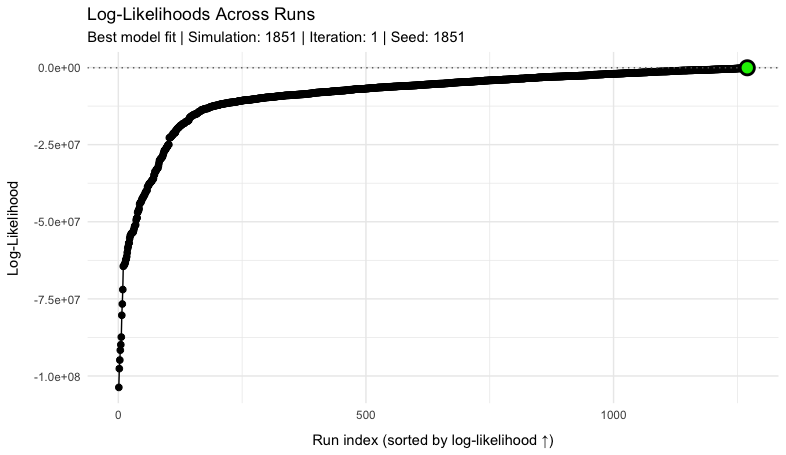

<!-- Google tag (gtag.js) -->

# Model calibration

## Bayesian Likelihood Approach

The MOSAIC framework employs Bayesian inference to calibrate its spatial transmission model. As in many other algorithms that use Bayesian inference, the model systematically estimates parameters based on their ability to recreate the observed data, which is measured through a *likelihood function*. One major assumption of the Bayesian method is that all model parameters---and most importantly, the link between model and data---have a known probability distribution (e.g. Normal, Poisson, Uniform). Therefore, all parameters in the MOSAIC framework have a prior distribution (before model calibration) that is highly informed by other data sources and meta-analyses (see the [Model Description](https://www.mosaicmod.org/model-description.html) page). 

To calibrate the MOSAIC model to observed cholera surveillance data, the algorithm updates prior beliefs about model parameters through the likelihood function $\mathcal{L}(\boldsymbol{\Theta})$. The likelihood is essentially a function of model parameters that measures how probable our particular model is given the observed data, or more formally, the posterior probability distribution of the parameter vector $\boldsymbol{\Theta}$. This parameter vector includes all quantities required for a single iteration of the model, which includes transmission rates, mobility parameters, and seasonal forcing coefficients for example (see the [Table of Model Parameters](https://www.mosaicmod.org/model-description.html#table-of-model-parameters)).
\begin{equation}
\boldsymbol{\Theta} = \{\, \beta,\, \gamma,\, \omega,\, a_1,\, a_2,\, b_1,\, b_2,\, \dots \, \}
(\#eq:theta)
\end{equation}
During model calibration, we aim to identify the best set of model parameters that maximize the log-likelihood while sampling from the large parameter space of $\boldsymbol{\Theta}$ using a brute‑force random sampling algorithm (more details below):
\begin{equation}
\hat{\boldsymbol{\Theta}} = \underset{\boldsymbol{\Theta}}{\arg\max}\big[\log \mathcal{L}(\boldsymbol{\Theta})\big].
(\#eq:general-likelihood)
\end{equation}

To specify the likelihood function, we treat $\mathcal{L}(\boldsymbol{\Theta})$ as the posterior density of $\boldsymbol{\Theta}$ given the observed cholera surveillance data, and then use the [Bayes' theorem](https://en.wikipedia.org/wiki/Bayes%27_theorem) to set up the model-data link.
\begin{equation}
\mathcal{L}(\boldsymbol{\Theta}) \Longrightarrow P(\boldsymbol{\Theta}\mid\text{data})  
(\#eq:bayes-1)
\end{equation}
Because the observed data $P(\text{data})$ does not depend on the model parameters and the prior $P(\boldsymbol{\Theta})$ is assumed to be uniform, these two terms can be treated as constants in Bayes’ theorem.  Consequently, the posterior density is proportional to the likelihood:
\begin{equation}
P(\boldsymbol{\Theta}\mid\text{data})
=\;
\frac{\displaystyle
P(\text{data}\mid\boldsymbol{\Theta})\;
\overbrace{P(\boldsymbol{\Theta})}^{\text{constant}}
}
{\displaystyle
\underbrace{P(\text{data})}_{\text{constant}}
}
\;\propto\;
P(\text{data}\mid\boldsymbol{\Theta}),
(\#eq:bayes-2)
\end{equation}
therefore maximizing the posterior (or minimizing its negative log) is equivalent to maximizing the likelihood $P(\text{data}\mid\boldsymbol{\Theta})$, and we can now construct the likelihood function using the relevant probability density functions $f(y\mid\mu)$ as described below.

## Total Log-likelihood for Cases and Deaths

Because the model posterior is proportional to $P(\text{data}\mid\boldsymbol{\Theta})$, we constructed the likelihood function with
the appropriate distribution for each of the observed data types using common notation for a probability density function $f(y\mid\mu)$. The MOSAIC framework is a spatial model, so we also included the $J$ spatial locations and $T$ time points in the full
likelihood, which gives the product over both indices:

\begin{equation}
P\left(\text{data}\mid\boldsymbol{\Theta}\right)
\;=\;
\prod_{j=1}^{J}
\;\prod_{t=1}^{T}
f\!\left(
y_{jt}\;
\bigl|\;
\mu_{jt}\!\left(\boldsymbol{\Theta}\right)
\right),
(\#eq:total-log-likelihood-1)
\end{equation}

where $y_{jt}$ is the observed count (cases, deaths, etc.) for location $j$ at
time $t$, and $\mu_{jt}(\boldsymbol{\Theta})$ is the corresponding model-generated
mean.  Substituting $f(\cdot)$ with the appropriate probability distribution
(Poisson, Negative Binomial, etc.) yields the explicit likelihood function used in
calibration.

The total log-likelihood combines contributions from observed cases and deaths across locations and time points. This combined likelihood function quantifies the probability of the observed epidemiological data given the model parameters $\boldsymbol{\Theta}$.
\begin{equation}
\log \mathcal{L}(\boldsymbol{\Theta}) =
\sum_{j=1}^{J} w_{j} \left[
w_{\text{cases}} \sum_{t=1}^{T} w_{t}\,\log P\left(C_{j,t}^{\text{obs}} \mid C_{j,t}^{\text{est}}(\boldsymbol{\Theta}), k_{\text{cases},j}\right)
+ w_{\text{deaths}} \sum_{t=1}^{T} w_{t}\,\log P\left(D_{j,t}^{\text{obs}} \mid D_{j,t}^{\text{est}}(\boldsymbol{\Theta}), k_{\text{deaths},j}\right)
\right]
(\#eq:total-log-likelihood-2)
\end{equation}

Note that each log-likelihood term is weighted three times — by a location weight $w_j$, a time-step weight $w_t$, and an outcome-specific weight $w_{\text{cases}}$ or $w_{\text{deaths}}$ — so that contributions reflect data reliability and public-health priorities across space, time, and outcome. The choice between Poisson and Negative Binomial for the density $P(\cdot)$ is driven by the local mean-variance relationship (VMR), ensuring that the assumed error structure mirrors the dispersion actually observed in the surveillance data. The next subsection details the parameterisation of each probability distribution and how the corresponding likelihood is computed.

| Parameter                                   | Description                                                          |
| ------------------------------------------- | -------------------------------------------------------------------- |
| $J$                                         | Number of locations                                                  |
| $T$                                         | Number of time points                                                |
| $C_{j,t}^{\text{obs}}$                      | Observed cases at location $j$ and time $t$                          |
| $D_{j,t}^{\text{obs}}$                      | Observed deaths at location $j$ and time $t$                         |
| $C_{j,t}^{\text{est}}(\boldsymbol{\Theta})$ | Model-estimated mean cases at location $j$, time $t$                 |
| $D_{j,t}^{\text{est}}(\boldsymbol{\Theta})$ | Model-estimated mean deaths at location $j$, time $t$                |
| $w_j$                                       | Location-specific weights (reflecting population or data confidence) |
| $w_t$                                       | Time-specific weights (typically uniform, $w_t=1$)                   |
| $w_{\text{cases}}$                          | Relative weight for cases                                            |
| $w_{\text{deaths}}$                         | Relative weight for deaths                                           |
| $k_{\text{cases}, j}$                       | Dispersion parameter for cases at location $j$                       |
| $k_{\text{deaths}, j}$                      | Dispersion parameter for deaths at location $j$                      |

## Distributional Assumptions for Likelihood Components

For each location $j$ and time step $t$ the density $f\!\left(y_{jt}\mid\mu_{jt}\left(\boldsymbol{\Theta}\right)\right)$ in Equation 
\@ref(eq:total-log-likelihood-1) is chosen to match the observed mean–variance relationship at that location, which is 
calculated as $\mathrm{VMR}_j = \mathrm{Var}(y_{j\cdot}) / \mathrm{Mean}(y_{j\cdot})$ from the raw surveillance counts. 
If $\mathrm{VMR}_j < 1.5$ the data are close to *equi-dispersion* and we adopt a *Poisson* distributed error model. Otherwise,
the count data are considered to be *over-dispersed* and we use a *Negative Binomial* error model with a location-specific dispersion 
parameter $k_j$.

### Negative Binomial density  (VMR $\ge 1.5$)
\begin{equation}
\log P_{\text{NB}}\!\left(y_{jt}\mid\mu_{jt},k_j\right)
\,=\,
\log\Gamma(y_{jt}+k_j)-\log\Gamma(k_j)-\log\Gamma(y_{jt}+1)
+k_j\log\!\left[\tfrac{k_j}{k_j+\mu_{jt}}\right]
+y_{jt}\log\!\left[\tfrac{\mu_{jt}}{k_j+\mu_{jt}}\right]
(\#eq:negbin)
\end{equation}
The dispersion is estimated per location via the method-of-moments:
\begin{equation}
k_j \;=\;\frac{\mu_j^2}{\mathrm{Var}(y_{j\cdot})-\mu_j},
(\#eq:dispersion)
\end{equation}
so that $\mathrm{Var}(y_{jt})=\mu_{jt}+\mu_{jt}^2/k_j$. As $k_j\rightarrow\infty$ the density in 
\@ref(eq:negbin) collapses smoothly to the Poisson form.

### Poisson density  (VMR $< 1.5$)

\begin{equation}
\log P_{\text{Pois}}\!\left(y_{jt}\mid\mu_{jt}\right)
\,=\;
y_{jt}\log\mu_{jt}-\mu_{jt}-\log(y_{jt}!).
(\#eq:poisson)
\end{equation}

The automatic Poisson/Negative-Binomial switch ensures that the
error structure embedded in the likelihood replicates the empirical
dispersion seen in the surveillance data, while the weighting scheme
$w_j,\,w_t,\,w_{\text{cases}},\,w_{\text{deaths}}$ (introduced in
Equation \@ref(eq:total-log-likelihood-2)) controls the relative influence
of each location, time step, and outcome on the overall fit.

## Algorithm for Parameter Estimation

The MOSAIC calibration relies on a *brute-force random sampling* (BFRS) workflow with importance-sampling for estimating posterior parameter distributions. The BFRS approach is deliberately simple, fully parallelisable, and maps directly onto the informative priors which have been painstakingly estimated a priori (see the [Model Description](https://www.mosaicmod.org/model-description.html) page).  

Unlike [Markov-Chain Monte Carlo](https://en.wikipedia.org/wiki/Markov_chain_Monte_Carlo) (MCMC) sampling methods, the BFRS workflow generates independent parameter draws, so there is no need to worry about convergence diagnostics, burn-in, or autocorrelation, and simulations can be distributed across hundreds of CPUs. The trade-off is efficiency: for a fixed computational budget MCMC can concentrate samples in the highest-posterior region, whereas BFRS spends many draws in moderately likely parts of the space. Although this wastes some compute, the penalty is small because the LASER modelling engine, whose fast, metapopulation implementation can evaluate each $\boldsymbol{\Theta}^{(i)}$ parameter draw in milliseconds.

Relative to [Latin-hypercube](https://en.wikipedia.org/wiki/Latin_hypercube_sampling#:~:text=Thus%2C%20orthogonal%20sampling%20ensures%20that,of%20random%20numbers%20without%20any) or [Sobol sequence](https://en.wikipedia.org/wiki/Sobol_sequence) sampling designs, which are also intended to do broad surveys of the parameter space, BFRS keeps the exact prior shape, can be extended at any time by simply adding more draws, and feeds directly into likelihood weighting without extra transformations. In combination with LASER’s speed, these features make Bayesian calibration in MOSAIC both fast and easily reproducible.

The steps below summarise how this BFRS workflow is turned into a practical calibration routine—moving from prior draws, through model simulation and likelihood evaluation, to the identification of the best-fitting parameter set.

1. *Generate reproducible parameter sample*

Draw $n_{\text{sim}}$ independent parameter vectors $\boldsymbol{\Theta}^{(i)} \sim P(\boldsymbol{\Theta})$ using predetermined random seeds, ensuring that the calibration can be rerun and audited exactly.

2. *Forward-simulate* 

The transitions between most model compartments are stochastic, so for each independent sampling of the parameter space $\boldsymbol{\Theta}^{(i)}$, we run the stochastic transmission model for $n_{\text{iter}}$ internal iterations.

3. *Evaluate the fit for every draw*

For each of the $n_{\text{sim}} \times n_{\text{iter}}$ internal iterations, compute the total *negative* log-likelihood $-\log\mathcal{L}(\boldsymbol{\Theta}^{(i)})$ via Equation \@ref(eq:total-log-likelihood-2).

4. *Post-processing end-points*  

- *Posterior parameter distributions* – convert all log-likelihoods to importance weights for estimating marginal posteriors (next section).  
- *Bayesian model averaging* – use the weighted ensemble to generate probabilistic forecasts.  
- *Best-fit scenario set* – select $\hat{\boldsymbol{\Theta}} = \arg\max_i\bigl[\log\mathcal{L}(\boldsymbol{\Theta}^{(i)})\bigr]$ for deterministic scenario and counter-factual analyses.

## Estimating the Posterior Distribution of Model Parameters

To transform the BFRS ensemble of samples from the parameter space and corresponding likelihood values
$\bigl\{\boldsymbol{\Theta}^{(i)},\,\log\mathcal{L}(\boldsymbol{\Theta}^{(i)})\bigr\}_{i=1}^{n_{\text{sim}}}$ into an legitimate Bayesian posterior, we used Importance Sampling (IS). The IS method is a well‑known technique to estimate posterior distributions originally described by [Kahn & Marshall 1953](https://pubsonline.informs.org/doi/10.1287/opre.1.5.263) and reviewed in a more modern context by [Tokdar & Kass 2010](https://doi.org/10.1002/wics.56). Thus, we calculate the IS-weights using the $\Delta \text{AIC}$ with a practical cut–off of $\Delta=4$ and retain the IS for a subset of supported models as described in the steps below:

### Compute $\Delta \text{AIC}$ for every draw

For any model, the [Akaike Information Criterion](https://en.wikipedia.org/wiki/Akaike_information_criterion) is $\text{AIC} \;=\; 2k \;-\; 2\log\mathcal{L}$, where $k$ is the number of estimated parameters. Because every MOSAIC simulation has the same $k$, the $\Delta \text{AIC}$ of draw $i$ relative to the best draw is determined solely by the difference in log-likelihood.
\begin{equation}
\Delta_i
\;=\;
\text{AIC}_i - \text{AIC}_{\text{min}}
\;=\;
-\,2\!\left[\log\mathcal{L}(\boldsymbol{\Theta}^{(i)}) -
\log\mathcal{L}_{\max}\right]
(\#eq:aic-delta)
\end{equation}

### Assign truncated importance weights

Since the BFRS method generates a large ensemble of candidate parameter sets $\boldsymbol{\Theta}^{(i)}$, we reduce the influence of poorly fitting models by truncating the importance weights using a $\Delta \text{AIC}$ cut-off. This ensures that only models with substantially better fit to the data contribute to the posterior.
\begin{equation}
\tilde{w}_i \;=\;
\begin{cases}
\exp\!\left[-\tfrac12 \Delta_i\right], & \Delta_i \le 6,\\[6pt]
0, & \Delta_i > 6,
\end{cases}
\qquad \text{and} \qquad
\tilde{w}_i \;=\;
\dfrac{w_i}{\displaystyle\sum_{j=1}^{n_{\text{sim}}} w_j}
(\#eq:aic-weights)
\end{equation}
The threshold of $\Delta_i \le 6$ is widely used in model selection and corresponds approximately to a likelihood ratio of $p_i = \exp(-\Delta_i/2) \approx 0.05$, which in nested-model comparisons aligns loosely with a frequentist $p$-value of 0.05 (Burnham & Anderson [2002](https://doi.org/10.1007/b97636) and [2004](https://journals.sagepub.com/doi/abs/10.1177/0049124104268644)). This cut-off removes models with essentially no empirical support, while preserving relative likelihood ratios among the retained models.

### Posterior summaries

Because the vector of truncated $\Delta \text{AIC}$ weights $\mathbf{\tilde{w}}$ are proportional to the posterior density $P(\boldsymbol{\Theta}\mid\text{data})$, we estimate the true Bayesian posterior distributions of each fitted model parameter as a weighted empirical statistic. Take for example the scalar $\sigma$, which gives the proportion of infections that are symptomatic. It is an element of each $\boldsymbol{\Theta}^{(i)}$ sample of the parameter space, so $\bigl\{\sigma^{(i)}\bigr\}_{i=1}^{n_{\text{sim}}}$ gives all $\sigma$ values for which a likelihood has been calculated. Therefore, we derive the posterior mean and 95% credible intervals for $\sigma$ as:
\begin{equation}
\mathbb{E}[\sigma] \;=\; \sum_{i=1}^{n_{\text{sim}}} \tilde{w}_i\,\sigma^{(i)}
\qquad \text{and} \qquad
95\% \, \text{CI} \;=\; \left[\,Q^{(\tilde{w})}_{0.025},\; Q^{(\tilde{w})}_{0.975}\right].
(\#eq:weighted-posterior)
\end{equation}
Where $Q^{(\tilde{w})}_{p}$ denotes the $\tilde{w}$-weighted $p$-th quantile of the retained ensemble, ensuring that the resulting intervals are
fully consistent with the Bayesian posterior implied by the importance-sampling weights.

## Model convergence

Because the MOSAIC framework uses an i.i.d. brute-force random sampling (BFRS) scheme for model fitting, traditional chain-based diagnostics such as $\hat R$ are not relevant. Instead we track three complementary weight–based statistics that together tell us *how many* models inform the posterior, *how strongly* they agree, and *how evenly* their support is distributed. These metrics also provide mathematical criteria that supported by previous theory and empirical studies, which is crucial for assessing model convergence. Specifically these metrics are:

1. **Effective sample size** — $\widehat{\text{ESS}}$  
gauges the amount of independent posterior information retained in the subset of best fitting model runs.
2. **Agreement index** — $A$  
measures the level of consensus among the retained best subset models.
3. **Coefficient of variation of weights** — $\mathrm{CV}_{\tilde w}$  
measures the variability of the retained models and detects extremely skewed model weights.

### Effective sample size (ESS)
Since the BFRS draws are independent of $P(\boldsymbol{\Theta})$, ESS plays
the role that $\hat R$ does in MCMC. We employ the specification of the ESS in [Elvira *et al.* 2022](https://onlinelibrary.wiley.com/doi/10.1111/insr.12500) using the $\Delta \text{AIC}$-truncated model weights $\tilde w_i$ from Equation \@ref(eq:aic-weights):
\begin{equation}
\widehat{\text{ESS}} =
\left[
\sum_{i=1}^{n_{\text{sim}}} \tilde{w}_i^{\,2}
\right]^{-1}.
\label{eq:ess}
\end{equation}
Because discarded model runs have $\tilde{w}_i=0$, ESS reflects only the retained
subset.  In dynamic Bayesian models an ESS $\gtrsim\!500$–$1000$ is generally
adequate for stable posterior medians and 95 % credible intervals
([Gelman *et al.* 2014](https://sites.stat.columbia.edu/gelman/book/);
[Bürkner 2017](https://www.jstatsoft.org/article/view/v080i01)).

### Agreement index *A*
We quantify consensus among the retained subset of best models \(\mathcal B = \{\,i : \Delta_i \le 4\}\) by the normalized [Shannon entropy](https://en.wikipedia.org/wiki/Entropy_(information_theory)) of their model weights $\tilde w_i$:
\begin{equation}
A = 
\frac{H(\mathbf{\tilde{w}})}{\log|\mathcal B|}
\qquad \text{and} \qquad
H(\mathbf{\tilde{w}})
=
-\sum_{i\in\mathcal B}\tilde w_i\,\log\tilde w_i.
(\#eq:agreement)
\end{equation}
Note that by definition $A \in \{0,1\}$ because $0 \;\le\; H(\mathbf{\tilde{w}})\;\le\;\log|\mathcal B|$. When $A=1$, all weights are equal ($\tilde w_i = 1/|\mathcal B|$) and there is a high degree of consensus in the sense that all models share similar fit. When $A=0$, a single model dominates ($\tilde w_i = 1$) for one model run $i$ and zero for the rest), which gives poor consensus among the subset of best models $\mathcal B$.

### Coefficient of variation of weights
Beyond the first-moment metric of model agreement, we use a second-moment check that detects extremely skewed model weights:
\begin{equation}
\mathrm{CV}_\mathbf{\tilde{w}} =
\frac{\sqrt{\sum_{i\in\mathcal B}\left(\tilde{w}_i-\bar w\right)^2}}
{\bar w}
\qquad \text{and} \qquad
\bar w=\tfrac1{|\mathcal B|}.
(\#eq:cvw)
\end{equation}
Large $\mathrm{CV}_\mathbf{\tilde{w}}$ warns that the variance within the best fitting subset of models may be high even if ESS and $A$ look satisfactory.  A common rule-of-thumb from [Kong et al. 1994](https://doi.org/10.1080/01621459.1994.10476469) is $\mathrm{CV}_\mathbf{\tilde{w}}\!\lesssim\!2$ for comfortably balanced weights.

### Convergence guidelines
A calibration run that meets all three criteria indicates that the retained ensemble is *informative* (high ESS), *internally consistent* (high $A$), and *numerically stable* (moderate $\mathrm{CV}_\mathbf{\tilde{w}}$), providing confidence in the posterior summaries and subsequent MOSAIC forecasts. We also perform Posterior Predictive Checks (PPC) on calibration runs to assess model fit and to refine the definition of model priors. Out targets for successful model calibration are shown in Table \@ref(tab:calibration) with an example log-likelihood curve for a calibration test showing the diminishing returns in model fit with the number of simulations (Figure \@ref(fig:likelihood-example)).

Table: (\#tab:calibration)Details on convergence diagnostics with recommended thresholds and troubleshooting guidelines.

|Metric                                                                          |Target range                               |                  Source|
|:-------------------------------------------------------------------------------|:------------------------------------------|-----------------------:|
|$\Delta$AIC cut-off                                                             |$\le 6 \ \left(p\! \approx \! 0.05\right)$ |[Burnham & Anderson 2004](https://journals.sagepub.com/doi/abs/10.1177/0049124104268644)|
|Effective Sample Size $\left(\widehat{\text{ESS}}\right)$                       |$\gt 500$                                  |[Gelamn et al 2014](https://sites.stat.columbia.edu/gelman/book/)|
|                                                                                |$\gt 1000$                                 |[Bürkner 2017](https://www.jstatsoft.org/article/view/v080i01)|
|Agreement Index $\left(A\right)$                                                |$\gt 0.7 \ \text{or} \ 0.8$                |[Elvira et al 2022](https://onlinelibrary.wiley.com/doi/10.1111/insr.12500)|
|Weight Coefficient of Variation $\left(\mathrm{CV}_{\tilde{\mathbf w}} \right)$ |$\lt 1 \ \text{or} \ 2$                    |[Kong et al 1994](https://doi.org/10.1080/01621459.1994.10476469)|

(\#fig:likelihood-example)Example log-Likelihood curve for a sample of 2000 model simulations. Log-likelihood values are sorted from minimum to maximum with the model simulation giving the maximum likelihood highlighted in green.

## Model Forecasting

This section is in development.

## Scenarios and Counter Factuals

This section is in development.

